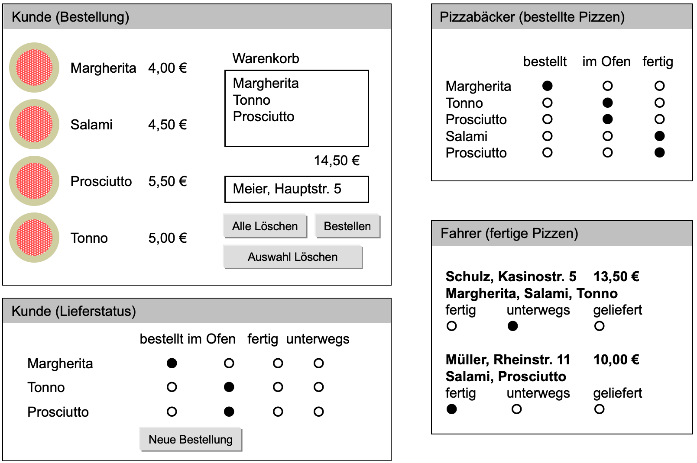

# Anforderungen an die Web-Applikation

!!! note
    **Hinweis**: Die Anforderungen sind aus Sicht des Pizzaservice beschrieben. Wenn Sie einen **eigenen Webshop** entwickeln, dann müssen Sie die Anforderungen entsprechend übertragen (bspw. kann anstelle der Bäckerseite eine Versandabteilungs- oder Kommissionierungsseite etc. erstellt werden). Die Anforderungen hinsichtlich **Aufbau und Funktionsweise gelten dann analog** für die Seiten des eigenen Webshops.

## Aufbau

Der Pizzaservice bzw. Onlineshop soll folgende **vier Webseiten** enthalten (gilt entsprechend auch für einen eigenem Webshop):

- **Bestellung**
- **Bestellstatus** (--> die Aktualisierunglogik wird in [Termin 3](termin3.md) implementiert)
- **Pizzabäcker** 
- **Fahrer** 
<!-- - TODO: PHP Controller für AJAX+JSON inkludieren -->

Der Pizzaservice soll mit **HTML5** und **CSS Level 3** dargestellt werden

Als Webserver wird **Apache 2** verwendet und als Datenbank **MySQL** (enthalten im [XAMPP Paket](https://www.apachefriends.org/download.html).)

Die **Abnahme** erfolgt auf Ihren Laptops mit den gängigen Browsern.

Für die PHP-Entwicklung müssen **Seiten-Templates** (--> siehe [Termin 2: PHP – Seitenklassen, Datenbankzugriff, Sessionmanagement und Sicherheit](termin2.md)) verwendet werden, die vorgegeben und über den [EWA-Moodlekurs](https://lernen.h-da.de/course/view.php?id=6940) herunterladbar sind.

## Designskizze

*Konzeptionelle Darstellung der vier Web-Seiten des Pizzaservice bzw. Onlineshops*

## Anforderungen des Auftraggebers

- **Pizzabestellung**

    Hier kann der Kunde seine Pizzen aus der Speisekarte auswählen und in einen
    Warenkorb übernehmen. 

    Es wird der Preis der Bestellung angezeigt und es muss eine Lieferadresse angegeben werden.

- **Bestellstatus** (=Kundenseite)

    Hier kann ein Kunde sehen, in welchem Zustand seine Pizzen sind (`bestellt`, `im Ofen`, `fertig`, `unterwegs`). 

    Er sieht nur seine Bestellung – ==und keine Aufträge von anderen Kunden==.

- **Pizzabäcker**

    Hier werden die bestellten Pizzen angezeigt. Der Pizzabäcker kann den Status für jede Pizza von "`bestellt`" auf "`im Ofen`" bzw. "`fertig`" setzen. 
    
    Übernimmt der Fahrer eine Pizza, so verschwindet sie aus der Liste.

- **Fahrer**

    Hier werden Bestellungen mit den einzelnen Pizzen, Preis und Adresse angezeigt. Der Fahrer kann den Status der Lieferungen verändern.      
    Eine Lieferung ist entweder "`fertig`", "`unterwegs`" oder "`geliefert`".  
    Lieferungen tauchen erst beim Fahrer auf, wenn alle zugehörigen Pizzen fertig sind.      
    Ausgelieferte Bestellungen verschwinden aus der Liste.

## Sonstige Anforderungen

<!-- - ~~Die Speisekarte kann um weitere Pizzen erweitert werden. Die Preisberechnungen ändern sich dann (ohne Neuprogrammierung)~~ -->

- Es werden nur gültige Bestellungen akzeptiert

- Die Auswahl einer Pizza soll über einen Mausklick auf ein Pizzasymbol erfolgen

- Der Warenkorb bietet die allgemein üblichen Funktionen

- Die Bestellseite passt ihre Darstellung für schmale Handybildschirme an und verwendet ein **responsives Layout**.

- Versuchen Sie das Layout so umzusetzen, wie es in der Designskizze dargestellt ist. Es sollen 4 getrennte Seiten entwickelt werden.

- Die Seiten `Pizzabäcker`, `Bestellstatus` und `Fahrer` sollen sich **automatisch aktualisieren**.  

- Es gibt zu **Testzwecken** eine weitere Webseite `Übersicht`, welche (für einfache Tests) Links zu den 4 Webseiten beinhaltet.  

    !!! note
        **Hinweis**:  
        Alternativ können Sie auch eine **Navigationsleiste** bzw. ein **Navigationsmenu** in die Web-Applikation integrieren, dann brauchen Sie *keine* Übersichtsseite zu implementieren.

<!-- - ~~Tests sollen so klar formuliert sein, dass sie **automatisiert** laufen könnten {>>Müssen wir noch genauer diskutieren!<<}~~ -->

