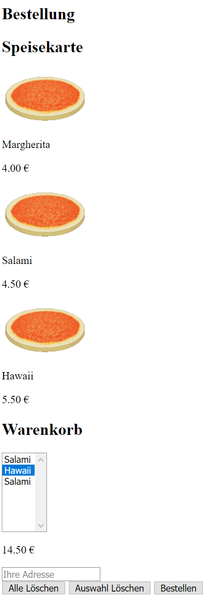

# Anforderungsanalyse und Selbststudium von HTML (--> zu Hause)

!!! abstract
    **Lernziele**

    - [x] Sie verstehen sämtliche Anforderungen an das Shopsystem (Pizzaservice o.ä.) bzw. haben Ungereimtheiten und Inkonsistenzen mit der/dem Dozenten/in geklärt
    - [x] Sie können einfache, statische HTML Seiten erstellen
    - [x] Sie verstehen die Grundstruktur einer HTML Seite
    - [x] Sie kennen die wichtigsten Elemente und die Funktionsweise von Formularen

## Aufgaben

!!! note
    **Hinweis**: Es wird erwartet, dass jede\(r\) Studierende diese Aufgaben selbständig und vollständig **vor dem ersten Praktikumstermin** erledigt! 

### Einarbeitung 

1. Lesen Sie die **komplette Praktikumsaufgabe**, um einen Eindruck davon zu bekommen, was Sie im Laufe des Semesters erwartet und welche Arbeiten für eine **erfolgreiche Testierung** notwendig sind.
2. Vergewissern Sie sich, dass Sie alle im Kapitel [Vorbemerkungen](vorbemerkung.md) genannten Informationen verstanden haben 
3. Es wird erwartet, dass Sie HTML-Code schreiben können. Verwenden Sie z.B. die folgende [Kurzreferenz](https://websitesetup.org/HTML5-cheat-sheet.pdf) für einen schnellen Überblick über die Anweisungen.
4. Installieren Sie einen **HTML-Editor (IDE)** Ihrer Wahl. Verwenden Sie einen Editor mit Syntax-Hervorhebung für HTML, CSS und PHP (z.B. Notepad++), in dem Sie den Code / die HTML-Tags etc. selbst erstellen können. Verwenden Sie bitte keine "Luxuseditoren", die HTML & Co. verbergen.

### Anforderungsanalyse

1. Stellen Sie sicher, dass Sie die Anforderungen der Aufgabe "Pizzaservice" (sowohl vom Auftraggeber als auch sonstige Vorgaben) genau verstanden haben.
2. Dokumentieren Sie offene Punkte zur Klärung.
3. Überlegen Sie sich, ob Sie lieber den Standard-Pizzaservice oder ein eigenes Shopsystem implementieren wollen

### Rohform des Shopsystems mit statischem HTML

1. Realisieren Sie die `Bestellseite` mit **HTML5** (Die übrigen Seiten müssen Sie noch nicht implementieren). Da Sie noch kein CSS verwenden (sollen), sollte die Seite ungefähr so aussehen wie in der folgenden Grafik:  

<!--
  
*Rohform der Bestellseite mit HTML - nur Inhalte und Bedienelemente, kein Layout)*
-->
2. Berücksichtigen Sie bei der Umsetzung die nachstehenden Hinweise:
    - Verwenden Sie das folgende (standardkonforme) Grundgerüst für Ihre HTML-Dateien:
  
        ```html  
        <!DOCTYPE html>
        <html lang="de">  
        <head>
            <meta charset="UTF-8" />
            <!-- für später: CSS include -->
            <!-- <link rel="stylesheet" href="XXX.css"/> -->
            <!-- für später: JavaScript include -->
            <!-- <script src="XXX.js"></script> -->
            <title>Text des Titels</title>
        </head>
        <body>
            <p>Eigentlicher Inhalt</p>
        </body>
        </html>
        ```

    - Verwenden Sie als Codierung **UTF-8** und speichern Sie alle Dateien im Dateiformat **UTF-8 (ohne BOM)**
    - Erstellen Sie nur die "HTML-Rohform", d.h., keine Formatierung in HTML, kein CSS, kein JavaScript etc.
    - Verwenden Sie strukturierende Tags wie `<section>` statt `<div>` für die Seitenstruktur
    - Schreiben Sie Umlaute und das €-Zeichen direkt in Ihre Dateien (verwenden Sie also z.B. das "ä" und nicht das benannte Zeichen  `:::html &auml;`)
    - Achten Sie auf ordentliche Formatierung des HTML-Quelltextes! 
    - Verwenden Sie HTML-Tabellen nur um tabellarische Daten auszugeben (und keinesfalls als reines Layouttool)!


3. Realisieren Sie zunächst auch diejenigen Inhalte statisch, die später dynamisch aus der Datenbank generiert werden sollen
    - Tragen Sie Beispieldaten ein – so dass klar ist, was später generiert werden muss 
    - Trennen Sie statische Inhalte von Inhalten, die später aus Inhalten der der Datenbank erzeugt werden

### Überprüfung der Ergebnisse
1. Testen Sie Ihre Seiten mit unterschiedlichen Browsern und validieren Sie die Standardkonformität mittels eines "HTML5 Validators". Besonders bei unerwartetem Verhalten des Browsers gibt ein Validator wertvolle Hinweise auf die mögliche Ursache der Probleme.
Nutzen Sie <https://validator.w3.org/#validate_by_input> oder <https://html5.validator.nu/> und korrigieren Sie etwaige Fehler und Warnungen.

2. Schicken Sie das Formular ab an das Echo-Skript `https://echo.fbi.h-da.de/` oder nutzen Sie einen HTTP-Traffic–Analyzer-Dienst wie `https://pipedream.com/`. Analysieren Sie die übertragenen Daten hinsichtlich Korrektheit und Vollständigkeit.

    !!! note
        **Hinweis**: Bedenken Sie, dass ein Formular nur Daten für Formularelemente überträgt, die ein `name`-Attribut haben! Außerdem brauchen Sie ein &lt;form&gt;, das die Formularelemente umschließt!

## Ergebnisse

Die folgenden Ergebnisse müssen für eine erfolgreiche Durchführung vorliegen:

!!! abstract
    __Ergebnisse:__

    - [ ] Statische, validierte HTML-Seite für die Bestellung mit funktionierendem Formular

