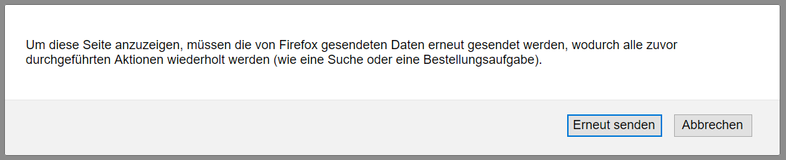

# PHP: Objektorientierte Seitenklassen und Datenbankzugriffe

!!! note
    **Lernziele**

    - [ ] Sie können die objektorientierte Programmierung mit PHP umsetzen
    - [ ] Sie verstehen die grundlegende Funktionsweise der Seiten- und Blockklassenarchitektur
    - [ ] Sie können mit PHP und MySQLi Datenbankzugriffe realisieren und Webseiten mit Inhalten aus der Datenbank erzeugen (lesend und schreibend).


Ziel dieser Einheit ist die Entwicklung von sauberem, d.h., gut wartbarem,  strukturiertem und objektorientiertem PHP-Code. Hierzu setzen wir vordefinierte **Seiten-** und **Blockklassen** ein. Ferner stellen wir in dieser Einheit die **Datenbankanbindung** zur Web-Applikation her um Daten zu lesen und zu schreiben. 

##Vorbereitung

!!! abstract  
    **Erledigen Sie diese Aufgaben VOR dem Übungstermin**    

      **Voraussetzung:** Die vier in [Termin 1](termin1.md) erstellten PHP-Seiten werden ordnungsgemäß vom Webserver ausgeliefert und erzeugen  standardkonformen HTML-Code.
      
      1. Laden Sie die **Zulieferung** für das Praktikum von der EWA-Moodleseite herunter und machen Sie sich mit dem Inhalt vertraut:      
         - `PageTemplate.php` dient als Vorlage für die Seiten `Bestellung.php`, `Kunde.php`, `Baecker.php` und `Fahrer.php`    
         - `Page.php` ist die gemeinsame Basisklasse dieser 4 Seiten-Klassen und soll die Datenbank öffnen und schließen und den HTML-Rahmen erzeugen
         - `BlockTemplate.php` dient (optional) als Vorlage für einzelne Blöcke innerhalb der Seiten
         - `Pizzaservice_Documentation.pdf` enthält eine Dokumentation der Klassen mit Klassendiagramm und Sequenzdiagramm.
      2. Versuchen Sie mit der Dokumentation und dem Quellcode das **Zusammenspiel der verschiedenen Klassen** zu verstehen. Klären Sie folgende Fragen:    
         - Wo erfolgt der eigentliche Aufruf zur Erstellung einer HTML-Seite?
         - Was tun die Methoden `getViewData()`, `generateView()` und `processReceivedData()`? In welcher Reihenfolge werden sie aufgerufen?
         - Wo wird der HTML-Rahmen mit &lt;body&gt; und &lt;head&gt; erzeugt? Wo wird er ausgegeben?
      3. Entwerfen Sie das **Datenmodell** für Ihren Pizzaservice. 
      Nutzen Sie beispielsweise das folgende Schema:

            ``` 
            Angebot:         PizzaNummer, PizzaName, Bilddatei, Preis
            BestelltePizza:  PizzaID, fBestellungID, fPizzaNummer, Status
            Bestellung:      BestellungID, Adresse, Bestellzeitpunkt
            ```

      1. Implementieren Sie das **Datenmodell** mit `phpMyAdmin`
         - Starten Sie den Webserver und den **Datenbankserver (MySQL)** mittels des XAMPP-Dienstprogrammes und rufen Sie `phpMyAdmin` auf durch `http://127.0.0.1/phpmyadmin`.
         - Verwenden Sie die Kollation `utf8_unicode_ci` (im Vorgabewert `utf8_general_ci` gilt nicht ß=ss)
         - `PizzaName`, `PizzaID`, `BestellungID` sind **Primärschlüssel**; IDs mit Autoincrement
         - Realisieren Sie die Verknüpfungen zwischen den Primärschlüsseln und den Fremdschlüsseln `fBestellungID`, `fPizzaName` in der Datenbank.  
           *Tipp: Mit dem "Designer" in `phpMyAdmin` können Sie die Beziehungen grafisch eintragen*
         - Tipp zum Bestellzeitpunkt: MySQL-Funktion `CURRENT_TIMESTAMP` als Standardwert des Feldes.

      2. Füllen Sie die "Speisekarte" (d.h. die Tabelle "`Angebot`") manuell mit 4-5 Pizzen. Verwenden Sie auch ungerade Preise wie 3.17€ oder 4.99€ und Namen mit Umlauten (Pizza Hühnchen).

!!! warning
    **Hinweis**: Wenn Sie diese Vorbereitung nicht **zu Beginn der Übung** zeigen können, erhalten Sie kein Testat für die vorherige Übung, sondern eine Verwarnung (**"gelbe Karte"**)!

## Aufgaben

Am besten führen Sie die folgenden Aufgaben zuerst für **eine** der Seiten (z.B. die Bestellseite) durch. So stellen Sie sicher, dass Sie alle Themen verstanden haben und korrekt umsetzen können bevor Sie die übrigen Seiten angehen.

### Dynamische Seitengenerierung mittels Seitenklassen

1. Legen Sie eine **Kopien der Klasse `PageTemplate.php`** für jede Seite an, die Sie erstellen wollen (also instgesamt `Bestellung.php`, `Kunde.php`, `Baecker.php` und `Fahrer.php`) und benennen Sie die Dateien entsprechend. Ändern Sie auch die Klassennamen und Verweise auf die Klasse innerhalb der Dateien.

2. Verteilen Sie Ihren **PHP-Code** aus der vorherigen Übung in die zuständigen Methoden der neuen Klasse und die generischen Teile in die Klasse `Page.php`. Die Kommentare in den Dateien helfen dabei. Rufen Sie die Seite über den Webserver ab und korrigieren Sie die Fehler.

    !!! note
        **Hinweise**:

         - Beim Testen und Debuggen hilft eine Fehlerausgabe. Verwenden Sie --> `error_reporting(E_ALL)`.
         - HTML-Ausgaben erfolgen ausschließlich in der Methode `generateView()` der Seitenklassen!
         - Funktionalität, die von allen Klassen benötigt wird, wird in der Basisklasse `Page` umgesetzt (z.B. die Anbindung an die Datenbank).
         - Die Ausgabe größerer HTML-Abschnitte ist mit der <a href="http://php.net/manual/de/language.types.string.php#language.types.string.syntax.heredoc" target="blank">Heredoc-Notation</a> besonders einfach. Achten Sie darauf, dass die Endmarke in der ersten Spalte beginnen muss und dahinter höchstens noch ein `;` folgen darf.
         - Die Struktur wird besser, wenn Sie Speisekarte, Warenkorb-Formular und Statusansicht unter Verwendung von `BlockTemplate.php` realisieren (das macht es aber auch anspruchsvoller und ist optional).

3. Schreiben Sie **Hilfs-Methoden** oder **zusätzliche Klassen** nach Bedarf. Auch die Methoden der gegebenen Klassen dürfen zusätzliche Parameter bekommen. Vermeiden Sie aber möglichst Änderungen an der Signatur von Methoden der Klasse `Page`.

4. Prüfen Sie, ob die neuen PHP-Seiten als Ausgabe die ursprünglichen statischen HTML-Seiten erzeugen und ob dieser Code immer noch **standardkonform** ist.

### Datenbankzugriff mittels MySQLi

1. Konfigurieren SIe den Aufbau der Datenbankverbindung in `Page.php`.
2. Implementieren Sie die **Datenbankzugriffe** (SELECT, INSERT INTO, UPDATE) in den zuständigen Methoden der Klassen und ersetzen Sie die statischen Codeteile durch Daten, die Sie von der Datenbank abfragen.
      - Der Zugriff auf die Datenbank erfolgt objektorientiert über die Klasse `MySQLi`. 
      - Zugriff auf die Datenbank erfolgt nur in `getViewData()` und `processReceivedData()`.
3. Testen und validieren Sie die generierten Seiten.

    !!! note
        Tipps zur Umsetzung
        
        - Nutzen Sie `var_dump($variable)` für die schnelle Testausgabe zwischendurch
        - `number_format($zahl, $nachkommastellen)` formatiert `$zahl`
        - `$mysqli->insert_id` liefert die Autoincrement-ID nach `INSERT INTO`
        - Tabellen- und Feldnamen in SQL-Statements klammert man am besten in Hochkommata ein: ` (Gravis / accent grave)
        - Prüfen Sie mit `phpMyAdmin` ob die Datenbankeinträge korrekt erstellt werden. Denken Sie daran, die Formulare so anzupassen, dass sie ihre Daten nicht mehr an die Echo-Skripte schicken, sondern an die tatsächliche Zielseite.
        - Eine geschickte Datenbankabfrage (z.B. mit einem `JOIN` oder `ORDER BY`) kann Ihnen viel Implementierungsaufwand ersparen.

### Auflösung von Blockierungen bei Aktualisierungen
Wenn eine Webseite mit einem Formular geladen wird, das zuvor mittels POST Daten gesendet hat, dann bringt der Browser ein (recht unverständliches) Popup und blockiert dadurch die Aktualisierung.
*Popup durch Reload mit POST-Daten)*      
Lösen Sie diese Blockierung auf, indem Sie beim Aufruf der Seite zuerst die Daten verarbeiten und dann die Seite (ohne Daten) neuladen:     

 - Verarbeiten Sie die Daten in processReceivedData() 
 - laden Sie mit dem  PHP-Befehl `:::js header('Location: http://meineSeite.php/');` die gleiche Seite erneut - aber dieses mal ohne Daten. 
 - Jetzt können Sie die Seite ohne Blockierung aktualisieren.    
 
Achten Sie aber darauf, dass dieser "Redirect" wirklich nur dann ausgeführt wird, wenn Sie auch tatsächlich Daten empfangen haben - ansonsten entsteht eine Endlosschleife.    
**Hinweis**: Das Umstellen der Übertragung auf GET ist keine zulässige Lösung!

## Nachbereitung
Setzen Sie noch fehlende Teile der obigen Aufgabe bis zum nächsten Praktikumstermin um. 

## Ergebnisse

Die folgenden Ergebnisse müssen für eine erfolgreiche Durchführung der Praktikumseinheit vorliegen:

!!! abstract
    __Ergebnisse:__

    - [x] Implementierung der Seiten `Bestellung.php`, `Kunde.php`, `Baecker.php` und `Fahrer.php` mittels Seitenklassen und (optional) Blockklassen.
        - Die "Speisekarte" auf der Bestellseite wird mit den Daten aus den Datenbank erzeugt
        - Die Daten, welche die Bestellseite abschickt, werden in der Datenbank abgelegt.
        - Die Bäckerseite zeigt die bestellten Pizzen. Ein veränderter Status einer Pizza kann mit einem Submit-Button abgeschickt werden und wird in die Datenbank übernommen.
        - Die Fahrerseite zeigt die Bestellungen, die bereit für die Auslieferung sind. Ein veränderter Status einer Bestellung kann mit einem Submit-Button abgeschickt werden und wird in die Datenbank übernommen.
        - Die Fahrerseite und die Bäckerseite aktualisieren sich alle 5 Sekunden
        - Die Kundenseite setzen Sie bitte so um, dass *alle* bestellten Pizzen angezeigt werden. Die Einschränkung auf die Pizzen des jeweiligen Kunden erfolgt erst in der nächsten Übung durch Sessionamangement.
    - [x] Implementierung der Datenbankzugriffe mittels `MySQLi`


