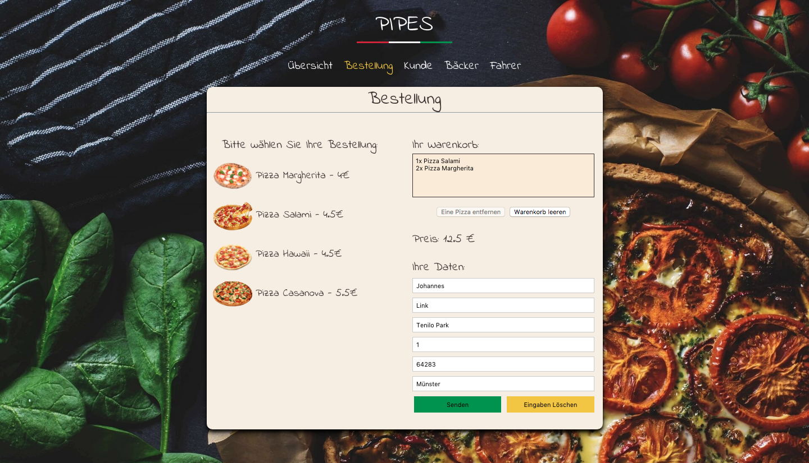
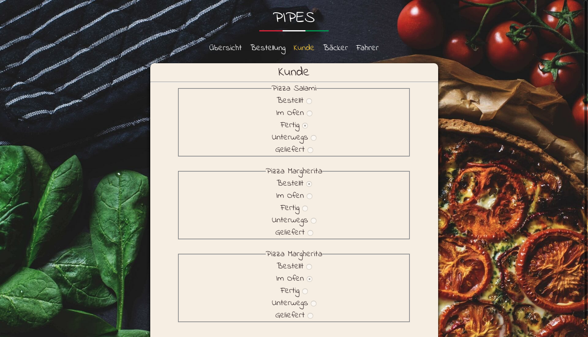
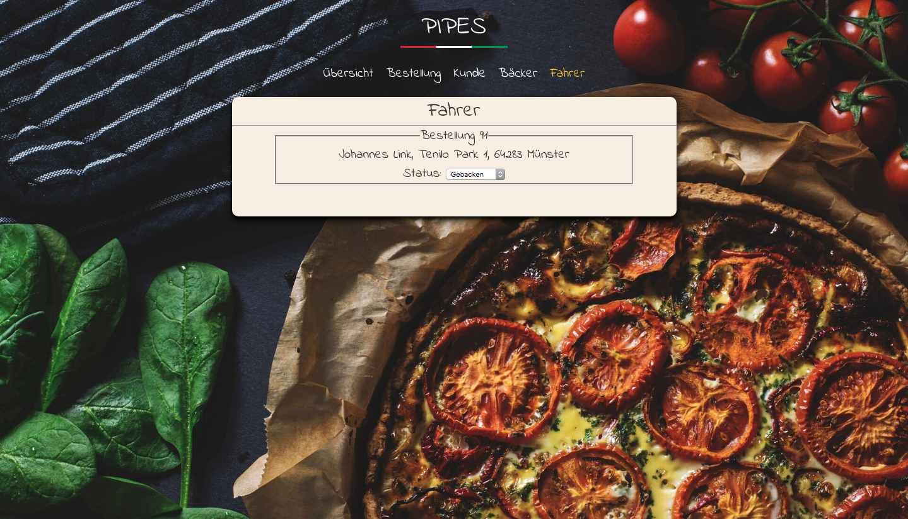
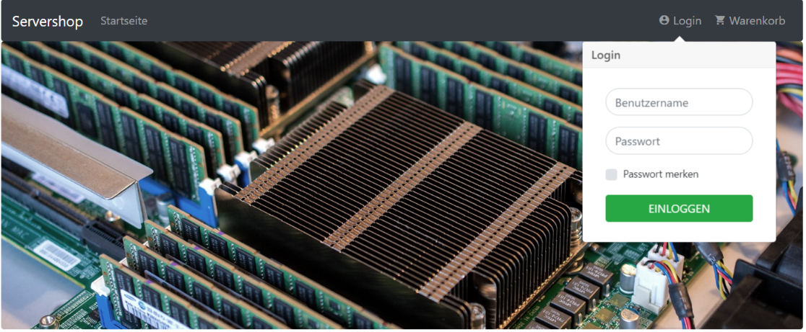
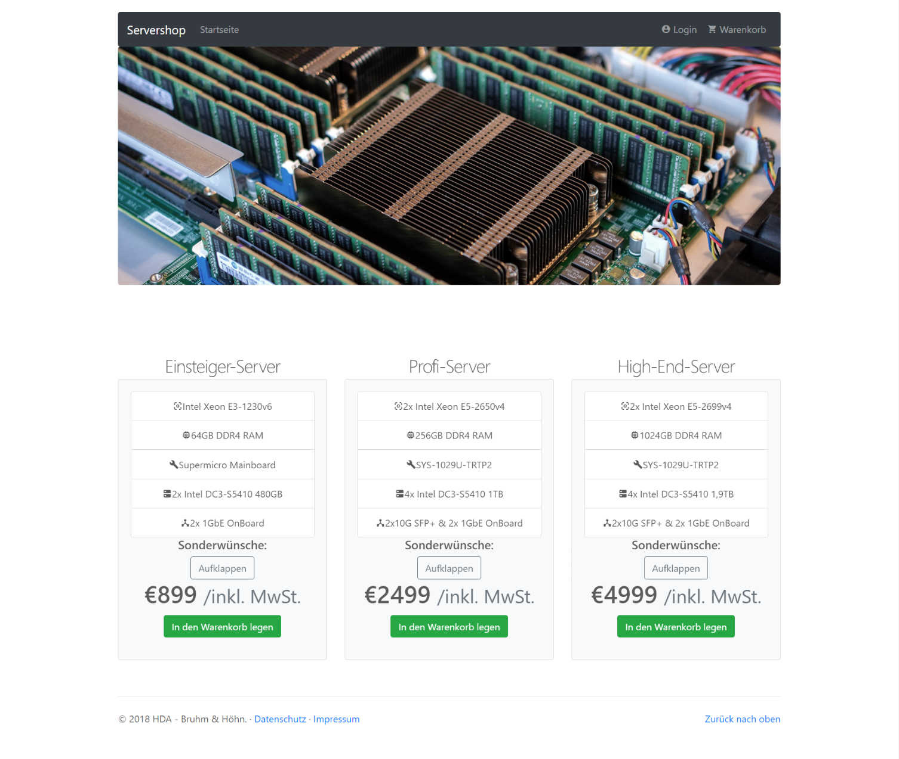
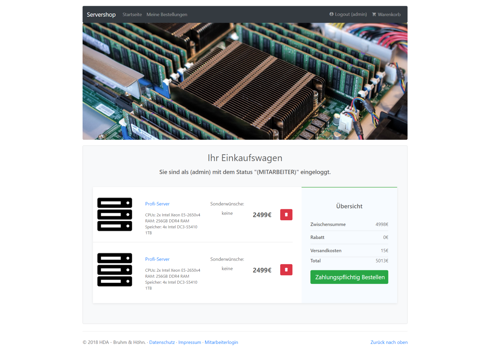
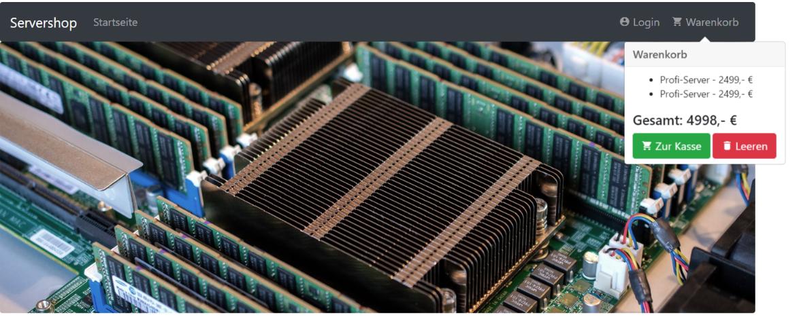
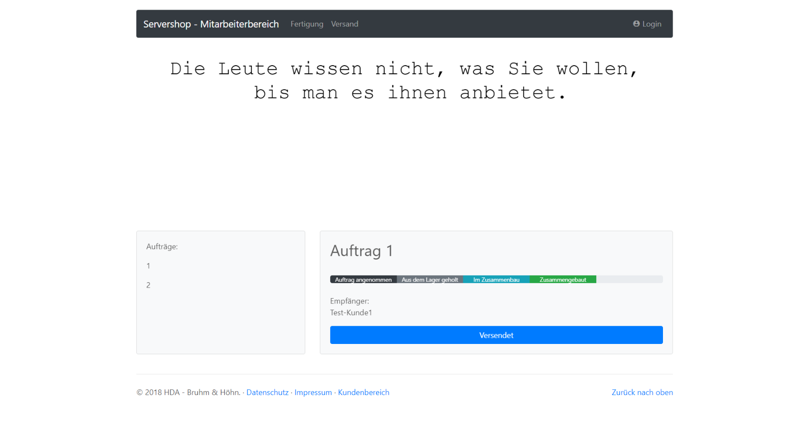
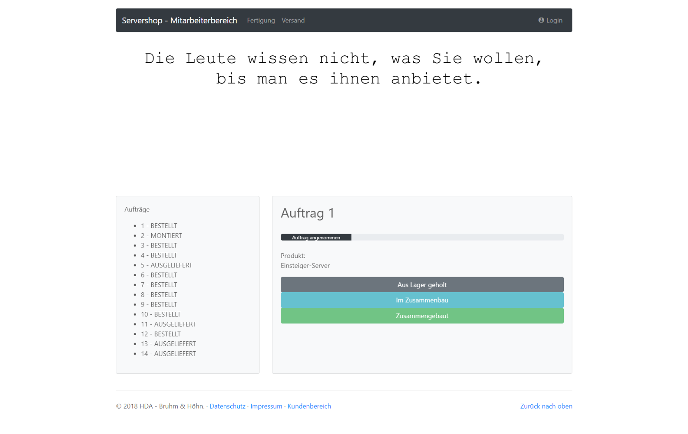

# Semesterthema Web-basierter Pizzaservice bzw. Onlineshop

## Vorbemerkungen

Im Lauf des Semesters soll eine **integrierte webbasierte Anwendung** in Form eines Pizzaservices (Standard) oder eines Webshops nach eigener Wahl entwickelt werden.

Der Webshop soll die folgenden **technischen Eigenschaften** aufweisen:

**Clientseitig**:

- Responsive Webseiten mit HTML und CSS
- Nutzereingaben mittels Formularen
- Client-seitige Interaktion mit JavaScript
- Echtzeitaktualisierung von Statusinformationen mittels AJAX und JSON

**Serverseitig**:

- Apache Webserver
- Dynamische Seitengenerierung mit PHP
- Anbindung einer MySQL-Datenbank
- Nutzung der Seiten- und Blockklassenarchitektur
- Generierung von JSON-Daten

Der Schwerpunkt liegt hierbei auf ==**professioneller Webentwicklung**==!

Wichtig hierbei ist Standardkonformität, Barrierefreiheit, Responsivität, Dokumentation, Tests und die Einhaltung der bewährten Regeln guter Softwaretechnik. 
Es geht in EWA nicht um Homepage-Bastelei oder die Verwendung von "Fertigteilen"!

!!! warning
    Nicht die Funktionalität steht im Vordergrund, sondern die Integration der verschiedenen Techniken und die Methodik der Vorgehensweise.

!!! warning
    Die reine Umsetzung der Funktionalität des Shopsystems reicht nicht für die Abnahme! Die **objektorientierte Umsetzung** mit **Seitenklassen** ist ein Pflichtbestandteil!

## Beispiele

### Pizzaservice

Eine Studierendenlösung aus dem SoSe2018

*Übersichtsseite*

*Bestellseite*

*Übersichtsseite beim Kunden*

*Bäckerseite*

*Fahrerseite*

### Servershop

Ein Studierendenprojekt aus dem WiSe 2018/2019

<!-- Startseite mit Login -->
*Startseite mit Login*

<!-- Katalogansicht  -->
*Katalogansicht*

<!-- Einkaufswagen -->
*Einkaufswagen*

<!-- Warenkorbansicht -->
*Warenkorbansicht*

<!-- Statusanzeige beim Kunden -->
*Statusanzeige beim Kunden*

<!-- Statusanzeige Shop -->
*Statusanzeige Shop*

