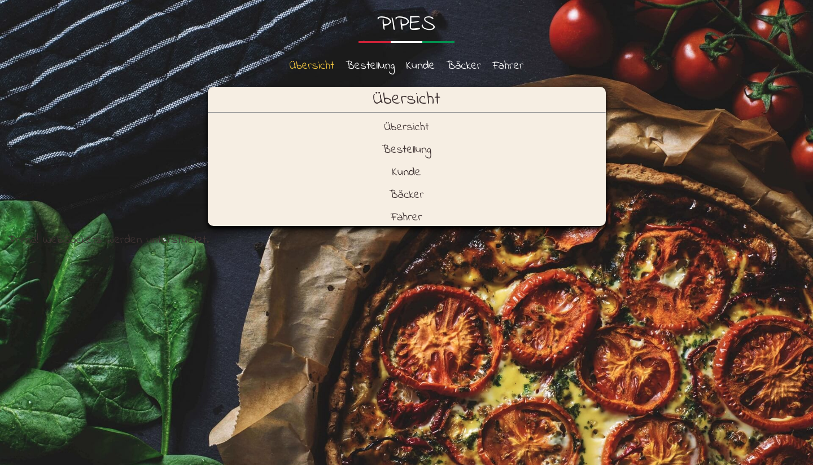
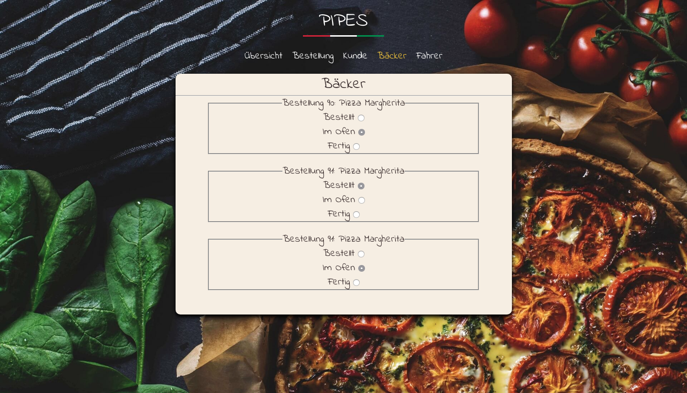

# Semesterthema webbasierter Pizzaservice bzw. Onlineshop

## Vorbemerkungen

Im Lauf des Semesters soll eine **integrierte webbasierte Anwendung** in Form eines Pizzaservice (das ist die Standard-Applikation) oder eines Webshops nach eigener Wahl entwickelt werden.

Der Pizzaservice bzw. Webshop soll die folgenden **technischen Eigenschaften** aufweisen:

**Clientseitig**:

- Responsive Webseiten mit HTML und CSS
- Nutzereingaben mittels Formularen
- Client-seitige Interaktion mit JavaScript
- {--Echtzeita--} Aktualisierung von Statusinformationen mittels AJAX und JSON

**Serverseitig**:

- Apache Webserver
- Dynamische Seitengenerierung mit PHP
- Anbindung einer MariaDB-Datenbank
- Nutzung der Seiten- und Blockklassenarchitektur
- Generierung von JSON-Daten

Der Schwerpunkt liegt vor allem auf einer **Software-technisch sauberen Umsetzung**. 
<!-- ==**professioneller Webentwicklung!**== -->

Wichtig hierbei ist **Standardkonformität**, **Barrierefreiheit**, **Responsivität**, **Trennung der Verantwortlichkeiten** (*engl. "Separation of Concerns"*) und die Einhaltung der bewährten Regeln **guter Softwaretechnik**. 

Es geht in EWA *nicht* um Homepage-Bastelei oder die Verwendung von "Fertigteilen"!

!!! warning
    Nicht die Funktionalität steht im Vordergrund, sondern die **Integration** der verschiedenen Techniken und die **Methodik** der Vorgehensweise.

!!! warning
    Die reine Umsetzung der Funktionalität des Shopsystems reicht *nicht* für die Abnahme! Die **objektorientierte Umsetzung** mit **Seitenklassen** ist ein Pflichtbestandteil!

!!! warning
    Die Aufgabe muss mit den in der Veranstaltung behandelten (grundlegenden) Techniken gelöst werden! **Der Einsatz von Frameworks wie bspw.&nbsp;jQuery oder Bootstrap ist nicht gestattet!** 

## Beispiele

### Pizzaservice

Eine Studierendenlösung aus dem SoSe2018

*Übersichtsseite*

*Bestellseite*

*Übersichtsseite beim Kunden*

*Bäckerseite*

*Fahrerseite*

### Servershop

Ein Studierendenprojekt aus dem WiSe 2018/2019

<!-- Startseite mit Login -->
*Startseite mit Login*

<!-- Katalogansicht  -->
*Katalogansicht*

<!-- Einkaufswagen -->
*Einkaufswagen*

<!-- Warenkorbansicht -->
*Warenkorbansicht*

<!-- Statusanzeige beim Kunden -->
*Statusanzeige beim Kunden*

<!-- Statusanzeige Shop -->
*Statusanzeige Shop*

