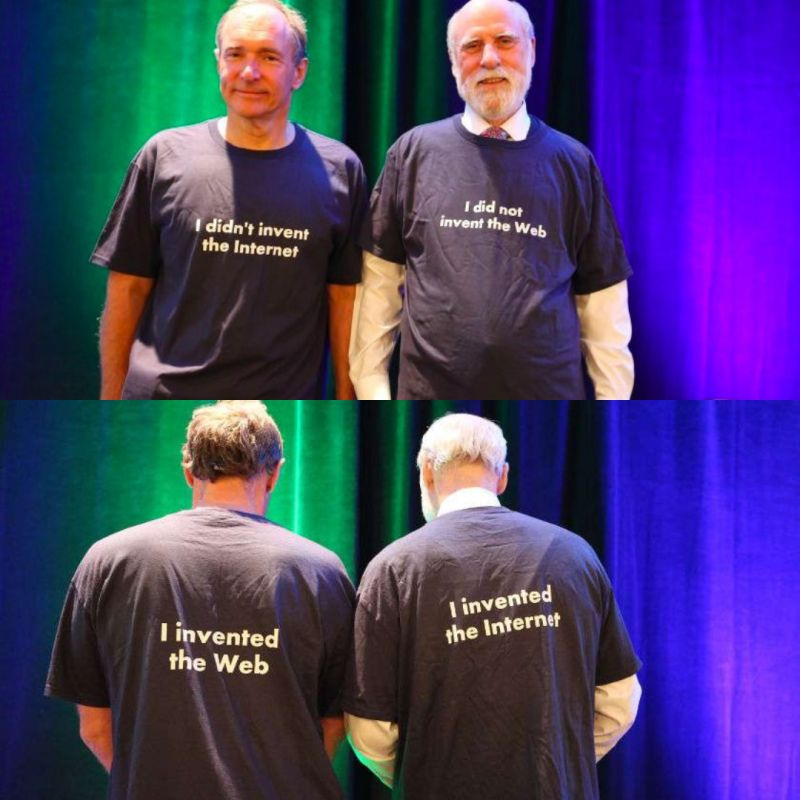

# EWA Semesterplan und Themenübersicht
<!-- Themenübersicht und Leitfragen -->
<!-- 
_Quelle: LinkedIn bzw. Twitter_ -->

Hier finden sich die Inhalte der **wöchentlichen Vorlesungseinheiten** (erkennbar an der ersten Zahl im Titel), unterteilt nach **Leitfragen** und entsprechenden **Lehrmaterialien**. Die Ausrichtung der Inhalte an Leitfragen folgt Erkenntnissen aus der Gehirnforschung und soll das Lernen und Verständnis fördern. 

Nutzen Sie die Lehrmaterialen zur **Vorbereitung** und die Leitfragen zur **Lernzielkontrolle**.

Die erste Zahl im Titel bezieht sich auf die jeweilige **Vorlesungswoche** (vergleichen Sie hierzu den [EWA Semesterplan für das WiSe 2022/2023](https://lernen.h-da.de/mod/resource/view.php?id=213139) in Moodle), die zweite Zahl auf eine ggf. vorhandene thematische Unterteilung.

EWA-Discord-Channel: <https://discord.gg/AC97TNBSJ6>

<!-- Ferner dienen die Leitfragen als **Lernzielkontrolle**. -->

<!-- :material-human-male-board:{ .hugo } Lehrmaterialien: -->

## Teil 0: Einführung

### Einheit #1: Organisation

**Leitfragen**:

- Wie ist die Veranstaltung organisiert ?
- Welche Unterstützungsangebote gibt es; wo bekomme ich Hilfe ?
- Was erwartet mich und was wird von mir erwartet ?

!!! book
    **Materialien**:

    - Der [Einführungsfoliensatz](https://lernen.h-da.de/mod/resource/view.php?id=231312)
    - Die [Vorlesungs- und Praktikumstermine](https://lernen.h-da.de/mod/resource/view.php?id=213139)
    - Für Interessierte: [Ein Ausflug in die Entstehung des World Wide Web](https://lernen.h-da.de/mod/resource/view.php?id=275887)

## Teil I: Statische Webseiten

### Einheit #2:1: Grundlagen zur Erzeugung von Web-Inhalten 

**Leitfragen**:

- Internet und Web – ist das dasselbe ?
- Wie erzeugt man Inhalte für das Web ?
- Welche Tools benötigt man zum Erstellen von Webseiten ?
- Wie funkioniert ein Webserver ?
- Wie werden die Inhalte im Web beschrieben ?
- Woraus besteht eine Webseite ?

!!! book 
    __Lehrmaterialen__

    - Foliensatz: Kap. 1.1 & 1.2 
    - Lehrvideo: [Einleitung](https://electures.h-da.de/paella/ui/watch.html?id=64d5324e-cdd8-4416-99e9-29acf6d55b4d) – (00:00:00 - 00:17:20)
    - Lehrvideo: [Statische Webseiten](https://electures.h-da.de/paella/ui/watch.html?id=53af8ad4-e22b-4010-808a-0d8a1d2e4834) – (00:00:00 - 00:47:19)

### Einheit #2.2: HTML

**Leitfragen**:

- Welche HTML-Elemente gibt es ?
- Wie baut man eine HTML-Seite auf ?
- Wie wird eine HTML-Seite im Browser dargestellt ?
- `id` vs. `class` – wofür benötigt man welches Attribut ?
- Wie speichert man Daten in Webseiten ? – das wunderbare `data`-Attribut

!!! book
    **Lehrmaterialen**

    - Foliensatz: Kap. 1.3 - 1.3.2
    - Lehrvideo: [Statische Webseiten](https://electures.h-da.de/paella/ui/watch.html?id=53af8ad4-e22b-4010-808a-0d8a1d2e4834) – (00:47:20 - 01:05:54)

### Einheit #2.3: Datenaustausch

**Leitfragen**:

- Wie tauschen Webseiten Daten aus ?
- Was sind Formulare und wie funktionieren diese ?
- Wie funktioniert ein Webserver ?

!!! book
    **Lehrmaterialen**

    - Foliensatz: Kap. 1.3.3 & 1.3.4
    - Lehrvideo: [Statische Webseiten](https://electures.h-da.de/paella/ui/watch.html?id=53af8ad4-e22b-4010-808a-0d8a1d2e4834) – (01:05:55 – 01:28:50)
    - Lehrvideo: [Infrastruktur und Querschnittsthemen II](https://electures.h-da.de/paella/ui/watch.html?id=f887c2ab-a21c-4bdf-8a96-547da22ff401) – (HTTP/S: 00:00:00 – 00:21:48)

## Teil II: Dynamische Webseiten

### Einheit #3: Dynamische Seitengenerierung mittels PHP

- Wie funktioniert PHP ?
- Wie erstellt man dynamische Inhalte mittels PHP ?
- Wie tauschen PHP-Seiten Daten aus ?
- Welche Sicherheitsstandards müssen beachtet weden ?

!!! book
    **Lehrmaterialien**

    - Foliensatz: Kap. 2 - 2.1 & 2.4
    - Lehrvideo: [Dynamische Webseiten I](https://electures.h-da.de/paella/ui/watch.html?id=9e9d2250-4e8c-4a2c-93e7-3e9e566d0572) – (00:00:00 – 01:24:28)
    - Für Interessierte: [Anleitungsvideo für das Debuggen mit PhpStorm und Docker](https://electures.h-da.de/paella/ui/watch.html?id=3bb6798f-b73c-41cb-a08f-362af5c56023)

### Einheit #4: Datenbankzugriff mit PHP

- Was benötigt man für den DB-Zugriff mittels PHP ?
- Wie erstellt man eine Datenbank mittels phpmyadmin ?
- Wie liest man Daten aus einer DB aus und bindet diese in eine mit PHP generierte Webseite ein ?
- Welche Sicherheitsanforderungen muss man berücksichtigen ?

!!! book
    **Lehrmaterialen**

    - Foliensatz: Kap. 2.2
    - Lehrvideo: [Dynamische Webseiten I](https://electures.h-da.de/paella/ui/watch.html?id=9e9d2250-4e8c-4a2c-93e7-3e9e566d0572) – (01:24:30 – 01:49:07)

### Einheit #5.1: Besseres PHP durch Seitenklassen

- Welche Schwachstellen ergeben sich aus der bisher kennengelerneten PHP-Entwicklung ?
- Wie sind Seitenklassen aufgebaut ?
- Wie funktionieren Seitenklassen ?
- Welche Nachteile bieten Seitenklassen und wie lassen sich diese verbessern ?

!!! book
    **Lehrmaterialen**

    - Foliensatz: Kap. 2.3 & Kap 2.4
    - Lehrvideo: [Dynamische Webseiten II](https://electures.h-da.de/paella/ui/watch.html?id=b25604ce-af11-4893-ae8b-2994839bc643) – (00:00:00 – 01:10:30)

### Einheit #5.2: Cookies und Sessions

- Was sind Cookies und wie funktionieren diese ?
- Wie lässt sich mittels Cookies Nutzerverhalten ausspionieren ?
- Was sind Sessions ?
- Warum funktionieren Sessions nur in Verbindung mit Cookies wirklich gut ?

!!! book
    **Lehrmaterialen**

    - Foliensatz: Kap. 2.5
    - Skriptum von Prof. Zander zu [Cookies und Sessions](https://lernen.h-da.de/mod/resource/view.php?id=218410)
    - Lehrvideo: [Dynamische Webseiten II](https://electures.h-da.de/paella/ui/watch.html?id=b25604ce-af11-4893-ae8b-2994839bc643) – (01:10:32 – 01:44:12)

## Teil III: Interaktive Webseiten

### Einheit #6: JavaScript – Sprachgrundlagen

!!! warning "Neue Einführung in JavaScript"
    __Wichtig: Hier weichen wir etwas vom Skript ab und es erfolgt eine eigene, umfassendere und tiefergehende Einführung in JavaScript.  
    Verpassen Sie also nicht die entsprechenden Vorlesungseinheiten!__

<!-- !!! info 
    Aufgrund einer Weiterbildungsmaßnahme wird diese Einheit von **Thomas Hofmann** gehalten und orientiert sich an den VO-Unterlagen. -->

- Welche grundlegenden Konzepte unterscheiden JavaScript von gängigen OO-Programmiersprachen ?
<!-- - Welche Datentypenarten bietet JavaScript ? -->
- Wodurch unterscheiden sich *Primitive* von *Reference Types* ?
- Wie behandelt JavaScript Funktionen ?
- Welche Möglichkeiten ergeben sich aus der Behandlung von Funktionen als _"First-Class Citizen"_ ?
- Wie werden Objekte in JavaScript erzeugt und behandelt ?
- Wie funktioniert Vererbung in JavaScript ?

!!! book
    **Lehrmaterialen**

    - Ergänzende Slides von Prof. Zander    
        - [Einführung in JavaScript](https://lernen.h-da.de/mod/resource/view.php?id=611929)
        - [Funktionen in JavaScript](https://lernen.h-da.de/mod/resource/view.php?id=611930)
    - Foliensatz: Kap. 3 - 3.1.1
    - Lehrvideo: [Interaktive Webseiten I](https://electures.h-da.de/paella/ui/watch.html?id=ea56ce63-6cda-41ff-b96a-fbcfc5a7009c) – (00:00:00 – 00:44:39)
    - Das IMHO beste Buch zur Einführung in JavaScript: [The Principles of Object-Oriented JavaScript](https://www.oreilly.com/library/view/the-principles-of/9781457185304/)  
    – _mit ein wenig "Suchgeschick" findet man auch eine PDF-Version_
    - Zur Vertiefung
        - Buch: [Understanding ECMAScript 6](https://leanpub.com/understandinges6/read/) (hier die [Sourcen](https://github.com/nzakas/understandinges6/tree/master/manuscript))
      - Mozilla Web Documents: [Einführung in Objekt-orientiertes JavaScript](https://developer.mozilla.org/en-US/docs/Learn/JavaScript/Objects/Object-oriented_JS)

### Einheit #7: JavaScript im Browser

- Was ist das DOM ?
<!-- { .hugo } -->
- Welche Sprachmittel bietet JavaScript für die Arbeit mit dem DOM ?
<!-- - Wie wird das DOM durch JavaScript manipuliert ? -->
- Was sind Handler ?
- Wie lassen sich Handler mittels JavaScript implementieren ?

!!! book
    **Lehrmaterialen**

    - Foliensatz: Kap. 3.1.2 - 3.1.4
    - Lehrvideo: [Interaktive Webseiten I](https://electures.h-da.de/paella/ui/watch.html?id=ea56ce63-6cda-41ff-b96a-fbcfc5a7009c) – (00:44:40 – 01:42:48)
    - Youtube-Video zu [JavaScript-Handlern](https://www.youtube.com/watch?v=6gO8ut4gz3A&t=921s)

### Einheit #8: Forschrittliche Sprachkonzepte

- Wie setzt man Error-Handling in JavaScript richtig ein ?
- Was sind Closures und wofür werden sie verwendet ?
- Wie funktioniert asynchrones JavaScript ?
- Welche JavaScript Sprachkonstrukte ermöglichen die asynchrone Ausführung von Programmcode ?
<!-- - [Subscribe to our mailing list](#){ .md-button } -->

!!! book
    **Lehrmaterialen**

    - Ergänzende Slides von Prof. Zander
        - [Fortschrittliche JavaScript Sprachkonzepte](https://lernen.h-da.de/mod/resource/view.php?id=613808)
    - Closures
        - [MDN-Artikel zu Closures](https://developer.mozilla.org/en-US/docs/Web/JavaScript/Closures)
        - [Closures als innere Funktionen](https://www.mediaevent.de/javascript/closures.html)
    - Gute Artikel zu Promises 
        - [JavaScript Promises – Explain Like I'm Five](https://blog.greenroots.info/javascript-promises-explain-like-i-am-five)
        - [JavaScript Promise Chain – The art of handling promises](https://blog.greenroots.info/javascript-promise-chain-the-art-of-handling-promises)
    - Async/Await: [JavaScript async and await - in plain English, please](https://blog.greenroots.info/javascript-async-and-await-in-plain-english-please)
    - MDN Artikel zu [Inheritance in JavaScript](https://developer.mozilla.org/en-US/docs/Learn/JavaScript/Objects/Inheritance)

### Einheit #9: Asynchronous JavaScript and XML (AJAX)

- Was ist AJAX und welche Rolle spielt es in Single Page Applications (SPA)s ?
- Wie läuft eine AJAX-basierte Kommunikation in einer Web-Applikation ab ?
- Welche Rolle spielt JSON beim asynchronen Datenaustausch ?
<!-- - AJAX und SPA  -->

!!! book
    **Lehrmaterialen**

    - Foliensatz: Kap. 3.2.1 - 3.2.4
    - Lehrvideo: [Interaktive Webseiten II](https://electures.h-da.de/paella/ui/watch.html?id=9b3895e1-3427-4dbe-a77f-f43529603c99) – (00:00:00 – 01:12:32)

## Teil IV: Gestaltung von Websites

### Einheit #10: Cascading Style Sheets (CSS)

- Was ist die Grundidee hinter CSS ?
- Wie erfolgt die Zuordnung von CSS-Stilregeln zum DOM ?
- Welche CSS-Selektoren gibt es ?
- Wie entscheidet der Browser, welche CSS-Stilregel angewandt wird ?
- Wie funktioniert die Float-Eigenschaft ?
- Wie lässt sich das Positionierungsverhalten von DOM-Elementen bestimmen ?- 

!!! book
    **Lehrmaterialen**

    - Foliensatz: Kap. 4 - 4.4
    - Lehrvideo: [Gestaltung von Webseiten I](https://electures.h-da.de/paella/ui/watch.html?id=c8ccc751-b9bb-4308-bea2-5926dfcecc5e) – (00:00:00 – 01:31:48)

### Einheit #11: Fortschrittliches CSS für dynamisches Layout (Flexbox etc)

- Warum ist ein statisches / Tabellen-basiertes Layout nicht mehr zeitgemäß ?
- Welche Layoutansätze gibt es im Web ?
- Was ist das Flexbox-Modul und welche Möglichkeiten bietet es ?
- Wie erstellt man ein responsives Design mit Mediaqueries und Flexbox ?

!!! book
    **Lehrmaterialen**

    - Foliensatz: Kap. 4.5 - 4.7
    - Lehrvideo: [Gestaltung von Webseiten I](https://electures.h-da.de/paella/ui/watch.html?id=9b3895e1-3427-4dbe-a77f-f43529603c99) – (00:00:00 – 01:31:48)
    - Zur Vertiefung: [Sehr gute und anschauliche Einführung in die Funktionsweise der Flexbox](https://css-tricks.com/snippets/css/a-guide-to-flexbox/)
    - Für Interessierte: [Ein Vergleich der CSS Präprozessoren SASS vs. LESS](https://lernen.h-da.de/mod/resource/view.php?id=215259)

<!-- ### Einheit #11.2: Responsive Design

- Warum ist ein statisches / Tabellen-basiertes Layout nicht mehr zeitgemäß ?
- Welche Layoutansätze gibt es im Web ?
- Wie erstellt man ein responsives Design mit Mediaqueries und Flexbox ?

Lehrmaterial
- Foliensatz: Kap. 4.7
- -->

## Teil V: Infrastruktur & Querschnittsthemen

### Einheit #12: UI-Tests von Web-Applikationen

- Wie lassen sich Webseiten mit Selenium testen ?
- Welche Besonderheiten besitzen Web-Applikationen gegenüber traditionellen Desktop-Applikationen ?

!!! book
    **Lehrmaterialien**

    - Foliensatz: Kap. 5.7.4 – Folie 436 & 437
    - Lehrvideo: [Infrastruktur und Querschnittsthemen III](https://electures.h-da.de/paella/ui/watch.html?id=a6cbe6a2-1b87-4d0e-9ae1-38ffce4e2a40) – (00:50:53 - 00:58:50)