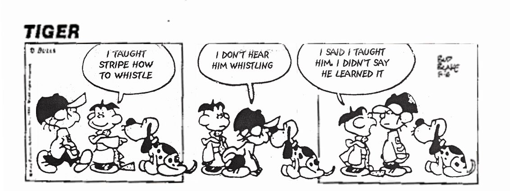

# Lernen Lernen

### Was ist Lernen ?

!!! note "Defintion"
    LERNEN IST DER PROZESS EINER ZEITLICH RELATIV ÜBERDAUERNDEN ÄNDERUNG DES VERHALTENSPOTENTIALS AUFGRUND VON ERFAHRUNG.

**Prozess**

* ein bestimmter Ablauf pro Zeit; Vorgang der in der Zeit stattfindet, nicht sprunghaft

**relativ überdauernd**

* Lernen führt zu etwas, das gewisse zeitliche Stabilität hat
* nicht vorübergehend oder kurzfristig wie Müdigkeit, Hunger oder Emotionen
* aber eingeschränkt, kann verloren gehen

**Verhaltenspotential**  

* Verhaltensänderungen sind nicht sofort sichtbar, daher eher eine Änderung des Potentials; (man könnte das Verhalten zeigen, aber tut es nicht, wenn es nicht gefordert ist)

**Erfahrung**

* Alles was uns im Laufe unseres Lebens widerfährt
* umfasst die Aufnahme von Informationen, deren Auswertung und Umsetzung sowie die Äußerung von Reaktionen, die die Umwelt beeinflussen

### Was verstehen wir unter dem Begriff Lernen?

* Erwerb von geistigen, körperlichen, sozialen Kenntnissen, Fähigkeiten und Fertigkeiten
* Durch das Lernen verändern sich das Verhalten, Denken oder Fühlen
* Absichtliches (intentionales) und beiläufiges (inzidentelles und implizites) Lernen
* Individuelles oder kollektives Lernen

