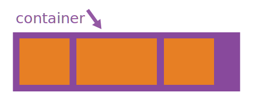
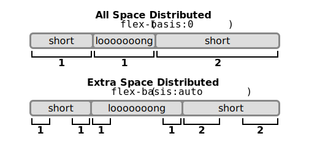

# The CSS Flexbox Layout

!!! abstract
    **Objectives:**

    * [x] You know the basic principles of the CSS3 Flexbox layout module and can apply it to built a responsive UI with a good user experience
    * [x] You learn the pasic properietes of the Flexbox layout module
    * [x] You understand how to apply the Flexbox layout module in a mobile first approach and can apply it to concrete layout problems

!!! warning ""
    **Warning: ** The flexbox is really really good but sometimes hard to understand and to apply to a concrete use case.

    The traditional layout modules are easier to understand but are limitied for the mobile first approach 
 

## Background

The __Flexible Box Layout Module__ (short _flexbox_) aims at providing a more efficient way to lay out, align and distribute space among items in a container, even when their size is unknown and/or dynamic (thus the word 'flex').

Prior to the Flexbox Layout module, the HTML and CSS Specifications defined **four main layout modes**:

- `Block`, for sections in a webpage
- `Inline`, for text
- `Table`, for two-dimensional table data
- `Positioned`, for explicit position of an element

The Flexible Box Layout Module makes it easier to design a **flexible responsive layout structure** without using float or positioning.

The main idea behind the flex layout is to give the container the ability to alter its items'

- `width`,
- `height`, and
- `order`

to **best fill the available space** in particular to __accommodate to all kind of display devices and screen sizes__. Thus, a flex container **expands** items to fill available free space, or **shrinks** them to prevent overflow.

Most importantly, the flexbox layout is **direction-agnostic** as opposed to the regular layouts such as `block`, which is vertically-based and `inline`, which is horizontally-based. While those work well for pages, they __lack flexibility to support large or complex applications__, especially when it comes to orientation changing, resizing, stretching, shrinking, etc.

!!! note
    **Note:** Flexbox layout is most appropriate to the components of an application and small-scale layouts, while the Grid layout is intended for larger scale layouts. ("When to use Flexbox vs. Grid layout")

!!! question
    **Question:** What makes the Flexbox layout direction agnostic? Think about an examples that illustrates that behaviour.

## Basic Concepts and Terminology

Flexbox is an **entire module** and *not* a single property. It hence involves a lot of new concepts including its **own set of properties**. Some of them are meant to be set on the **container** (ie parent element, known as "__flex container__") whereas the others are meant to be set on the **children** (ie child elements or "__flex items__").

The flex layout is based on **flex-flow directions**. The following figure from the specification explains the main idea behind the flex layout:

*Main elements of the flexbox layout*

Basically, items will be laid out following *either* the `main axis` (from `main-start` to `main-end`) or the `cross axis` (from `cross-start` to `cross-end`).

- **main axis** – The main axis of a flex container is the primary axis along which flex items are laid out. Beware, it is not necessarily horizontal; it depends on the `flex-direction` property (see below).
- **main-start | main-end** - The flex items are placed within the container starting from `main-start` and going to `main-end`.
- **main size** – A flex item's width or height, whichever is in the main dimension, is the item's main size. The flex item's main size property is either the ‘width’ or ‘height’ property, whichever is in the main dimension.
- **cross axis** – The axis perpendicular to the main axis is called the `cross axis`. Its direction depends on the main axis direction.
- **cross-start | cross-end** - Flex lines are filled with items and placed into the container starting on the `cross-start` side of the flex container and going toward the `cross-end` side.
- **cross size** - The width or height of a flex item, whichever is in the cross dimension, is the item's cross size. The cross size property is whichever of ‘width’ or ‘height’ that is in the cross dimension.

*The flex container (=parent)*
*The items laid out in the flex container (=children)*

## Properties of the Flex Container

To start using the Flexbox model, you need to first define a flex container.

``` html
<div class="flex-container">
  <div class="item">1</div>
  <div class="item">2</div>
  <div class="item">3</div>
</div>
```

The flex container properties are:

- `flex-direction`
- `flex-wrap`
- `flex-flow`
- `justify-content`
- `align-items`
- `align-content`

### display

This defines a flex container; the flex container becomes flexible by setting the `display` property to `flex` (=_block_) or `inline-flex` (=_inline_) depending on the given value. It enables a flex context for all its direct children.

``` css
.container {
  display: flex; /* or inline-flex */
}
```

---

### flex-direction


This establishes the `main axis`, thus defining the direction flex items are placed in the flex container. Flexbox is (aside from optional wrapping) a __single-direction layout concept__. Think of flex items as primarily laying out either in horizontal rows or vertical columns.

``` css
.container {
  flex-direction: row | row-reverse | column | column-reverse;
}
```

- `row` (default): left to right in ltr; right to left in rtl
- `row-reverse`: right to left in ltr; left to right in rtl
- `column`: same as row but top to bottom
- `column-reverse`: same as row-reverse but bottom to top

---

### flex-wrap

The `flex-wrap` property specifies whether the flex items should wrap or not.


By default, flex items will all try to fit onto one line. You can change that and allow the items to wrap as needed with this property.

``` css
.container{
  flex-wrap: nowrap | wrap | wrap-reverse;
}
```

- `nowrap` (default): all flex items will be on one line
- `wrap`: flex items will wrap onto multiple lines, from top to bottom.
- `wrap-reverse`: flex items will wrap onto multiple lines from bottom to top.

---

### justify-content

The `justify-content` property is used to align the flex items along the `main axis`, i.e., to fill the mai axis' horizontal space.


It helps distribute extra free space left over when either all the flex items on a line are inflexible, or are flexible but have reached their maximum size. It also exerts some control over the alignment of items when they overflow the line.

``` css
.container {
  justify-content: flex-start | flex-end | center | space-between | space-around | space-evenly;
}
```

- `flex-start` (default): items are packed toward the start line
- `flex-end`: items are packed toward to end line
- `center`: items are centered along the line
- `space-between`: items are evenly distributed in the line; first item is on the start line, last item on the end line
- `space-around`: items are evenly distributed in the line with equal space around them. Note that visually the spaces aren't equal, since all the items have equal space on both sides. The first item will have one unit of space against the container edge, but two units of space between the next item because that next item has its own spacing that applies.
- `space-evenly`: items are distributed so that the spacing between any two items (and the space to the edges) is equal.

---

### align-items

The `align-items` property is used to align the flex items vertically.


This defines the default behaviour for how flex items are laid out along the cross axis on the current line. Think of it as the `justify-content` version for the cross-axis (perpendicular to the main-axis).

``` css
.container {
  align-items: flex-start | flex-end | center | baseline | stretch;
}
```

- `flex-start`: cross-start margin edge of the items is placed on the cross-start line
- `flex-end`: cross-end margin edge of the items is placed on the cross-end line
- `center`: items are centered in the cross-axis
- `baseline`: items are aligned such as their baselines align
- `stretch` (default): stretch to fill the container (still respect min-width/max-width)

---

### align-content

The `align-content` property is used to align the flex lines within the flex container if there is extra space available.


This aligns a flex container's lines within when there is extra space in the `cross-axis`, similar to how `justify-content` aligns individual items within the `main-axis`.

!!! note
    This property has no effect when there is only one line of flex items.

``` css
.container {
  align-content: flex-start | flex-end | center | space-between | space-around | stretch;
}
```

- `flex-start`: lines packed to the start of the container
- `flex-end`: lines packed to the end of the container
- `center`: lines packed to the center of the container
- `space-between`: lines evenly distributed; the first line is at the start of the container while the last one is at the end
- `space-around`: lines evenly distributed with equal space around each line
- `stretch` (default): lines stretch to take up the remaining space

## Properties for the Flex Items

The direct child elements of a flex container automatically becomes flexible (flex) items.

The flex item properties are:

- `order`
- `flex-grow`
- `flex-shrink`
- `flex-basis`
- `flex`
- `align-self`

### order

The `order` property specifies the order of the flex items.


By default, flex items are laid out in the source order. However, the order property controls the order in which they appear in the flex container.
The first flex item in the code does not have to appear as the first item in the layout.

``` css
#item {
  order: <integer>; /* default is 0 */
}
```

---

### flex-grow

The `flex-grow` property specifies how much a flex item will grow relative to the rest of the flex items.


It accepts a **unitless value** that serves as a **proportion**. It dictates the **relative amount** of the available space inside the flex container the item should take up.

If all items have `flex-grow` set to 1, the remaining space in the container will be distributed equally to all children. If one of the children has a value of 2, the remaining space would take up twice as much space as the others (or it will try to, at least).

``` css
#item {
  flex-grow: <number>; /* default 0 */
}
```

Negative numbers are invalid.

---

### flex-shrink

The `flex-shrink` property specifies how much a flex item will shrink relative to the rest of the flex items.

``` css
.item {
  flex-shrink: <number>; /* default 1 */
}
```

Negative numbers are invalid.

---

### flex-basis

The `flex-basis` property specifies the initial length of a flex item.

It defines the **default size** of an element before the remaining space is distributed. It can be a length (e.g. `20%`, `5rem`, etc.) or a keyword. The auto keyword means "look at my width or height property". The `content` keyword means "size it based on the item's content" - this keyword isn't well supported yet, so it's hard to test and harder to know what its brethren `max-content`, `min-content`, and `fit-content` do.

``` css
.item {
  flex-basis: <length> | auto; /* default auto */
}
```

If set to `0`, the extra space around content isn't factored in. If set to `auto`, the extra space is distributed based on its `flex-grow` value.



---

### align-self

The `align-self` property specifies the alignment for the selected item inside the flexible container.

The `align-self` property overrides the default alignment set by the container's `align-items` property.

Please see the `align-items` explanation to understand the available values.

``` css
.item {
  align-self: auto | flex-start | flex-end | center | baseline | stretch;
}
```

## Examples

This is an experimental section to test whether Code Pens can be included in mkdoc pages.

### Simple HTML Headline

<p data-height="265" data-theme-id="0" data-slug-hash="mLKLVO" data-default-tab="html,result" data-user="StefanZander" data-embed-version="2" data-pen-title="HTML Intro" class="codepen">See the Pen <a href="https://codepen.io/StefanZander/pen/mLKLVO/">HTML Intro</a> by Stefan Zander (<a href="https://codepen.io/StefanZander">@StefanZander</a>) on <a href="https://codepen.io">CodePen</a>.</p>
<script async src="https://static.codepen.io/assets/embed/ei.js"></script>

### `flex-direction` and `justify-content` Properties

<p data-height="265" data-theme-id="0" data-slug-hash="ELRLgB" data-default-tab="css,result" data-user="StefanZander" data-embed-version="2" data-pen-title="Simple Flexbox" class="codepen">See the Pen <a href="https://codepen.io/StefanZander/pen/ELRLgB/">Simple Flexbox</a> by Stefan Zander (<a href="https://codepen.io/StefanZander">@StefanZander</a>) on <a href="https://codepen.io">CodePen</a>.</p>
<script async src="https://static.codepen.io/assets/embed/ei.js"></script>

## Disclaimer

Most of this information and images have been compiled from the following pages

- <https://css-tricks.com/snippets/css/a-guide-to-flexbox/>
- <https://developer.mozilla.org/en-US/docs/Web/CSS/CSS_Flexible_Box_Layout/Basic_Concepts_of_Flexbox>
