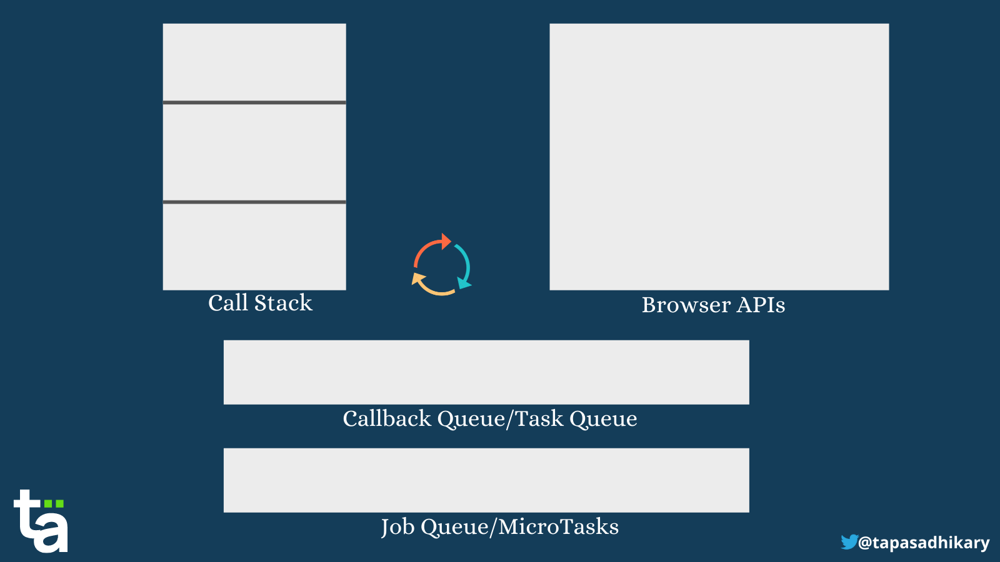

<style>
/**
 * @theme enable-all-auto-scaling
 * @auto-scaling true
 */

/* @import 'default'; */
/* @import url('user-theme2.css'); */


</style>

<!-- marp --engine ./engine.js --watch --theme-set custom-theme-roboto.css -- --allow-local-files js_concepts.md -->
<!-- marp --pdf --allow-local-files --engine ./engine.js --theme-set custom-theme-roboto.css -- js_concepts.md -->

# Entwicklung Web-basierter Anwendungen

#### Prof. Dr. Stefan Linus Zander 

Einführung in JavaScript | Wichtige Sprachkonzepte  {.lightgreen .Big .skip}


---
<!-- header: Overview -->
<!-- footer: Entwicklung Web-basierter Anwendungen | Einführung in JavaScript – Wichtige Konzepte | Prof. Dr. Stefan Zander | Hochschule Darmstadt – University of Applied Sciences -->

# Outline

- Error Handling using `try...catch`
- ES6 Syntax
- Closures
- Asynchronous Programming
  - Callbacks
  - Promises
  - Async & Await


---
<!-- header: Error Handling -->
# Error Handling

::::: columns
:::: single
- __Programm defensively__ $\leadsto$ ==anticipate the things that can go wrong and handle them in your code==
  - e.g. Checking parameter types
  - e.g. Checking for `null` or `undefined`
- Surround code that can throw errors with `try / catch`
    - e.g. in node.js, an unhandled error might cause your server to shut down
- Throw `Error` objects in case of unexpected events

::: blue small centerbox BIGskip
**Error Handling is a kind of mindset**
Prepare your code for things that can go wrong & handle them nicely!
:::
::::
:::: single
```js
// NO Error Handling
const printFirstTwoLetters = (str) => { 
    const firstTwo = str.substring(0,2);
    console.log(firstTwo); // will not be executed
}
printFirstTwoLetters(5) // str.substring is not a function
```
```js
// WITH Error Handling
const printFirstTwoLetters = (str) => {
    "use strict";
    try {
        if (typeof str !== "string") 
            throw new Error("Parameter is not a String");
        if (str.length < 2)
            throw new Error("String is less than 2 chars");
        const firstTwo = str.substring(0,2);
        console.log(firstTwo);
    } catch (err) {
        console.log(err)
    }
}
printFirstTwoLetters(5) // Parameter is not a String
printFirstTwoLetters("5") // String is less than 2 chars
```
::::
:::::


---
<!-- header: ES6 Syntax -->
## Some new ES6 Syntax Features

<!-- ES6/ES2015 syntax is widely used across the Web; learn it to better understand external JS code examples -->
::::: columns-center
:::: single
**Destructuring**
::::
:::: double
```js
let robotA = { name: "Bender" };
let robotB = { name: "Flexo" };

let { name: nameA } = robotA;
let { name: nameB } = robotB;

console.log(nameA); // "Bender"
console.log(nameB); // "Flexo"
```
::::
:::: double
```js
let options = {   title: "Menu",  
                  width: 100, 
                  height: 200 
              };

let {title, width, height} = options;

console.log(title, width, heigth); 
```
::::
:::::

::::: columns-center
:::: single
**The Spread Operator**
::::
:::: double
```js
let dateFields = [1970, 0, 1];  
let d = new Date(...dateFields);
```
::::
:::: double
```js
let obj1 = { foo: 'bar', x: 42 };
let obj2 = { foo: 'baz', y: 13 };
let mergedObj = { ...obj1, ...obj2 };
// Object { foo: "baz", x: 42, y: 13 }
```
::::
:::::

::::: columns-center
:::: single
**Literal Strings**
::::
:::: double
```js
const a = 101;
const b = 42;
const quiz = "Sum of " + a + " + " + b + 
  " is " + (a + b) + ".";
```
::::
:::: double
```js
// written as template literal
const quiz = 
  `Sum of ${a} + ${b} is ${(a + b)}.`;
```
::::
:::::

::: footnotes
Source: https://www.youtube.com/watch?v=a00NRSFgHsY and https://javascript.info/destructuring-assignment
::: 


---
<!-- header: Closures -->
# Closures

::::: columns
:::: single
- A closure is the combination of ==outer== and ==inner functions== 
- A closure provides access to an outer function’s scope from an inner function
- Closures are a common way to achieve ==encapsulation==, ie. <br/> $\leadsto$ _hiding data from external and uncontrolled access_
- To use a closure, define a function inside another function and expose it – return it or pass it to another function
- The inner function will have access to the ==lexical scope== of the outer function, even after the outer function has returned

  ::: blue centerbox small BigSkip
  **Usage Scenarios**
    - Isolation of protected variables
    - Transportation of states to another scope
    - Creation of stateful functions
  :::
::::
:::: single
```js
function MyProtectedObj(param) {
  const mySecretVariable = Math.floor(4711 * Math.random());
  let name = param;

  return { 
    getCode: function() { 
      return mySecretVariable;
    },
    setName: function(value) {
      name = value;
    },
    getName: function() {
      return name;
    }
  }
}
```

```js
let obj = MyProtectedObj("James");

console.log(mySecretVariable);      // Reference Error 
console.log(obj.mySecretVariable);  // outputs 'undefined'

obj.getCode();          //returns the randomly generated number
obj.setName("John");    //ok
obj.getName();          //outputs 'John'
```
::::
:::::


---
# Closure – Pitfalls

::::: columns
:::: double
Be careful, `this` does not work in closures
::::
:::: triple
```js
function MyProtectedObj(name) {
  this.mySecretVariable = Math.floor(4711 * Math.random());
  this.name = name;

  return { 
    getCode: function() { 
      return mySecretVariable;
    },
    setCode: function(value) {
      mySecretVariable = value;
    },
    getName: function() {
      return name;
    }
  }
}

let obj = MyProtectedObj("James");

//works since mySecretVariable is bound to the global scope
console.log(mySecretVariable);  // outputs the generated number
```
::::
:::::

::: footnotes
Sources: https://medium.com/javascript-scene/master-the-javascript-interview-what-is-a-closure-b2f0d2152b36 and 
https://www.computerbase.de/forum/threads/warum-sind-closures-so-wichtig.1906523/
:::


---
<!-- header: Asychronicity in JavaScript -->
# Asynchronous JavaScript


---
## JavaScript is a Single-Threaded, Non-Blocking, Asynchronous PL

::::: columns-center
:::: single small
**Function Execution Stack** (aka ==Call Stack==)
<!-- - LIFO Data structure maintained internally by the JS engine -->
- All invoked functions are added to the call stack
- Completed functions are removed until the stack is empty
- Functions are executed ==synchronously== one-by-one

<!-- - Events or remote API calls might interrupt the execution -->
**Callback Queue** (aka ==Task Queue==)
- Callbacks are stored in this separate (FIFO) queue
- The JS engine _periodically_ looks for new entries in the ==task queue== and once the ==call stack== is empty it shifts the first entry to the call stack and executes it synchronously (==$\Rightarrow$ event loop==)

<!-- - Promises are special objects that help executing async code -->
**Job Queue**
- ==Promise executor functions== are stored in the ==job queue==
- For each loop of the event loop, one macro task is completed out of the callback queue
- Once that task is complete, the event loop visits the job queue and completes all micro-tasks in the job queue before it continues.
<!-- - The JS engine uses a stack data structure to keep track of currently executed functions. The stack is called **Function Execution Stack**.
- The Function Execution Stack (aka ==Call Stack==) executes the functions _sequentially_, line-by-line, one-by-one.
- The browser/web APIs use ==callback functions== to complete thetasks when an asynchronous operation/delay is done. The callback function is placed in the callback queue.
- The promise executor functions are placed in the job queue.
- For each loop of the event loop, one macro task is completed out of the callback queue.
- Once that task is complete, the event loop visits the job queue. It completes all the micro-tasks in the job queue before it looks for the next thing.
- If both the queues get entries at the same point in time, the job queue gets preference over the callback queue. -->

::::
:::: single 
::: blue centerbox center
**Single-threaded** and **asychronous** – how does this work ???
:::

::::
:::::


::: footnotes
Source: https://www.freecodecamp.org/news/synchronous-vs-asynchronous-in-javascript/
:::


---
# Asynchronous Programming 

- JavaScript has some *unique features* for the ==asynchronous execution== of code
- The 3 _most important concepts_ are

::::: centerbox blue Skip Big 
1.) **Callbacks**
2.) **Promises**
3.) **Async & Await**
:::::


---
<!-- header: Callback Functions -->
# Callbacks


::::: columns
:::: single
- ==Callbacks== are a _central element_ in ==asynchronous JavaScript==
- Callbacks are ==(mostly anonymous) functions== that will be called when a previously defined ==event== occurs
- Callbacks are implement ==handler functions==; they are called ==asynchronously== by the JavaScript engine
- Callbacks are most commonly used to ...
  - handle ==input events==
  - processes recieved ==JSON data== from AJAX requests
- Callbacks can become _problematic_ $\rightarrow$ ==Callback-Hell==
::::
:::: single
```js
//************ Example #1: A Simple Callback ************
console.log("Hallo Welt - jetzt");

setTimeout(() => {
    console.log("Hallo Welt - nach 1 Sek.")
}, 1000 ); 

console.log(
    "Dieser Code wird vor dem asynchronen Code ausgeführt...");

// Output:
// "Hallo Welt - jetzt"
// "Dieser Code wird vor dem asynchronen Code ausgeführt..."
// "Hallo Welt - nach 1 Sek."


//******* Example #2: Event Handler for DOM Elements *******
const btn = document.querySelector('#btn');
btn.addEventListener("click", () => { ... });
```
::::
:::::


---
# Callback-Hell

The **callback-hell** denotes a ==christmas tree like pattern== of ==nested callback handlers==


::::: columns-bottom
:::: single
```js
let i = 0;
let stop = false;

setTimeout(() => {
    console.log("rot – " + i);
    setTimeout(() => {
        console.log("gelb – " + i);
        setTimeout(() => {
            console.log("grün – " + i);
            stop = true;
        }, 2000);
    }, 2000);
}, 2000);

const inc = setInterval(() => { 
    i = i + 1;
    if (stop === true) {
        clearInterval(inc);
    }
}, 500);
```
::::
:::: single
Output
```js
// rot – 3
// gelb – 7
// grün – 11
```
::::
:::::


---
<!-- header: Promises -->
# Promises

::::: columns
:::: single
- Promises are objects for making _asynchronous calls_
  - a ==value== is created in a success case
  - an ==error== is created if the promise does not complete
- The ==promise constructor== expects an ==executor function== with two ==callback functions== as arguments
  - `resolve` indicates a _successful completion_ of the task  
  - `reject` indicates the occurence of an _error_
- Callback functions are used to announce the _outcome_
- The callback functions are provided by JavaScript
- Promises have three ==handler methods==
  - `.then()` accepts `result` and `error` as arguments
  - `.catch()` used to handle error cases
  - `.finally()` used to perform cleanup work
::::
:::: single
```js
// Example
const myPromise = new Promise((resolve, reject) => {
    const rand = Math.floor(Math.random() * 2); // '0' or '1'
    if (rand === 0) {
        resolve(rand);
    } else {
        reject(new Error("Fehlerfall – " + rand));
    }
} );

// Promises can be chained instead of nested 
// ie., no christmas-tree-pattern 
myPromise
    .then((rand) => console.log("Success – " + rand))
    .then(() => console.log("2. Ausgabe nur im Erfolgsfall"))
    .catch((err) => console.error(err));
```
::::
:::::

::: footnotes
Source: https://blog.greenroots.info/javascript-promises-explain-like-i-am-five
:::

---
# Fetch with Promises

::::: columns
:::: single
- The **Fetch API** interface allows web browser to make asynchronous HTTP requests without `XMLHttpRequest`
- The `fetch()` method allows to fetch resources asynchronosly
  - it takes at least ==one argument==: the URL to fetch
  - it does not directly return the data but a ==promise== that resolves with a `Response` object
- The `Response` object contains the entire _HTTP response_
  - `.json()` needs to be called to _retrieve_ the ==JSON data==
- The promise object returned won't be rejected in case of HTTP status codes `404` or `500`
::::
:::: single
```js
const fetch = require('node-fetch');  // not needed in browser

fetch("https://randomuser.me/api/")
    .then((response) => response.json())
    .then((data) => console.log(data.results) )
    .catch((err) => console.error(err));

// Output
[  
  {
    gender: 'male',
    name: { title: 'Mr', first: 'Maël', last: 'Da Silva' },
    location: {
      street: [Object],
      city: 'Poitiers',
      state: 'Guadeloupe',
      country: 'France',
      postcode: 54475,
      coordinates: [Object],
      timezone: [Object]
    }, [...] 
  } 
]
```
::::
:::::

::: footnotes
Sources: https://developer.mozilla.org/en-US/docs/Web/API/Fetch_API/Using_Fetch
:::


---
<!-- header: Async & Await -->
## Async & Await – The Preferred Way to handle Promises and Asynchronous Operations
<!--
- marking a function as `async` signals the JS engine that it is called asynchronously
- in asynchronous functions, we can use the `await` keyword
  - the literal meaning is that we 'await the response'
  - the JS engine automatically assigns the response value to the variable
- Async/Await allows to write cleaner code compared to promises
-->

::::: columns
:::: single
- Async & Await work on top of ==promises==
- We use `async` to ==return a promise==^1^
  - `async` declares an asychronous function
  - transforms a function into a `Promise`
  - enable the use of `await`
  - resolve with whatever is returned by its body
- We use `await` to wait and ==handle a promise==
  - `await` pauses the execution of asynchronous functions
    - until a promise is settled (either resolved or rejected)
    - and a value/error is returned/thrown
  - `await` is used in front on promises
  - only works with promises, not callbacks
  - can only be used inside `async` functions
::::
:::: single
```js
const fetchUserWithErrorHandling = async () => {
    try {
        const res = await fetch(url);
        const data = await res.json();
        console.log("finished");
    } catch(err) {
        console.error(err);
    }
}

fetchUserWithErrorHandling();
```
::: small
- If the promise rejects, it throws an error that is handled by the `catch` block
- Async/Await enables standard ==error handling== with `try...catch`
::: small
::::
:::::

::: footnotes
^1^ If you do not return a promise explicitly from an async function, JavaScript automatically wraps the value in a Promise and returns it.
:::


---
## Await must be Invoked in an async Function

::::: columns-center
:::: triple
```js
const fetchUserDetails = async (userId) => {
    // pretend we make an asynchronous call
    // and return the user details
    return {'name': 'Robin', 'likes': ['toys', 'pizzas']};
}
```
::::
:::: double
**Remember**
An async function always encapsulates its return value in a promise
::::
:::::

::::: columns-center
:::: triple
```js
// not working
const user = await fetchUserDetails();
console.log(user);
```
::::
:::: double
**Remember**
`await` can only be called inside an async function
::::
:::::

::::: columns-center
:::: triple
```js
// correct solution via IIFE
(async () => {
    const user = await fetchUserDetails();
    console.log(user);
})();
```
::::
:::: double
**Remember**
In order to use `await` regardless of an async function, it need to be wrapped in an async IIFE
::::
:::::

::: footnotes
Source: https://blog.greenroots.info/javascript-async-and-await-in-plain-english-please
:::


---
<!-- header: JavaScript Modules -->
# JavaScript Modules

::::: columns
:::: single
* Modules are used to separte code into files
* Modules are self-contained units of code, stored in files


::::
:::: single
```js
Code
```
::::
:::::


::: footnotes
Sources:
- https://www.freecodecamp.org/news/javascript-modules-explained-with-examples/
- https://www.freecodecamp.org/news/javascript-modules-beginners-guide/
- https://www.freecodecamp.org/news/javascript-modules-a-beginner-s-guide-783f7d7a5fcc/
:::


---
<!-- header: Summary -->
# Summary


---
# :far-lightbulb: Points to Remember

::::: columns
:::: double
- Unsafe code should always be wrapped in a `try-catch()` block
- Closures allow to hide data from external and uncontrolled access through a combination of inner and outer function
- Closures work both when executed as function as well as constructors
- JavaScript employs different data structure in order to enable asynchronocity
  - functions are executed in a call stack 
  - callbacks are so-called macro-tasks and processed in the ... queue 
  - promises are micro-tasks and processed in the ... 
- The event loop priorizes micro tasks over macro tasks which are executed only when the call stack is empty
- Callback functions, Promises, and functions encapsulated in async and await are executed asynchronously
::::
:::: single vert-center

::::
:::::


<!-- Sehr gute JS-Tutorial-Quelle https://www.tutorialstonight.com/js/js-objects#javascript-object-using-class -->
