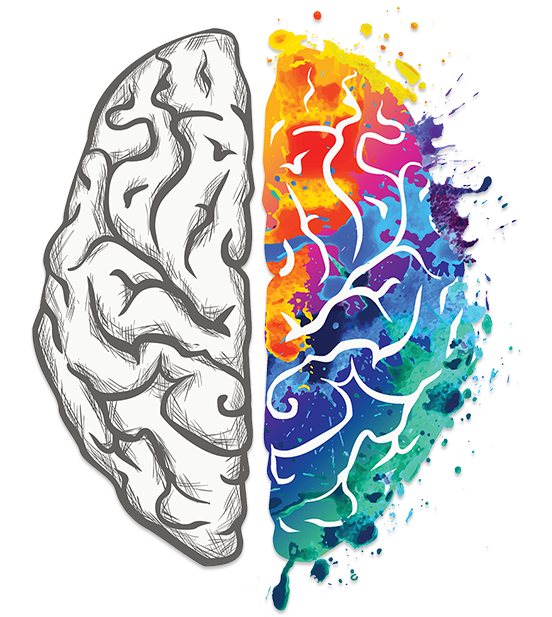

<!-- marp --engine ./engine.js --watch --theme-set custom-theme-roboto.css -- --allow-local-files 2024_SS_Kick-Off.md -->
<!-- marp --pdf --allow-local-files --engine ./engine.js --theme-set custom-theme-roboto.css -- 2024_SS_Kick-Off.md -->

<!--  -->
# Informatik und Gesellschaft {.Huge}

#### Dipl. Soz. Bettina von Römer & Prof. Dr. Stefan Linus Zander

Kick-Off und Organisation 
16.04.2024 {.lightgreen .Big .Bigskip}

---
<!-- header: ""Organisation und Durchführung"" -->
<!-- footer: von Römer & Zander | Informatik und Gesellschaft | Sommersemester 2024 | Kick-Off – 16.04.2024  -->

# Heutige Agenda

- Vorstellung der Dozierenden
- Ziele der Veranstaltung
- Anforderungen
- Erwartungen
- Organisation
  - Ablauf einer Seminarstunde
  - Ablauf im Semester
- Bewertungskriterien
- Themenvorstellung

---
<!-- header: "" -->
# Dipl. Soz. Bettina von Römer

::::: columns
:::: single
::: center

<bettina.vonroemer@h-da.de>
::::
:::: triple small
- **Studium**
  - Philipps-Universität Marburg (MA Geschichte) 
  - Universität Bielefeld (Dipl. Soz.)

- **Arbeit/ Forschung/ Lehre**
  - Wissenschaftliche Angestellte an der Universität Kassel 
  - Freiberufliche Tätigkeiten als Dozentin und Beraterin, u.a.:
  - Universität Stuttgart (Nachwuchsbarometer Technikwissenschaften); Berufsakademie Stuttgart - Europäische Schulen Organisation (ESO); Deutsche Telekom Training - Stuttgart 
  - Lehrbeauftragte (h_da)	
  - Freie Mitarbeiterin der Sonderforschungsgruppe Institutionenanalyse (sofia) (h_da)
  - Lehrkraft für besondere Aufgaben (LfbA) (h_da) seit 2013
  - Empirische Forschung u.a. zum Mobilitätsverhalten in ländlichen Regionen (MOVE) und aktuell: Gewalt gegen Frauen (Feminizid)

- **Leben**
  - Seit 2000 in Weinheim
  - Verheiratet, drei – inzwischen – erwachsene Kinder
::::
:::::

---
<!-- header: "" -->
# Prof. Dr. Stefan Zander

::::: columns
:::: single vert-top
::: center 

<stefan.zander@h-da.de>
::::
:::: triple small
- **Werdegang**
  - Informatikstudium (Diplom) + Int. Masterstudium (in D und UK)
  - Universität Wien (Promotion + Tätigkeit als Universitätsassistent)
  - Forschungszentrum Informatik am KIT (Researcher Scientist + Co-Forschungsgruppenleiter)	
  - Seit 04/2017 Professor an der h_da 

- **Lehrveranstaltungen**
  - Human Computer Interaction, Entwicklung Web-basierter Anwendungen, Informatik und Gesellschaft
  - Wissenschaftliches Arbeiten in der Informatik, Knowledge Graphs, Semantisches Wissensmanagement im Unternehmen

- **Forschung**
  - Methoden des User-Centered Design (User Research, Usability, Design Thinking)
  - SemantischeTechnologien und deren Anwendung in div. Spezialgebieten
  - Konzepte für Ontologie-basiertes Wissensmanagement

- **Privat**
  - verheiratet, 2 Kinder
::::
:::::

---
# Interessante Quellen zum Selbststudium

::::: columns
:::: triple
- [The Next Global Superpower Isn't Who You Think | Ian Bremmer | TED](https://youtu.be/uiUPD-z9DTg?si=nMt-72CvdQtUDarH)
  - Ein beachtenswerter TED-Talk des US-amerikanischen Politikwissenschaftlers Ian Bremmer über die Rolle und Macht von Tech-Unternehmen im Rahmen einer neuen/veränderten Weltordnung.

- [U$A – Die Dollar-Demokratie](https://youtu.be/_H7HvXFwKO0?si=YKLN40NC03eZhgtB)
  - Sehenswerte arte-Doku die aufzeigt, wie Geld bei amerikanischen Wahlen, egal ob in Washington oder in der Provinz, die Wahlergebnisse und somit die gesamte Politik in den USA bestimmt. 

- [Fake America Great Again](https://vimeo.com/471514311)
  - Die arte-Dokumentation zeigt am Beispiel des Wahlsieges des ehem. US-Präsidenten Trump, wie durch gezielte Datenanalyse und soziale Medien Wahlen gewonnen werden

- [Whose Job does AI automate?](https://youtu.be/gjDRDrOrH94?si=HHzs29hO8NJmgX5l)
  - Interessante Abschlusskeynote auf dem Web Summit Rio 2023 von Cassie Kozyrkov (former Chief Decision Scientist at Google) über die aktuelle AI-Entwicklung.

- [Birds Aren’t Real? How a Conspiracy Takes Flight | Peter McIndoe | TED](https://youtu.be/3VEkzweBJPM?si=eqyJtbWJVWisKqAl)

::: center orangebox marg25
Weitere Vorschläge aus dem Plenum ?
:::

::::
:::: single center

::::
:::::

---
# Allgemeines :fa-chalkboard:

- **Lehrformat: Seminar**
  - 2,5 CP
  - Sprache: deutsch
  - Anwesenheitspflicht bei allen Terminen

- **Erläuterung 2,5 CP**
  - 1 CP entspricht 25 - 30 Std. Arbeit
  - Entsprechend 2,5 CP = ca. 60 - 75 Std.
  - Vollzeitstudium geht von 30 CP pro Semester aus, das entspricht
  - 2,5 CP ≙ 8,5 %, d.h. bei 6-Tage-Woche ½ Tag pro Woche (4 Std.)

- **Letzte Möglichkeit zur Abmeldung: Ende der Restplatzvergabe (siehe OBS)**
  - danach Note 5 bei Nichtabgabe/Nichtteilnahme

---
# Ziele der Veranstaltung

<!-- ::::: columns-center
:::: single -->
**Informatikthemen mit Gesellschaftsbezug**
- In was für einer Gesellschaft wollen *SIE* leben?
- Wie mitgestalten? Wo Verantwortung übernehmen?
- An welchen Stellen ist das für die Informatik relevant?

**Reflexion der gesellschaftlichen Aspekte der Informatik**
- NICHT abdriften in technische Details

**Wöchentlich eine Präsentation zu einem relevanten Thema**
- Gruppenpräsentation (3-4 Personen)
- Diskussion im Plenum

**Erstellung eines Quizzes zu den wichtigsten Inhalten des Vortrags**
- Lernzielkontrolle und Reflexion
<!-- **Lernzielkontrolle in der Folgewoche mittels Quiz (neu)** -->
<!-- 
::::
:::: single

::::
::::: -->

<!-- ::: footnotes
Bildquelle: https://c4.wallpaperflare.com/wallpaper/556/603/706/1892-on-the-terrace-german-painter-german-painter-oil-on-canvas-hd-wallpaper-preview.jpg
::: -->

---
# Lernziele nach Modulhandbuch :fa-book:

::::: columns-center
:::: double
- Die Studierenden sollen die **Bedingungen**, **Wirkungen** und **Folgen** des **informatorischen Handelns** und **Gestaltens** in der **Gesellschaft** analysieren, verstehen und beurteilen lernen. 

- Sie sollen die Grundlagen zur Wahrnehmung der **eigenen Verantwortung** gegenüber den vom **Informationstechnik-Einsatz Betroffenen** und zur Umsetzung in individuelles und gemeinsames, **gesellschaftlich wirksames** und **verantwortliches Handeln** lernen.
::::
:::: single

::::
:::::

---
# Was wird von Ihnen verlangt ?

<!-- ::::: columns-center
:::: single -->
- Mitmachen :fa-people-pulling: – Mitdenken :fa-head-side-virus: – Mitdiskutieren :fa-comment:
- Aktivität & Aufmerksamkeit
- Redebereitschaft & Diskussionslust
- Lesefreude & Schreibbereitschaft
- Wöchentliche Teilnahme
- Textlektüre (jede Woche)
- Gruppenvortrag und Diskussionsleitung (1x)
- Quiz-Erstellung und Durchführung (1x)
<!-- ::::
:::: single

::::
::::: -->

::: footnotes
Bildquelle: https://c4.wallpaperflare.com/wallpaper/710/270/417/1898-austrian-painter-austrian-painter-oil-on-canvas-franz-von-defregger-hd-wallpaper-preview.jpg
:::

---
# Anforderungen :fa-person-digging:

**Vorbereitung und Leitung einer Seminarstunde**
- Gruppenpräsentation, Interaktion und Diskussionsleitung zu einem Thema (max. 55 min)
- Zeitmanagement ist IHRE Aufgabe!

**Erstellung eines Quizzes zu Ihrer Seminarstunde**
- Durchführung des Quizzes in der Woche nach Ihrer eigenen Präsentation

**Anwesenheitspflicht in jeder Seminarstunde**
- Abwesenheit mit schriftlichem Nachweis per E-Mail:
  - Ärztliches Attest (Arbeitsunfähigkeitsbescheinigung)
- Ein zweites unentschuldigtes Fehlen führt zum Nichtbestehen des Moduls
  <!-- - Corona: PCR- oder Bürgertest Ergebnis (Bescheinigung) -->

---
# Erwartungen

**Wöchentliche Lektüre der Quellen für jedes Thema**
- die Präsentation soll davon ausgehen, dass alle Anwesenden die Texte gelesen haben

**Aktive Beteiligung an den Diskussionen**
- Aktivität & Aufmerksamkeit
- Redebereitschaft & Diskussionslust
- ==Nutzung von elektronischen Geräten ausschließlich zu Seminarzwecken (kein Coding oder sonst. Tätigkeiten) :far-hand-point-up:== 

**Aktive Vorbereitung ihres Themas mehrere Wochen im Voraus** 
- Lesen der bereitgestellten Literatur
- Selbständige Suche nach weiteren, wissenschaftlich-belastbare und seriösen Quellen
- Entwicklung zentraler Aussagen/Thesen (welche im Vortrag argumentativ gestützt und verteidigt werden)
- Selbständiges Einholen von Feedback der Dozierenden

<!-- - 2 Wochen vorher: E-Mail mit Stichpunkten, Fragen und Quellen an die Dozierenden
- 1 Woche vorher: Absprache mit Dozierenden im Rahmen des Seminars (Coaching vor Ort) -->

---
## Gruppenpräsentation :fa-people-group:
<!--  -->

- **Gruppen von 3-4 Studierenden halten eine [gemeinsame]{.underline} Präsentation**
   - Ausgeglichene Zeiteinteilung :far-clock:
   - Präsentation baut aufeinander auf (keine streng aneinandergereihten Präsentationen)
   - Jeweils kurze Vorstellung der Präsentierenden (wir müssen wissen wer spricht!)
   - Präsentation und Diskussion müssen nicht unbedingt getrennt nacheinander erfolgen

- **Sie stellen ihr Thema anregend vor und leiten hin zu einer Diskussion**
  - Mit Gesellschaftsbezug!
  - Keine technischen Details oder Sachvorträge, aber korrekte Definition und Einordnung ihres Themas
  - Stellen Sie Thesen vor (oder auf) die aufrütteln :fas-person-circle-exclamation:, provozieren :fas-heart-circle-exclamation:, zum Diskutieren :fas-comments: einladen

- **Sie kennen ihr Thema – ihre Kommilitonen lernen etwas neues**
   - Keine „Zusammenfassung“ der vorgegebenen Quellen
   - Quellen sind Startpunkt und Grundlage Ihrer eigenen Recherche
   - Sie sind relativ frei in der Gestaltung ihres Themas

- **Formalien**
  - wissenschaftliche Quellenangaben (bei Bildern, Zitaten und Studien direkt auf der Folie), Seitenzahlen, …
  - Abgabe der Präsentation durch Hochladen im Moodle-Forum als PDF: **noch am gleichen Tag**

---
## Quiz :fa-dice: (1/2)

::: twocolumns 
:fas-bullseye: **Zielsetzung** {.big .center .inverseblue}
- für Gruppe
  - Feedback, wie gut das Plenum die zentralen Inhalte aufgenommen hat
- für Plenum
  - Sichtbarmachung, wie gut der Vortag verstanden wurde 
  $\leadsto$ was blieb hängen?!
- für alle Studierenden
  - Möglichkeit, durch sehr gute Leistungen in den Quizzes eine *Aufwertung* der Seminarnote zu erhalten

:fas-list-check: **Aufgabe** {.big .center .inversegreen}
- für Gruppe
  - Herausarbeitung der _wesentlichen Inhalte_ etc. der Seminarstunde und Überführung in ein Hörsaalquiz in der Folgewoche
  - Durchführung des Quizzes zu Beginn der Folgeveranstaltung
  - Verwaltung und Export der Rangliste (--> Vorlage in Moodle)
- für Studierende
  - Registration mit Matrikelnummer am jeweiligen Quiz 
  - regelmäßige Teilnahme
:::

---
## Quiz :fa-dice: (2/2)

::::: columns-center
:::: double
:fas-truck-fast: **Durchführung** 
- Tools: 
  - **Quizizz** (https://quizizz.com/?lng=de) oder 
  - **arsnova.click** (https://arsnova.click/)
  - kostenlose Registrierung mind. eines Mitglieds (nur bei Quizizz)
- Teilnehmende registrieren sich zu Beginn des Quizzes mit der *Matrikelnummer* 
- Auslegung des Quizzes auf etwa *8 - 10 Minuten (max.)* 
- Fragen zeitlich begrenzen; gerne mit unterschiedlichen Fragetypen(1)^1^
- Präsentation des Quizzes und der Ergebnisse und Rangliste am Beamer
- Exportieren der Rangliste als `.csv` und Upload im Moodle-Forum
- Übertragung der Rangliste in das bereit gestellte Template (Link in Moodle)
::::
:::: single bluebox small
**Regeln** :fa-medal: {.big .center}
- Beste 3 Teilnehmende am Semesterende erhalten eine Aufwertung :fa-arrow-trend-up: von bis zu einer Notenstufe auf die Seminarnote
- Schlechteste 3 Teilnehmende am Semesterende erhalten eine Abwertung :fa-arrow-trend-down: von 0,3 auf die Seminarnote
- bei mehr als 3 Nicht-Teilnahmen 0,3 Abzug :fa-arrow-trend-down: auf die Seminarnote; für jede weitere Nicht-Teilnahme Abzug :fa-arrow-trend-down: von 0,1 auf die Seminarnote
::::
:::::

::: footnotes
(1)^1^ In der freien/kostenlosen Version sind die Fragetypen stark begrenzt. 
:::

---

# Ablauf einer Seminarstunde

- Die Seminarstunde wird von der jeweiligen Gruppe "ausgerichtet"
   - Zeitüberschreitung wird sanktioniert:
      - *Weiße Karte*:	0 Minuten übrig –	Noch kein Abzug	– Kommen Sie zum Ende.
      - *Gelbe Karte*:	2 Minuten überzogen –	0,3 Notenpunkte Abzug	– Kommen Sie zum Ende!
      - *Rote Karte*:	5 Minuten überzogen –	1 Notenpunkt Abzug	– Abbruch durch Dozent_in

- :far-clock: Zeitplan:
   - Start: pünktlich
   - 5 Minuten: Fragen; Vorbereitung des Quizzes; Registrierung der Teilnehmenden
   - 10 Minuten: Durchführung des Quizzes zum Thema aus der Vorwoche
   - 5 Minuten: Kurzes Reflexion des Quizzes
   - 55 Minuten: Präsentation, Diskussion und Interaktion
   - 15 Minuten: Feedback zur Präsentation
   - Ende: 13:30 Uhr
   - bei Bedarf: zus. Feedback und/oder Coaching der nachfolgenden Gruppe

---
# Semestertermine :far-calendar:

- **1. Termin: Kickoff und Organisation (heute 16.04.2024)**
   - Gruppen- und Themenfindung

<!--
- **2. Termin: Einführung der Dozierenden** (Themenfindung abgeschlossen)
  - Impulsvortrag zu Demokratie und Digitalisierung ––brauchen wir diesen Termin? 
-->

- **2. & 3. Termin: Worauf kommt es bei den Präsentationen an?**
   - Grundlagen wissenschaftlichen Arbeitens; 
   - Vorstellung der wichtigsten Präsentationstechniken
   - Vorstellung der Quizzsysteme
   - Gruppencoaching: Alle Gruppen haben Ihr Thema und stellen die jeweiligen Fragestellungen und Vorgehensweise vor

- **4. Termin: Vorbereitung der Seminarstunden** 
  - selbständige Gruppenarbeit; keine Präsenzveranstaltung; bei Bedarf Coaching und Feedback durch Dozierende

- **5. – 13. Termin: insgesamt 12 Themen & 9 Gruppen** (Themen und Termine in Moodle)
  - Präsentation
  - Diskussion
  - Quiz

- **14. Termin (16.07.2024)**
  - Puffer / Quiz / Vorlesungsevaluation / Feeback / Abschluss

---
# Bewertungskriterien :fa-trophy:

::::: grid2col widthauto horizontal-left vertical-align-top gap1em
:fa-person-chalkboard: **Präsentation** {.redbox .big}

::: redbox
Hauptnote; ggf. individuelle Auf- bzw. Abwertung je nach Leistung
**Leistung**: Leiten der Seminarstunde (Vorbereitung, Präsentation, Moderation, Interaktion) 
**Erwartung**: Fundierte Quellenarbeit (vorgegebene + eigene); schlüssige, nachvollziehbare Ausarbeitung; souveräne Moderation und Präsentation
:::

:fa-dice: **Quiz** {.bluebox .big}

::: bluebox
Auf- bzw. Abwertung der Hauptnote entspr. der Ausarbeitung 
**Leistung**: Vorbereitung und Durchführung eines Quizzes zu den wesentlichen Inhalten & Lernzielen  
**Erwartung**: Angemessene Komplexität und Umfang; Schlüssigkeit und Nachvollziehbarkeit
:::

:fa-ranking-star: **Rangliste** {.bluebox .big}

::: bluebox
Möglichkeit zur Verbesserung der Hauptnote um bis zu einer Haupt-Notenstufe; bei Nichtteilnahme Abzug 
**Leistung**: Belegung der Top-Plätze in der Gesamtabrechnung der Quizzes
:::

:fa-comment: **Mitarbeit** {.greenbox .big}

::: greenbox
Optional; Verbesserung der Note um eine minor Notenstufe (+/- 0,3) durch individuelle Mitarbeit
**Leistung**: Sichtbarkeit; fortwährende fundierte und konstruktive Beiträge; Beteiligung an Diskussion etc.
:::
:::::

---
# Kriterien für das Präsentieren :fa-person-chalkboard:

- Gruppen-/Teamarbeit sichtbar in "rundem" Aufbau, Inhalt, Template, etc.
- Thema getroffen, gut strukturiert, sinnvoller Aufbau, roter Faden erkennbar, nachvollziehbare Überleitungen
- Lautstärke, Tempo, Modulation, freies Sprechen, Mimik, Gestik, Körperhaltung, Blickkontakt
- Interesse Wecken, „Botschaft erkennbar“, anregende Thesen für Diskussion hergeleitet
- Zeit eingehalten, Diskussion sinnvoll moderiert, „runder“ Abschluss des Themas nach Diskussion gefunden
- Sinnvolles Aufgreifen der Plenumsbeiträge, nachvollziehbare und anregende Interaktion

---
# Nächste Schritte :fa-shoe-prints:

- Themenwahl/Gruppenwahl – Eintragung via Moodle in der 2. Vorlesungsstunde
  - Abschluss bis _Montag, 22.04.2024, 24:00 Uhr_

- Bereiten Sie Ihr Thema rechtzeitig vor (_starten Sie gleich!_)
   - Lesen Sie Ihr Thema und Ihre Quellen aufmerksam durch
   - Lesen Sie alle anderen Themen, um Überschneidungen zu minimieren
     - Einige Themen sind sehr nah beieinander, bleiben Sie in Ihrem Thema!
   - Machen Sie sich Ihren Zeitplan bewusst:
      - 2 Wochen vor Ihrer Präsentation sollen Sie Ihre Vorbereitung und Quellen abgeben (:fa-right-long: per Mail an Dozentin und Dozent)

- Bereiten Sie sich mit Ihrer Gruppe auf den "Coaching"-Termin (#3) vor!
   - Gruppen stellen Fragestellung und Ideen für die Ausarbeitung vor und bekommen Feedback von den Dozierenden und Kommiliton*innen

<!-- - Lesen bzw. Hören Sie zur Einstimmung Unterhaltungslektüre aus dem Werbeblock  -->

- Beteiligen Sie sich aktiv an den Diskussionen

- Haben Sie Spaß :far-face-smile:

<!--
---
# Präsentationsthemen :fa-person-chalkboard:

1. Infokratie – Digitalisierung und die Krise der Demokratie
2. Die (digital) transparenten Bürger
3. Digitale Diskriminierung
4. Desinformationskampagnen im Wahlkampf
5. Medienkompetenz oder Digitale Demenz? Zum Einfluss der Digitalisierung auf Erziehung und Bildung
6. Typischer Informatiker – ist auf jeden Fall männlich und was noch?
7. Cognitive Warfare - Der große Informationskrieg
8. Hinter der KI: Clickworking als moderne „Sklavenarbeit“?
9. Kommunikation – „always on, aber nie da“ (alone together) 
10. Ist TikTok eine Gefahr für uns und unsere demokratischen Grundprinzipien?
11. 
-->

---
# Präsentationsthemen :fa-person-chalkboard:

1. Typischer Informatiker – ist auf jeden Fall männlich und was noch?
2. Die digital transparenten Bürger*innen - In welcher Gesellschaft wollen wir leben?
3. Infokratie: Digitalisierung und die Krise der Demokratie
4. Digitale Diskriminierung: Bias in der Programmierung und ihre Folgen für die Gesellschaft
5. Desinformationskampagnen im Wahlkampf: Angriff auf die demokratische Grundordnung
6. Die Veränderung der Kommunikation: "Alone together"
7. Cognitive Warfare: Der große Informationskrieg
8. Hinter der KI: Clickworking als modernen Sklavenarbeit?
9. Sind Systeme wie TikTok eine Gefahr für uns als Gesellschaft und unsere demokratischen Grundprinzipien?
10. Ressourcenabbau für IT-Produkte
11. Digitalsierung und Energieverbrauch
12. ChatGPT in Studium und Lehre - Nur ein neues Werkzeug oder mehr?

---
## Freibleibend für Ergebnis der Themenpriorisierung
<!-- # Themenauswahl durch die Studierenden -->
<!-- 

-->