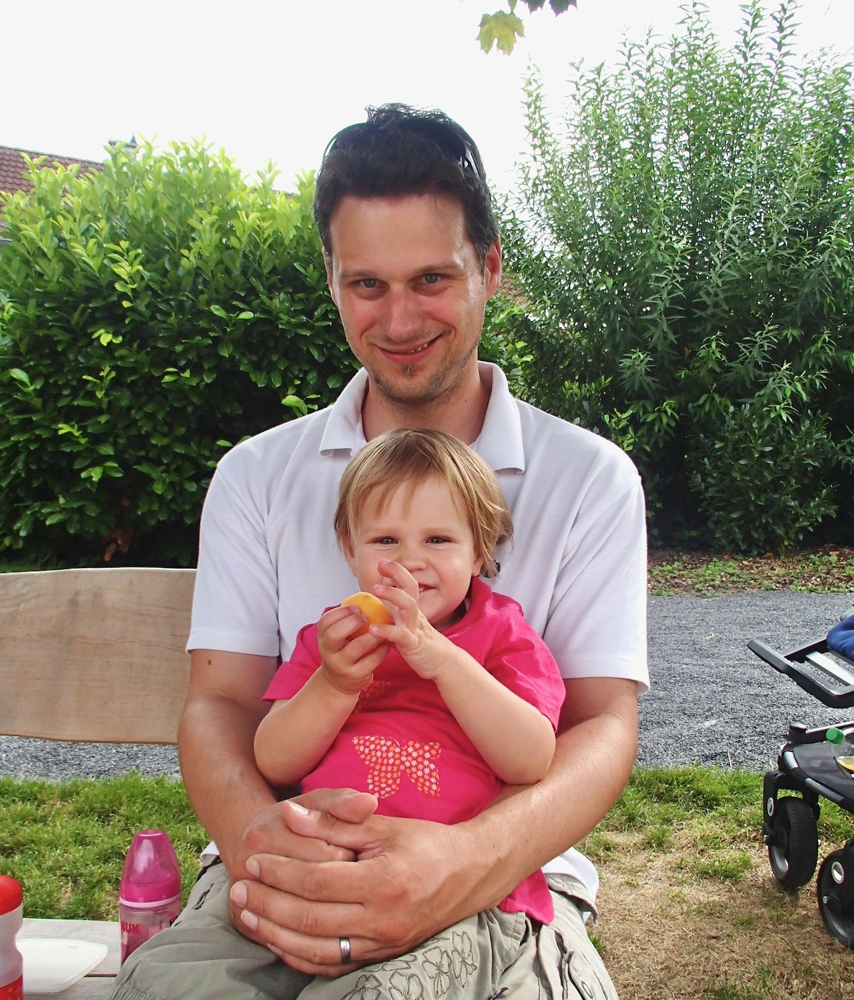

<!-- marp --engine ./engine.js --watch --theme-set custom-theme-roboto.css -- --allow-local-files kick-off.md -->
<!-- marp --pdf --allow-local-files --engine ./engine.js --theme-set custom-theme-roboto.css -- kick-off.md -->

# Informatik und Gesellschaft {.Huge}

#### Dipl. Soz. Bettina von Römer & Prof. Dr. Stefan Linus Zander 

Kick-Off und Organisation 
17.10.2023 {.lightgreen .Big .Bigskip}

---
<!-- header: ""Organisation und Durchführung"" -->
<!-- footer: Römer & Zander | Informatik und Gesellschaft | Wintersemester 2023/2024 | Kick-Off – 17.10.2023  -->

# Heutige Agenda

- Vorstellung der Dozierenden
- Ziele der Veranstaltung
- Anforderungen
- Erwartungen
- Organisation
  - Ablauf einer Seminarstunde
  - Ablauf im Semester
- Bewertungskriterien
- Themenvorstellung

---
<!-- header: "" -->
# Dipl. Soz. Bettina von Römer

::::: columns
:::: single
::: center

<bettina.vonroemer@h-da.de>
::::
:::: triple small
- **Studium**
  - Philipps-Universität Marburg (MA Geschichte) 
  - Universität Bielefeld (Dipl. Soz.)

- **Arbeit/ Forschung/ Lehre**
  - Wissenschaftliche Angestellte an der Universität Kassel 
  - Freiberufliche Tätigkeiten als Dozentin und Beraterin, u.a.:
  - Universität Stuttgart (Nachwuchsbarometer Technikwissenschaften); Berufsakademie Stuttgart - Europäische Schulen Organisation (ESO); Deutsche Telekom Training - Stuttgart 
  - Lehrbeauftragte (h_da)	
  - Freie Mitarbeiterin der Sonderforschungsgruppe Institutionenanalyse (sofia) (h_da)
  - Lehrkraft für besondere Aufgaben (LfbA) (h_da) seit 2013
  - Empirische Forschung u.a. zum Mobilitätsverhalten in ländlichen Regionen (MOVE) und aktuell: Gewalt gegen Frauen (Feminizid)

- **Leben**
  - Seit 2000 in Weinheim
  - Verheiratet, drei – inzwischen – erwachsene Kinder
::::
:::::

---
<!-- header: "" -->
# Prof. Dr. Stefan Zander

::::: columns
:::: single vert-top
::: center 

<stefan.zander@h-da.de>
::::
:::: triple small
- **Werdegang**
  - Informatikstudium (Diplom) + Int. Masterstudium (in D und UK)
  - Universität Wien (Promotion + Tätigkeit als Universitätsassistent)
  - Forschungszentrum Informatik am KIT (Researcher Scientist + Co-Forschungsgruppenleiter)	
  - Seit 04/2017 Professor an der h_da 

- **Lehrveranstaltungen**
  - Human Computer Interaction, Entwicklung Web-basierter Anwendungen, Informatik und Gesellschaft
  - Wissenschaftliches Arbeiten in der Informatik, Knowledge Graphs, Semantisches Wissensmanagement im Unternehmen

- **Forschung**
  - Methoden des User-Centered Design (User Research, Usability, Design Thinking)
  - SemantischeTechnologien und deren Anwendung in div. Spezialgebieten
  - Konzepte für Ontologie-basiertes Wissensmanagement

- **Privat**
  - verheiratet, 2 Kinder
::::
:::::

---
# Allgemeines

- **Lehrformat: Seminar**
  - 2,5 CP
  - Sprache: deutsch
  - Anwesenheitspflicht bei allen Terminen

- **Erläuterung 2,5 CP**
  - 1 CP entspricht 25-30 Std. Arbeit
  - Entsprechend 2,5 CP = ca. 60 - 75 Std.
  - Vollzeitstudium geht von 30 CP pro Semester aus, das entspricht
  - 2,5 CP ≙ 8,5 %, d.h. bei 6-Tage-Woche ½ Tag pro Woche (4 Std.)

- **Letzte Möglichkeit zur Abmeldung: Ende der Restplatzvergabe (siehe OBS)**
  - danach Note 5 bei Nichtabgabe

---
# Ziele der Veranstaltung

<!-- ::::: columns-center
:::: single -->
**Informatikthemen mit Gesellschaftsbezug**
- In was für einer Gesellschaft wollen *SIE* leben?
  - Diskussion / Mentimeter
- Wie mitgestalten?
- An welchen Stellen ist das für die Informatik relevant?
   - Diskussion / Mentimeter

**Reflexion der gesellschaftlichen Aspekte der Informatik**
- NICHT abdriften in technische Details

**Wöchentlich eine Präsentation zu einem relevanten Thema**
- Gruppenpräsentation (3/4 Personen)
- Diskussion im Plenum

**Erstellung eines Quizzes zu den wichtigsten Inhalten des Vortrags**
- Lernzielkontrolle und Reflexion
<!-- **Lernzielkontrolle in der Folgewoche mittels Quiz (neu)** -->
<!-- 
::::
:::: single

::::
::::: -->

<!-- ::: footnotes
Bildquelle: https://c4.wallpaperflare.com/wallpaper/556/603/706/1892-on-the-terrace-german-painter-german-painter-oil-on-canvas-hd-wallpaper-preview.jpg
::: -->

---
# Lernziele nach Modulhandbuch :fa-book:

::::: columns-center
:::: double
- Die Studierenden sollen die **Bedingungen**, **Wirkungen** und **Folgen** des **informatorischen Handelns** und **Gestaltens** in der **Gesellschaft** analysieren, verstehen und beurteilen lernen. 
- Sie sollen die Grundlagen zur Wahrnehmung der **eigenen Verantwortung** gegenüber den vom **Informationstechnik-Einsatz Betroffenen** und zur Umsetzung in individuelles und gemeinsames, **gesellschaftlich wirksames** und **verantwortliches Handeln** lernen.
::::
:::: single

::::
:::::

---
# Was wird von Ihnen verlangt ?

<!-- ::::: columns-center
:::: single -->
- Mitmachen :fa-people-pulling: – Mitdenken :fa-head-side-virus: – Mitdiskutieren :fa-comment:
- Aktivität & Aufmerksamkeit
- Redebereitschaft & Diskussionslust
- Lesefreude & Schreibbereitschaft
- Wöchentliche Teilnahme
- Textlektüre (jede Woche)
- Gruppenvortrag und Diskussionsleitung (1 mal)
- Quiz-Erstellung und Durchführung (1 mal)
<!-- ::::
:::: single

::::
::::: -->

<!-- ::: footnotes
Bildquelle: https://c4.wallpaperflare.com/wallpaper/710/270/417/1898-austrian-painter-austrian-painter-oil-on-canvas-franz-von-defregger-hd-wallpaper-preview.jpg
::: -->

---
# Anforderungen

**Vorbereitung und Leitung einer Seminarstunde**
- Gruppenpräsentation, Interaktion und Diskussionsleitung zu einem Thema (max. 55 min)
- Zeitmanagement ist IHRE Aufgabe!

**Erstellung eines Quizzes zu einer Seminarstunde**
- Durchführung des Quizzes in der Woche nach Ihrer eigenen Präsentation

**Anwesenheitspflicht in jeder Seminarstunde**
- Abwesenheit mit schriftlichem Nachweis per E-Mail:
  - Ärztliches Attest (Arbeitsunfähigkeitsbescheinigung)
  - Corona: PCR- oder Bürgertest Ergebnis (Bescheinigung)

---
# Erwartungen

**Wöchentliche Lektüre der Quellen für jedes Thema**
- die Präsentation soll davon ausgehen, dass alle Anwesenden die Texte gelesen haben

**Aktive Beteiligung an den Diskussionen**
- Aktivität & Aufmerksamkeit
- Redebereitschaft & Diskussionslust
- _Nutzung von elektronischen Geräten ausschließlich zu Seminarzwecken (kein Coding oder sonst. Tätigkeiten) :far-hand-point-up:_ 

**Aktive Vorbereitung ihres Themas mehrere Wochen im Voraus** 
- Lesen der bereitgestellten Literatur
- Selbständige Suche nach weiteren, wissenschaftlich-belastbare und seriösen Quellen
- Entwicklung zentraler Aussagen/Thesen (welche im Vortrag argumentativ gestützt und verteidigt werden)
- Selbständiges Einholen von Feedback der Dozierenden

<!-- - 2 Wochen vorher: E-Mail mit Stichpunkten, Fragen und Quellen an die Dozierenden
- 1 Woche vorher: Absprache mit Dozierenden im Rahmen des Seminars (Coaching vor Ort) -->

---
## Gruppenpräsentation :fa-people-group:
<!--  -->

- **Gruppen von 3(-4) Studierenden halten eine gemeinsame Präsentation**
   - Ausgeglichene Zeiteinteilung
   - Präsentation baut aufeinander auf (keine 4 aneinandergereihten Präsentationen)
   - Jeweils kurze Vorstellung der Präsentierenden (wir müssen wissen wer spricht!)
   - Präsentation und Diskussion müssen nicht unbedingt getrennt nacheinander erfolgen

- **Sie stellen ihr Thema anregend vor und leiten hin zu einer Diskussion**
  - Mit Gesellschaftsbezug!
  - Keine technischen Details oder Sachvorträge, aber korrekte Definition und Einordnung ihres Themas
  - Stellen Sie Thesen vor (oder auf) die aufrütteln, provozieren, zum Diskutieren einladen

- **Sie kennen ihr Thema, ihre Kommilitonen lernen etwas neues**
   - Keine „Zusammenfassung“ der vorgegebenen Quellen
   - Quellen sind Startpunkt und Grundlage Ihrer eigenen Recherche
   - Sie sind relativ frei in der Gestaltung ihres Themas

- **Formalien**
  - wissenschaftliche Quellenangaben (bei Bildern, Zitaten und Studien direkt auf der Folie), Seitenzahlen, …
  - Abgabe der Präsentation durch Hochladen im Forum als PDF: **noch am gleichen Tag**

---
## Quiz :fa-dice:

TBA

---

# Ablauf einer Seminarstunde

- Die Seminarstunde wird von der jeweiligen Gruppe "ausgerichtet"
   - Zeitüberschreitung wird sanktioniert:
      - Weiße Karte:	0 Minuten übrig:	Noch kein Abzug	– Kommen Sie zum Ende.
      - Gelbe Karte:	2 Minuten überzogen:	0,3 Notenpunkte Abzug	– Kommen Sie zum Ende!
      - Rote Karte:	5 Minuten überzogen:	1 Notenpunkt Abzug	– Abbruch durch Dozent_in

- Zeitplan:
   - Start: pünktlich
   - 10 Minuten: Durchführung des Quizzes zum Thema aus der Vorwoche
   - 5 Minuten: Kurzes Plenumsfeedback zum Quiz
   - 55 Minuten: Präsentation, Diskussion und Interaktion
   - 15 Minuten: Feedback zur Präsentation
   - Ende: 13:25 Uhr
   - bei Bedarf: zus. Feedback und/oder Coaching der nachfolgenden Gruppe

---
# Semestertermine :far-calendar:

- **1. Termin: Kickoff und Orga (heute 17.10.2023)**
   - Gruppen- und Themenfindung

- **2. Termin: Einführung der Dozierenden** (Themenfindung abgeschlossen)

- **3. & 4. Termin: Worauf kommt es bei den Präsentationen an?**
   - Gruppencoaching: Alle Gruppen haben Ihr Thema und stellen die jeweiligen Fragestellungen und Vorgehensweise vor

- **5.–13. Termin: insgesamt 9 Themen/Gruppen**
  - Präsentation
  - Diskussion
  - Quiz

- **14. Termin (06.02.2024)**
  - Puffer
  - Vorlesungsevaluation
  - Feedback
  - Abschluss

---
# Bewertungskriterien :fa-trophy:

::::: grid2col widthauto horizontal-left vertical-align-top gap1em
:fa-person-chalkboard: **Präsentation** {.blue}

:::
Hauptnote; ggf. individuelle Auf- bzw. Abwertung je nach Leistung
**Leistung**: Leiten der Seminarstunde (Vorbereitung, Präsentation, Moderation, Interkation) 
**Erwartung**: Fundierte Quellenarbeit (vorgegebene + eigene); schlüssige und nachvollziehbare Ausarbeitung; Moderation
:::

:fa-dice: **Quiz** {.blue}

:::
Auf- bzw. Abwertung der Hauptnote entspr. der Ausarbeitung
**Leistung**: Vorbereitung und Durchführung eines Quizzes zu den wesentlichen Inhalten und Lernzielen des Themas 
**Erwartung**: Angemessene Komplexität und Umfang; Schlüssigkeit und Nachvollziehbarkeit
:::

:fa-ranking-star: **Rangliste** {.blue}

:::
Optional; Möglichkeit zur Verbesserung der Note um max. eine Haupt-Notenstufe (+ 1,0)
**Leistung**: Belegung der Top-5-Plätze in der Gesamtabrechnung der Quizzes
:::

:fa-comment: **Mitarbeit** {.blue}

Optional; Verbesserung der Note um eine minor Notenstufe (+/- 0,3) durch individuelle Mitarbeit
**Leistung**: Sichtbarkeit; fortwährende fundierte und konstruktive Beiträge; Beteiligung an Diskussion etc.

:::::

---
# Kriterien für das Präsentieren :fa-person-chalkboard:

- Gruppen-/Teamarbeit sichtbar in "rundem" Aufbau, Inhalt, Template, etc.
- Thema getroffen, gut strukturiert, sinnvoller Aufbau, roter Faden erkennbar, nachvollziehbare Überleitungen
- Lautstärke, Tempo, Modulation, freies Sprechen, Mimik, Gestik, Körperhaltung, Blickkontakt
- Interesse Wecken, „Botschaft erkennbar“, anregende Thesen für Diskussion hergeleitet
- Zeit eingehalten, Diskussion sinnvoll moderiert, „runder“ Abschluss des Themas nach Diskussion gefunden
- Sinnvolles Aufgreifen der Plenumsbeiträge, nachvollziehbare und anregende Interaktion

---
# Nächste Schritte :fa-shoe-prints:

- Themenwahl/Gruppenwahl – Eintragung via Moodle heute Abend ab 20 Uhr möglich
  - Abschluss bis Montag, 23.10.2023, 12:00 Uhr

- Bereiten Sie Ihr Thema rechtzeitig vor
   - Lesen Sie Ihr Thema und Ihre Quellen aufmerksam durch
   - Lesen Sie alle anderen Themen, um Überschneidungen zu minimieren
     - Einige Themen sind sehr nah beieinander, bleiben Sie in Ihrem Thema!
   - Machen Sie sich Ihren Zeitplan bewusst:
      - 2 Wochen vor Ihrer Präsentation sollen Sie Ihre Vorbereitung und Quellen abgeben (:fa-right-long: per Mail an Dozentin und Dozent)

- Bereiten Sie sich mit Ihrer Gruppe auf den "Coaching"-Termin am 7.11. vor!
   - Gruppen stellen Fragestellung und Ideen für die Ausarbeitung vor und bekommen Feedback von den Dozierenden und Kommiliton*innen

- ==Lesen / Hören Sie zur Einstimmung Unterhaltungslektüre aus dem Werbeblock== -- BEIBEHALTEN?

- Beteiligen Sie sich aktiv an den Diskussionen

- Haben Sie Spaß :far-face-smile: