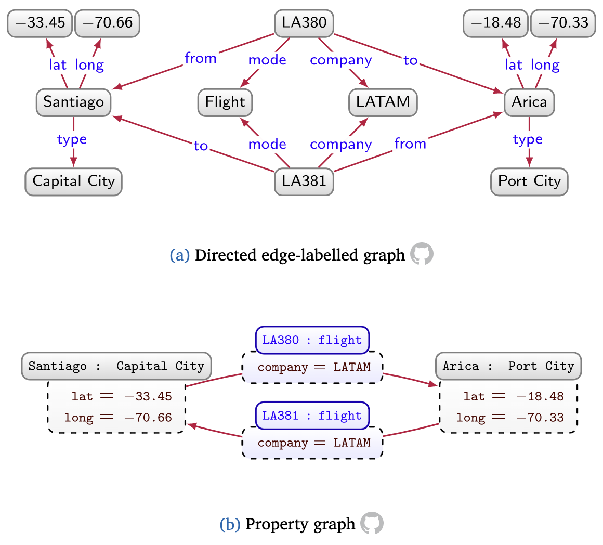

<style>
/**
 * @theme enable-all-auto-scaling
 * @auto-scaling true
 */

/* @import 'default'; */
/* @import url('user-theme2.css'); */
</style>


<!-- marp --engine ./engine.js --watch --theme-set custom-theme-roboto.css -- --allow-local-files data_graphs.md -->
<!-- marp --pdf --allow-local-files --engine ./engine.js --theme-set custom-theme-roboto.css -- data_graphs.md -->


# Foundations of Semantic Knowledge Graphs

#### Prof. Dr. Stefan Linus Zander 

Data Graph Types {.lightgreen .Big .skip}


<!-- 
## What you will learn in this Lecture


We first discuss a __selection of graph-structured data models__ that are commonly used in practice to represent data graphs. 

We then discuss the primitives that form the basis of __graph query languages__ used to interrogate such data graphs.
 -->


---
<!-- header: Teaching Methodology -->
<!-- footer: Foundations of Semantic Knowledge Graphs | Data Graphs | Prof. Dr. Stefan Zander | Hochschule Darmstadt – University of Applied Sciences -->
## A word about the teaching methodology used during the theoretical parts of this module

- At the core, we start with a mathematical definition and representation of graphs
- we then use extend these definition towards a graph-based model in CS
- We introduce data graphs and discuss different types and models
- We then add schema, identity, and context to transform data graphs into knowledge graphs
- We add semantics and ontologies to build semantic knowledge graphs and introduce a representation framework for SKGs

:::: bluebox center marg2 spacebefore
**Didactical Model**
This lecture uses a *continuum* of _increasing complexity_ applied to data graphs to explain the additional concepts and features needed for their transistion into semantic knowledge graphs as a didactical model.
::::


---
<!-- header: Motivation -->
## Motivation: A graph-based data representation provides a number of advantages over other, traditional data models

<!-- Why there is a need for data graphs -->
::::: columns
:::: single
- Requirements and peculiarities of domains of interest are often _not fully known_ at the beginning
- Additional features might needed
  - *multi-language support*
  - *multiple names* and *descriptions*
  - *multiple types*
  - incomplete or missing information might harm *schema compliance*
- Schemas might *evolve over time* as the complexity of the domain of interest increases
- *Schema adaptations* are expensive and require lots of testing and validation
  - remodelling, reloading, and reindexing of data needed
- Diversity 

::::
:::: single
**Example**

Initial schema for an event database (table with 5 columns)
```
Event(name*, venue, type, start*, end)     *uniqueness
```
A more flexible and elaborated schema solution

```
EventName(id,name),   EventStart(id,start), 
EventEnd(id,end),     EventVenue(id,venue), 
EventType(id,type) 
```

::: bluebox small smallskip
- Remodelling often results in binary relations between entities 
  $\leadsto$ close to modelling a graph
- Using a data-graph model removes the necessity of an **upfront schema** and facilitates refinements
:::
::::
:::::


---
<!-- header: Data Graph Types -->
## Overview of the different Types of Data Graphs

1. Directed Edge-Labelled Graphs
2. Heterogeneous Graphs
3. Property Graphs
4. Graph Datasets
5. Other Graph Data Models
6. Graph Stores


---
## Directed Edge-Labelled Graphs

::: definition
A ==directed edge-labelled graph== (sometimes called _multi-relational graph_) is a tuple $G = (V, E, L)$, where 
- $V \subseteq \mathbf{Con}$ is a set of nodes, 
- $L \subseteq \mathbf{Con}$ is a set of edge labels, and 
- $E = V \times L \times V$ is a set of edges with $\mathbf{Con}$ being a countable infinite set of constants.

Source: https://kgbook.org/
:::

::::: columns
:::: single 
**Remarks**
- $V$ and $L$ are _not disjoint_, ie., a node can also serve as an edge-label
- Nodes and edge labels can be present without any associated edge
- The above definition can be extended by the previous restrictions if necessary 
  - some graph databases implement these restrictions
::::
:::: single
**Characteristics**
- ==Nodes== are used to represent entities (TODO: define)
- ==Edges== represent binary relations between those entities.
- Adding information typically involves adding new nodes and edges
- Incomplete information is expressed by omitting a particular edge (eg. `start-` and/or `end-time`)
::::
:::::


<!-- 
---
## Directed Edge-Labelled Graphs

::: definition
A ==directed edge-labelled graph== is a tuple $G = (V, E, L)$, where $V \subseteq \mathbf{Con}$ is a set of nodes, $L \subseteq \mathbf{Con}$ is a set of edge labels, and $E = V \times L \times V$ is a set of edges with $\mathbf{Con}$ being a countable infinite set of constants.

Source: https://kgbook.org/
:::


::::: columns
:::: single 
**Remarks**
- $V$ and $L$ are not disjoint, ie., a node can also serve as an edge-label.
- Nodes and edge labels can be present without any associated edge.
- The above definition can be extended by the previous restrictions if necessary 
  - some graph databases implement these restrictions
::::
:::: single
**Characteristics**
- _nodes_ are used to represent entities
- _edges_ are used to represent binary relations between those entities.
- A directed edge-labelled graph is sometimes known as a _multi-relational graph_
- Adding information typically involves adding new nodes and edges
- Incomplete information is expressed by omitting a particular edge (eg. start- and/or end-time)
::::
:::::
 -->


---
## Example

::: center

:::


---
## Advantages compared to the Relational Model

::::: columns
:::: single
**Advantages**
- Modelling data as a graph in this way offers more flexibility for integrating new data sources, compared to the standard relational model, where a schema must be defined upfront and followed at each step. 
- While other structured data models such as trees (XML, JSON, etc.) would offer similar flexibility, graphs do _not require organising the data hierarchically_. 
- Graphs also allow _cycles_ to be represented and queried (e.g., note the directed cycle in the routes between Santiago, Arica, and Viña del Mar).
::::
:::: single
**Representation Framework**
- The ==Resource Description Framework (RDF)==^1^ is a standardized data model and based on the directed edge-labelled graph model
- RDF defines different types of nodes and uses IRIs for the global identification of entities across the Web
- Literals allow for the representation of strings and other datatype values
- blank nodes can be used to represent n-ary relationships
::::
:::::

::: footnotes
^1^ [Resource Description Framework (RDF)](https://www.w3.org/RDF/)
:::

<!-- 
---
## The foundation of any knowledge graphs rests on the principle of first applying a graph abstraction to data

... -->


---
## Heterogeneous Graphs

::: definition
A ==heterogeneous graph== is a tuple $G = (V, E, L, l)$, where $V \subseteq \mathbf{Con}$ is a set of nodes, $L \subseteq \mathbf{Con}$ is a set of edge/node labels, and $E = V \times L \times V$ is a set of edges with $\mathbf{Con}$ being a countable infinite set of constants, and $l : V \rightarrow L$ maps each node to a label.

Source: https://kgbook.org/
:::


**Additional Remarks**
- A ==heterogeneous graph== is a _directed graph_ where _each node and each edge is assigned one type_
- They are sometimes called __heterogeneous information network__
- In heterogeneous graphs, _edge_ and _node labels_ are often called ==types==.
- Heterogeneous graphs allow for _partitioning nodes_ according to their type to facilitate machine learning tasks
- By rather defining edges with labels (as in directed edge-labelled graphs) – rather than separately labelling edges with $l$ – two nodes can be related by $n$ edges with $n$ different labels;


---
## Example and further Characteristics

::::: columns
:::: single
::: bluebox
**Characteristics**
- Edge labels correspond to ==edge types==
  - The node type forms part of the graph model itself rather than being expressed with a relation
- An edge is called ==homogeneous==, if it is between two nodes of the same type
  - e.g., (City:Munich) partner_town_of (City:Edinburgh)
- If the **type** between two adjacent nodes is different, the edge is called ==heterogeneous==
  - e.g., (City:Santiago) capital (Country:Chile)
- Such graphs typically only support **many-to-one relations** between nodes and types 
  - as opposed to directed edge-labelled graphs which can contain untyped nodes
:::
::::
:::: single
**Examples**
::: center

:::
::::
:::::


---
## Property Graphs

::: definition
A ==property graph== is a tuple $G = (V, E, L, P, U, e, l, p)$, where 
- $V \subseteq \mathbf{Con}$ is a set of ==node ids==, 
- $L \subseteq \mathbf{Con}$ is a set of ==labels==, 
- $P \subseteq \mathbf{Con}$ is a set of ==properties==, 
- $U \subseteq \mathbf{Con}$ is a set of ==values==,
- $e = E \rightarrow V \times V$ maps an edge id to a pair of node ids,
- $l = V \cup E \rightarrow 2^{L}$ maps a node or edge id to a set of labels,
- and $p = V \cup E \rightarrow 2^{P \times U}$ maps a node or edge id to a set of property-value pairs.

Source: https://kgbook.org/
:::

**Additional Remarks**
- Property graphs constitute an _alternative graph model_ that offers _additional flexibility_ when modelling more complex relations. 
  - In the previous graph models, it is not possible to add additional information to relation, e.g., to state the price of a connection between towns
- A property graph allows a set of **property–value pairs** and a **label** to be associated with both nodes and edges.
- According to the above state defintion, a node or edge can have several values for a given property. In practice, systems like Neo4j may rather support this by allowing a single array (i.e., list) of values.


---
## Example

::::: columns-center
:::: single
::: bluebox small
**Summary**

- In summary, directed edge-labelled graphs offer a more minimal model, while property graphs offer a more flexible one. 
- Often the choice of model will be secondary to other practical factors, such as the implementations available for different models, etc.
- Property graphs are prominently used in graph databases, such as Neo4j.
- Property graphs can be converted to/from directed edge-labelled graphs
:::
::::
:::: double
::: center

:::
::::
:::::


---
## Organizing multiple data graphs in a graph dataset 

::::: columns 
:::: double
**Background**
Multiple directed edge-labelled graphs can be merged by taking their union but it is often _desirable to manage several graphs rather than one monolithic graph_.

**Constituents**
A ==graph dataset== usually consists of a {.smallskip}
1. set of _named graphs_ and 
2. a _default graph_. 

Each _named graph_ is a pair of a _graph ID_ and a _graph_. 
The _default graph_ is a graph without an ID, and is referenced "by default".


**Extensions** {.smallskip}
- Graph names can also be used as nodes in a graph. 
- Vertices and edges can be _repeated across graphs_, 
  - the same node in different graphs will typically refer to the same entity, allowing data on that entity to be integrated when merging graphs.
::::
:::: single
::: caption 

A graph dataset for representing fake news propagation (source: https://github.com/mdepak/fake-news-propagation)
:::

::: graybox smallest
Multiple graphs from different sources can be processed (update, refine, etc) differently by distinguishing untrustworthy sources from more trustworthy ones.
:::
::::
:::::


---
## Example


Graph dataset based on directed edge-labelled graphs with two named graphs and a default graph describing events and routes

::: footnotes
Source: https://kgbook.org/#subsub-graphdataset
:::


---
## A formal Definition for Graph Datasets

::: definition
A ==named graph== is a pair $(n,G)$ where 
- $G$ is a ==data graph==, and 
- $n \in \mathbf{Con}$ is a ==graph name==.

A ==graph dataset== is a pair $D = (G_{D},N)$, where
- $G_{D}$ is a data graph called ==the default graph== and
- $N$ is either the empty set, or a set of ==named graphs== $\{(n_{1}, G_{1}), \dots ,(n_{k}, G_{k})\}\ (k > 0)$ such that if $i \neq j$ then $n_{i} \neq n_{j}$ for all $1 \leqslant i \leqslant k, 1 \leqslant j \leqslant k$.

Source: kgbook.org
:::

**Additional remarks**
- We assume that all data graphs featured in a given graph dataset follow the same model (directed edge-labelled graph, heterogeneous graph, property graph, etc).
- The concept of graph datasets generalises straightforwardly to datasets of other types of graphs


---
## Other Graph Data Models and Stores (hypergraphs or hypernodes)

- Labelled property graphs, property graphs, and heterogeneous/homogeneous graphs are popular examples of graph representations. 

- Other graph data models exist that use _complex nodes_ that may contain {.smallskip}
  - individual _edges_ or 
  - _nested graphs_ (sometimes called _hypernodes_).

- Mathematical notation of a _hypergraph_ defines complex edges that _connect sets_ rather than pairs of nodes.

- Hypergraphs are thus also a special type of knowledge graph and can be converted into a simpler graph data model and vice versa.


---
## Graph Stores

A variety of techniques have been proposed for storing and indexing graphs, facilitating the efficient evaluation of queries 

Directed edge-labelled graphs can be stored in relational databases either in form of 
- a _single relation of arity tree_ (triple table), 
- as a _binary relation for each property_ (vertical partitioning), 
- or as _$n$-ary relations for entities of a given type_ (property tables)

Custom (so-called native) storage techniques have also been developed for a variety of graph models, providing efficient access for finding nodes, edges, and their adjacent elements.

A number of systems further allow for distributing graphs over multiple machines based on popular NoSQL stores or custom partitioning schemes. 


---
# Attempts for Defining Knowledge Graphs


---
## Knowledge Graphs have many contentious definitions ranging from specific technical proposals to more inclusive general proposals


An inclusive definition attempt{.Large}

::::: definition
A knowledge graph can be conceived as a graph of data intended to accumulate and convey knowledge of the real world, whose nodes represent entities of interest and whose edges represent relations between these entities. 

Adapted from...
:::::

The ==graph of data== (aka data graph) conforms to a __graph-based data model__, which may be a _directed edge-labelled graph_, a _property graph_, etc.


---
<!-- ## Another Attempt for a Knowledge Graph Definition -->
## Knowledge Graphs embody a number of characteristic properties

:::: definition
A Knowledge Graph is a data set that is:
- ==structured== (in the form of a specific data structure)
- ==normalised== (consisting of small units, such as vertices and edges)
- ==connected== (defined by the – possibly distant – connections between objects)

Moreover, knowledge graphs are typically:
- ==explicit== (created purposefully with an intended meaning)
- ==declarative== (meaningful in itself, independent of a particular implementation or algorithm)
- ==annotated== (enriched with contextual information to record additional details and meta-data)
- ==non-hierarchical== (more than just a tree-structure)
- ==large== (millions rather than hundreds of elements)

Source: Defintion taken from Knowledge Graph lecture from Prof. Dr. Markus Krötzsch, TU Dresden
::::
