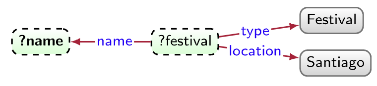

<!-- marp --engine ./engine.js --watch --theme-set custom-theme-roboto.css -- --allow-local-files deductive_knowledge.md -->
<!-- marp --pdf --allow-local-files --engine ./engine.js --theme-set custom-theme-roboto.css -- deductive_knowledge.md -->

# Foundations of Semantic Knowledge Graphs

#### Prof. Dr. Stefan Linus Zander 

Deductive Knowledge {.lightgreen .Big .skip}

---
<!-- header: Overview -->
<!-- footer: Foundations of Semantic Knowledge Graphs | A Formal Introduction to Graphs | Prof. Dr. Stefan Zander | Hochschule Darmstadt – University of Applied Sciences -->

# Outline

- ...

---
## Preliminary Considerations

::::: centercontent columns
:::: double center 

::::
:::: single
As humans, we can deduce more from the data graph (add example) than what the edges explicitly indicate:
- Ñam festival (`EID15`) will be located in Santiago, even though the graph does not contain an edge `EID15–location➛Santiago`
- The cities connected by flights must have some airport nearby, even though the graph does not contain nodes referring to these airports.
::::
:::::

::: redbox centerbox
**Data** as premise + some **general rules** we know a priori $\rightarrow$ use a **deductive process** to derive new data.
:::

---
## How can we derive new knowledge ? Humans derive new knowledge based on commonsense and domain knowledge

::::: spaceafter columns 
:::: single
::: centerbox greenbox
[__Commonsense Knowledge__ :fa-users:]{.center .big}

- general premise and rules
- known a priori
- shared by many people
:::
::::
:::: single
::: centerbox bluebox
[__Domain Knowledge__ :fas-flask-vial:]{.center .big}

- knowledge shared by few experts in an area
  - e.g. an expert in biology may know that *hemocyanin* is a protein containing copper that carries oxygen in the blood of some species of *Mollusca* and *Arthropoda*
- encoded in very specific domain models
:::
::::
:::::

Machines, in contrast, do not have a priori access to such deductive faculties; rather they need to be given **formal instructions**, in terms of premises and ==entailment regimes==, facilitating similar deductions to what a human can make. 

In this way, we will be making more of the **meaning** (i.e., ==semantics==) of the graph **explicit** in a **machine-readable format**.

---
## More about entailment regimes

**Entailment regimes** _formalise the conclusions that logically follow as a consequence of a given set of premises_.

Once instructed in this manner, machines can (often) apply deductions with a precision, efficiency, and scale beyond human performance.

These deductions may serve a range of applications, such as 
- improving query answering, 
- (deductive) classification, 
- finding inconsistencies, 
- etc.

---
## Example: Using entailment regimes for query answering

::::: columns-bottom
:::: triple
**Premise**: Example data graph with explicit statements 
::: center spacebefore

:::
::::
:::: double
**Query**: "find festivals located in Santiago"

::: center

:::

**Explanations**
- without entailment regimes, the graph pattern would return no results
  - no node of type `festival`
  - nothing has directly the location `Santigao`
- `Ñam` could be automatically entailed if we stated that 
  - $x$ being a `Food Festival` ==entails== that $x$ _is_ a `Festival`, or 
  - $x$ having venue $y$ in city $z$ ==entails== that $x$ _has location_ $z$
::::
:::::

---
## How Ontologies can help us to automatically compute entailments based on formal semantics

We will learn about ways in which more complex ==entailments== can be _expressed_ and _automated_. 

Though we could leverage a number of **logical frameworks** for these purposes – such as First-Order Logic, Datalog, Prolog, Answer Set Programming, etc. – we focus on ==ontologies==, which constitute a ==formal representation of knowledge== that, importantly for us, _can be represented as a graph_. 

We discuss 
- how ontologies can be **formally defined**, 
- how they relate to existing **logical frameworks**, and 
- how **reasoning** can be conducted with respect to such ontologies