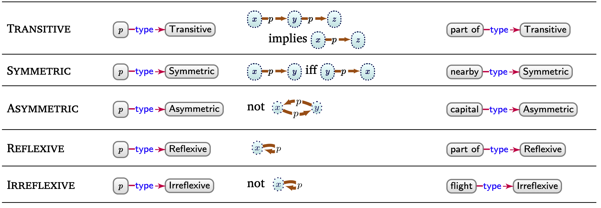
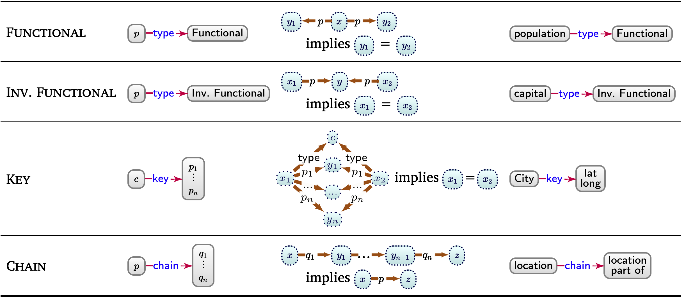
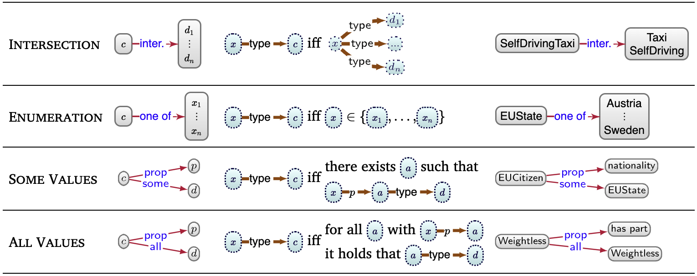

<style>
/**
 * @theme enable-all-auto-scaling
 * @auto-scaling true
 */

/* @import 'default'; */
/* @import url('user-theme2.css'); */
</style>


<!-- marp --engine ./engine.js --watch --theme-set custom-theme-roboto.css -- --allow-local-files deductive_knowledge.md -->
<!-- marp --pdf --allow-local-files --engine ./engine.js --theme-set custom-theme-roboto.css -- deductive_knowledge.md -->


# Foundations of Semantic Knowledge Graphs

#### Prof. Dr. Stefan Linus Zander 

Deductive Knowledge {.lightgreen .Big .skip}


---
<!-- header: Overview -->
<!-- footer: Foundations of Semantic Knowledge Graphs | A Formal Introduction to Graphs | Prof. Dr. Stefan Zander | Hochschule Darmstadt – University of Applied Sciences -->

# Outline

- ...


---
## Preliminary Considerations


::::: centercontent columns
:::: double center 

::::
:::: single
We can deduce more from the data graph than what the edges explicitly indicate:
- _Ñam festival (`EID15`) will be located in Santiago, even though the graph does not contain an edge `EID15–location➛Santiago`_
- _The cities connected by flights must have some airport nearby, even though the graph does not contain nodes referring to these airports._
::::
:::::

::: redbox centerbox
**Data** as premise + some **general rules** we know a priori $\rightarrow$ use a **deductive process** to derive new data.
:::


---
## IMPORTANT: Interpretations and Models


In order to understand the semantics of a data graph, we ==map== elements of it to entities in the real world.
This process is called ==interpreation==.
By interpreting a data graph, we create/composes a ==domain graph== that connects real-world entities with real-world relations and reflects the structure and elements of the data graph.
The process of interpretation involves mapping the nodes and edges in the data graph to nodes (ie ==entities==) and edges (ie ==relations==) of the domain graph.
Along these lines, we can abstractly define an interpretation of a data graph as being composed of two elements: 
- a domain graph 
- and a mapping from the terms (nodes and edge-labels) of the data graph to those of the domain graph. 

The domain graph follows the same model as the data graph.


---
## Why Interpretations are useful

The distinction between nodes/edges and entities/relations becomes important, when we define the meaning of ==ontology features== and ==entailment==.
- **Example**
  e.g. if we ask whether there is an edge labelled `flight` between `Arica` and `Viña del Mar` for the data graph, the answer is no. However, if we ask if the entities `Arica` and `Viña del Mar` are connected by the relation `flight`, then the answer depends on what assumptions we make when interpreting the graph.
  - Under the Closed World Assumption (CWA), if we do not have additional knowledge, then the answer is a definite no – since what is not known is assumed to be false.
  - Under the Open World Assumption (OWA), we cannot be certain that this relation does not exist as this could be part of some knowledge not (yet) described by the graph
  - under the Unique Name Assumption (UNA), the data graph describes at least two flights to `Santiago`
  - under No Unique Name Assumption (NUNA), we can only say that there is _at least_ one such flight since `Viña del Mar` and `Arica` may be the same entity with two "names".
  


---
## Why Interpretations are useful

These assumptions (or lack thereof) define which interpretations are valid, and which interpretations satisfy which data graphs. 

We call an interpretation that satisfies a data graph a model of that data graph. 

The UNA forbids interpretations that map two data terms to the same domain term. 
The NUNA allows such interpretations. 

Under the CWA, an interpretation that contains an edge $x\rightarrow p \rightarrow y$ in its domain graph can only satisfy a data graph from which we can entail x–p➛y. 
Under the OWA, an interpretation containing the edge $x\rightarrow p \rightarrow y$ can satisfy a data graph not entailing x–p➛y so long it does not explicitly contradict that edge.

::: bluebox small
**OWL** adopts the **NUNA** and **OWA**, which is the most general case: 
- multiple nodes/edge-labels in the graph may refer to the same entity/relation-type (per the NUNA), and 
- anything _not entailed_ by the data graph is _not assumed to be false_ as a consequence (per the OWA).
:::


---
## Move to Beginning: How can we derive new knowledge ? Humans derive new knowledge based on commonsense and domain knowledge

::::: spaceafter columns 
:::: single greenbox
::: center
[__Commonsense Knowledge__ :fa-users:]{.centertext .big}
:::
- general premise and rules
- known a priori
- shared by many people

::::
:::: single bluebox
::: center 
[__Domain Knowledge__ :fas-flask-vial:]{.center .big}
:::
- knowledge shared by few experts in an area
  - e.g. an expert in biology may know that *hemocyanin* is a protein containing copper that carries oxygen in the blood of some species of *Mollusca* and *Arthropoda*
- encoded in very specific domain models
::::
:::::

_Machines, in contrast, do not have a priori access to such deductive faculties_ 

$\leadsto$ they need to be given **formal instructions** (==premises== and ==entailment regimes==) facilitating similar deductions to what humans can make. 

$\leadsto$ In this way, we will be making more of the **meaning** (i.e., ==semantics==) of the graph **explicit** in a **machine-readable format**.


---
## More about entailment regimes / What are entailment regimes ?

**Entailment regimes** _formalise the conclusions that logically follow as a consequence of a given set of premises_.

Once instructed in this manner, machines can (often) apply deductions with a precision, efficiency, and scale beyond human performance.

These deductions may serve a range of applications, such as 
- improving query answering, 
- (deductive) classification, 
- finding inconsistencies, 
- etc.


---
## Example: Using entailment regimes for query answering


::::: columns-center
:::: triple
**Premise**: Example data graph with explicit statements 
::: center spacebefore

:::
::::
:::: double
**Query**: "find festivals located in Santiago"

::: center

:::

**Explanations**
- without entailment regimes, the graph pattern would return no results
  - no node of type `festival`
  - nothing has directly the location `Santigao`
- `Ñam` could be automatically entailed if we stated that 
  - $x$ being a `Food Festival` ==entails== that $x$ _is_ a `Festival`, or 
  - $x$ having venue $y$ in city $z$ ==entails== that $x$ _has location_ $z$
::::
:::::


---
## How Ontologies can help us to automatically compute entailments based on formal semantics


In the following, we will learn about ways in which _more complex entailments_ can be expressed and automated. 

Though we could leverage a number of **logical frameworks** for these purposes (e.g., First-Order Logic, Datalog, Prolog, Answer Set Programming, etc.), we focus on ==[ontologies]{.inversered}==, which 
- constitute a ==:fa-square-root-variable: formal representation of knowledge== 
- that, importantly for us, _:fa-diagram-project: can be represented as a graph_ 

We discuss 
- how ==ontologies== can be _formally defined_, 
- how they relate to existing _logical frameworks_, and 
- how _reasoning_ can be conducted with respect to such ontologies


---
# Ontology Features 


---
## Ontology Features: Introduction

Beyond our base assumptions, we can associate certain **patterns** in the data graph with ==semantic conditions== that _define which interpretations satisfy it_.
- we can add a semantic condition to enforce that if our data graph contains the edge `p–subp. of➛q`, then any edge `x–parrow tip rightwardy` in the domain graph of the interpretation must also have a corresponding edge `x–qarrow tip rightwardy` to satisfy the data graph. 

**Example**:
```rdf
Semantic condition:       :p    rdfs:subPropertyOf      :q

Domain graph:             :x    :p    :y

Data graph:               :x    :q    :y
```

These **semantic conditions** then form the ==features== of an ontology language. 
We will discuss such features by means of the ontology language OWL on the following slides.


---
## Ontology Features for Individuals

OWL provides the follow features for describing the formal, model-theoretic semantics of individuals.

**Assertions**: we can assert (binary) relations between individuals using edges such as `Santa Lucía–city➛Santiago`. 
Ie., we refer to the condition that the relation is given in the domain graph of the interpretation; if so, the interpretation satisfies the axiom.

**Same entity**: Based on the OWA, we can state that two terms refer to the same entity
- e.g. `Región V–same as➛Región de Valparaíso` (add example from Sack)

**Different from**:  two terms refer to different entities, where, e.g., `Valparaíso–diff. from➛Región de Valparaíso` distinguishes the city from the region of the same name. 

**Negation**: We may also state that a relation does _not hold_ using ==negation==, which can be serialised as a graph using a form of **reification**.


---
## Overview of Ontology Features for Individuals

::: center

:::


---
## For later: Ontology Features for Property Axioms


With OWL, additional semantics can be defined for a pair of properties:
- (specialization and generalizations – RDFS)
- equivalence /equivalent
- inverse 
- disjontness / disjoint
- transitivity / transitive
- symmetric
- asymmetric
- reflexive
- irreflexive 

Multiplicity: we can also define the multiplicity of the relation denoted by properties based on being
- functional (ie., many-to-one)
- inverse-functional (ie. one-to-many)


---
## Additional Semantics for Properties

Key: We may further define a key for a class, denoting the set of properties whose values uniquely identify the entities of that class.

Chain: A path expression only allowing concatenation of properties such that pairs of entities related by the chain are also related by the given property.


---
## Overview of Ontology features for property axioms (1/3)

::: center

:::


---
## Overview of Ontology features for property axioms (2/3)

::: center

:::


---
## Overview of Ontology features for property axioms (3/3)

::: center

:::


---
## Ontology Features for Class Axioms

:::twocolumns
Given a pair of **classes**, OWL allows for defining that they are
- related via a *super-/subclass-relation*
- *equivalent*
- *disjont*

Novel classes can be defined by 
- __I.) applying _set operators_ to other classes__
  - one can define a novel class as the *complement* of another class
  - the *union* or *intersection* of a list (of arbitrary length) of other classes
  - an *enumeration* of all of its instances
- __II.) based on _conditions / restrictions_ that the properties of its instances satisfy__
  - by placing _restrictions_ on a particular property $p$, one can define classes whose instances are all of the entities that have: 
    - _some value_ from a given class on $p$
    - _all values_ from a given class on $p$
    - have a _specific individual_ as a value on $p$ _(has value)_ 
    - have _themselves_ as a _reflexive value_ on $p$ _(has self)_ 
    - have at least / at most / or exactly _some number of values_ on $p$ _(cardinality)_
    - have at least / at most / or exactly _some number of values_ on $p$ from a given class _(qualified cardinality)_ 
:::


---
## Overview of Ontology features for class axioms (1/3)

::: center

:::


---
## Overview of Ontology features for class axioms (2/3)

::: center

:::


---
## Overview of Ontology features for class axioms (3/3)

::: center

:::