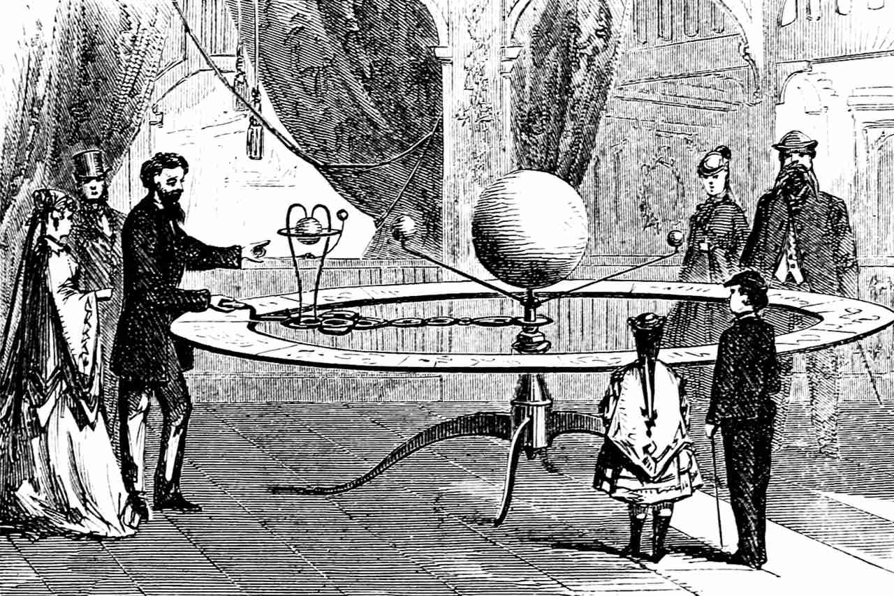
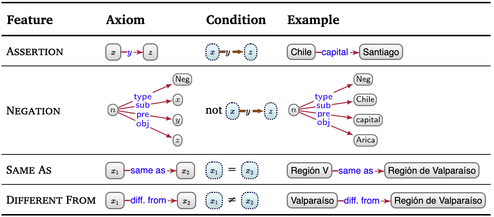
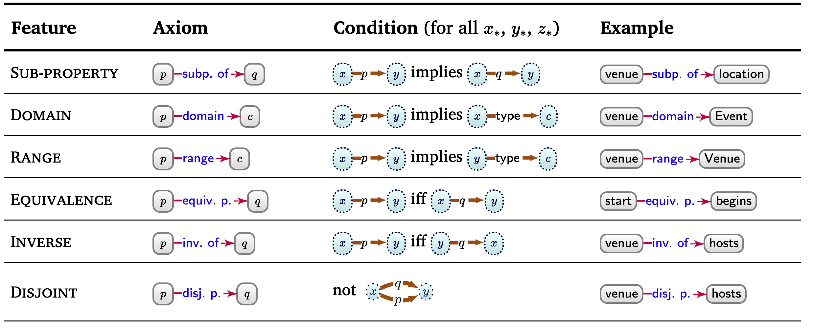

<style>
/**
 * @theme enable-all-auto-scaling
 * @auto-scaling true
 */

/* @import 'default'; */
/* @import url('user-theme2.css'); */
</style>


<!-- marp --engine ./engine.js --watch --theme-set custom-theme-roboto.css -- --allow-local-files deductive_knowledge.md -->
<!-- marp --pdf --allow-local-files --engine ./engine.js --theme-set custom-theme-roboto.css -- deductive_knowledge.md -->


# Foundations of Semantic Knowledge Graphs

#### Prof. Dr. Stefan Linus Zander 

Deductive Knowledge and Ontologies{.lightgreen .Big .skip}


---
<!-- header: Overview -->
<!-- footer: Foundations of Semantic Knowledge Graphs | A Formal Introduction to Graphs | Prof. Dr. Stefan Zander | Hochschule Darmstadt – University of Applied Sciences -->

# Outline

- Knowledge Types for Deduction
- Ontologies
- Interpretations and Models
- Ontology Language Features 
- Basic Reasoning Types


---
<!-- header: Motivation -->
## What additional information can we deduce from the following graph ?

::::  center 

::::

::: footnotes
Source: Aidan Hogan, Eva Blomqvist, Michael Cochez, Claudia d’Amato, Gerard de Melo, Claudio Gutierrez, Sabrina Kirrane, José Emilio Labra Gayo, Roberto Navigli, Sebastian Neumaier, Axel-Cyrille Ngonga Ngomo, Axel Polleres, Sabbir M. Rashid, Anisa Rula, Lukas Schmelzeisen, Juan Sequeda, Steffen Staab, Antoine Zimmermann (2021) Knowledge Graphs, Synthesis Lectures on Data, Semantics, and Knowledge, No. 22, 1–237, DOI: 10.2200/S01125ED1V01Y202109DSK022, Springer. 
:::

<!-- 
 - the Ñam festival (EID15) will be located in Santiago, even though the graph does not contain an edge EID15–location➛Santiago. 
 - We may further deduce that the cities connected by flights must have some airport nearby, even though the graph does not contain nodes referring to these airports. 
 -->


---
## We can deduce more from a graph than what edges explicitly indicate

::::: centercontent columns
:::: double center 

::::
:::: single
**Examples**:
- Ñam festival (`EID15`) will be located in Santiago, even though the graph does not contain an edge `EID15–location➛Santiago`
- The cities connected by flights must have some airport nearby, even though the graph does not contain nodes referring to these airports.
::::
:::::

::: redbox centerbox spacebefore
:fa-robot: Given **data** as premise $+$ some **general rules** we know a priori $\rightarrow$ we can use a **deductive process** to __derive new data__.
:::


---
## Humans derive new knowledge based on commonsense and domain knowledge

::::: spaceafter columns 
:::: single greenbox
::: center
[__Commonsense Knowledge__ :fa-users:]{.centertext .big}
:::
- general premise and rules
- known a priori
- shared by many people
- knowledge that is universally justifed
::::
:::: single bluebox
::: center 
[__Domain Knowledge__ :fas-flask-vial:]{.center .big}
:::
- knowledge shared by few experts in an area
  - [e.g. an expert in biology may know that *hemocyanin* is a protein containing copper that carries oxygen in the blood of some species of *Mollusca* and *Arthropoda*]{.kursiv}
- encoded in very specific domain models
::::
:::::

_:fa-warning: Machines, in contrast, do not have a priori access to such deductive faculties_ 

- Machines need **formal instructions** in terms of ==premises== and ==entailment regimes== to produce similar deductions w.r.t. humans
- In this way, we will be making more of the **meaning** (i.e., ==semantics==) of the graph **explicit** in a **machine-readable format**.
- ==Entailment regimes== formalise the conclusions that logically follow as a consequence of a given set of premises.


---
## Entailment regimes formalise the conclusions that logically follow as a consequence of a given set of premises

<!-- **Entailment regimes** _formalise the conclusions that logically follow as a consequence of a given set of premises_. -->

These **deductions** may serve a range of applications, such as 
- _improving query answering_
- _(deductive) classification_
- _finding inconsistencies_
- _deducing class memberships_
- etc.


:fa-wand-magic-sparkles: Once instructed, machines can (often) apply deductions with a precision, efficiency, and scale beyond human performance.


---
## Example: Using entailment regimes for query answering


::::: columns-center
:::: triple
**Premise**: Example data graph with explicit statements 
::: center spacebefore

:::
::: caption
Source: https://kgbook.org/#chap-deductive
:::
::::
:::: double
**Query**: "find festivals located in Santiago"

::: center

:::

**Explanations**
- Without entailment regimes, the graph pattern would return no results
  - no node of type `festival`
  - nothing has directly the location `Santigao`
- `Ñam` could be automatically entailed if we stated that 
  - $x$ being a `Food Festival` ==entails== that $x$ _is_ a `Festival`, or 
  - $x$ having venue $y$ in city $z$ ==entails== that $x$ _has location_ $z$
::::
:::::


---
<!-- header: Ontologies -->
## How Ontologies can help us to automatically compute entailments based on formal semantics


We will learn about ways in which __more complex entailments__ can be expressed and automated. 

A number of **logical frameworks** could be leverages for these purposes 
$\leadsto$ e.g. *First-Order Logic*, *Datalog*, *Prolog*, *Answer Set Programming* etc. 

::: bluebox spaceafter1em
We focus on [ontologies]{.inversered .Big}, which... 
- ...constitute a _:fa-square-root-variable: formal representation of knowledge_
- ...can be represented as a _:fa-diagram-project:graph_ 
:::

We discuss... 
- ...how ==ontologies== can be _formally defined_, 
- ...how they can be created using ==ontology languages==, and
- ...how new facts can be deduced via ==reasoning== based on entailment regimes 


---
## What is an Ontology ?


To enable *entailment*, we must be *precise* about what the terms we use *mean*.

::: definition
An ==ontology== is a concrete, formal representation of what terms mean within the scope in which they are used (e.g., a given domain), formulated using an ==ontology language==.

Source: based on https://kgbook.org/#ssec-ontologies
:::

- The term stems from the *philosophical study* of ontology, concerning the kinds of entities that exist, the nature of their existence, what kinds of properties they have, and how they may be identified and categorised.

- Ontologies can _guide_ how graph data are _modelled_.

- Given that ontologies are formal representations, they can be used to ==automate entailment==.

- The **usefulness** of an ontology depends on 
  - the _level of agreement_ on what that ontology defines, 
  - how *detailed* it is, and 
  - how broadly and consistently it is *adopted* $\leadsto$ thus enhancing interoperability.


---
## A widely accepted definition of ontologies in CS


::: definition
An ==ontology== is a formal, explicit specification of a shared conceptualization.

Source: Studer, Benjamins, Fensel. "Knowledge Engineering: Principles und Methods." Data und Knowledge Engineering. 25 (1998) 161-197 based on Tom Gruber 1993.
:::

- :fa-square-root-variable: **formal** 
  - based on mathematics and logics
  - interpretable by machines
  - specific algorithms are able to compute the correctness (ie satisfiability) of an ontology

- :fa-pen-to-square: **explicit specification** 
  - described in axiomatic forms, ie., semantics of the terms are expressed in form of logical axioms 
  - An ontology language is used for expressing elements of a domain

- :fa-people-group: **shared conceptualisation**
  - common understanding about the elements and constituents of a domain
  - created by a group of experts
  - reflect consensual knowlegde plus a shared committment


---
## Additional popular ontology definitions


1. ["An ontology defines the basic terms and relations comprising the vocabulary of a topic area, as well as the rules for combining terms and relations to define extensions to the vocabulary."]{.kursiv}
  [_Neches, R.; Fikes, R.; Finin, T.; Gruber, T.; Patil, R.; Senator, T.; Swartout, W.R. Enabling Technology for Knowledge Sharing. AI Magazine. Winter 1991. 36-56_]{.smaller}

2. ["An ontology is a hierarchically structured set of terms for describing a domain that can be used as a skeletal foundation for a knowledge base."]{.kursiv}
  [_B. Swartout; R. Patil; k. Knight; T. Russ. Toward Distributed Use of Large-Scale Ontologies. Ontological Engineering. AAAI-97 Spring Symposium Series. 1997. 138-148_]{.smaller}

2. ["An ontology provides the means for describing explicitly the conceptualization behind the knowledge represented in a knowledge base."]{.kursiv}
  [_A. Bernaras; I. Laresgoiti; J. Correra. Building und Reusing Ontologies for Electrical Network Applications. ECAI96. 12th European Conference on Artificial Intelligence. Ed. John Wiley & Sons, Ltd. 298-302_]{.smaller}


---
## The Ontology Spectrum 

::: spacebefore

:::


---
<!-- header: "" -->


---
<!-- header: Ontologies -->
## Ontologies Summary


- An ontology is a *set* of *axioms*
- *Axioms* describe the formal semantics of the concepts used in and defined by an ontology
- *Concepts* are organized in a taxonomical classification system and identified via their symbols
- An *ontology language* defines the set of ontology lanugage elements that can be used for the formulation of axioms
- The expressivity of an ontology language is determined by *description logic* upon which it is built (cf. ALC, EL++, SHOIN(D), SROIQ(D) ...)


---
# Excursus: Interpretations and Models

---
## Interpretations and Models


In order to _understand the semantics of a data graph_, we ==map== elements of it to entities in the real world $\rightarrow$ this process is called ==interpreation==.

By interpreting a data graph, we create a ==domain graph== that _connects real-world entities_ with _real-world relations_ and reflects the structure and elements of the data graph.

The process of interpretation involves mapping the nodes and edges in the data graph to nodes (ie ==entities==) and edges (ie ==relations==) of the domain graph.

Along these lines, we can abstractly define an interpretation of a data graph as being composed of two elements: 
1. a **domain graph**
2. and a **mapping** from the terms (nodes and edge-labels) of the data graph to those of the domain graph. 

The domain graph follows the same model as the data graph.


---
## Why Interpretations are useful

The distinction between nodes/edges and entities/relations becomes important, when we define the meaning of ==ontology features== and ==entailment==.
- **Example**
  e.g. if we ask whether there is an edge labelled `flight` between `Arica` and `Viña del Mar` for the data graph, the answer is no. However, if we ask if the entities `Arica` and `Viña del Mar` are connected by the relation `flight`, then the answer depends on what assumptions we make when interpreting the graph.
  - Under the _Closed World Assumption (CWA)_, if we do not have additional knowledge, then the answer is 'no' – since what is not known is assumed to be false.
  - Under the _Open World Assumption (OWA)_, we cannot be certain that this relation does not exist as this could be part of some knowledge not (yet) described by the graph
  - Under the _Unique Name Assumption (UNA)_, the data graph describes at least two flights to `Santiago`
  - Under _No Unique Name Assumption (NUNA)_, we can only say that there is _at least_ one such flight since `Viña del Mar` and `Arica` may be the same entity with two "names".
  


---
## Why Interpretations are useful

These assumptions (or lack thereof) define which interpretations are valid, and which interpretations satisfy which data graphs. 

We call an interpretation that satisfies a data graph a model of that data graph. 

The UNA forbids interpretations that map two data terms to the same domain term. 
The NUNA allows such interpretations. 

Under the CWA, an interpretation that contains an edge $x\rightarrow p \rightarrow y$ in its domain graph can only satisfy a data graph from which we can entail x–p➛y. 
Under the OWA, an interpretation containing the edge $x\rightarrow p \rightarrow y$ can satisfy a data graph not entailing x–p➛y so long it does not explicitly contradict that edge.

::: bluebox small
**OWL** adopts the **NUNA** and **OWA**, which is the most general case: 
- multiple nodes/edge-labels in the graph may refer to the same entity/relation-type (per the NUNA), and 
- anything _not entailed_ by the data graph is _not assumed to be false_ as a consequence (per the OWA).
:::


---
## Interpretations

The OWA and NUNA allow an infinite number of possible interpretations (models) for a data graph.

However, the addition of axioms to a model limits the number of possible interpretations. 

E.g. by declaring a property as _irreflexiv_, the following assertion is no longer a possible model of the graph:

```
:x      :y          :z .  // assertion in the data graph
:a      :a          :a .  // is a model of the graph (the OWA and NUNA allows to map multiple nodes to one entity in the model)

as long as the following assertion holds

x = y = z = a 

By adding addtional axioms with semantic conditions to the graph, we restrict models for the graph:

:x      :y          :z .
:y      rdf:type    owl:IrreflexiveObjectProperty .

With these axioms, the above interpretation is no longer a model of the graph as it breaks the irreflexive axiom condition.
```


---
# Ontology Features

- ...for Individuals
- ...for Properties
- ...for Classes


---
<!-- header: Ontology Features -->
## Ontology Features: Introduction

**Premise**
- We can associate _certain patterns_ in the data graph with ==semantic conditions== that define _which interpretations satisfy it_.
  
**Example**
- E.g. we can add a _semantic condition_ to enforce that if our data graph contains the edge `:p rdfs:subPropertyOf :q`, then any edge `:x :p :y` in the domain graph of the interpretation must also have a corresponding edge `:x :q :y` to satisfy the data graph. <br/><br/>
  ```rdf
  Data graph:               :p    rdfs:subPropertyOf    :q .    (a)
                            :x        :q                :y .    (b)

  Semantic Condition:       (c)   →   (a)   ⋀   (b) .
  
  Domain graph:             :x    :p    :y .                    (c)
  ```

These **semantic conditions** then form the ==features== of an ontology language. 
We will discuss such features by means of the ontology language OWL in the upcomming chapter.


---
# Ontology Features for Individuals

---
## Ontology Features for Individuals

OWL provides the following *features* for describing the formal, model-theoretic semantics of individuals.

- **Assertions**: we can assert (binary) relations between individuals using edges 
  - e.g. `:Santa Lucía  :hasCity  :Santiago .` 
  - $\leadsto$ i.e. we refer to the condition that the relation is given in the domain graph of the interpretation; if so, the interpretation satisfies the axiom.

- **Same entity**: Based on the OWA, we can state that two terms refer to the same entity
  - e.g. `:CarbonDioxide   owl:sameAs   :ARX012345`

- **Different from**:  In OWL everything might be potentially identical if we don’t explicitly state the difference 
  - e.g. `:Valparaíso  owl:differentFrom  :Región de Valparaíso` distinguishes the city from the region of the same name. 

- **Negation**: We can state that a relation does _not hold_ using ==negation==, which can be serialised as a graph using a form of **reification**.
  - e.g. `NegativeObjectPropertyAssertion( :hasWife :Bill :Mary )`

::: footnotes
Examples are taken from: Harald Sack's Lecture on Knowledge Graphs, https://kgbook.org,  and Section 4.4 of the OWL2-Primer (https://www.w3.org/TR/owl2-primer/)
:::


---
## Overview of Ontology Features for Individuals

::: center

:::


---
# Ontology Features for Property Axioms

---
## Ontology Features for Property Axioms

::::: columns
:::: single
For a **pair of properties**, ==additional semantics== can be defined using OWL ($\leadsto$ more infos on the OWL slides)
- *specialization* and *generalizations* (see RDFS slides)
- *equivalence* 
- *inverse* 
- *disjontness* 
- *transitivity*
- *symmetric*
- *asymmetric*
- *reflexive*
- *irreflexive* 
::::
:::: single
**Multiplicity**: we can also define the multiplicity of the relation denoted by properties based on being
- *functional* (ie., many-to-one)
- *inverse-functional* (ie. one-to-many)

**Key**: We may further define a *key* for a class, denoting the set of properties whose values *uniquely identify* the entities of that class.

**Chain**: A *path expression* only allowing *concatenation* of *properties* such that pairs of entities related by the chain are also related by the given property.
::::
:::::


---
## Overview of ontology features for property axioms (1/3)

::: center

:::


---
## Overview of ontology features for property axioms (2/3)

::: center

:::


---
## Overview of ontology features for property axioms (3/3)

::: center

:::


---
# Ontology Features for Class Axioms

---
## Ontology Features for Class Axioms

:::twocolumns
A **pair of classes** can be defined as  
- being in a *super-/subclass-relation*
- *equivalent*
- *disjont*

**Novel classes** can be defined by... 
- __I.) ...applying _set operators_ to other classes__
  - one can define a novel class as the *complement* of another class
  - the *union* or *intersection* of a list (of arbitrary length) of other classes
  - an *enumeration* of all of its instances
- __II.) ...based on _conditions / restrictions_ that the properties of its instances satisfy__
  - by placing _restrictions_ on a particular property $p$, one can define classes whose instances are all of the entities that have: 
    - _some value_ from a given class on $p$
    - _all values_ from a given class on $p$
    - have a _specific individual_ as a value on $p$ _(has value)_ 
    - have _themselves_ as a _reflexive value_ on $p$ _(has self)_ 
    - have at least / at most / or exactly _some number of values_ on $p$ _(cardinality)_
    - have at least / at most / or exactly _some number of values_ on $p$ from a given class _(qualified cardinality)_ 
:::


---
## Overview of ontology features for class axioms (1/3)

::: center

:::


---
## Overview of ontology features for class axioms (2/3)

::: center

:::


---
## Overview of ontology features for class axioms (3/3)

::: center

:::


---
## In the next lecture, we will talk about how to create ontologies using OWL and Protégé