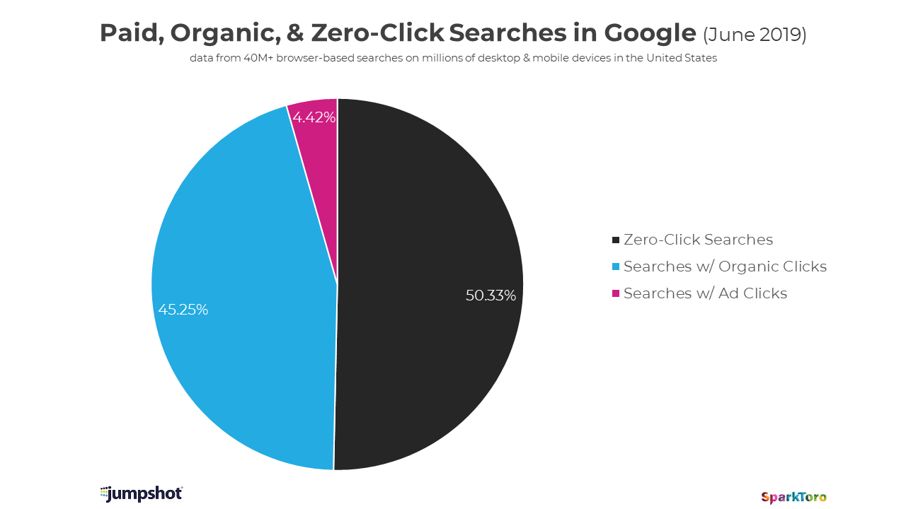
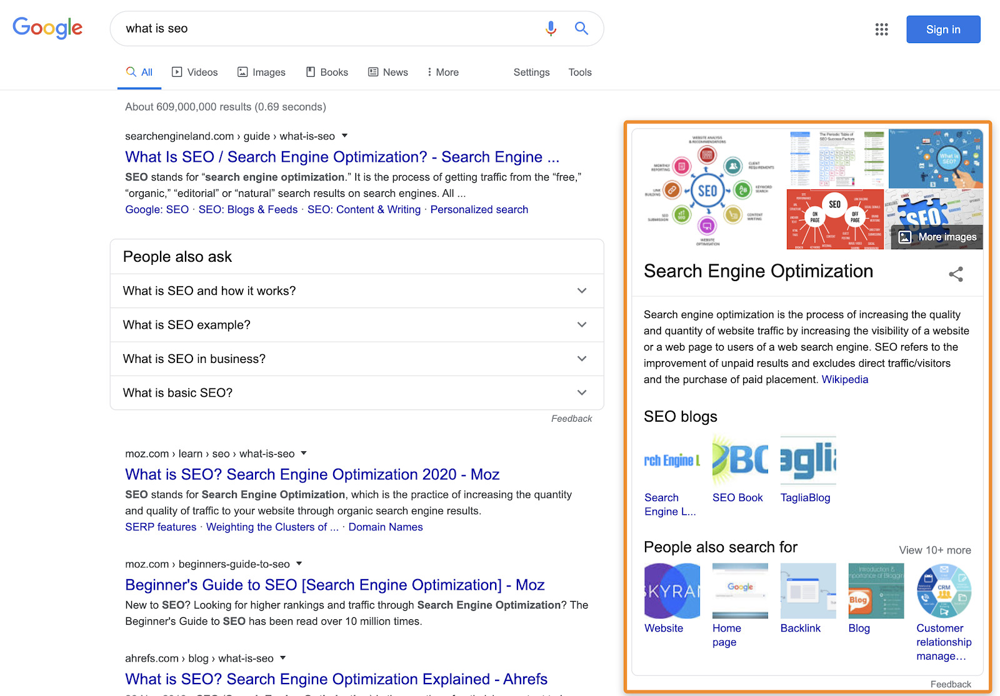

<!-- marp --engine ./engine.js --watch --theme-set custom-theme-roboto.css -- --allow-local-files intro.md -->
<!-- marp --pdf --allow-local-files --engine ./engine.js --theme-set custom-theme-roboto.css -- intro.md -->

# Foundations of Semantic Knowledge Graphs

#### Prof. Dr. Stefan Linus Zander 

A Formal Introduction to Graphs {.lightgreen .Big .skip}

---
<!-- header: Overview -->
<!-- footer: Foundations of Semantic Knowledge Graphs | A Formal Introduction to Graphs | Prof. Dr. Stefan Zander | Hochschule Darmstadt – University of Applied Sciences -->

# Outline

- ...

---
## Preamble

This modul provides a practical insights into current state-of-the-art technologies for knowledge graph engineering, application, and utilization.

It introduces methods, technologies, and concepts 

---
<!-- header: Introduction -->
## Graph Theory :fa-bomb:

In this part of the lecture, we consider graphs from a formal, _mathematical_ perspective.

---
## What are the Goals of this Course ?

- to motivate and give a comprehensive introduction to knowledge graphs: 
- describe their foundational data models and how they can be queried; 
- discuss representations relating to schema, identity, and context;  
- discuss deductive and inductive ways to make knowledge explicit; 
- present a variety of techniques that can be used for the creation and enrichment of graph-structured data; 
- describe how the quality of knowledge graphs can be discerned and how they can be refined; to 
- discuss standards and best practices by which knowledge graphs can be published; and to 
- provide an overview of existing knowledge graphs found in practice. 

Our intended audience includes researchers and practitioners who are new to knowledge graphs. As such, we do not assume that readers have specific expertise on knowledge graphs.

---
## A Brief History of Knowledge Graphs

- The modern incarnation of the term stems from the 2012 announcement of the Google Knowledge Graph
- Now, every big company has their own knowledge graph
  - Airbnb [87], Amazon [298], eBay [417], Facebook [387], IBM [128], LinkedIn [224], Microsoft [482], Uber [214]
- The industrial uptake makes it hard for academia to ignore KGs
- The core idea of using graphs is to represent data, often enhanced with some way to explicitly represent knowledge

::: footnotes
Sources: 
https://blog.google/products/search/introducing-knowledge-graph-things-not/
https://blog.google/products/search/about-knowledge-graph-and-knowledge-panels/
:::

---
## What are the Benefits of Knowledge Graphs

A _graph-based abstraction_ of knowledge has numerous benefits in professional scenarios when compared with traditional data organisation systems such as the relational model or NoSQL alternatives.
- Graphs provide a ==concise and intuitive abstraction== for a variety of domains, where edges capture the relations between the entities inherent in the domain.
- Graphs allow maintainers to ==postpone the definition of a schema==, allowing the data and its scope to evolve in a more flexible manner than typically possible in a relational setting, particularly for capturing _incomplete knowledge_.
-  Unlike (other) NoSQL models, ==specialised graph query languages== support not only standard relational operators (joins, unions, projections, etc.), but also _navigational operators_ for recursively finding entities connected through _arbitrary-length paths_.
-  ==Standard knowledge representation formalisms== – such as ontologies and rules – can be employed to define and reason about the _semantics_ of the terms used to label and describe the nodes and edges in the graph.
-  ==Scalable frameworks for graph analytics== can be leveraged for computing centrality, clustering, summarisation, etc., in order to gain insights about the domain being described. 
-  Various representations have also been developed that support applying ==machine learning techniques== directly over graphs.
  
::: bluebox center
In summary, the decision to build and use a knowledge graph opens up a range of techniques that can be brought to bear for integrating and extracting value from diverse sources of data.
:::

---
## Applications: Knowledge Graphs influence Search Behaviour

Based on Rand Fishkin’s latest study (see sources), more than 50% of searches result in no clicks.

::::: columns
:::: single

::::
::::single

::::
:::::

The Knowledge Graph helps Google in answering queries directly using a knowldge panel; cf. the query for "what is seo" on the right picture.

::: footnotes
Sources: https://ahrefs.com/blog/google-knowledge-graph/ and https://sparktoro.com/blog/less-than-half-of-google-searches-now-result-in-a-click/
:::