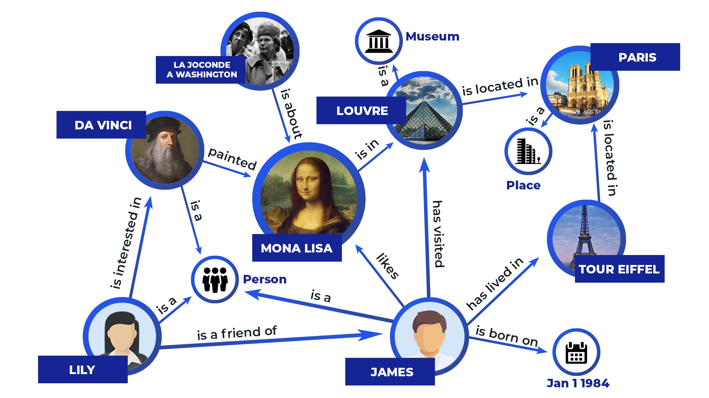
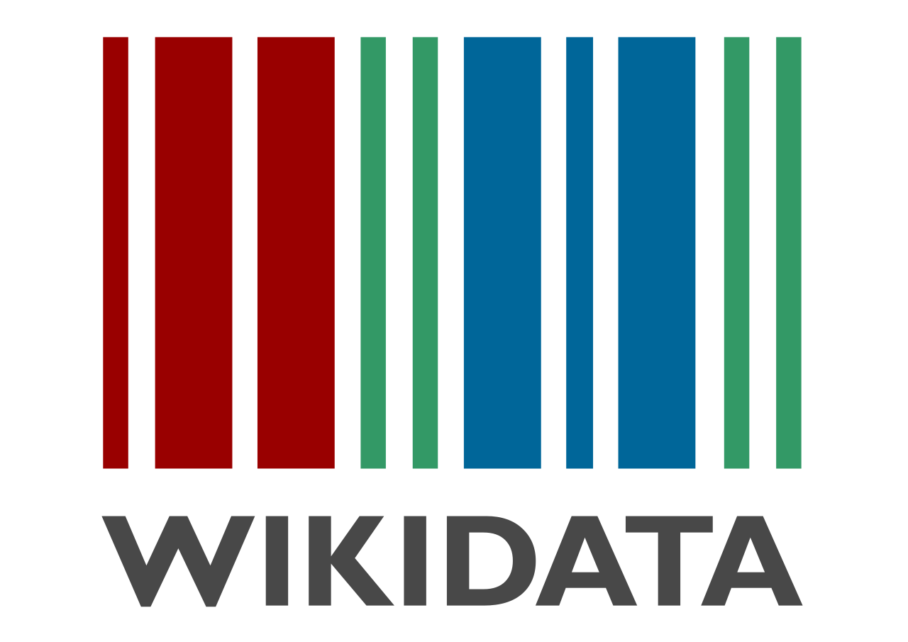
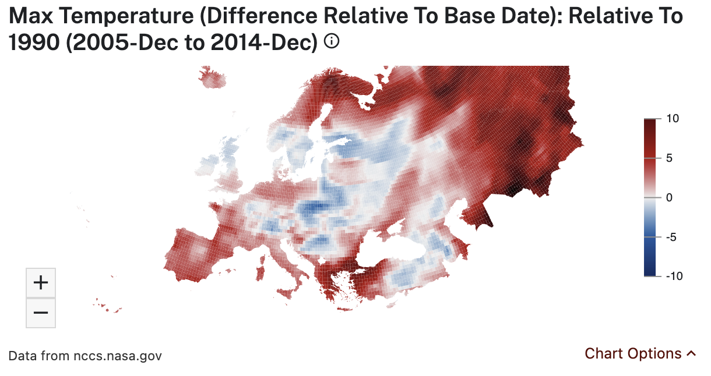
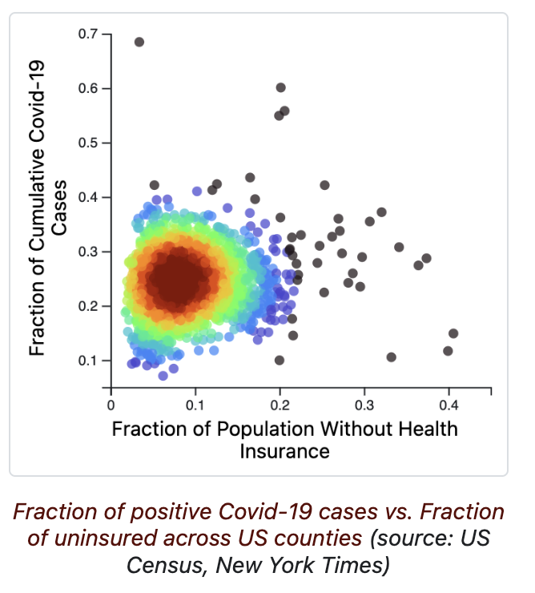
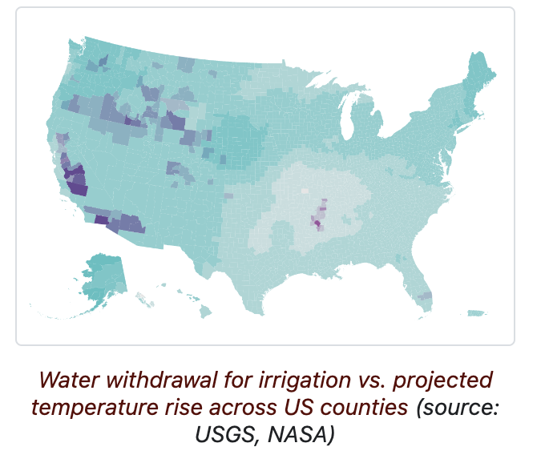
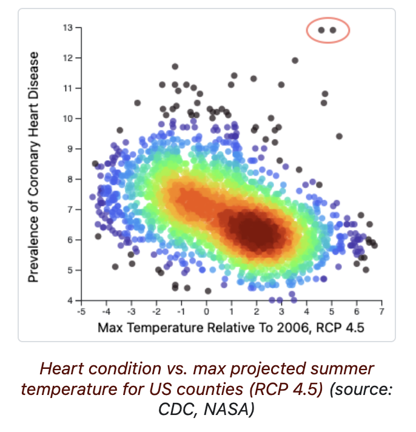
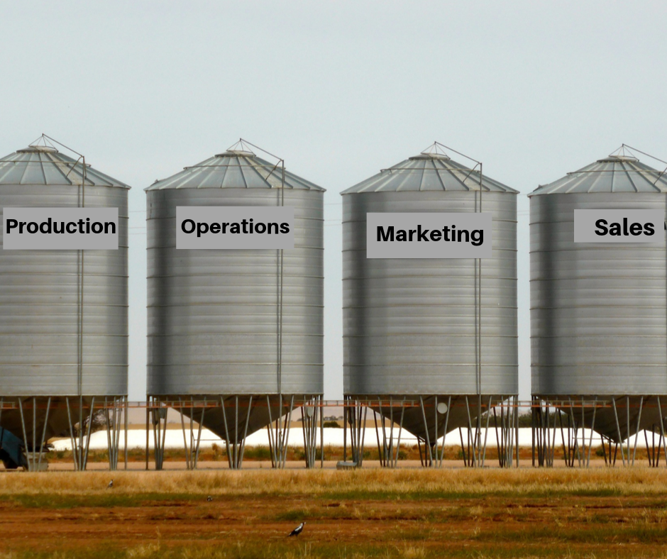
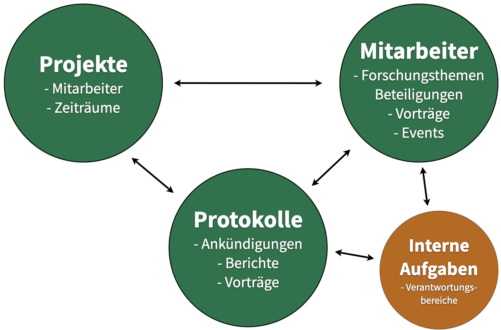
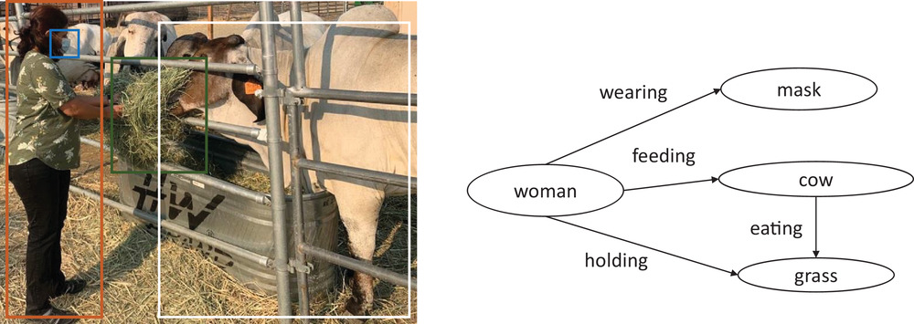
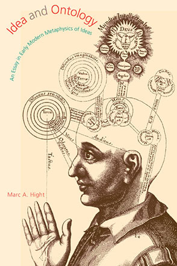

<!-- marp --engine ./engine.js --watch --theme-set custom-theme-roboto.css -- --allow-local-files intro.md -->
<!-- marp --pdf --allow-local-files --engine ./engine.js --theme-set custom-theme-roboto.css -- intro.md -->

# Foundations of Semantic Knowledge Graphs

#### Prof. Dr. Stefan Linus Zander 

Knowledge Graphs {.lightgreen .Big .skip}

---
<!-- header: Overview -->
<!-- footer: Foundations of Semantic Knowledge Graphs | A Formal Introduction to Graphs | Prof. Dr. Stefan Zander | Hochschule Darmstadt – University of Applied Sciences -->

<!-- 
# Outline

- ...

---
## Preamble (remove)

This modul provides a practical insights into current state-of-the-art technologies for knowledge graph engineering, application, and utilization.

It introduces methods, technologies, and concepts 

---
## Graph Theory :fa-bomb:

In this part of the lecture, we consider graphs from a formal, _mathematical_ perspective.
 -->

## What are the Goals :fa-bullseye: of this Course ?

::::: columns-center
:::: double
- to motivate and give a comprehensive introduction to knowledge graphs
- describe their foundational data models and how they can be queried
- discuss representations relating to schema, identity, and context
- discuss deductive and inductive ways to make knowledge explicit
- present a variety of techniques that can be used for the creation and enrichment of graph-structured data 
- describe how the quality of knowledge graphs can be discerned and how they can be refined 
- discuss standards and best practices by which knowledge graphs can be published 
- provide an overview of existing knowledge graphs found in practice. 
::::
:::: single

::::
:::::

::: bluebox center marg4
This course is for students and people who are new to knowledge graphs. As such, we do not assume that participants have specific expertise or background knoweldge on knowledge graphs.
:::

---
# The Impact of Knowledge Graphs is already visible 

---
## Applications: Knowledge Graphs influence Search Behaviour

Based on Rand Fishkin’s latest study (see sources), more than 50% of searches result in no clicks.

::::: columns
:::: single

::::
::::single

::::
:::::

The Knowledge Graph helps Google in answering queries directly using a knowldge panel; cf. the query for "what is seo" on the right picture.

::: footnotes
Sources: https://ahrefs.com/blog/google-knowledge-graph/ and https://sparktoro.com/blog/less-than-half-of-google-searches-now-result-in-a-click/
:::

---
<!-- header: "" -->
## A Brief History of Knowledge Graphs

The modern incarnation of the term stems from the 2012 announcement of the ==Google Knowledge Graph== 

::: center

:::

---
## Now, every big company has their own knowledge graph

- *Airbnb* ("Homes you may like"), 
- *Amazon* (product recommendations engine; Alexa), 
- *eBay* (eBay Shopper Experience Graph), 
- *Facebook* (Facebook Knowledge Graph), 
- *IBM* (Watson), 
- *LinkedIn* (People You May Know), 
- *Microsoft* (Cortana), 
- *Uber* (Uber Technology Platform)

**The industrial uptake makes it hard to ignore KGs**

::: bluebox center
The _core idea_ of using graphs is to represent data, often enhanced with means to explicitly represent knowledge
:::

::: footnotes
Sources: 
https://blog.google/products/search/introducing-knowledge-graph-things-not/
https://blog.google/products/search/about-knowledge-graph-and-knowledge-panels/
:::

---
## Excursus: How eBay uses Knowlegde Graphs

::: graybox small
**The eBay Shopper Experience Graph**

eBay also uses knowledge graphs to improve its platform's functionality and provide a better user experience. eBay's knowledge graph is known as the "eBay Shopper Experience Graph".

The eBay Shopper Experience Graph uses machine learning and artificial intelligence to analyze and understand the relationships between different types of data on the platform, including product listings, user profiles, search queries, and more. This allows eBay to provide more relevant search results and personalized recommendations to its users.

The eBay Shopper Experience Graph is used to power a number of features on the platform, such as the "Shop Similar Items" and "You May Also Like" recommendations, which provide users with personalized product recommendations based on their browsing and purchase history. The knowledge graph is also used to improve eBay's search functionality, making it easier for users to find the products they are looking for.

In addition, eBay also uses its knowledge graph to identify fraudulent activity on the platform, such as fake product listings or seller accounts. By using machine learning algorithms to analyze and understand patterns of suspicious behavior, eBay is able to identify and prevent fraudulent activity before it can harm users or the platform itself.

Overall, the eBay Shopper Experience Graph plays a crucial role in helping eBay provide a more personalized and efficient platform to its users, while also improving its security and preventing fraud.
:::

---
## Excursus: How Airbnb uses Knowledge Graphs

::: graybox small
**The Airbnb Knowledge Graph**

Airbnb also uses knowledge graphs to improve its platform and provide a better user experience. Airbnb's knowledge graph is known as the "Airbnb Knowledge Graph".

The Airbnb Knowledge Graph uses machine learning and artificial intelligence to analyze and understand the relationships between different types of data on the platform, including user profiles, listings, bookings, and more. This allows Airbnb to provide more relevant search results and personalized recommendations to its users.

The Airbnb Knowledge Graph is used to power a number of features on the platform, such as the "More Places to Stay" and "Homes You May Like" recommendations, which provide users with personalized accommodation recommendations based on their search history and preferences. The knowledge graph is also used to improve Airbnb's search functionality, making it easier for users to find the right accommodation for their needs.

In addition, Airbnb uses its knowledge graph to optimize its pricing and revenue management strategy. By analyzing patterns and trends in user behavior and accommodation demand, Airbnb is able to adjust its pricing algorithm to maximize revenue for hosts while still offering competitive prices for users.

Overall, the Airbnb Knowledge Graph plays a crucial role in helping Airbnb provide a more personalized and efficient platform to its users, while also optimizing its pricing strategy and revenue management.
:::

::: footnotes
Source: https://medium.com/airbnb-engineering/contextualizing-airbnb-by-building-knowledge-graph-b7077e268d5a
:::

---
## Knowledge Graphs are Everywhere 

**Search Engine Optimization and Web Commerce** 
- Schema.org used by >20% of Web sites (cf. https://queue.acm.org/detail.cfm?id=2857276)
- Major search engines exploit semantic descriptions (cf. schema.org; GoodRelations-ontology; RDFa; JSON-LD)

**Pharma and Lifesciences**
- Mature and comprehensive vocabularies and ontologies (eg. Gene Ontology describing genes and their functions)
- Billions of disease, drug, clinical trial descriptions

**Digital Libraries**
- Many established vocabularies (DublinCore, FRBR, EDM)
- Millions of aggregated from thousands of memory institutions on Europeana, German Digital Library

::: footnotes
Source: https://www.slideshare.net/soeren1611/knowledge-graph-introduction (Slide 34)
:::

---
##  Key Application Areas for Knowledge Graphs

::::: columns
:::: triple
**Three key applications accellerated the popularity of KGs**: 

1. The integration and organization of information about ==known "entities"==, either as an _openly accessible resource_ on the _Web_ <!--, or as a proprietary resource within an _enterprise/organization_ -->

2. The representation of _input_ and _output information_ for ==AI/ML algorithms==. 
   
3. The deployment in _organisations_ or _enterprises_ in order to
   1. _improve **search** and **discovery**_ by explicit relationships
   2. _enable better **decision-making**_ through holisting views on data
   3. _enhance **customer experience**_ through personalized and connected information
   4. _facilitate **data integration**_ by generic, domain-independent KRFs
   5. _support **knowledge management**_ by centralized KBs
::::
:::: double

::::
:::::

::: footnotes
Source: Chaudhri, V. K., Baru, C., Chittar, N., Dong, X. L., Genesereth, M., Hendler, J., Kalyanpur, A., Lenat, D., Sequeda, J., Vrandečić, D., and Wang, K. 2022. "Knowledge graphs: Introduction, history, and perspectives.". AI Magazine 43: 17–29. https://doi.org/10.1002/aaai.12033
:::

---
## Knowledge Graphs allow for organizing open information – Wikidata

::::: columns-center
:::: triple
- **Wikidata** is a collaboratively edited open KG that provides data for Wikipedia and for other uses on the web.
- The Wikidata KG enhances/improves the quality of information in Wikipedia
- Semantic KGs might employ terms whose semantics are defined on the basis of logical theories
- The entailment regimes computed by inference engines allow for deriving relationships that are not inherently present
- When other open KGs use well-known vocabularies with commonly defined semantics, entities can be linked together (e.g. using schema.org)
- Multi-level annotations can be created and published

:::center

:::
::::
:::: double 
::: graybox smaller
**Example** 
Consider the Wikipedia page for the town "Winterthur", which includes a list of all of Winterthur's twin towns: two are in Switzerland, one in the Czech Republic, and one in Austria. Wikipedia also has an entry for the city, Ontario, in California, which lists Winterthur as its sister city. The “sister city” and “twin city” relationships are meant to be identical as well as reciprocal. Thus, if a city A is a sister (twin) of another city B, then B must be a sister (twin) of A. In Wikipedia, “Sister cities” and “Twin towns” are simply section headings without any relationship/linkage specified between the two. Therefore, it is difficult to detect this discrepancy automatically. In contrast, the Wikidata representation of Winterthur includes a relationship called twinned administrative body, which includes the city of Ontario, CA. As this relationship is defined to be a symmetrical relationship in the KG, a SPARQL query engine can infer that the Wikidata page for the city of Ontario, CA is to be linked to the Wikidata page of Winterthur.
:::
::::
:::::

---
## Additional Examples: Datacommons

::::: columns-center
:::: single
https://datacommons.org/ is another publicly available large KG that incorporates data from many different, mostly governmental sources and authorities such as 
- *demographics* (US Census, Eurostat)
- *economics* (World Bank, Bureau of Labor Statistics, Bureau of Economic Analysis)
- *health* (World Health Organization, Center for Disease Control)
- *climate* (Intergovernmental Panel on Climate Change, National Oceanic and Atmospheric Administration) 
- *sustainability* (U.S. National Renewable Energy Laboratory (NREL), RE Atlas, etc.)
::::
:::: single center

::::
:::::

---
## Additional Examples: Datacommons visualisations on COVID-19

::::: columns-center
:::: triple
**COVID-19**
As many insightful articles from the New York Times and others pointed out, Covid-19 affected African American communities much more. Unfortunately, Covid-19 prevalence is correlated with many other indicators. 

For example, we see that _Covid-19 infection rates are highly correlated_ 
- with the fraction of the population that is *uninsured*, 
- with the fraction of the population in *poverty*, 
- with the fraction of the population on *food stamps*, etc.

Of course, these are just correlations. 

This _Colab notebook_ digs deeper, performing a causal analysis to discover the _most variables most causally predictive of Covid-19 occurrence and morbidity_.
::::
:::: double center

::::
:::::

---
<!-- header: "" -->
## Examples: Datacommons visualisations on environmental issues

::::: columns-bottom
:::: single center

::::
:::: single center

::::
:::::

---
## Knowledge Graphs in Organisations {.inverse}

**Data Silos** — many valuable Information is still locked in proprietary data formats and systems {.inverse}

::: footnotes
Picture source: ...
:::

---
<!-- header: Application Areas for Knowledge Graphs -->
## Knowledge Graphs support the Organization of Enterprise Information

**Data integration** is essential to the functioning of modern enterprises where corporate data typically reside across _many distinct databases_ and _unstructured sources_.

::::: columns
:::: single
::: graybox small spaceafter
**Examples**: {.noskip}
- Companies can create a "==360-degree-view==" of its customers by aggregating data from different external sources 
- Companies can track user behaviour and relate it to internal data for more effective business operations
:::

The data integration process for creating the 360-degree view of a customer might begin with _knowledge engineers_ working with _business analysts_ to sketch out a _schema_ of the _key entities_, _events_, and the _relationships_ that they are interested in tracking.
::::
:::: single center

::::
:::::

The **meaning** of the data stored in enterprise databases is _hidden in logic_ embedded in *queries*, *data models*, *application code*, *written documentation*, or simply in the *minds* of subject matter *experts* requiring both human and machine effort in the mapping process.

---
## New and exciting aspects of the use of KGs for data integration

1. First, the integrated information may come from text and other _unstructured sources_ (for example, news, social media, and others) as well as _structured data sources_ (for example, relational databases). As many information extraction systems already output information in triples, using a ==generic schema of triples== substantially reduces the cost of starting such data integration projects.

2. Second, it can be easier to _adapt_ a triple-based schema in response to _changes_ than the comparable effort required to adapt a traditional relational database. This is because a relational system is typically modeled to support the application, and thus, _schema changes often require database reorganization_.

3. Lastly, modern KG engines are highly optimized for _answering questions_ that require traversing the graph relationships in the data. 

::: bluebox center marg4 spacebefore
Due to the relative ease of creating and visualizing the schema and the availability of built-in analytics operations, KGs are becoming a popular solution for turning data into intelligence in the enterprises.
:::

::: footnotes
Source: https://onlinelibrary.wiley.com/doi/full/10.1002/aaai.12033
:::

---
## Knowledge Graphs in Artificial Intelligence and Computer Vision

::::: columns
:::: double

::: graybox small
A ==scene graph== became a central tool for achieving compositional behavior in CV algorithms. {.smallskip}
- Once a CV algorithm is able to recognize certain objects, by leveraging scene graphs, it can be trained to recognize any combination of those objects with fewer examples. 
- Scene graphs also provide the foundation for tasks such as visual question answering.
:::

::::
:::: single 
In CV, an image is represented as a _set of objects_ with a _set of properties_, where each object corresponds to a _bounding box_, identified by an object detector. 
- Objects are interconnected by a set of _named relationships_ predicted by a _model_ trained for identifying visual relationships. 

A CV algorithm produces the KG (aka ==scene graph==) shown to the left with objects such as a `woman`, a `cow`, and a `mask`, and relationships such as `holding`, `feeding` etc.
::::
:::::

---
## What are the Benefits of Knowledge Graphs

A _graph-based abstraction_ of knowledge has numerous benefits in professional scenarios when compared with traditional data organisation systems such as the relational model or NoSQL alternatives.
- Graphs provide a ==concise and intuitive abstraction== for a variety of domains, where edges capture the relations between the entities inherent in the domain.
- Graphs allow maintainers to ==postpone the definition of a schema==, allowing the data and its scope to evolve in a more flexible manner than typically possible in a relational setting, particularly for capturing _incomplete knowledge_.
-  Unlike (other) NoSQL models, ==specialised graph query languages== support not only standard relational operators (joins, unions, projections, etc.), but also _navigational operators_ for recursively finding entities connected through _arbitrary-length paths_.
-  ==Standard knowledge representation formalisms== – such as _ontologies_ and _rules_ – can be employed to define and reason about the _semantics_ of the terms used to label and describe the nodes and edges in the graph.
-  ==Scalable frameworks for graph analytics== can be leveraged for computing centrality, clustering, summarisation, etc., in order to gain insights about the domain being described. 
-  Various representations have also been developed that support applying ==machine learning techniques== directly over graphs.
  
::: bluebox center
In summary, the decision to build and use a knowledge graph opens up a range of techniques that can be brought to bear for integrating and extracting value from diverse sources of data.
:::

---
# Attempts for Defining Knowledge Graphs

---
## Knowledge Graphs have many contentious definitions ranging from specific technical proposals to more inclusive general proposals

An inclusive definition attempt{.Large}

::::: definition
A knowledge graph can be conceived as a graph of data intended to accumulate and convey knowledge of the real world, whose nodes represent entities of interest and whose edges represent relations between these entities. 

Adapted from...
:::::

The ==graph of data== (aka data graph) conforms to a __graph-based data model__, which may be a _directed edge-labelled graph_, a _property graph_, etc.

---
<!-- ## Another Attempt for a Knowledge Graph Definition -->
## Knowledge Graphs embody a number of characteristic properties

:::: definition
A Knowledge Graph is a data set that is:
- ==structured== (in the form of a specific data structure)
- ==normalised== (consisting of small units, such as vertices and edges)
- ==connected== (defined by the – possibly distant – connections between objects)

Moreover, knowledge graphs are typically:
- ==explicit== (created purposefully with an intended meaning)
- ==declarative== (meaningful in itself, independent of a particular implementation or algorithm)
- ==annotated== (enriched with contextual information to record additional details and meta-data)
- ==non-hierarchical== (more than just a tree-structure)
- ==large== (millions rather than hundreds of elements)

Source: Defintion taken from Knowledge Graph lecture from Prof. Dr. Markus Krötzsch, TU Dresden
::::

---
## What is the meaning of 'Knowledge' in Knowledge Graphs ?

By ==knowledge==, we refer to something that is _known_. 

- Such knowledge may be accumulated from _external sources_, or extracted from the _knowledge graph itself_ 
- Knowledge may be _composed_ of ==simple== or ==quantified statements== 
  - "Santiago is the capital of Chile" (simple assertion) 
  - "all capitals are cities" (quantified assertion)
- Simple statements can be accumulated as _edges_ in the data graph
- The accumulation of quantified statements requires a _more expressive way_ to represent knowledge such as ==ontologies== or ==rules==
- _Deductive methods_ can be used to entail and accumulate further knowledge 
  - e.g. "Santiago is a city"
- Additional knowledge – based on simple or quantified statements – can also be extracted from and accumulated by the knowledge graph using _inductive methods_

---
##  Graph Representations in Mathematics are not sufficient for Knowledge Graph Representations in Computer Science 

We have seen that graphs can be encoded in several ways: 
- _Adjacency matrix_ (and variants)
- _Adjacency list_ (and variants)
- Other derived representations

This is enough to store and manipulate graphs in software, but it is not enough to exchange graphs across applications.

**Open questions**:
- What kind(s) of graph do we want to exchange?
- How are vertices given (numbers? strings? specific ids? . . . )?
- Are edge labels supported and what are they?
- Can the graph include values of data types (integer? float? string? times? . . . )? 
- How exactly are these things encoded in bytes in a file?

::: footnotes
Source: Compiled from Lecture Materials about Knowledge Graphs from Prof. Dr. Markus Krötzsch, TU Dresden
:::

---
## Each Graph Representation (Matrix, List) has its Pros :far-thumbs-up: and Cons :far-thumbs-down:

::::: columns
:::: single
**Matrix**
- :far-thumbs-up: space efficient for dense graphs (1 bit per edge)
- :far-thumbs-up: can be processed with matrix operations (highly parallel)
- :far-thumbs-down: space inefficient for sparse graphs
- :far-thumbs-down: not natural for _labelled multi-graphs_

Example
::::
:::: single
**List**
- :far-thumbs-up: space efficient for sparse graphs;
- :far-thumbs-up: easy to use for labelled multi-graphs;
- :far-thumbs-down: harder to process (esp. if edge order can be random)
- :far-thumbs-down: not space efficient for dense graphs

Example
::::
:::::

::: bluebox center marg15
Note: Knowledge graphs are typically sparse and labelled, but parallel processing still makes matrices attractive in some applications.
:::

::: footnotes
Source: Lecture Slides of Prof. Dr. Markus Krötzsch
:::

---
## Search and Query

Search and query operations on KGs can be reduced to ==graph navigation==. 

::: greenbox
**Example** For example, in a friendship KG, to obtain the friends of the friends of a person A, one can first navigate the graph from A to all nodes B connected to it by a relation labeled as friend. One can then recursively navigate to all nodes C connected by the friend relation to each B. 
:::

- Directed labeled graph representation and graph algorithms are effective for several classes of problems (NAME THEM). 
- They are, however, insufficient to capture all inferences of interest. 
- We will discuss this in more detail in a later section on big semantics versus little semantics.

::: footnotes
Source: https://onlinelibrary.wiley.com/doi/full/10.1002/aaai.12033
:::