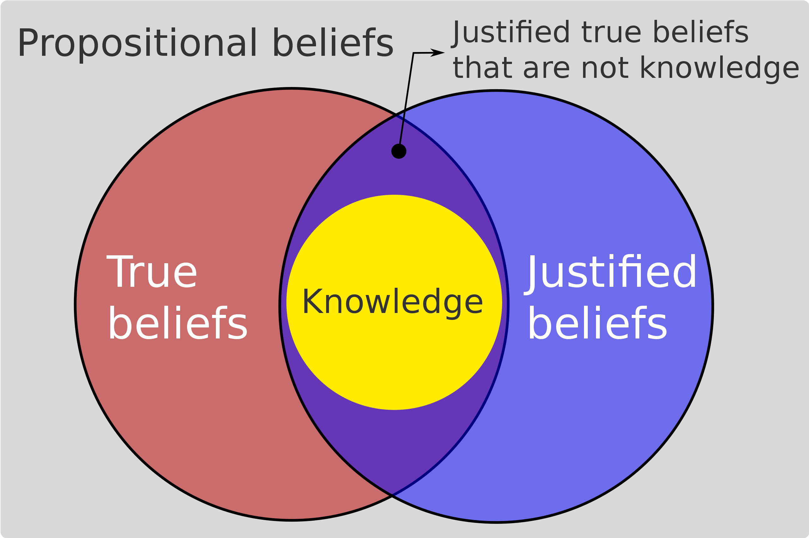

<!-- marp --engine ./engine.js --watch --theme-set custom-theme-roboto.css -- --allow-local-files knowledge.md -->
<!-- marp --pdf --allow-local-files --engine ./engine.js --theme-set custom-theme-roboto.css -- knowledge.md -->

# Foundations of Semantic Knowledge Graphs

#### Prof. Dr. Stefan Linus Zander 

Knowledge, Knowledge Representation, and Understanding {.lightgreen .Big .skip}

---
<!-- header: Overview -->
<!-- footer: Foundations of Semantic Knowledge Graphs | Data Graphs | Prof. Dr. Stefan Zander | Hochschule Darmstadt – University of Applied Sciences -->

<!-- ## What you will learn in this Unit

... -->

# What is Knowledge and how can it be utilized in IS ?

---
## Knowledge can be explained^*^ philosophically, pragmatically, and technically

::::: columns
:::: single
**Philosophically**
- Attributes to the epistemological perspective
- Huge disconsensus in philosophy about the different conceptions and definitions
- Knowledge is a subset of all true believes
- One largely accepted definition is [Justified]{.kursiv} True Belief (JTB)
- The american philosopher Edmund Gettier disapproved the JTB by providing a number of counter examples – also known as the _Gettier Cases_
::::
:::: single
**Pragmatically**
- several _models_ have been proposed to explain the nature of knowledge, mostly in the context of certain scenarios (e.g. CPS, Industry 4.0, Innovation etc.)
- The most prominent ones among others are
  - The Wissenstreppe 4.0 by Claus North
  - The SECI-Model
  - The Knowledge Pyramid by Ackoff, 1999
::::
:::: single
**Technically**
- Knowledge needs a form of manifestation to be represented in machine-processable models.
- This area is denoted as (formal) knowledge representationn
- It makes extensive use of different logical theories to represent knowledge in formal, unambiguous ways while being able to draw inferences on the model's constituents 
::::
:::::

::: footnotes
^*^ As we will see, there is no universally accepted definition of/for 'Knowledge'
:::

---
## So what do we do now...?

The simplest approach for defining knowledge is to define it on the basis of a continuum of increasing meaning and value in terms of the intentions and actions an agent can perform based on the contemplation of elements being constituents of  

---
## Knowledge is best explained through a Continuum of increasing Specificity and Meaningfulness

::::: gridncol widthauto horizontal-center
Symbols

$$\rightarrow$$

Data

$$\rightarrow$$

Information

$$\rightarrow$$

Knowledge

$$\{ a, b , 4, 7, \theta, \sigma, \dots \}$$

 

7,4

 

7,4 m

 

:::::

::::: columns
:::: single

::::
:::: single vert-center
$$ \text{Galeocerdo cuvier} \sqsubseteq \text{Animal} \sqcap \forall \text{maxLength}.7,8$$
::::

:::::

---
## Data

- Data is raw.
- It simply exists and has no significance beyond its existence (in and of itself).
- It can exist in any form, usable or not.

---
## Information

- Information is data that has been given **meaning** by way of **relational connection**.
- This "meaning" can be useful, but does not have to be.
- Information is **contained in descriptions**.
- Information answers to questions that begin with such words as *who*, *what*, *when*, *where*, and *how many*.

---
## Knowledge

::::: columns
:::: double
- **Knowledge** is the appropriate collection of information, such that it's intent is to be **useful**.
- **Wisdom** is the ability to make **sound judgments** and **decisions**.
- **Understanding** is a **continuum** that leads from data, through information and knowledge, and ultimately to wisdom.

::: bluebox center SKIP
**Data** transforms to **information** by ==convention==, 
**information** to **knowledge** by ==cognition==, and
**knowledge** to **wisdom** by ==contemplation==.
:::
::::
:::: triple

::::
:::::

::: footnotes
Source: D. Ackoff, 1999
:::

---
## What is Knowledge ?

::: graybox
**An Explanation by Chat-GPT**

Knowledge is what we know about the world around us. It is what we have learned and understood, whether through experience, study, observation, or instruction. It includes facts, concepts, principles, ideas, and insights that help us understand the world and navigate it. Knowledge is what we have in our minds and can apply to solve problems, make decisions, and navigate various situations.
:::

---
## Knowledge as Justified true belief (JTB)

::::: columns
:::: single
- The JTB account of knowledge is the claim that knowledge can be conceptually analyzed as _justified true belief_, which is to say that the meaning of sentences such as "Smith knows that it rained today" can be given with the following set of conditions, which are *necessary* and *sufficient* for knowledge to obtain:

- An agent $S$ knows that a proposition $P$ is true if and only if:
  1. $P$ is true, and
  2. $S$ believes that $P$ is true, and
  3. $S$ is justified in believing that $P$ is true

- The concept of justified true belief states that in order to know that a given proposition is true, one must not only believe the relevant true proposition, but also have justification for doing so.

<!-- In more formal terms, -->

::::
:::: single

::: caption
The Gettier problem is motivated by the idea that some justified true beliefs do not amount to knowledge; they are the result of lucky coincidents.
:::
::::
:::::

::: footnotes
Sources: (1) https://en.wikipedia.org/wiki/Gettier_problem and (2) https://en.wikipedia.org/wiki/Definitions_of_knowledge#Justified_true_belief
::: 

---
## Knowledge as justified true belief (JTB)

::::: columns 
:::: single
**Truth**
- Knowledge implies truth
  - i.e. one cannot know things that are not true even if the corresponding belief is justified and rational. 
  - e.g. nobody can know that Hillary Clinton won the 2016 US Presidential election since this did not happen.  
- Knowledge is a relation through which a person stands in cognitive contact with reality. 
- This contact implies that the known proposition is true.
::::
:::: single
**Belief**
- Knowledge is usually understood as a form of belief: to know something implies that one believes it.
  - e.g. an agent accepts the proposition in question.
- Belief is interpreted as a commitment to something being true.
- A few epistemologists hold that true belief by itself is sufficient for knowledge.
- Despite various different conceptions there is a common and shared agreement among philosophers that knowledge is a form of belief. 
::::
:::: single
**Justification**
- Justification is based on the idea that having a true belief is not sufficient for knowledge since it implies more than just being right about sth. 
- Beliefs based on dogmatic opinions, blind guesses, or erroneous reasoning do not constitute knowledge even if they are true.
  - e.g. if someone believes that Machu Picchu is in Peru because both expressions end with 'u', this true belief doesn't constitute knowledge.
- ==True beliefs that are based on good justification constitute knowledge== 
  - e.g. a person visiting peru knows that Machu Picchu is in Peru
::::
:::::

---
## A classic example of JTB

One classic example of justified true belief is the following scenario:

::: graybox spaceafter kursiv
**Example**
Imagine that you look at your watch and see that it's currently 2:00 PM. You believe that it's 2:00 PM, and this belief is true, because it matches what you see on your watch. However, your belief is not based on a mere guess or a hunch - it's justified, because you have several reasons to believe that your watch is accurate. For example, you may have set your watch to the correct time earlier in the day, and you may have checked it against another reliable timepiece.
:::

- So in this example, you have a justified true belief that it's currently 2:00 PM. 
- Your belief is true, because it corresponds to reality, and it's justified, because you have good reasons to believe it. 

---
## Another example of JTB

::: graybox spaceafter kursiv
**Example**
Suppose you have a friend named Sarah who you know to be a reliable source of information. One day, Sarah tells you that it's currently raining outside. You believe Sarah's statement to be true, because you trust her and have no reason to doubt her. Additionally, when you look outside, you see that the ground is wet and people are carrying umbrellas, which confirms Sarah's statement.
:::

- In this scenario, you have a justified true belief that it's raining outside. 
- Your belief is true, because it corresponds to reality, and it's justified, because you have good reasons to believe it. 
- You trust your friend Sarah, and you can see that the ground is wet and people are carrying umbrellas.