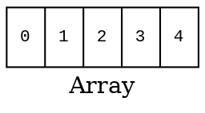
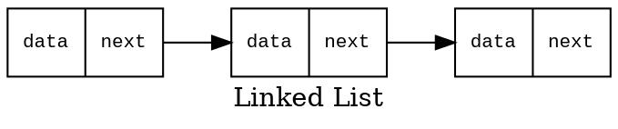
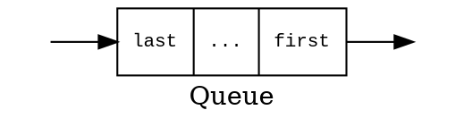
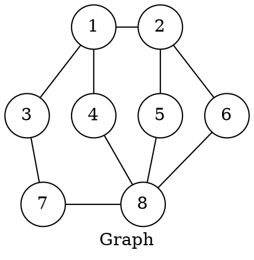

<style>
/**
 * @theme enable-all-auto-scaling
 * @auto-scaling true
 */

/* @import 'default'; */
/* @import url('user-theme2.css'); */
</style>


<!-- marp --engine ./engine.js --watch --theme-set custom-theme-roboto.css -- --allow-local-files mathematics.md -->
<!-- marp --pdf --allow-local-files --engine ./engine.js --theme-set custom-theme-roboto.css -- mathematics.md -->


# Foundations of Semantic Knowledge Graphs

#### Prof. Dr. Stefan Linus Zander 

A Mathematical Introduction to Graphs in Computer Science {.lightgreen .Big .skip}


---
<!-- header: Overview -->
<!-- footer: Foundations of Semantic Knowledge Graphs | Data Graphs | Prof. Dr. Stefan Zander | Hochschule Darmstadt – University of Applied Sciences -->

## What you will learn in this Unit

...


---
## There are a number of different data structures for storing data

::::: columns
:::: single
**Linear Data Structures**

```graphviz
digraph G {
    node [shape=record, fontname="Courier New", fontsize=10];
    label="Stack";
//    {rank=same; point1; point2;}
    stack [label="{Top|...|...|...|Bottom }"];
/* 
    point1 [label="", style=invisible, width=0, height=0];
    point2 [label="", style=invisible, width=0, height=0];
   
    point1 -> stack [label="push"];
    stack -> point2 [label="pop"]; 
*/
}
```







<!-- 
```graphviz
digraph G {
    node [shape=record, fontname="Courier New", fontsize=10];
    label="Queue";
    graph [rankdir=TB];
    stack [label="{last|...|...|...|first }"];
    point1 [label="", style=invisible, width=0, height=0];
    point2 [label="", style=invisible, width=0, height=0];
    point1 -> stack [label="push"];
    stack -> point2 [label="pop"];
}
``` -->

::::
:::: double
**Non-linear Data Structures**
::: grid2col horizontal-center widthauto
```graphviz
digraph G {
  label="Tree"
  node [shape=circle];
  1 -> 2;
  1 -> 3;
  2 -> 4;
  2 -> 5;
  3 -> 6;
  3 -> 7;
  5 -> 8;
  5 -> 9;
}
```


:::
::::
:::::


---
## Trees and Graphs share a number of common attributes

