<style>
/**
 * @theme enable-all-auto-scaling
 * @auto-scaling true
 */

/* @import 'default'; */
/* @import url('user-theme2.css'); */
</style>


<!-- marp --engine ./engine.js --watch --theme-set custom-theme-roboto.css -- --allow-local-files mathematics.md -->
<!-- marp --pdf --allow-local-files --engine ./engine.js --theme-set custom-theme-roboto.css -- mathematics.md -->


# Foundations of Semantic Knowledge Graphs

#### Prof. Dr. Stefan Linus Zander 

A Mathematical Introduction to Graphs in Computer Science {.lightgreen .Big .skip}


---
<!-- header: Properties of Graphs -->
<!-- footer: Foundations of Semantic Knowledge Graphs | Data Graphs | Prof. Dr. Stefan Zander | Hochschule Darmstadt – University of Applied Sciences -->

## What you will learn in this Unit

We will discuss the mathematical foundation underlying knowledge graphs.


---
## There are a number of different data structures for storing data

::::: columns
:::: single
**Linear Data Structures**
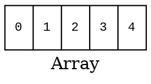

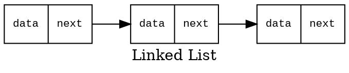

```graphviz
digraph G {
    node [shape=record, fontname="Courier New", fontsize=10];
    label="Stack";
//    {rank=same; point1; point2;}
    stack [label="{Top|...|...|...|Bottom }"];
/* 
    point1 [label="", style=invisible, width=0, height=0];
    point2 [label="", style=invisible, width=0, height=0];
   
    point1 -> stack [label="push"];
    stack -> point2 [label="pop"]; 
*/
}
```

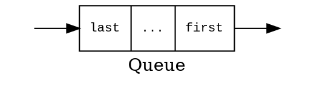
<!-- 
```graphviz
digraph G {
    node [shape=record, fontname="Courier New", fontsize=10];
    label="Queue";
    graph [rankdir=TB];
    stack [label="{last|...|...|...|first }"];
    point1 [label="", style=invisible, width=0, height=0];
    point2 [label="", style=invisible, width=0, height=0];
    point1 -> stack [label="push"];
    stack -> point2 [label="pop"];
}
``` -->

::::
:::: double
**Non-linear Data Structures**
::: grid2col horizontal-center widthauto
```graphviz
digraph G {
  label="Tree"
  node [shape=circle];
  1 -> 2;
  1 -> 3;
  2 -> 4;
  2 -> 5;
  3 -> 6;
  3 -> 7;
  5 -> 8;
  5 -> 9;
}
```

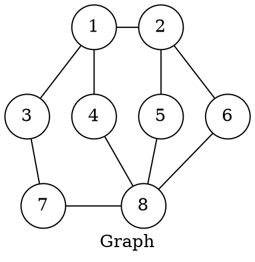
:::
::::
:::::


---
## Trees and Graphs share a number of common attributes


::::: columns
:::: single
::: center
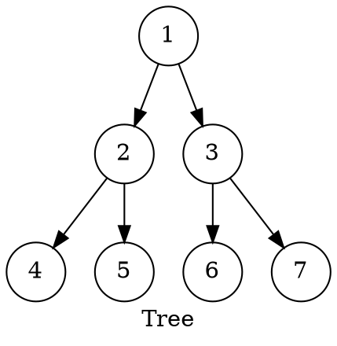
:::

- A tree with $N$ nodes has $N-1$ edges
  - one edge for each parent-child relationship
- All nodes in a tree except the root have exactly one parent
- All nodes must be reachable from the root through exactly one defined path
- _Any tree is also a graph_

::::
:::: single
::: center

:::

- A graph consists of a set of nodes and edges
- In Graph Theory, nodes are usually called vertices
- No rules that dictate the connection among nodes, ie., edges can be connected in any possible way
- CS usually adapts the mathematical notion of graphs 
- CS studies graphs and related algorithms in Graph Theory
::::
:::::


---
## A Mathematical Definition of Graphs

::::: columns
:::: single

**Graph**
::: marg2
A graph $G$ is an ordered pair of a set $V$ of vertices and a set $E$ of edges. 

  $$ G = (V,E)$$

<!-- Since the order matters, $V$ is the first object in the pair and $E$ is the second object. -->

Ordered pair: $\quad \quad (a,b) \neq (b,a) \quad \text{if} \ \ a \neq b$

Unordered pair: $\quad \quad \{ a , b \} = \{ {b,a} \}$

<!-- An edge is represented by the pairs of vertices it connects. -->
:::

**Edges**
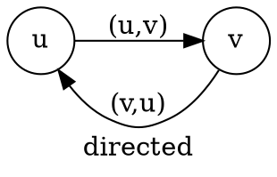

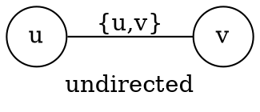


::::
:::: single vert-center
::: center
```graphviz
graph G {
    node [shape=circle];
    nodesep=.5;
    {rank=same; 1; 2;};
    {rank=same; 3; 4; 5; 6;};
    {rank=same; 7; 8;};
    1 [label="v&#x2081;"];
    2 [label="v&#x2082;"];
    3 [label="v&#x2083;"];
    4 [label="v&#x2084;"];
    5 [label="v&#x2085;"];
    6 [label="v&#x2086;"];
    7 [label="v&#x2087;"];
    8 [label="v&#x2088;"];
    1 -- 2;
    1 -- 3;
    1 -- 4;
    2 -- 5;
    2 -- 6;
    3 -- 7;
    4 -- 8;
    5 -- 8;
    6 -- 8;
    7 -- 8; // [label=<Regular<SUB>subscript</SUB>>];
}
```
:::

$$ V = \{ v_1, v_2, v_3, v_4, v_5, v_6, v_7 ,v_8 \} $$

$$ \begin{align} 
E = \{ &\{v_1,v_2\}, \{v_1,v_3\}, \{v_1,v_4\}, \{v_2,v_5\}, \\
&\{v_2,v_6\}, \{v_3,v_7\}, \{v_4,v_8\}, \{v_5,v_8\}, \\
& \{v_6,v_8\}, \{v_7,v_8\} \}
\end{align}$$

::::
:::::


---
## Directed vs. Undirected Graphs


::::: columns-center
:::: single center
```graphviz
digraph G {
    node [shape=circle];
    nodesep=1;
    splines="spline";
    label="a directed graph or Digraph"; 
    {rank=same; 1; 2;};
    {rank=same; 3; 4; 5;};
    {rank=same; 6;};
    1 [label="v&#x2081;"];
    2 [label="v&#x2082;"];
    3 [label="v&#x2083;"];
    4 [label="v&#x2084;"];
    5 [label="v&#x2085;"];
    6 [label="v&#x2086;"];
    1 -> 2;
    1 -> 3;
    1 -> 4;
    2 -> 4;
    2 -> 5;
    4 -> 1;
    4 -> 6;
    6 -> 3;
    6 -> 5;
}
```
::::
:::: single center
```graphviz
graph G {
    node [shape=circle];
    nodesep=.5;
    label="an undirected graph"; 
    {rank=same; 1; 2;};
    {rank=same; 3; 4; 5; 6;};
    {rank=same; 7; 8;};
    1 [label="v&#x2081;"];
    2 [label="v&#x2082;"];
    3 [label="v&#x2083;"];
    4 [label="v&#x2084;"];
    5 [label="v&#x2085;"];
    6 [label="v&#x2086;"];
    7 [label="v&#x2087;"];
    8 [label="v&#x2088;"];
    1 -- 2;
    1 -- 3;
    1 -- 4;
    2 -- 5;
    2 -- 6;
    3 -- 7;
    4 -- 8;
    5 -- 8;
    6 -- 8;
    7 -- 8;
}
```
::::
:::::

**Remarks**
- Many real-world systems or problems can be modelled using a graph.
- Graphs can be used to represent any collection of objects having some kind of pairwise relationship.


---
## Example Graphs: Social Network

::::: columns-center
:::: double center
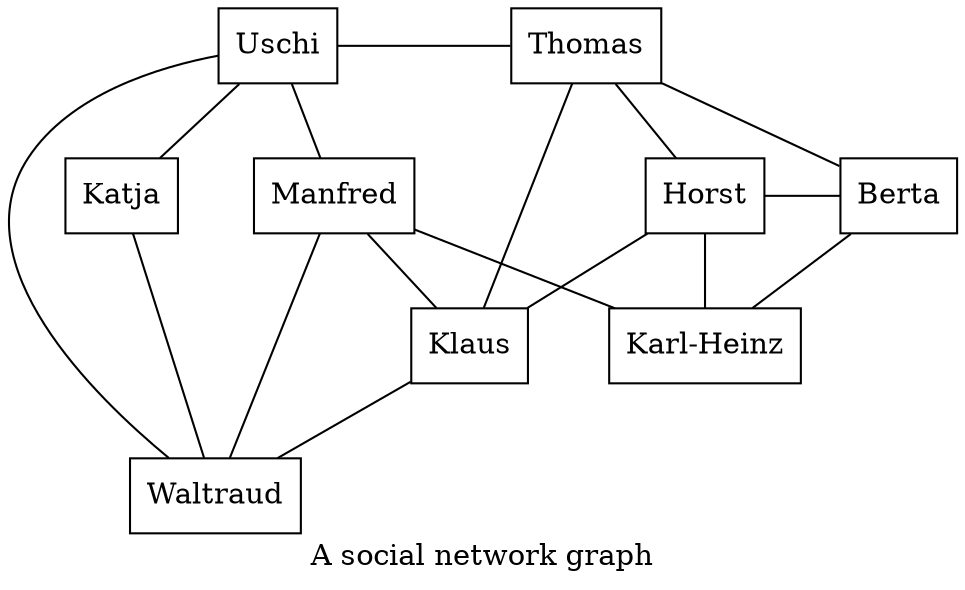
::::
:::: single
- **Social networks** are usually represented as _undirected graphs_ since friendships are mutual relationship
- Vertices represents _persons_ and edges represent _friend relationships_ 
- A lot of problems can be solved by applying standard algorithms from graph theory
  - e.g. suggesting friends of friends who are not connected
  - e.g. can we suggest some friends for 'Katja'?
- Standard graph problem: 
  _[Find all nodes having a shortest path length of '2' from 'Katja']{.kursiv}_
::::
:::::


---
## Example Graphs: Interlinked Web Pages

::::: columns-center
:::: double center
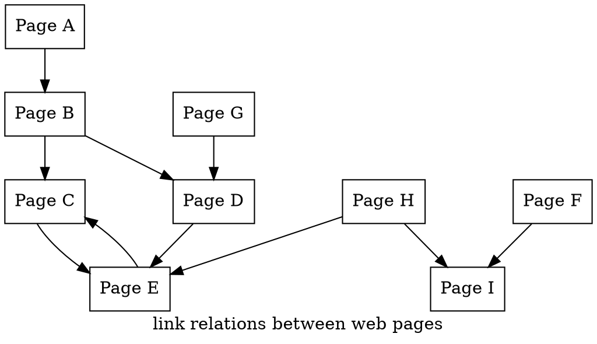
::::
:::: single
- A vertice represents a _web page_ with a unique URL 
- An edge represents a _link_ from one page to another
- The edges are _directed_ because the relationship is _not mutual_
- Application Scenario: ==Web Crawling== to collect and store data about web pages
- Web crawling is basically ==graph traversal==
- Standard graph probelm: 
  **Centrality** (degree, betweenness, closeness, eigenvector, etc)
::::
:::::


<!-- Graph centrality refers to a set of measures that quantify the importance or influence of nodes in a network or graph. In other words, centrality measures identify which nodes are most central or essential in a network.

There are several types of centrality measures, including degree centrality, betweenness centrality, closeness centrality, and eigenvector centrality.

Degree centrality is based on the number of connections a node has to other nodes in the network. Nodes with high degree centrality are often referred to as "hubs" in the network.

Betweenness centrality measures the extent to which a node lies on paths between other nodes in the network. Nodes with high betweenness centrality are important for facilitating communication between different parts of the network.

Closeness centrality measures how quickly a node can reach all other nodes in the network. Nodes with high closeness centrality are typically well-connected to other nodes in the network and can quickly communicate with them.

Eigenvector centrality is based on the idea that the importance of a node depends on the importance of its neighbors. Nodes with high eigenvector centrality are connected to other nodes that are also important in the network.

Overall, centrality measures are useful for identifying key players or nodes in a network, understanding how information or influence flows through the network, and predicting how the network will behave under different conditions. -->


---
##  Example Graphs: Road Networks

::::: columns
:::: double
::: center
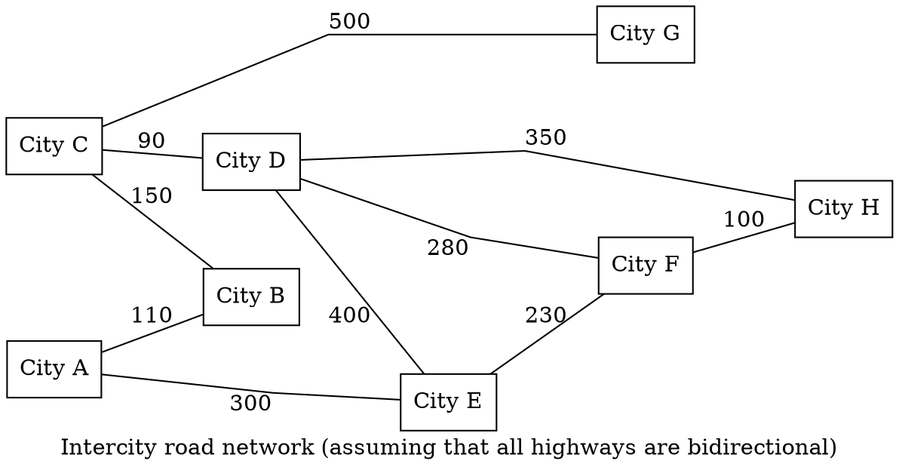
:::
::: bluebox small
**Problem**: _What is the shortest direction from 'City F' to 'City B' ?_ {.smallskip}
- With weights added to connections we can accumulate the single weigths and find the shortest route
:::
::::
:::: single
- _Edges_ represent _bidirectional intercity connections_
- Associating a weight or cost to a connection accounts for their _length_
- _Values_ associated with edges are denoted as ==weight== or ==cost==
- Such graphs are called ==weighted graphs==
- Connections must be treated differently due to their varying lengths
- Road networks can be represented as ==weighted undirected graphs==
- Some application scenarios require a different treatment of edges
- All graphs can be treated as weighted graphs
::::
:::::


---
## Special edge types

::::: columns
:::: single
**Self-Loop**
::::
:::: quad
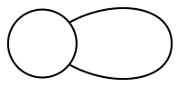

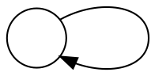
::::
:::::

::::: columns
:::: single
**Multi-Edge**
::::
:::: quad
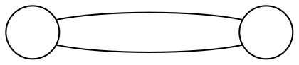

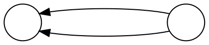

A graph is called ==multi-edge graph==, if it contains pairs of vertices that are connected by more than one edge.
::::
:::::

::: bluebox center marg5 spacebefore
If there are no self-loops or multi-edges in a graph, it is a ==simple graph==.
:::


---
## Properties of Graphs (2/2)

::::: columns
:::: single
**Number of Edges**
::::
:::: single
```graphviz
digraph G {
    nodesep=1;
    //graph [rankdir=LR];
    node [shape=circle];
    layout="fdp";
    sep="1.5";
    {rank=same; 1; 2;};
    {rank=same; 3; 4;};
    1 [label="v&#x2081;"];
    2 [label="v&#x2082;"];
    3 [label="v&#x2083;"];
    4 [label="v&#x2084;"];
    1 -> 2 [color="blue"];
    1 -> 3 [color="blue"];
    1 -> 4 [color="blue"];
    2 -> 1 [color="red"];
    2 -> 3 [color="red"];
    2 -> 4 [color="red"];
    3 -> 1 [color="green"];
    3 -> 2 [color="green"];
    3 -> 4 [color="green"];
    4 -> 1 [color="orange"];
    4 -> 2 [color="orange"];
    4 -> 3 [color="orange"];
}
```
::::
:::: double
$$ \begin{align} 
V &= \{v_1, v_2, v_3, v_4 \} \\
|V| &= 4
\end{align} $$

$$\begin{align} \text{if} \ |V| = n \ \text{then} \\ 
&0 \leqq |E| \leqq n(n-1), \quad &\text{if directed} \\
&0 \leqq |E| \leqq \frac{n(n-1)}{2}, &\text{if undirected}
\end{align} $$

Assuming no self-loop or multi-edge.

$$\begin{align*}
&\text{if} \ |V| = 10,& &|E| \leqq 90 \\
&\text{if} \ |V| = 100,& &|E| \leqq 9900
\end{align*} $$
::::
:::::

A graph is ==dense==, if the number of edges is close to the maximum number of possible edges.
A graph is ==sparse==, if the number of edges is close to $|V|$.

However, there are no defined boundaries for classifying a graph as dense or sparse $\leadsto$ it all depends on the context.

This classification is important, since a lot of decisions are made based on whether the graph is dense or sparse (e.g. choosing a different storage structure in computer's memory for dense graphs (ie adjacency matrix vs. adjacency list used for sparse graphs)).


---
## Properties of Graphs: Paths, Walks, and Trails


::::: columns-center
:::: double
In graph theory there is some inconsistency between the terms ==path== and ==walk==. 

A ==walk== is a sequence of vertices where each adjacent pair is connected by an edge.

$$ < v_1, v_2, v_6, v_8, v_5, v_2, v_1, v_4 > $$


A ==path== is a walk with no repeated _vertex_ 

$$ < v_1, v_2, v_6, v_8, v_7, v_3 > $$

A ==simple path== is a walk in which no _vertices_ and _edges_ are repeated.

$$ < v_1, v_2, v_6, v_8 > $$

A ==trail== is a walk with no repeated _edge_ (vertices can be repeated)

$$ < v_1, v_2, v_5, v_8, v_4, v_1, v_3 > $$

The ==length== of a *walk* *trail*, *path* or cycle is its __number of edges__.

::::
:::: single
```graphviz
graph G {
    node [shape=circle];
    nodesep=.5;
    label="an undirected graph"; 
    {rank=same; 1; 2;};
    {rank=same; 3; 4; 5; 6;};
    {rank=same; 7; 8;};
    1 [label="v&#x2081;"];
    2 [label="v&#x2082;"];
    3 [label="v&#x2083;"];
    4 [label="v&#x2084;"];
    5 [label="v&#x2085;"];
    6 [label="v&#x2086;"];
    7 [label="v&#x2087;"];
    8 [label="v&#x2088;"];
    1 -- 2;
    1 -- 3;
    1 -- 4;
    2 -- 5;
    2 -- 6;
    3 -- 7;
    4 -- 8;
    5 -- 8;
    6 -- 8;
    7 -- 8;
}
```

If any other path is possible, there must be a simple path $\Leftrightarrow$ if there is a simple path, any other "path" is also possible
::::
:::::

::: footnotes
Walk and path are often used as synonyms but most often when we say path we mean simple path, a path in which vertices and edges are not repeated.
:::


---
## Properties of Graphs: Strongly Connected Graphs 

::: bluebox center marg4 space
A **graph** is a ==strongly connected graph== if there is a path from any vertex to any other vertex.
:::

::::: columns-center
:::: single center 
```graphviz
graph G {
    node [shape=circle];
    nodesep=1.5;
    label="A connected graph"; 
    {rank=same; 2;};
    {rank=same; 3; 1;};
    {rank=same; 4; 5;};
    1 [label="v&#x2081;"];
    2 [label="v&#x2082;"];
    3 [label="v&#x2083;"];
    4 [label="v&#x2084;"];
    5 [label="v&#x2085;"];
    1 -- 2;
    2 -- 3;
    3 -- 4;
    4 -- 5;
}
```
<!-- If an edge would be removed, the graph would be not connected -->
::::
:::: single center vert-bottom
```graphviz
digraph G {
    node [shape=circle];
    nodesep=1.5;
    label="A weakly connected graph"; 
    {rank=same; 2;};
    {rank=same; 3; 1;};
    1 [label="v&#x2081;"];
    2 [label="v&#x2082;"];
    3 [label="v&#x2083;"];
    1 -> 3;
    1 -> 2;
    3 -> 2;
}
```
::::
:::: single center vert-bottom
```graphviz
digraph G {
    node [shape=circle];
    nodesep=1.5;
    label="A strongly connected graph"; 
    {rank=same; 1;};
    {rank=same; 2; 4;};
    {rank=same; 3;};
    1 [label="v&#x2081;"];
    2 [label="v&#x2082;"];
    3 [label="v&#x2083;"];
    4 [label="v&#x2084;"];
    1 -> 4;
    2 -> 1;
    2 -> 3;
    2 -> 4;
    3 -> 4;
    4 -> 2;
}
```
::::
:::::


The degree and type of **connectedness** is an important concept in graph theory.


---
## Properties of Graphs: Cycles


::::: columns-center
:::: double

A **closed walk** starts and ends at the same vertex and its length is $>0$. 
$$ < v_1, v_2, v_5, v_8, v_4, v_1 > $$

A (simple) **cycle** is a closed walk with no repetition other than start and end.
$$ < v_1, v_2, v_5, v_8, v_4, v_1 > $$

An **acyclic graph** is a graph with no cycles.

A tree with undirected edges would be an undirected acyclic graph

A tree would not have a simple cycle. 

A **directed acyclic graph** is often called ==DAG==.

Common problem in DAGs: Finding the shortest route from one vertice to another.

::::
:::: single
```graphviz
graph G {
    node [shape=circle];
    nodesep=.5;
    label="an undirected graph"; 
    {rank=same; 1; 2;};
    {rank=same; 3; 4; 5; 6;};
    {rank=same; 7; 8;};
    1 [label="v&#x2081;"];
    2 [label="v&#x2082;"];
    3 [label="v&#x2083;"];
    4 [label="v&#x2084;"];
    5 [label="v&#x2085;"];
    6 [label="v&#x2086;"];
    7 [label="v&#x2087;"];
    8 [label="v&#x2088;"];
    1 -- 2;
    1 -- 3;
    1 -- 4;
    2 -- 5;
    2 -- 6;
    3 -- 7;
    4 -- 8;
    5 -- 8;
    6 -- 8;
    7 -- 8;
}
```

```graphviz
digraph G {
    node [shape=circle];
    graph [rankdir=LR];
    nodesep=1.0;
    label="A directed acyclic graph (DAG)"; 
    //{rank=same; 1;};
    //{rank=same; 2; 4;};
    //{rank=same; 3;};
    1 [label="v&#x2081;"];
    2 [label="v&#x2082;"];
    3 [label="v&#x2083;"];
    4 [label="v&#x2084;"];
    5 [label="v&#x2085;"];
    1 -> 2;
    1 -> 3;
    2 -> 4;
    3 -> 4;
    3 -> 5;
    4 -> 5;
}
```
::::
:::::


---
<!-- header: "" -->
# Graph Representation


---
<!-- header: Graph Representations -->
## Representing graphs: Adjacency Matrix

There are several ways for representing graphs in Computer Science.

::: definition spaceafter
The ==adjacency matrix== of a graph $G = ⟨V, E⟩$ is the boolean $|V| \times |V|$ matrix that contains, at any coordinate $⟨v_1,v_2⟩$, the value $1$ if there is an edge connecting $v_1$ and $v_2$.

Source: Introduction to Knowlege Graphs, Prof. Dr. Markus Krötzsch, TU Dresden
:::

**Notes**
- Adjacency matrices for undirected graphs are symmetric.
- Loops (if allowed) show up as $1$ in the diagonal.
- The matrix could be adapted to multi-graphs by storing the numbers of edges. 
- The matrix could be adapted to labelled simple graphs by storing the labels.


---
## Representing graphs: Adjacency List

There are several ways for representing graphs in Computer Science.

::: definition spaceafter
The ==adjacency list== of a graph $G = ⟨V,E⟩$ is the list of all of its edges.

Source: Introduction to Knowlege Graphs, Prof. Dr. Markus Krötzsch, TU Dresden
:::

**Notes**
- We can write edges as pairs (order is irrelevant for undirected graphs)
- Loops (if allowed) show up as edges with repeated vertices
- The list could be adapted to _multi-graphs_ by adding the number of edges to each line, or by allowing repeated lines
- The list could be adapted to _labelled graphs_ by adding labels to each line (for multi-graph: repeat lines rather than also storing number).
- The list does not encode $V$: vertices without edges are missing (might be listed separately if relevant to application)


---
## Each graph representation has its pros :far-thumbs-up: and cons :far-thumbs-down:

::::: columns
:::: single
**Adjacency Matrix**
- :far-thumbs-up: space efficient for dense graphs (1 bit per edge)
- :far-thumbs-up: can be processed with matrix operations (highly parallel)
- :far-thumbs-down: space inefficient for sparse graphs
- :far-thumbs-down: not natural for _labelled multi-graphs_

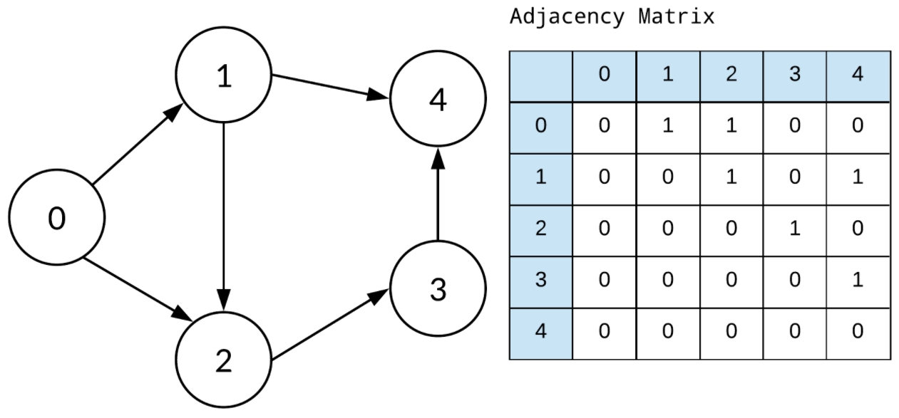
::::
:::: single
**Adjecency List**
- :far-thumbs-up: space efficient for sparse graphs;
- :far-thumbs-up: easy to use for labelled multi-graphs;
- :far-thumbs-down: harder to process (esp. if edge order can be random)
- :far-thumbs-down: not space efficient for dense graphs

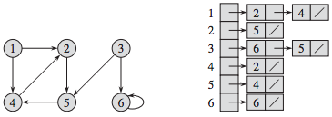
::::
:::::

::: bluebox center marg15
Note: **Knowledge graphs** are typically **sparse** and **labelled**, but parallel processing still makes matrices attractive in some applications.
:::

::: footnotes
Source: Lecture Slides of Prof. Dr. Markus Krötzsch, TU Dresden; Pictures taken from https://www.cs.mtsu.edu/~xyang/3080/
:::


---
##  Graph representations in mathematics are not sufficient for knowledge graph representations in Computer Science 

We have seen that graphs can be encoded in several ways: 
- _Adjacency matrix_ (and variants)
- _Adjacency list_ (and variants)
- Other derived representations

This works for storing and manipulating graphs in software, but it is insufficient to _encode meaning_ and _exchange graphs across apps_.

**Open questions**:
- What kind(s) of graph do we want to exchange ?
- How are vertices given (numbers? strings? specific ids? ... ) ?
- Are edge labels supported and what are they ?
- Can the graph include values of data types (integer? float? string? times? ... )? 
- How exactly are these things encoded in bytes in a file?

::: footnotes
Source: Compiled from Lecture Materials about Knowledge Graphs from Prof. Dr. Markus Krötzsch, TU Dresden
:::


