<style>
/**
 * @theme enable-all-auto-scaling
 * @auto-scaling true
 */

/* @import 'default'; */
/* @import url('user-theme2.css'); */
</style>


<!-- marp --engine ./engine.js --watch --theme-set custom-theme-roboto.css -- --allow-local-files mathematics.md -->
<!-- marp --pdf --allow-local-files --engine ./engine.js --theme-set custom-theme-roboto.css -- mathematics.md -->


# Foundations of Semantic Knowledge Graphs

#### Prof. Dr. Stefan Linus Zander 

A Mathematical Introduction to Graphs in Computer Science {.lightgreen .Big .skip}


---
<!-- header: Overview -->
<!-- footer: Foundations of Semantic Knowledge Graphs | Data Graphs | Prof. Dr. Stefan Zander | Hochschule Darmstadt – University of Applied Sciences -->

## What you will learn in this Unit

...


---
## There are a number of different data structures for storing data

::::: columns
:::: single
**Linear Data Structures**
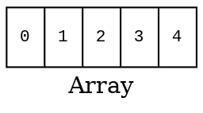

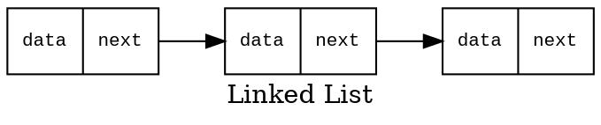

```graphviz
digraph G {
    node [shape=record, fontname="Courier New", fontsize=10];
    label="Stack";
//    {rank=same; point1; point2;}
    stack [label="{Top|...|...|...|Bottom }"];
/* 
    point1 [label="", style=invisible, width=0, height=0];
    point2 [label="", style=invisible, width=0, height=0];
   
    point1 -> stack [label="push"];
    stack -> point2 [label="pop"]; 
*/
}
```

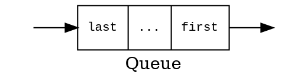
<!-- 
```graphviz
digraph G {
    node [shape=record, fontname="Courier New", fontsize=10];
    label="Queue";
    graph [rankdir=TB];
    stack [label="{last|...|...|...|first }"];
    point1 [label="", style=invisible, width=0, height=0];
    point2 [label="", style=invisible, width=0, height=0];
    point1 -> stack [label="push"];
    stack -> point2 [label="pop"];
}
``` -->

::::
:::: double
**Non-linear Data Structures**
::: grid2col horizontal-center widthauto
```graphviz
digraph G {
  label="Tree"
  node [shape=circle];
  1 -> 2;
  1 -> 3;
  2 -> 4;
  2 -> 5;
  3 -> 6;
  3 -> 7;
  5 -> 8;
  5 -> 9;
}
```

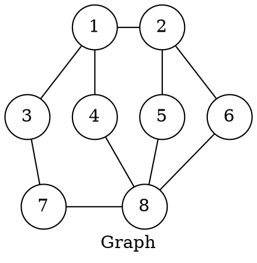
:::
::::
:::::


---
## Trees and Graphs share a number of common attributes


::::: columns
:::: single
::: center
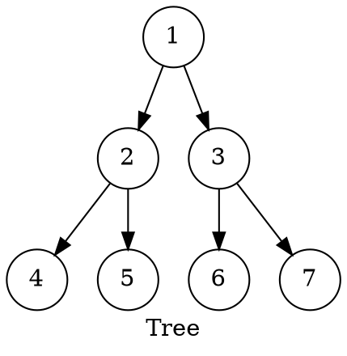
:::

- A tree with $N$ nodes has $N-1$ edges
  - one edge for each parent-child relationship
- All nodes in a tree except the root have exactly one parent
- All nodes must be reachable from the root through exactly one defined path
- _Any tree is also a graph_

::::
:::: single
::: center

:::

- A graph consists of a set of nodes and edges
- In Graph Theory, nodes are usually called vertices
- No rules that dictate the connection among nodes, ie., edges can be connected in any possible way
- CS usually adapts the mathematical notion of graphs 
- CS studies graphs and related algorithms in Graph Theory
::::
:::::


---
## A Mathematical Definition of Graphs

::::: columns
:::: single

**Graph**
::: marg2
A graph $G$ is an ordered pair of a set $V$ of vertices and a set $E$ of edges. 

  $$ G = (V,E)$$

<!-- Since the order matters, $V$ is the first object in the pair and $E$ is the second object. -->

Ordered pair: $\quad \quad (a,b) \neq (b,a) \quad \text{if} \ \ a \neq b$

Unordered pair: $\quad \quad \{ a , b \} = \{ {b,a} \}$

<!-- An edge is represented by the pairs of vertices it connects. -->
:::

**Edges**
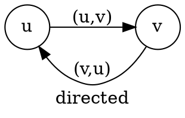

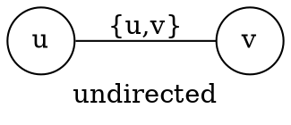


::::
:::: single vert-center
::: center
```graphviz
graph G {
     node [shape=circle];
    {rank=same; 1; 2;};
    {rank=same; 3; 4; 5; 6;};
    {rank=same; 7; 8;};
    1 [label="v&#x2081;"];
    2 [label="v&#x2082;"];
    3 [label="v&#x2083;"];
    4 [label="v&#x2084;"];
    5 [label="v&#x2085;"];
    6 [label="v&#x2086;"];
    7 [label="v&#x2087;"];
    8 [label="v&#x2088;"];
    1 -- 2;
    1 -- 3;
    1 -- 4;
    2 -- 5;
    2 -- 6;
    3 -- 7;
    4 -- 8;
    5 -- 8;
    6 -- 8;
    7 -- 8 [label=<Regular<SUB>subscript</SUB>>];
}
```
:::

$$ V = \{ v_1, v_2, v_3, v_4, v_5, v_6, v_7 ,v_8 \} $$

$$ \begin{align} 
E = \{ &\{v_1,v_2\}, \{v_1,v_3\}, \{v_1,v_4\}, \{v_2,v_5\}, \\
&\{v_2,v_6\}, \{v_3,v_7\}, \{v_4,v_8\}, \{v_5,v_8\}, \\
& \{v_6,v_8\}, \{v_7,v_8\} \}
\end{align}$$

::::
:::::


---
## Directed vs. Undirected Graphs


::::: columns-center
:::: single center
```graphviz
digraph G {
    node [shape=circle];
    nodesep=1;
    splines="spline";
    label="a directed graph or Digraph"; 
    {rank=same; 1; 2;};
    {rank=same; 3; 4; 5;};
    {rank=same; 6;};
    1 [label="v&#x2081;"];
    2 [label="v&#x2082;"];
    3 [label="v&#x2083;"];
    4 [label="v&#x2084;"];
    5 [label="v&#x2085;"];
    6 [label="v&#x2086;"];
    1 -> 2;
    1 -> 3;
    1 -> 4;
    2 -> 4;
    2 -> 5;
    4 -> 1;
    4 -> 6;
    6 -> 3;
    6 -> 5;
}
```
::::
:::: single center
```graphviz
graph G {
    node [shape=circle];
    nodesep=.5;
    label="an undirected graph"; 
    {rank=same; 1; 2;};
    {rank=same; 3; 4; 5; 6;};
    {rank=same; 7; 8;};
    1 [label="v&#x2081;"];
    2 [label="v&#x2082;"];
    3 [label="v&#x2083;"];
    4 [label="v&#x2084;"];
    5 [label="v&#x2085;"];
    6 [label="v&#x2086;"];
    7 [label="v&#x2087;"];
    8 [label="v&#x2088;"];
    1 -- 2;
    1 -- 3;
    1 -- 4;
    2 -- 5;
    2 -- 6;
    3 -- 7;
    4 -- 8;
    5 -- 8;
    6 -- 8;
    7 -- 8;
}
```
::::
:::::

**Remarks**
- Many real-world systems or problems can be modelled using a graph.
- Graphs can be used to represent any collection of objects having some kind of pairwise relationship.


---
## Example Graphs: Social Network

::::: columns
:::: double center
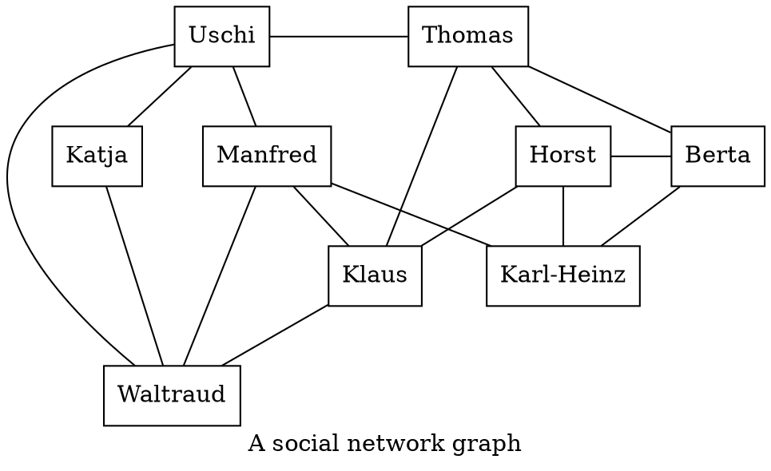
::::
:::: single
- Social networks are usually represented as undirected graphs since friendships are mutual relationship
- Vertices represents persons and edges represent friend relationships 
- A lot of problems can be solved by applying standard algorithms from graph theory
  - e.g. suggesting friends of friends who are not connected
  - e.g. can we suggest some friends for 'Katja'?
- Standard graph problem: Find all nodes having a shortest path length of '2' from 'Katja' 
::::
:::::


---
## Example Graphs: Interlinked Web Pages

::::: columns
:::: double center
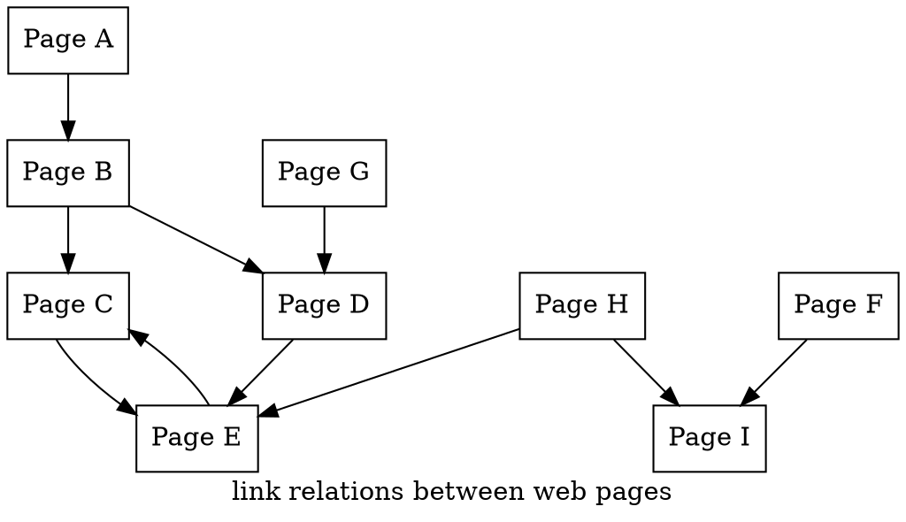
::::
:::: single
- A vertice represents a web page with a unique URL 
- An edge represents a link from one page to another
- The edges are directed because the relationship is not mutual
- Application Scenario: Web Crawling to collect and store data about web pages
- Web crawling is basically graph traversal
::::
:::::


---
##  Example Graphs: Road Networks

::::: columns
:::: double center
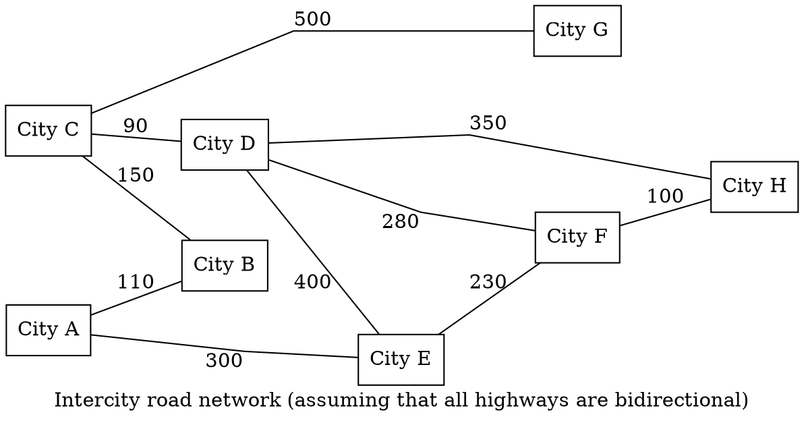
::::
:::: single
- Edges represent bidirectional intercity connections
- Connections must be treated differently due to their varying lengths
- Associating a weight or cost to a connection accounts for their length
- We label the vertices according to their length
- Problem: What is the shortest direction from 'City F' to 'City B'?
  - with weights added to connections we can calculate the weigths and find the shortest route.
- All graphs can be treated as weighted graphs
- Road networks can be represented as weighted undirected graphs
::::
:::::