

<!-- marp --engine ./engine.js --watch --theme-set custom-theme-roboto.css -- --allow-local-files owl.md -->
<!-- marp --pdf --allow-local-files --engine ./engine.js --theme-set custom-theme-roboto.css -- owl.md -->

# Foundations of Semantic Knowledge Graphs

#### Prof. Dr. Stefan Linus Zander 

Defining Ontologies and the Ontology Language OWL {.lightgreen .Big .skip}

---
<!-- header: Overview -->
<!-- footer: Foundations of Semantic Knowledge Graphs | A Formal Introduction to Graphs | Prof. Dr. Stefan Zander | Hochschule Darmstadt – University of Applied Sciences -->

## Preamble: What makes a data graph a knowledge graph ?

We have learned about the different types of data graphs and the elements that constitute a data graph.

In order to transform a data graph into a knowledge graph, we need additional features:
- *Knowledge Representation Framework* :fa-check:
- *Identity* :fa-check:
- *Schema knowledge* :fa-check:
- *Contextual knowledge* :fa-check:
- *Semantics* :fa-magnifying-glass:

::: redbox center spacebefore
$\leadsto$ We therefore discuss **RDF** and the __RDF Schema data-modelling vocabulary__ that allow for the creation of knowledge graphs
:::

---
## What will we learn in this section :fa-graduation-cap:

- How to define more complex expressions, the semantics of which exceeds those of RDF/S
- We will learn how to design ontologies for the use in KGs
- We will learn about formal concepts and how they can be used for modelling aspects of a domain

---
## Components of OWL Ontologies

:::: columns
::: single
**Individuals** :fa-person:
- Individuals represent objects in the domain of interest
- Individuals are also known as *instances of classes*
- OWL does not use the *Unique Name Assumption* $\leadsto$ two different names could refer to the same individual
- In OWL, we must clearly specify for individuals whether they are the same or different from each other
:::
::: single
**Properties** :fa-timeline: <!-- :fa-diagram-project: -->
- Properties represent binary relations on individuals $\leadsto$ properties link two individuals together
- Properties can have different characteristics (being inverse, functional, inverse functional, symetric etc)
- Properties are called *roles* in description logics or *slots* in Protégé
:::
::: single
**Classes** :fa-people-roof:
- OWL interprets classes as sets that contain individuals
- Classes are described using formal descriptions that precisely state the requirements for membership
- Classes can be organized in a super-subclass-hierarchies called a _taxonomy_
- Classes are sometimes denoted as *concepts* – but classes are concrete representations of concepts
:::
::::

---
## OWL Naming Recommendations :fa-pencil:

Although there is no strict naming convention for classes, properties and individuals, it is recommended to use the following rules

::::: columns
:::: single
::: graybox small
**Naming Convention for Properties**

Property naming should use ==lower camel case notation==: 
- start with a **lower case letter**, 
- have **no spaces**, 
- and have the **remaining words capitalised**. 
- are **prefixed** with the word '**has**', or the word '**is**' 

Example: `hasPart`, `isPartOf`, `hasManufacturer`, `isProducerOf`

Not only does this convention help make the intent of the property clearer to humans, it is also taken advantage of by the ‘English Prose Tooltip Generator’, which uses this naming convention where possible to generate more human readable expressions for class descriptions.
:::
::::
:::: single
::: graybox small
**Naming Convention for Classes**

Classes should be named using a ==upper camel case notation==:
- start with a **capital letter** 
- should **not contain spaces**. 
 
Examples: `Pizza`, `PizzaTopping`, `MargheritaPizza`. 

Alternatively, underscores ('`_`') can be used to join words; for example `Pizza_Topping`. 

Which ever convention is used, it is important to be **consistent**.
:::
::::
:::::

::: footnotes
Source: OWL Pizza Tutorial der University of Manchester
:::

---
# Ontology Features 

## –Classes

---
## Classes in OWL

Classes are interpreted as sets that contain individuals.

Classes are described using formal, ie. mathematical descriptions that precisely state the requirements from class membership.

Example: `SafetyLaserScanner ⊑ ∃hasCapability.SafeMonitoringOf2DFields`

In OWL classes are built up of descriptions that specify the conditions that must be satisfied by an individual for it to be a member of the class.

OWL distinguishes between
- primitive classes – classes that only have necessary conditions
- defined classes – classes that have at least one set of necessary and sufficient conditions; any individual that satisfies these conditions (ie., the definition) becomes member of that class; class membership is expressed by necessary and sufficient conditions

:::: redbox
**Important** :fa-warning:
Automatic classification only works with defined classes $\leadsto$ a reasoner can only automatically classify classes under defined classes.
::::

---
## Disjoint Classes

==OWL Classes are assumed to ‘overlap’== $\leadsto$ We therefore cannot assume that an individual is not a member of a particular class simply because it has not been asserted to be a member of that class. 

In order to ‘separate’ a group of classes they must made ==disjoint== from one another. 

This ensures that an individual which has been asserted to be a member of one of the classes in the group cannot be a member of any other classes in that group. 

As example `Pizza`, `PizzaTopping` and `PizzaBase` can be made disjoint from one another. 

This means that it is not possible for an individual to be a member of a combination of these classes – it would not make sense for an individual to be a Pizza and a PizzaBase!

---
## What does it actually mean to be a subclass of something in OWL? 

::::: columns-center
:::: single
**Example**
What does it mean for `VegetableTopping` to be a subclass of `PizzaTopping`, or for `TomatoTopping` to be a subclass of `VegetableTopping`? 

$\Rightarrow$ In OWL subclass means ==necessary implication==.

::: bluebox 
:fa-warning: **Meaning**
In other words, if `VegetableTopping` is a subclass of `PizzaTopping` then **ALL** instances of `VegetableTopping` are instances of `PizzaTopping`, without exception — if something is a `VegetableTopping` then this implies that it is also a `PizzaTopping`.
:::
::::
:::: single
::: center
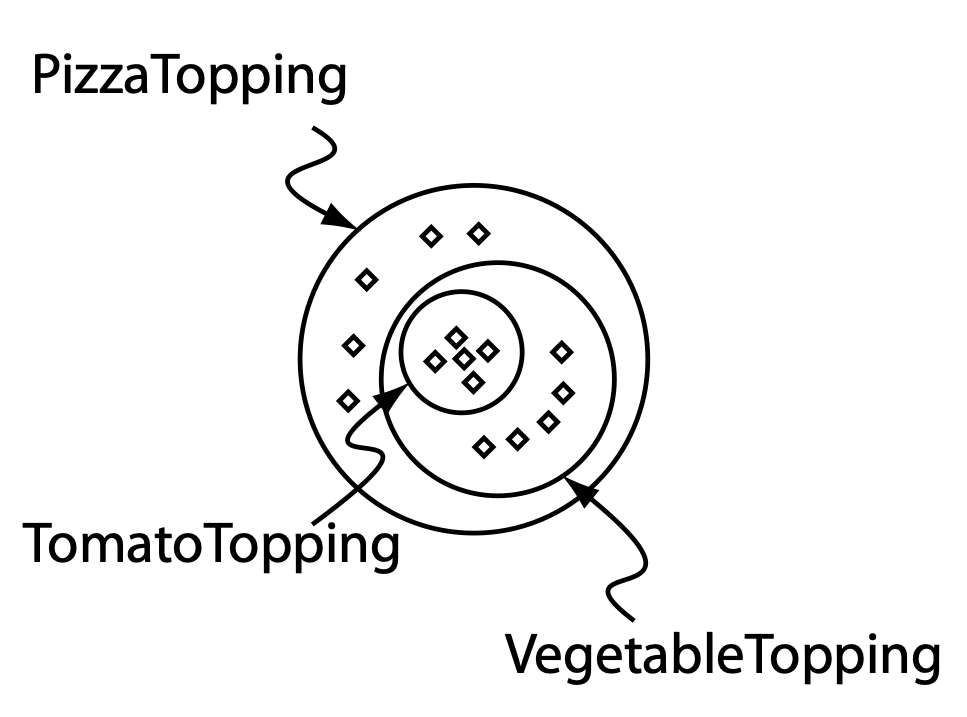
::: 
::: caption
All individuals that are members of the class `TomatoTopping` are members of the class `VegetableTopping` and members of the class `PizzaTopping` as we have stated that `TomatoTopping` is a subclass of `VegetableTopping` which is a subclass of `PizzaTopping`.
:::
::::
:::::

---
# Ontology Features 
## $\leadsto$ Properties

---
<!-- header: Properties -->
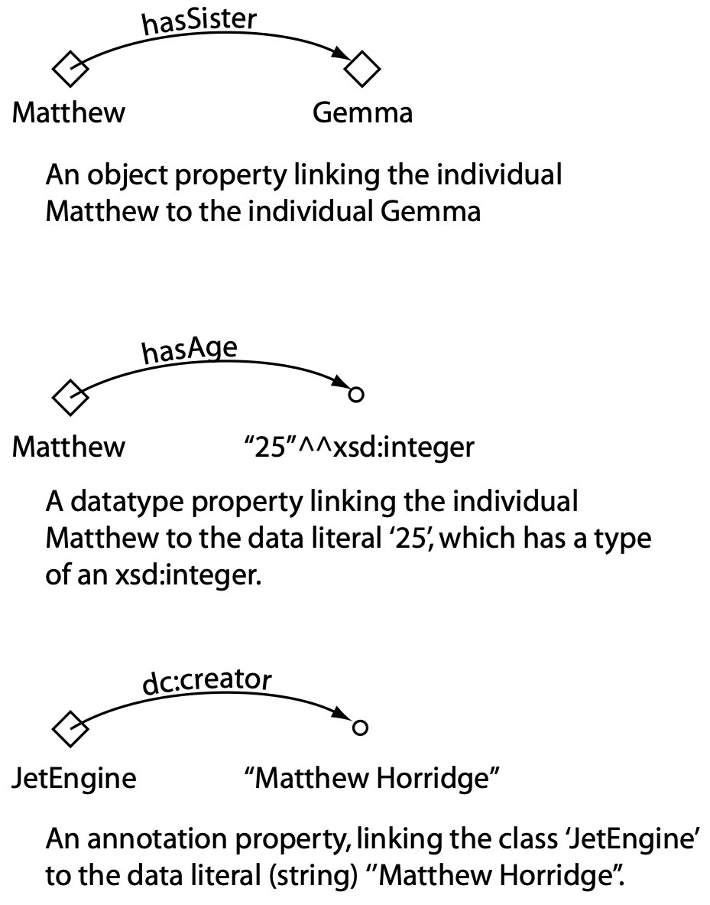
## OWL Property Types

OWL distinguishes between **3 types** of **properties**
- ==Object Properties==
  - represent relationships between individuals, i.e., they link one individual to another
- ==Datatype Properties==
  - ...
- ==Annotation Properties==
  - allow to add additional information to classes, individuals, and object/datatype properties

---
## OWL Object Property Characteristics

### Inverse Properties
::::: columns
:::: single
- Each object property may have a corresponding inverse property. 
- If some property links individual a to individual b then its inverse property will link individual b to individual a. 
::::
:::: single center
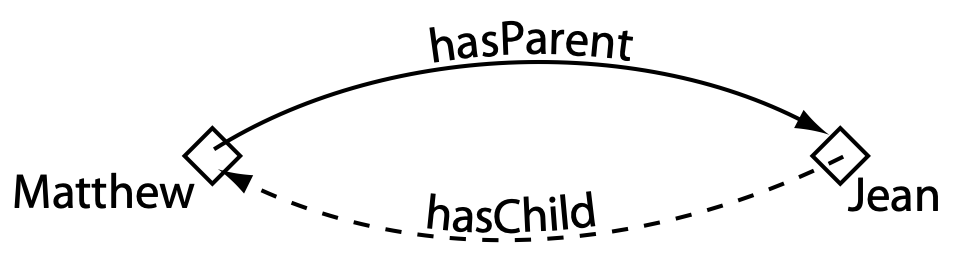
::::
:::::

### Functional Properties
::::: columns
:::: single
- For a given individual, there can be *at most* one individual that is related to the individual via the property.
- Functional properties are also known as *single valued properties* and also *features*.
::::
:::: single center
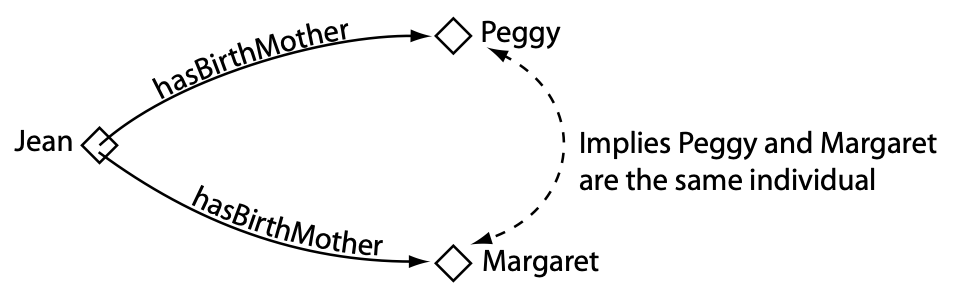
::::
:::::

---
## OWL Object Property Characteristics

::::: columns-bottom
:::: single
### Inverse Functional Properties

- If a property is inverse functional then it means that the inverse property is functional. 
- For a given individual, there can be at most one individual related to that individual via the property. 
::::
:::: single center
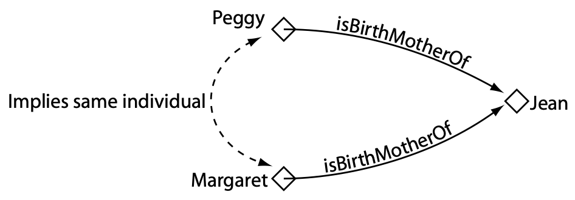
::::
:::::

::::: columns-bottom
:::: single
### Transitive Properties

- If a property is transitive, and the property `P` relates individual `a` to individual `b`, and also individual `b` to individual `c`, then we can infer that individual `a` is related to individual `c` via property `P`.
- The inverse of a transitive property should also be transitive.
- If a property is transitive then it cannot be functional
::::
:::: single center
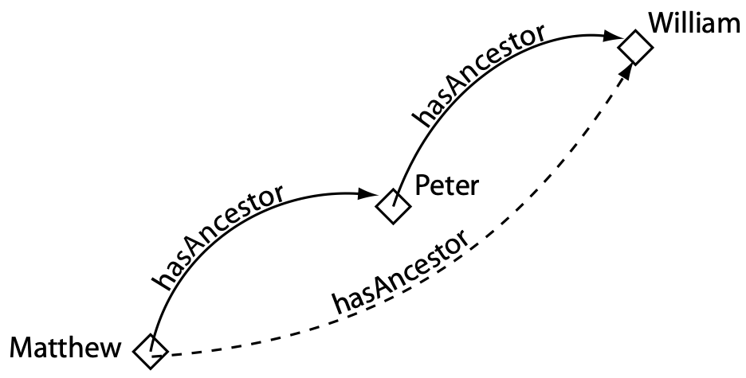
::::
:::::

---
## OWL Object Property Characteristics

### Symmetric Properties
::::: columns-center
:::: single
- If a property `P` is symmetric, and the property relates individual `a` to individual `b` then individual `b` is also related to individual `a` via property `P`
- In other words: the property is its own inverse property.
::::
:::: single center
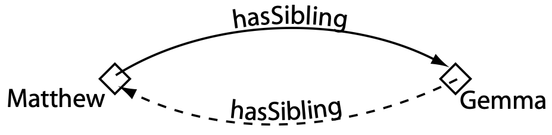
::::
:::::

::::: columns-bottom
:::: single
### Asymmetric Properties

- If a property `P` is asymmetric, and the property relates individual `a` to individual `b` then individual `b` cannot be related to individual `a` via property `P`.
::::
:::: single center
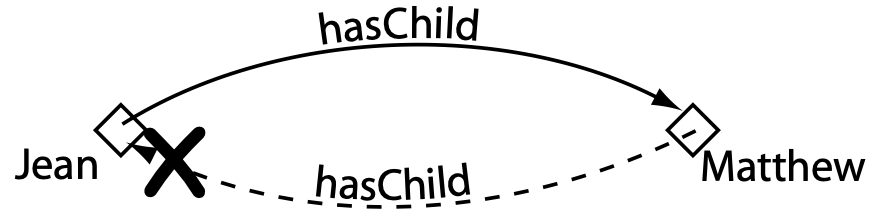
::::
:::::

---
## OWL Object Property Characteristics (4/4)

::::: columns-center
:::: single
### Reflexive Properties

- A property `P` is said to be reflexive when the property must relate individual `a` to itself.
- E.g. `knows` is such a property that could be defined as being reflexive
::::
:::: single center

::::
:::::

### Irreflexive Properties
::::: columns-center
:::: single
- If a property `P` is irreflexive, it can be described as a property that relates an individual `a` to individual `b`, where individual `a` and individual `b` are not the same.
- E.g., an individual `Alice` can be related to individual `Bob` along the property `motherOf`, but `Alice` cannot be `motherOf` herself.
::::
:::: single center

::::
:::::

---
# Describing and Defining Classes

---
<!-- header: Property Restrictions -->
## Property Restrictions

::: orangebox spaceafter
:fa-key: **Key idea** 
A **restriction** describes a **class of individuals** based on the **relationships** that members of the class participate in. The key idea is that a **class of individuals** is described or defined by the **relationships** that these individuals **participate in**. The annonymous class contains all individuals that satisfy the restriction.
:::

OWL distinguishes between the following **types** of restrictions

- *Quantifier Restrictions*
  - *Existential Restrictions* – denoted by the existential quantifier $\exists$ and formulated as `someValuesFrom` in OWL.
  - *Universal Restrictions* – denoted by the universal quantifier $\forall$ and read as 'only'. The formulation in OWL is `allValuesFrom`.
- *(Qualified) Cardinality Restrictions*
- *hasValue Restrictions*

---
## Quantifier Restrictions

_Quantifier restrictions_ consist of _three_ parts:
1. A ==quantifier==, which is either the ==existential quantifier (some)==, or the ==universal quantifier (only)==. 
2. A ==property==, along which the restriction acts.
3. A ==filler== that is a class description.

::: redbox spaceafter
For a given individual, the quantifier effectively puts **constraints** on the **relationships** that the individual participates in. 
:::

It does this by either 
- specifying that **at least one** kind of relationship must exist, 
- or by specifying the **only** kinds of relationships that can exist (if they exist).

---
## Existential Restrictions ($\exists$)

==Existential restrictions== are by far the _most common type_ of restrictions in OWL ontologies. 

An ==existential restriction== describes a **class of individuals** that have **at least one** (some) **relationship** along a **specified property** to an **individual** that is a member of a **specified class**. 

**Example** :fa-pencil:
- `hasTopping some MozarellaTopping` describes an annonymous class of individuals that have at least one (some) `hasTopping` relationship to an individual that is members of `MozzarellaTopping`
- The restriction acts along the `hasTopping` property, and has a ==filler== `MozzarellaTopping`.
- Protégé uses the keyword `some` and the _class expression editor_

::: bluebox spacebefore
**Remember** :fa-wand-magic-sparkles:
A restriction describes an anonymous class (an unnamed class). The anonymous class contains all of the individuals that satisfy the restriction – i.e. all of the individuals that have the relationships required to be a member of the class.
:::

---
## Existential Restrictions ($\exists$) 

::::: columns
:::: single
::: small
The class `Pizza` is described to be a subclass of `Thing` and a subclass of the things that have a base which is some kind of `PizzaBase`.

Notice that these are **necessary conditions** — if something is a `Pizza` 
- it is *necessary* for it to be a member of the class `Thing` and 
- *necessary* for it to have a kind of `PizzaBase`.

More formally, for something to be a `Pizza` it is necessary for it to be in a relationship with an individual that is a member of the class `PizzaBase` via the property `hasBase`.

When restrictions are used to describe classes, they actually specify **anonymous superclasses** of the class being described. For example, we could say that `MargheritaPizza` is a subclass of, amongst other things, `Pizza` and also a subclass of the things that have at least one topping that is `MozzarellaTopping`.
:::
::::
:::: single center
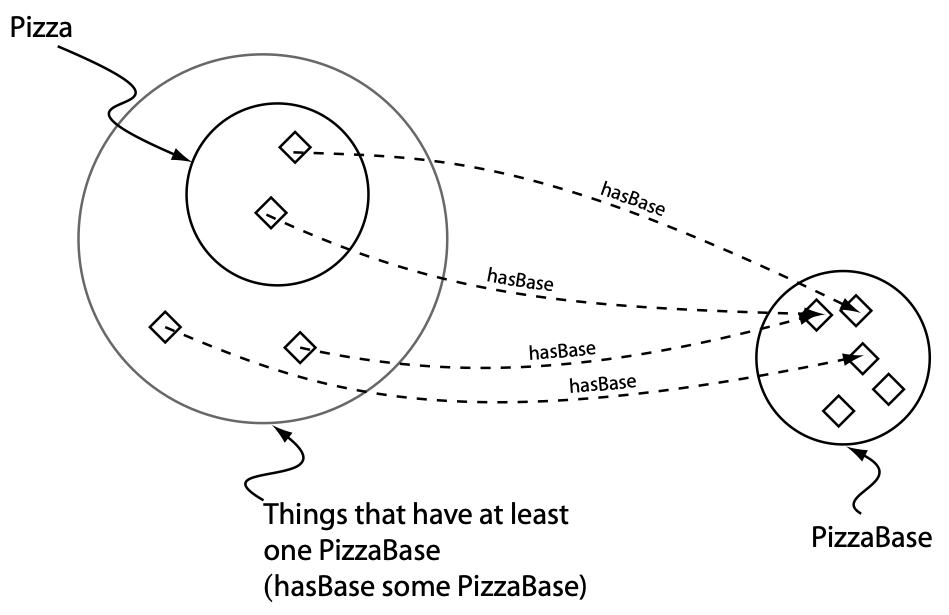
::: caption
A Schematic Description of a Pizza — In order for something to be a Pizza it is necessary for it to have a (at least one) PizzaBase — A Pizza is a subclass of the things that have at least one PizzaBase
::::
:::::

::: footnotes
In OWL, everything is a member of the class `Thing`.
:::

---
## Existential Restrictions ($\exists$) – Example

::::: columns
:::: single
::: small
We can add restrictions to `MargeritaPizza` to say that a `MargheritaPizza` is a `NamedPizza` that has at least one kind of `MozzarellaTopping` and at least one kind of `TomatoTopping`.

More formally (reading the class description view line by line), if something is a member of the class `MargheritaPizza` ...
- it is *necessary* for it to be a member of the class `NamedPizza` 
- and it is *necessary* for it to be a member of the anonymous class of things that are linked to at least one member of the class `MozzarellaTopping` via the property `hasTopping`, 
- and it is *necessary* for it to be a member of the anonymous class of things that are linked to at least one member of the class `TomatoTopping` via the property `hasTopping`.
:::
::::
:::: single center
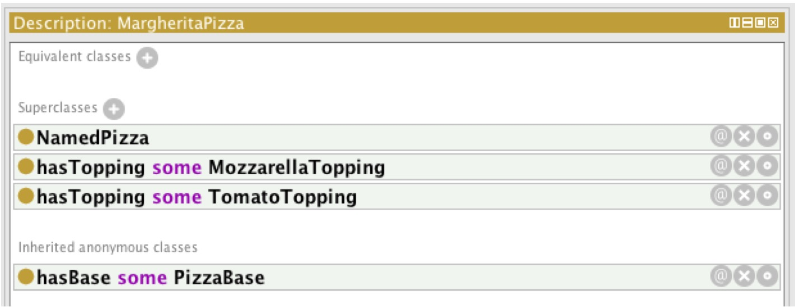
::: caption
The Class Description View Showing A Description Of a `MargheritaPizza`
::::
:::::

---
## Universal Restrictions ($\forall$) 

With existential restrictions, we could not say, that **all** relationships of individuals must be to members of a specific class. 

==Universal restrictions== (represented by the symbol ==$\forall$==) describe the set of individuals that, for a _given property_, **only have relationships** to other individuals that are members of a _specific class_. 
- Universal restrictions constrain the relationships along a given property to individuals that are members of a specific class. 
  - **Example**: The universal restriction $\forall$ `hasTopping MozzarellaTopping` describes the individuals all of whose `hasTopping` relationships are to members of the class `MozzarellaTopping` — the individuals do not have a `hasTopping` relationships to individuals that aren’t members of the class `MozzarellaTopping`.
- Universal restrictions are also known as `allValuesFrom` restrictions, or `only` restrictions since they *constrain* ==the filler== for a given property to a *specific class*. 

<!-- In the previous example, we used the existential restriction `hasTopping some MozzarellaTopping` to describe the individuals that have _at least one_ relationship along the property `hasTopping` to an individual that is a member of the class `MozzarellaTopping`.  

::: red
$\Rightarrow$ This restriction does not imply that all of the `hasTopping` relationships must be to a member of the class `MozzarellaTopping`. 
:::
-->
<!-- To restrict the relationships for a given property to individuals that are members of a specific class we must use a universal restriction. -->

:::: redbox spacebefore
:fa-warning: **Warning**
A feature of universal restrictions is, that for the given property, the set of individuals that the restriction describes will also contain the individuals that do not have any relationship along this property to any other individuals. 
::::

---
## Universal Restrictions ($\forall$) 

:::: redbox space
**Remember** :fa-circle-exclamation:

An important point to note is that universal restrictions do not ‘guarentee’ the **existence** of a relationship for a given property. 
$\leadsto$ They merely state that if such a relationship for the given property exists, then it must be with an individual that is a member of a specified class.
::::

**Example**
- The restriction, $\forall$ `hasTopping TomatoTopping` describes the anonymous class of individuals that **only** have `hasTopping` relationships to individuals that are members of the class `TomatoTopping`, **OR**, individuals that definitely do not participate in any `hasTopping` relationships at all.

---
## Universal Restrictions ($\forall$) – Pitfalls and Example

::::: columns
:::: single small
A common mistake is to use an intersection instead of a union.{.red}
- For example, `CheeseTopping` ⊓ `VegetableTopping`. 
  - This reads, `CheeseTopping` *and* `VegetableTopping`. Although "CheeseTopping and Vegetable" might be a natural thing to say in English, this logically means something that is _simultaneously_ a kind of `CheeseTopping` *AND* `VegetableTopping`. 
  - If the classes `CheeseTopping` and `VegetableTopping` were *not disjoint*, this would have been a logically legitimate thing to say – it would not be inconsistent and therefore would not be ‘spotted’ by a reasoner.

- In the example it might have been tempting to create _two universal restrictions_ — one for `CheeseTopping` (`∀ hasTopping CheeseTopping`) and one for `VegetableTopping` (`∀ hasTopping VegetableTopping`). However, when *multiple restrictions* are used (for any type of restriction) the *total description* is taken to be the **intersection** of the *individual restrictions*. This would have therefore been equivalent to one restriction with a filler that is the intersection of `MozzarellaTopping` and `TomatoTopping` — as explained above this would have been logically incorrect.
::::
:::: single small
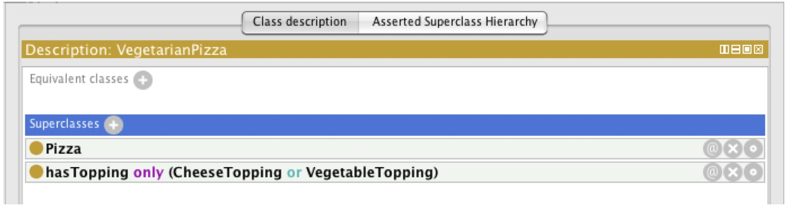

- This means that if something is a member of the class `VegetarianPizza` it is *necessary* for it to be a kind of `Pizza` **and** it is *necessary* for it to **only** (∀ universal quantifier) have toppings that are kinds of `CheeseTopping` **or** kinds of `VegetableTopping`.
- In other words, all `hasTopping` relationships that individuals which are members of the class `VegetarianPizza` participate in must be to individuals that are either members of the class `CheeseTopping` or `VegetableTopping`.
- The class `VegetarianPizza` also contains individuals that are `Pizza`s and do not participate in any `hasTopping` relationships.
::::
:::::

---
## Universal Restrictions ($\forall$) – Pitfalls and Example

::::: columns
:::: single 
::: small
<!-- **Common mistakes**  -->
1. **Use an intersection instead of a union**
   - For example, `CheeseTopping` ⊓ `VegetableTopping`. 
     - This reads, `CheeseTopping` *and* `VegetableTopping`. Although "CheeseTopping and Vegetable" might be a natural thing to say in English, this logically means something that is _simultaneously_ a kind of `CheeseTopping` *AND* `VegetableTopping`. 
     - If the classes `CheeseTopping` and `VegetableTopping` were *not disjoint*, this would have been a logically legitimate thing to say – it would not be inconsistent and therefore would not be ‘spotted’ by a reasoner.

2. [**Create two universal restrictions**]{.noskip .red}
   - one for `CheeseTopping` (`∀ hasTopping CheeseTopping`) and 
   - one for `VegetableTopping` (`∀ hasTopping VegetableTopping`). 
     - When *multiple restrictions* are used (for any type of restriction) the *total description* is taken to be the **intersection** of the *individual restrictions*. This would have therefore been equivalent to one restriction with a filler that is the intersection of `MozzarellaTopping` and `TomatoTopping` — as explained above this would have been logically incorrect.
:::
::::
:::: single small

- This means that if something is a member of the class `VegetarianPizza` it is *necessary* for it to be a kind of `Pizza` **and** it is *necessary* for it to **only** (∀ universal quantifier) have toppings that are kinds of `CheeseTopping` **or** kinds of `VegetableTopping`.
- In other words, all `hasTopping` relationships that individuals which are members of the class `VegetarianPizza` participate in must be to individuals that are either members of the class `CheeseTopping` or `VegetableTopping`.
- The class `VegetarianPizza` also contains individuals that are `Pizza`s and do not participate in any `hasTopping` relationships.
::::
:::::

---
## Cardinality Restrictions

Cardinality restrictions are used to talk about the *number of relationships* that an individual may participate in for a given property.

::::: columns 
:::: single small bluebox
**Minimum Cardinality Restrictions (≥)**
- Specify the _minimum_ number of relationships that an individual must participate in for a given property.
- For example `≥ hasTopping 3` describes the individuals that participate in **at least** three `hasTopping` relationships. 
- Minimum cardinality restrictions place _no maximum limit_ on the number of relationships that an individual can participate in for a given property.
::::
:::: single small bluebox
**Maximum Cardinality Restrictions (≤)**
- Specify the _maximum_ number of relationships that an individual can participate in for a given property. 
- For example `≤ hasTopping 2` describes the class of individuals that participate in **at most** two `hasTopping` relationships. 
- Maximum cardinality restrictions place _no minimum limit_ on the number of relationships that an individual must participate in for a specific property.
::::
:::: single small bluebox
**Cardinality Restrictions (=)**
- Specify the _exact_ number of relationships that an individual must participate in for a given property. 
- For example `= hasTopping 5` describes the set of individuals that participate in **exactly** five `hasTopping` relationships. 
- Cardinality restriction is a _syntactic short hand_ for using a _combination_ of a minimum cardinality restriction and a maximum cardinality restriction. 
::::
:::::

::: footnotes
For example the above cardinality restriction could be represented by using the intersection of the two restrictions: `≤ hasTopping 5`, and, `≥ hasTopping 5`.
:::

---
## hasValue-Restriction

::: redbox spaceafter
A ==hasValue restriction== (∋) describes an anonymous class of individuals that are related to another **specific individual** along a **specified property**. 
:::

**Example**
`hasCountryOfOrigin ∋ Italy` $+$ `MozarellaTopping` is from Italy $\rightarrow$ `MozarellaTopping` $\sqsubseteq$ `hasCountryOfOrigin value Italy`

- Contrast this with a quantifier restriction where the individuals that are described by the quantifier restriction are related to **any indvidual from a specified class** along a specified property. 

:::: bluebox small spacebefore
**Semantic equivalence via enumerated classes**
hasValue restrictions are semantically equivalent to an existential restriction along the same property as the hasValue restriction, which has a _filler_ that is an _enumerated class_ that contains the individual (and only the individual) used in the hasValue restriction.
::::

---
## hasValue-Restriction

::::: columns-center
:::: single
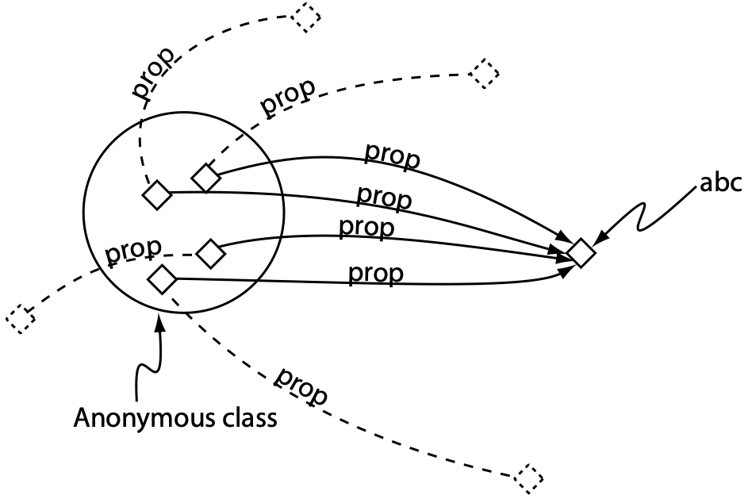
::::
:::: single
- The figure shows a schematic view of the hasValue restriction `prop ∋ abc`. 
- This restriction describes the anonymous class of individuals that have at least one relationship along the `prop` property to the specific individual `abc`.
- The dashed lines indicate that this type of restriction does not constrain the property used in the hasValue restriction solely to the individual used in the hasValue restriction.
::::
:::::

---
## How to formulate class descriptions using restrictions

Restrictions in class descriptions can be formulated in two different ways:
- As ==necessary conditions==
  - If something is a member of this class then it is necessary to fulfil these conditions 
  - With necessary conditions alone, we cannot say – "If something fulfils these conditions then it must be a member of this class"
  - A class that only has necessary conditions is known as a **Primitive Class**.
- As ==sufficient AND necessary conditions==
  - Not only are the conditions necessary for membership of the class, they are also sufficient to determine that any (random) individual that satisfies them must be a member of the class 
  - Necessary conditions are simply called **Superclasses** in Protégé. Necessary and sufficient condition are called **Equivalent classes**.
  - A class that has at least one set of necessary and sufficient conditions is known as a **Defined Class**.

---
## Necessary and Sufficient Conditions
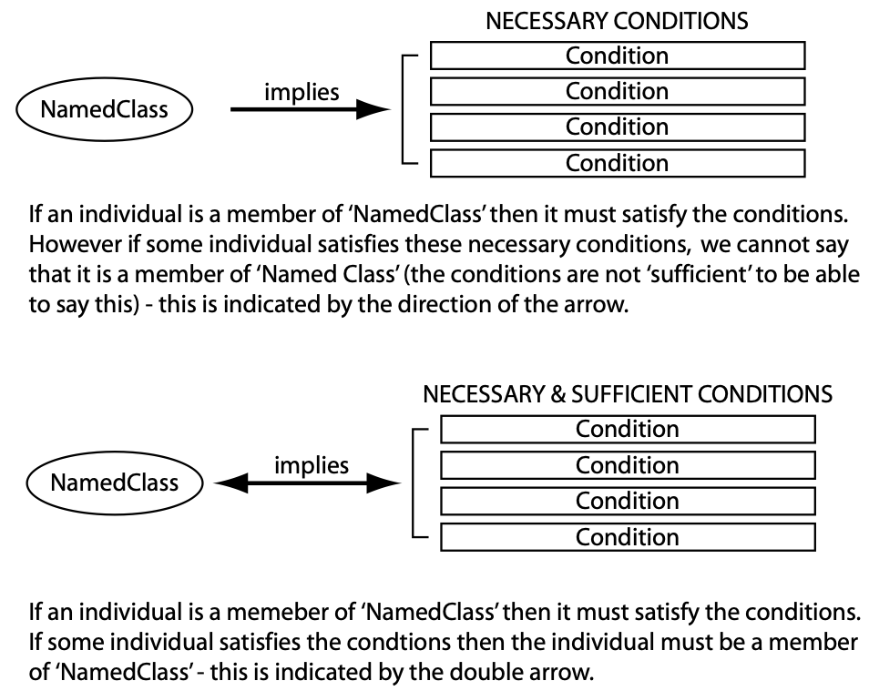

:::: graybox small
**To summarize**:
- If class `A` is described using _necessary conditions_, then we can say that if an individual is a member of class `A` it must satisfy the conditions. 
- We cannot say that any (random) individual satisfying these conditions must be member of class `A`. 
- However, if class `A` is now defined using _necessary AND sufficient conditions_, we can now say that if any (random) individual satisfies these conditions then it must be a member of class `A`. 
- The conditions are not only necessary for membership of `A` but also sufficient to determine that something satisfying these conditions is a member of `A`.
::::

---
## How are necessary and sufficient conditions useful in practice ?

::::: columns-bottom
:::: single
Suppose 
- we have another class `B`, 
- we know that any individuals being members of class `B` also satisfy the conditions that define class `A`. 

We can determine that 
- class `B` is ==subsumed by== class `A` 
- $\Rightarrow$ `B` is a **subclass** of `A`. 

::: bluebox center spacebefore
Checking for ==class subsumption== is a _key task_ of a description logic reasoner for automatically computing _classification hierarchies_.
:::
::::
:::: single center
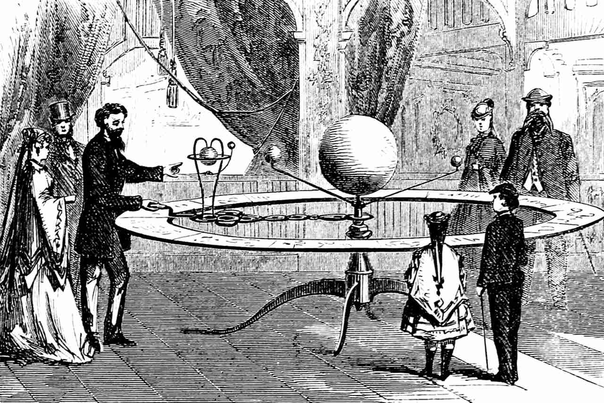
::::
:::::

---
## Overview of class types in OWL

- Primitive Classes – are classes with only necessary conditions
- Defined Classes – classes with at least one set of necessary and sufficient conditions

---
## Computing automated classifications using the reasoner 
:::: bluebox 
**Important**: 
- It is important to understand that a reasoner can only automatically classify classes under defined classes - i.e. classes with at least one set of necessary and sufficient conditions.
- Without a reasoner it is very difficult to keep large ontologies in a maintainable and logically correct state.
- The use of a reasoner to compute subclass-superclass relationships between classes becomes almost vital.
- In cases where ontologies can have classes that have many superclasses (multiple inheritance) it is almost always a good idea to construct the class hierarchy as a simple tree. 
- Classes in the asserted hierarchy (manually constructed hierarchy) therefore have no more than one superclass. 
- Computing and maintaining multiple inheritance is the job of the reasoner. 
- This helps to keep the ontology in a maintainable and modular state. 
- Not only does this promote the reuse of the ontology by other ontologies and applications, it also minimises human errors that are inherent in maintaining a multiple inheritance hierarchy.
::::

::: footnotes
See illustrations on page 58 of the OWL pizza tutorial about asserted and inferred hierarchy
:::

---
## Automated classification and open world reasoning

**Motivation** :fa-dumbbell:
- `MargheritaPizza` and `SohoPizza` should by classified by the reasoner as `VegetarianPizza` based on their `hasTopping` relationsships to vegetarian individuals, e.g., being members of the classes `CheeseTopping` or `VegetableTopping` and their subclasses.

**Observation** :fa-binoculars: 
- Despite creating a definition for `VegetarianPizza` using necessary and sufficient conditions, `MargheritaPizza` and `SohoPizza` were not classified as subclasses of it. 

**Problem** :fa-cloud-bolt:
- Reasoning in OWL is based on what is known as the ==open world assumption (OWA)== or as ==open world reasoning (OWR)==. 
- The open world assumption means that we cannot assume something doesn’t exist until it is explicitly stated that it does not exist. 
- Because something hasn’t been stated to be true, it cannot be assumed to be false — it is assumed that ‘the knowledge just hasn’t been added to the knowledge base’.

---
## What does it mean for our vegetarian pizzas...?

::::: columns-center
:::: single
- In the case of our pizzas, we have stated that `MargheritaPizza` has toppings that are kinds of `MozzarellaTopping` and also kinds of `TomatoTopping`. 

- Because of the open world assumption, until we explicitly say that a `MargheritaPizza` only has these kinds of toppings, it is assumed (by the reasoner) that a `MargheritaPizza` could have other toppings. 

- To specify explicitly that a `MargheritaPizza` has toppings that are kinds of `MozzarellaTopping` or kinds of `TomatoTopping` and only kinds of `MozzarellaTopping` or `TomatoTopping`, we must add what is known as a ==closure axiom== on the `hasTopping` property.
::::
:::: single center

::::
:::::

---
## Closure Axiom

A closure axiom on a property consists of a ==universal restriction== along the property to say that _it can only be filled by the specified fillers_. 
The restriction has a _filler_ that is the _union of the fillers_ that occur in the _existential restrictions_ for the property.

::::: columns
:::: single
::: graybox small
**Explanation**

This now says that 
- if an individual is a member of the class `MargeritaPizza` 

then 
- it must be a member of the class `Pizza`, 
- and it must have at least one topping that is a kind of `MozzarellaTopping` 
- and it must have at least one topping that is a member of the class `TomatoTopping` 
- and the toppings must only be kinds of `MozzarellaTopping` or `TomatoTopping`.
:::
::::
:::: double
::: center
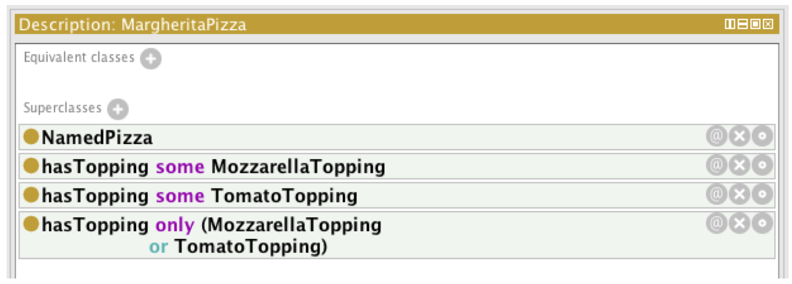
:::
::: redbox small
A common error in situations such as above is to **only** use **universal restrictions** in descriptions. For example, describing a `MargheritaPizza` by making it a subclass of `Pizza` and then only using `∀ hasTopping (MozzarellaTopping ⊔ TomatoTopping)` without any existential restrictions. However, because of the semantics of the universal restriction, this actually means either: things that are `Pizza`s and only have toppings that are `MozzarellaTopping` or `TomatoTopping`, OR, things that are `Pizza`s and do not have any toppings at all.
:::
::::
:::::

---
## What a Reasoner can do with ontological semantics

Ontologies described by OWL can be processed by a reasoner
- A reasoner can test whether a class is a subclass of another class
- A reasoner can compute the inferred ontology hierarchy
- A reasoner can perform consistency checking
  - i.e., based on the descriptions (conditions) of a class, a reasoner can check whether or not it is possible for a class to have any instances
  - An inconsistent class can not have any instances 

---
## Excursus: How to make URIs function as an unambiguous entity name

::::: graybox smaller
**Q**: Given the URI: https://example.com/people/albert_einstein, what are the implementation mechanics for ensuring that it functions as an unambiguous entity name?

To ensure that a URI, like https://example.com/people/albert_einstein, functions as an unambiguous entity name, you need to follow these implementation mechanics:

- **Unique identifier**: Make sure the URI is unique and doesn’t refer to multiple entities. This prevents confusion and ensures that the URI unambiguously identifies a single entity. In this example, "albert_einstein" should only refer to one person, and not be reused for different entities.
  
- **Persistent and stable**: Ensure that the URI remains stable and persistent over time. Avoid changing the URI structure or removing the resource, as this may lead to broken links and loss of information. Use a domain and hosting service that you can maintain for a long period.

- **Content negotiation**: Implement content negotiation on the server hosting the resource. This allows the server to return different representations of the resource based on the client’s preferences (e.g., RDF, JSON-LD, or HTML). This way, both humans and machines can access the information associated with the URI.

- **Structured data**: Provide a machine-readable description of the entity using a structured data format like RDF, JSON-LD, or Microdata. Include the URI as the subject, and use standardized vocabularies, like schema.org or Dublin Core, to describe the entity’s properties and relationships.

- **Linking related entities**: Within the entity’s description, link to other related entities using their URIs. This helps create a web of interconnected data that improves machine understanding and discoverability.

By following these implementation mechanics, you can ensure that the URI https://example.com/people/albert_einstein functions as an unambiguous entity name, in line with the Linked Data Principles.
:::::

::: footnotes
Source: Extracted from a post to the linked data mailinglist by Kingsley Idehen from May 5th, 2023.
:::