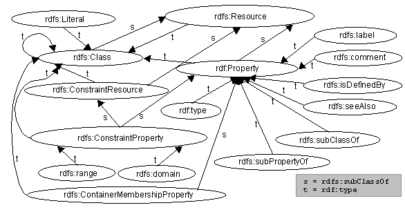

<style>
/**
 * @theme enable-all-auto-scaling
 * @auto-scaling true
 */

/* @import 'default'; */
/* @import url('user-theme2.css'); */
</style>


<!-- marp --engine ./engine.js --watch --theme-set custom-theme-roboto.css -- --allow-local-files rdfs.md -->
<!-- marp --pdf --allow-local-files --engine ./engine.js --theme-set custom-theme-roboto.css -- rdfs.md -->


# Foundations of Semantic Knowledge Graphs

#### Prof. Dr. Stefan Linus Zander 

Modelling Data with RDF Schema {.lightgreen .Big .skip}


---
<!-- header: Overview -->
<!-- footer: Foundations of Semantic Knowledge Graphs | A Formal Introduction to Graphs | Prof. Dr. Stefan Zander | Hochschule Darmstadt – University of Applied Sciences -->


# Outline

- Introduction to RDF Schema
- Modelling with RDF/S
  - Classes and Instances
  - Defining Classes
  - Classes and Subclasses
  - Subclass Semantics
  - Class Hierarchies
  - Properties
  - Property Hierarchies
  - Restrictions on Properties
- RDF/S Language Features
  - Predefined Classes and Properties
  - How to describe Schema Information in RDF/S
- A holistic RDF Schema Example 


---
<!-- header: Review -->
## Review: RDF Graphs

The **W3C Resource Description Framework** considers three types of ==RDF terms==: 
- *IRIs*, representing a resource using a global identifier
- *Blank nodes*, representing an unspecified resource without giving any identifier 
- *Literals* that represent values of some datatype
  - either typed literals, such as `"2020-11-10"^^<http://www.w3.org/2001/XMLSchema#date>`
  - or language-tagged strings, such as `"Knowledge Graphs"@en`

==RDF graphs== are sets of _triples_ consisting of
- a *subject*, which can be an IRI or bnode,
- a *predicate*, which can be an IRI,
- an *object*, which might be an IRI, bnode, or literal
$\leadsto$ naturally viewed as hypergraphs with ternary edges


---
<!-- header: Motivation -->

## Motivation

- RDF allows for making arbitrary assertions about individual resources and their relationships on the Web
- Preferable:
  - To make assertions about __generic sets__ of __individuals__ (ie. ==classes==)  
  [e.g. the class of all authors, organizations, books etc.]{.kursiv}
  - To explicitly specify the **logical relations** between _individuals_, _classes_, and their _relationships_ to accurately describe the universe of discourse
  [e.g. publisher are organizations / authors are persons / etc.]{.kursiv}
- **RDFS** allows for the **explicit specification** of **schematic** and **terminological knowledge** (also _factual knowledge_) about resources

::: footnotes
Picture Source: https://www.nhbs.com/how-zoologists-organize-things-book
:::


---
<!-- header: RDF Schema -->
## RDF Schema

::::: columns
:::: double
- **RDFS** simply defines a *data model* and a *vocabulary* for the creation of RDF statements
- Official name: "==RDF Vocabulary Description Language==" 
- RDF Schema provides a _data-modelling vocabulary_ for RDF data

**RDF Schema allows**
- Definition of **classes**
- Definition of **properties** and **restrictions**
- Definition of *hierarchies*
  - **Subclasses** and **superclasses**
  - **Subproperties** and **superproperties**
::::
:::: triple
::: center

:::
::::
:::::


---
## RDF Schema (2/2)

::::: columns
:::: double
- Part of the W3C RDF Recommendation (https://www.w3.org/TR/rdf-schema/)
- Namespace: `http://www.w3.org/2000/01/rdf-schema#`
- RDFS is a specific RDF vocabulary 
  $\leadsto$ ie., every RDFS document is also a valid RDF document
- RDFS is also **meta vocabulary** $\leadsto$ allows for the specification of the **semantics** of arbitrary **RDF vocabularies** (or parts of it)
- Every software with RDFS capabilities is able to comprehend the incorporated RDFS semantics correctly
- RDFS allows for defining **lightweight ontologies**

::::
:::: single

::::
:::::


---
<!-- header: Modelling with RDF/S -->
# Modelling with RDF/S


---
## Modelling with RDF/S: Classes and Instances

- Resources can be marked as **instances** of a class using the `rdf:type` property
  
  ```xml
  ex:semanticWeb      rdf:type      ex:Lehrbuch .
  ```

  :fas-comment-dots: [assigns the object’s URI to the subject as its (new) type, i.e., the resource `ex:semanticWeb` is a (new) instance of the class `ex:Lehrbuch`]{.kursiv .small}

- Class association or class assignment is _not exclusive_, i.e., a resource can be _instance of many classes_:
  
  ```json
  ex:semanticWeb      rdf:type       ex:Lecture .
  ```

- **Problem** :far-face-frown: 
  Syntactically **no inherent differentiation** between **designators** for classes and individuals 
  $\leadsto$ _i.e., there is no syntactic way in RDFS to distinguish URIs representing individuals from URIs representing class names_

- **Solution** :far-face-grin-stars:
  Explicit designation of an URI/IRI as belonging to the ==class of all classes== using `rdfs:Class`


---
## Modelling with RDF/S: Defining Classes

- Preferable: ==unique designation of an URI as class==
  
- Designating (typifying) an URI as a class with `rdfs:Class` 
  ```atom
  ex:Lehrbuch           rdf:type        rdfs:Class .
  ex:semanticWeb        rdf:type        ex:Lehrbuch .
  ```

- `rdfs:Class` is the _class of all classes_ and hence also contains _itself_ $\leadsto$ i.e., the following statement is valid:
  ```html
  rdfs:Class            rdf:type        rdfs:Class .
  ```

::: bluebox centerbox
**Notational conventions** for _classes_, _properties_, and _individuals_:
- URIs representing _classes_ are ==Capitalized==
- _Instance names_ and _properties_ are written in ==lower case==
:::


---
## Modelling with RDF/S: Classes and Subclasses

**Problem** :far-face-frown:
- Search for `ex:Book` only returns such publications that are of this type $\leadsto$ i.e., no instances of class `ex:Textbook` are retrieved

- Asserting `ex:semanticWeb rdf:type ex:Book` allows only for adding one specific resource
  ```rdf
  ex:Textbook         rdf:type        rdfs:Class .
  ex:semanticWeb      rdf:type        ex:Textbook .
  ```

- This _explicit inclusion_ of all instances of a class is cumbersome and leads to large RDF documents


**Solution** :far-face-grin-stars:
- Asserting that every `ex:Textbook` is also an `ex:Book` $\leadsto$ i.e., every instance of `ex:Textbook` is also an instance of `ex:Book`
  ```rdf
  ex:Textbook       rdfs:subClassOf       ex:Book .
  ```


---
## Modelling with RDF/S: Subclass Semantics

- `rdfs:subClassOf` is **reflexive** $\leadsto$ i.e., _every class is subclass of its own_
  ```turtle
  ex:Lehrbuch         rdfs:subClassOf       ex:Lehrbuch
  ``` 
  is a valid statement

- **Equality** of two classes can be expressed via ==mutual subclass relationships==
  ```rdf
  ex:Hospital         rdfs:subClassOf       ex:Krankenhaus .
  ex:Krankenhaus      rdfs:subClassOf       ex:Hospital .
  ```
  Every instance of `ex:Hospital` is also an instance of `ex:Krankenhaus` and vice versa


---
## Modelling with RDF/S: Class Hierarchies

- `rdfs:subClassOf` allows for defining complex **class hierarchies** (so-called ==Taxonomies==)
  ```xml
  ex:Textbook   rdfs:subClassOf     ex:Book .
  ex:Book       rdfs:subClassOf     ex:Printmedium .
  ex:Journal    rdfs:subClassOf     ex:Printmedium .
  ```


- `rdfs:subClassOf` is ==transitive==, $\leadsto$ i.e., it allows for the _propagation of subclass relationships_

  From the assertions above, the following statement can be deduced:

  ```xml
  ex:Textbook   rdfs:subClassOf     ex:Printmedium .
  ```

- Relation to **set theory**
  `rdf:type` refers to $\in$
  `rdfs:subClassOf` refers to $\subseteq$


---
## Modelling with RDF/S: Properties

- **Properties** in RDF(S) are treated as ==first-class citizens==
- Properties characterize the _relationship between two resources_
- Properties are _defined independently_ from concrete or specific classes (as opposed to OOP)
- **Syntactical rule**: properties start with a ==lower-case letter==, e.g., `rdf:type`, `ex:authorOf`, `rdfs:subClassOf` etc.


---
## Modelling with RDF/S: Property Hierarchies

- Properties may be **structured hierarchically** (cf. classes) 
- `rdfs:subPropertyOf` is an instance of `rdf:Property` and states that all resources related by one property are also related by another 
- `rdfs:subPropertyOf` is ==transitive==

  ```rdf
  ex:happilyMarriedTo       rdf:subPropertyOf         rdf:marriedTo . 
  ex:markus                 ex:happilyMarriedTo       ex:anja .
  ```

  A reasoner can deduce the following 

  ```rdf
  ex:markus                 ex:marriedTo                ex:anja .
  ```


---
## Modelling with RDF/S: Restrictions on Properties

==Restrictions== allow us to state that a _certain property can only be between things of a certain type_
- [E.g., when individual A is married to individual B, then both A and B are instances of class Person]{.kursiv}
- `rdfs:domain`
  - Any resource that has a given property is an instance of one or more classes
- `rdfs:range`
  - Values of a property are instances of one or more classes.
- `P rdfs:domain C`
  - States that `P` is an instance of the class `rdf:Property`, that `C` is a instance of the class `rdfs:Class` and that the resources denoted by the **subjects** of triples whose predicate is `P` are instances of the class `C`.
- `P rdfs:range C`
  - States that `P` is an instance of the class `rdf:Property`, that `C` is an instance of the class `rdfs:Class` and that the resources denoted by the **objects** of triples whose predicate is `P` are instances of the class `C`.


---
## Modelling with RDF/S: Example about Property Restrictions 

**Example**: All individuals that are married are persons 

```
ex:isMarriedTo      rdfs:domain           ex:Person .
ex:isMarriedTo      rdfs:range            ex:Person .
```

By stating that...
```
ex:Tom              ex:isMarriedTo        ex:Jane .
```

...we can infer the following:
```
ex:Tom              rdf:type              ex:Person . 
ex:Jane             rdf:type              ex:Person .
```

**Property restrictions** also apply for **data types**:
```
ex:hasAge           rdfs:range            xsd:nonNegativeInteger .
```


---
## Modelling with RDF/S: Property Restrictions Pitfalls :fa-person-falling-burst:

- **Example 1**:
  ```
  ex:authorOf           rdfs:range          ex:Textbook .
  ex:authorOf           rdfs:range          ex:Storybook .
  ```
  State that everything in the `rdfs:range` of `ex:author` is both a `ex:Textbook` and a `ex:Storybook`

- **Example 2**: 
  ```
  ex:isMarriedTo        rdfs:domain         ex:Person .
  ex:isMarriedTo        rdfs:range          ex:Person .
  ex:instituteAIFB      rdf:type            ex:Institution .
  
  ex:pascal             ex:isMarriedTo      ex:instituteAIFB .
  ```

  A logical consequence of this is: :fas-cloud-bolt:
  ```
  ex:instituteAIFB      rdf:type            ex:Person .
  ```


---
<!-- header: RDF/S Language Features -->
# RDF/S Language Features


---
## RDFS Language Features

Everything in the RDF model is a resource

```rdf
rdfs:Class            rdf:type        rdfs:Resource .
rdf:Property          rdf:type        rdfs:Resource .
rdfs:Literal          rdf:type        rdfs:Resource .
rdfs:XMLLiteral       rdf:type        rdfs:Resource .
rdfs:Datatype         rdf:type        rdfs:Resource .
```


---
## Predefined Classes by RDF/S

- `rdfs:Class`
  - defines an abstract object and is applied (with rdf:type) to create instances 
- `rdfs:Resource`
  - Class of all resources (every entity of an RDF model is instance of this class)
- `rdf:Property`
  - Class of all relationships between resources 
- `rdfs:Literal` / `rdf:XMLLiteral`
  - Class for literals / Class of all values pertaining to the predefined data type `XMLLiteral`
- `rdfs:Datatype`
  - Class of all data types, i.e., just as `rdfs:Class`, it is a class for classes 
- Other classes
  - `rdf:List`, `rdf:Seq`, `rdf:Bag`, `rdf:Alt`, `rdfs:Container`, `rdfs:ContainerMembershipProperty`, `rdf:Statement`

::: footnotes
A good summary of all RDF/S language elements is given in the W3C RDFS specification document: <https://www.w3.org/TR/rdf-schema/#ch_summary>
:::


---
## Properties defined by RDF/S

- `rdfs:subClassOf`
  - transitive property to define inheritance hierarchies for classes
- `rdfs:subPropertyOf`
  - transitive property to define inheritance hierarchies for properties
- `rdfs:domain`
  - defines the domain of a property concerning a class
- `rdfs:range`
  - defines range of a property concerning a class
- `rdfs:seeAlso`
  - defines a relation of a resource to another, which explains it
- `rdfs:isDefinedBy`
  - subproperty of `rdf:seeAlso`, defines the relation of a resource to its definition
- `rdfs:comment`
  - comment, usually in the form of a text
- `rdfs:label`
  - Human-readable name of a resource; contrary to ID


---
## How to describe Schema Information in RDF/S

- Triples about properties can also be used to specify _how properties should be used_.
- **Example**: RDF provides several properties for describing properties:
  ```xml
  <PropertyIRI>   rdf:type      rdfs:Property .                         # declare resource as property
  <PropertyIRI>   rdfs:label    "some label"@en .                       # assign label
  <PropertyIRI>   rdfs:comment  "Some human-readable comment"@en . 
  <PropertyIRI>   rdfs:range    xsd:decimal .                           # define range datatype
  <PropertyIRI>   rdfs:domain   <classIRI> .                            # define domain type (class)
  ```
- There are _many properties beyond those from the RDF standard_ for such purposes, 
  $\leadsto$ e.g., `rdfs:label` can be replaced by `<http://schema.org/name>` or `<http://www.w3.org/2004/02/skos/core#prefLabel>`
- RDF defines how its properties should be interpreted semantically ($\leadsto$ see OWL lectures)
- There are more elaborate ways of expressions schematic information in RDF
  - The **OWL Web Ontology Language** extends the semantic features of RDF 
  - Constraint languages **SHACL** and **SHEX** can restrict graphs syntactically


---
## A Simplified RDF Schema Language Model

::: center

:::

---
<!-- header: "" -->
# RDF Schema Example

---
## RDF Schema Example

```
@prefix rdfs: <http://www.w3.org/2000/01/rdf-schema#> .               @prefix owl:  <http://www.w3.org/2002/07/owl#>
@prefix rdf:  <http://www.w3.org/1999/02/22-rdf-syntax-ns#> .         @prefix :     <http://example.org/Climate#> .
```

```
:Greenhouse_gas     rdf:type              rdfs:Class ;                       // Class Definitions
                    rdfs:subClassOf       :Air_pollutant .  
:Person             rdf:type              rdfs:Class .
:Scientist          rdfs:subClassOf       :Person . 
:Physicist          rdfs:subClassOf       :Scientist .
:Chemist            rdfs:subClassOf       :Scientist .
```

```
:discoverer         rdf:type              rdf:Property ;                    // Property Definitions
                    rdfs:domain           owl:Thing ;
                    rdfs:range            :Person .
```

```
:Carbon_dioxide             rdf:type        :Greenhouse_gas ;               // Instance Definitions
                            :discoverer     :Jan_Baptist_van_Helmont ;
                            :discoverer     :Joseph_Black .
:Jan_Baptist_van_Helmont    rdf:type        :Physicist .
:Joseph_Black               rdf:type        :Chemist ;
                            rdfs:label      "Joseph Black"@en ;
                            rdfs:comment    "co-discovered CO2" .
```


---
## RDF Schema Summary by Example 

::: center

:::