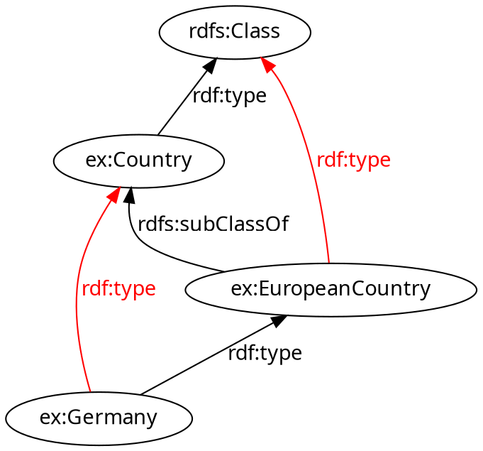
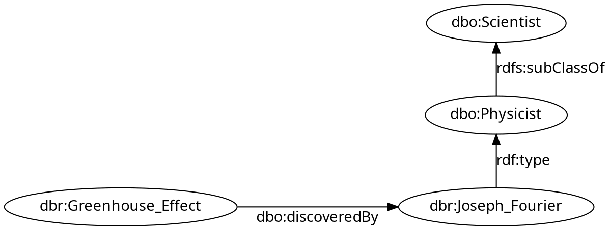
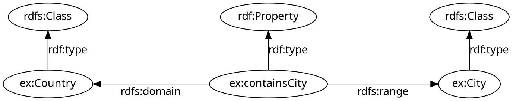
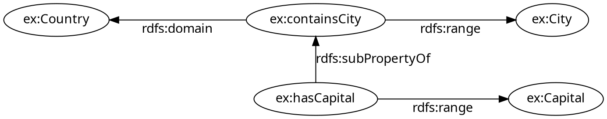

<style>
/**
 * @theme enable-all-auto-scaling
 * @auto-scaling true
 */

/* @import 'default'; */
/* @import url('user-theme2.css'); */
</style>


<!-- marp --engine ./engine.js --watch --theme-set custom-theme-roboto.css -- --allow-local-files rdfs_inferencing.md -->
<!-- marp --pdf --allow-local-files --engine ./engine.js --theme-set custom-theme-roboto.css -- rdfs_inferencing.md -->


# Foundations of Semantic Knowledge Graphs

#### Prof. Dr. Stefan Linus Zander 

Logical Inferencing using RDF Schema {.lightgreen .Big .skip}


---
<!-- header: Overview -->
<!-- footer: Foundations of Semantic Knowledge Graphs | A Formal Introduction to Graphs | Prof. Dr. Stefan Zander | Hochschule Darmstadt – University of Applied Sciences -->

# Outline

- ...


---
## Knowledge Representation Formulas: What we can express using formal semantics

::: twocolumns
Conditions on class membership
- all mammals are warm-blooded
- if you don't eat meat, you are a vegetarian

Relation between classes
- all cities are populated cities
- every class is equivalent to itself

Assertions on class membership
- Darmstadt is a city

Characteristics on properties
- hasCapital only relates to countries or cities
- partOf is a transitive property

Assertions on property relations
- hasCapital(Berlin, Germany)

Assertions on equality
- morning star = evening star = venus
:::


---
## Basic Inferencing: Class membership and hierarchy entailments

::::: columns
:::: double
- Specify that something (denoted by an IRI/URI) is a **class** (or a property)
  ```
  ex:Country          rdf:type            rdfs:Class .
  ```

- Specify that something is a **member** of a **class**
  ```
  ex:Germany          rdf:type            ex:EuropeanCountry .
  ```
- Specify that something is a **subclass** of another class
  ```
  ex:EuropeanCountry  rdfs:subClassOf     ex:Country .
  ```
::::
:::: single center

::::
:::::


---
## Basic Inferencing: Another Example

::: center space

:::

Deduction of new facts from class hierarchy
::: redbox centerbox noborder padding025em
$$
\forall i, c_1, c_2: T(i, \text{rdf:type}, c_1) \wedge T(c_1, \text{rdfs:subClassOf}, c_2) \rightarrow T(i, \text{rdf:type}, c2)
$$
:::

::: center kursiv small 
$\Rightarrow$ "The greenhouse effect was discovered by a scientist."
:::


---
## Basic Inferencing: Domain and range restrictions

::: center space spacebefore

:::

- Specify that some property **always** relates members of **specific classes**.
  ```
  ex:Germany      ex:containsCity     ex:Berlin .     <!-- from this statement -->
  ------------------------------------------------  
  ex:Germany      rdf:type            ex:Country .    <!-- inferred statements -->
  ex:Berlin       rdf:type            ex:City .                   ... 
  ```
- This entailment rule also propagates down to **subproperties** (see next slide)


---
## Basic Inferencing: Propagation of domain and range restrictions

::: center space spacebefore

:::

- Domain and range restrictions also propagate along **property hierarchies**.

  ```
  ex:Germany      ex:hasCapital       ex:Berlin .     <!-- from this statement -->
  ------------------------------------------------  
  ex:Berlin       rdf:type            ex:Capital .    <!-- inferred statements -->
  ex:Berlin       rdf:type            ex:City .                   ... 
  ex:Germany      ex:containsCity     ex:Berlin .
  ex:Germany      rdf:type            ex:Country .
  ```


---
## Add Overview of Entailment rules


---
## RDF Schema: Observations and Summary

- Properties are first-class citizen
  ...not part of classes as in object oriented programming (OOP/UML)
  ...domain and range restrictions are tricky and should be avoided

- No strict distinction between **schema** and **data level**

- RDF Schema entailment rules do not include **negation**

- No notion of equality  


---
## RDF Schema: Some useful information

- Specify a human readable label for terms and resources
  ```
  ex:Country        rdfs:label          "Land"@de .
  ```

- Add comments to a resource
  ```
  ex:Darmstadt      rdfs:comment        "Darmstadt is a city located in the south of the federal state Hessen" .
  ```

- Refer to another resource (central concept of Linked Open Data)
  ```
  ex:Darmstadt      rdfs:seeAlso        dbr:Darmstadt .
  ```


---
## RDF Schema: Summary

- Without **formal semantics**, the Web of Data is **meaningless**

- Distinction between **classes**, **properties**, and **instances** (schema vs. data)

- RDF Schema employes a number of **reserved symbols** (ie language terms) for defining individual vocabularies

- **Entailment rules** are expressed using reserved symbols / are computed based on the semantics of reserved symbols

- **Inferencing** denotes the application of entailment rules to formulas to produce **new facts**

- RDF Schema is **not** very **expressive**