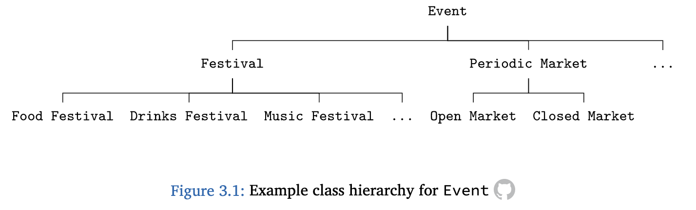
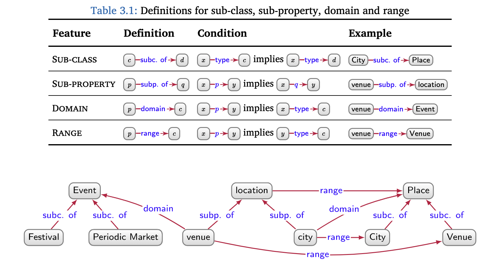

<!-- marp --engine ./engine.js --watch --theme-set custom-theme-roboto.css -- --allow-local-files schema.md -->
<!-- marp --pdf --allow-local-files --engine ./engine.js --theme-set custom-theme-roboto.css -- schema.md -->

# Foundations of Semantic Knowledge Graphs

#### Prof. Dr. Stefan Linus Zander 

Data Graph Augmentation (1/3): Schema {.lightgreen .Big .skip}

---
<!-- header: Overview -->
<!-- footer: Foundations of Semantic Knowledge Graphs | Data Graphs | Prof. Dr. Stefan Zander | Hochschule Darmstadt – University of Applied Sciences -->

## What you will learn in this Unit

...

---
## Modeling Data as Graphs allows to forgo or postpone the Definition of a Schema

Schemata can be used to prescribe a high-level structure and/or semantics that the graph follows (or should follow).

Three types of graph schemata exist
1. semantic schema
2. validating schema
3. emergent schema

---
## Semantic Schema

A semantic schema allows for defining the meaning of high-level terms (aka vocabulary or terminology) used in the graph.

It enables reasoning based on the entailments associated with the terms' semantics.

Semantic Schema allows to group nodes into ==classes==
usually using a term such as `type` 

Classes can have relations among other and organized hierarchically forming superclasses and subclasses

::::: columns
:::: single
::: center huge
**Classes**
- semantics can be added to classes to form class hierarchies
- class hierarchies usually represent type hierarchies, ie., manifestations of taxonomical classification systems for expressing generalization and specialisation relationships between members of such classes
:::
::::
:::: single
::: center Huge
**Properties**
- semantics for relations aka properties
- property hierarchies
- domain: relating the source node that participates in a relation to a certin class
- range: relating the target node of a relation to a certain class
:::
::::
:::::

---
## Overview of simple Schema Semantics

::: center

:::

---
## Semantic Schema are built on top of the Open World Assumption

Semantic schemata are typically defined for incomplete graph data, where the absence of an edge between two nodes does not mean that the relation does not hold in the real world. 

In contrast, if the ==Closed World Assumption (CWA)== were adopted – as is the case in many classical database systems – it would be assumed that the data graph is a complete description of the world, thus allowing to assert with certainty that no flight exists between the two cities.

A compromise between OWA and CWA is the ==Local Closed World Assumption (LCWA)==, where portions of the data graph are assumed to be complete.

::::: columns
:::: single
Closed-World Assumption (CWA)

There is no train connection between Freiburg and Karlsruhe

::::
:::: single
Open World Assumption (OWA)

very important concept for data integration in open, distributed and federated systems

If no train connection between Freiburg and Karlsruhe is contained in the data graph does not mean there is no one in the real world
::::
:::: single
Local Closed World Assumption (LCWA)

::::
:::::