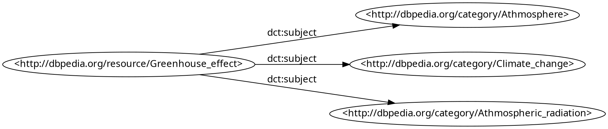
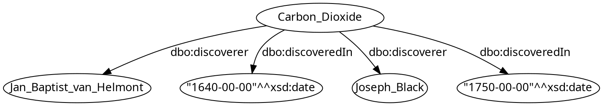
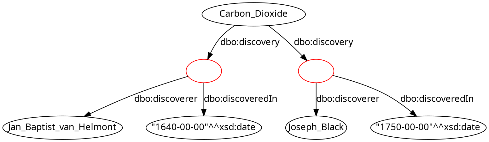
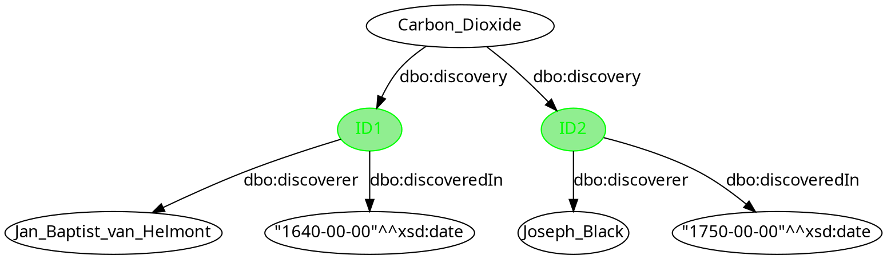

<style>
/**
 * @theme enable-all-auto-scaling
 * @auto-scaling true
 */

/* @import 'default'; */
/* @import url('user-theme2.css'); */
</style>


<!-- marp --engine ./engine.js --watch --theme-set custom-theme-roboto.css -- --allow-local-files serialisation.md -->
<!-- marp --pdf --allow-local-files --engine ./engine.js --theme-set custom-theme-roboto.css -- serialisation.md -->


# Foundations of Semantic Knowledge Graphs

#### Prof. Dr. Stefan Linus Zander 

RDF Serialisations {.lightgreen .Big .skip}


---
<!-- header: Overview -->
<!-- footer: Foundations of Semantic Knowledge Graphs | A Formal Introduction to Graphs | Prof. Dr. Stefan Zander | Hochschule Darmstadt – University of Applied Sciences -->

# Outline

- ...


---
## An RDF Graph can be serialised in a number of different formats

We mainly discussed the ==abstract syntax== of RDF.
In order to exchange RDF graphs, **concrete syntacic forms** are needed to **encode** RDF graphs.

**There are numerous syntactic formats available**:

- :fa-magnifying-glass: *N-Triples* is a simple line-based format 
- :fa-magnifying-glass: *Turtle* adds convenient abbreviations to N-Triples 
- *JSON-LD* for encoding RDF graphs in JSON
- *RDF/XML* for encoding RDF graphs in XML
- *RDFa* for embedding RDF graphs into HTML

Further historic/unofficial formats exist but are hardly relevant today.


---
## N-Triples

N-Triples is almost the simplest format conceivable:
- Each line encodes one triple:
  - IRIs are written in angle brackets, e.g., `<https://www.tu-dresden.de/>`
  - Literals are written as usual with a given type IRI, e.g., `"2019-10-22"^^<http://www.w3.org/2001/XMLSchema#date>` or with a language-tag, e.g., `"knowledge graph"@en`
  - Blank nodes are written as `_:stringId`, where `stringId` is a string that identifies the blank node within the document (it has no global meaning)
  - Parts are separated by whitespace, and lines end with .
- Unicode is supported, but various escape sequences also work
-  Comments are allowed after triples (nowhere else); they start with `#`

Full specification at https://www.w3.org/TR/n-triples/


---
## Example

::: center space

:::

```n-triples
<http://dbpedia.org/resource/Greenhouse_effect> 
    <http://dbpedia.org/ontology/discoveredIn> "1824"^^<http://www.w3.org/2001/XMLSchema#date> .

<http://dbpedia.org/resource/Greenhouse_effect> 
    <http://dbpedia.org/ontology/discoverer> <http://dbpedia.org/resource/Joseph_Fourier> .
```


---
## N-Triples Summary

**Advantages** :far-thumbs-up:
- Very simple
- Fast and easy to parse
- Processable even with basic text-processing tools, e.g., grep

**Disadvantages** :far-thumbs-down: 
- Somewhat inefficient in terms of storage space
- Not particularly human-friendly (reading and writing)


---
## Turtle (Terse RDF Triple Language) Notation

The ==Turtle== format **extends N-Triples** with several **convenient abbreviations**:
- *Prefix declarations* and *base namespaces* allow us to **shorten IRIs**
- If we terminate triples with `;` the next triple is assumed to start with the _same subject_ 
- If we terminate triples with `,` the next triple is assumed to start with the _same subject and predicate_
- **Blank nodes** can be encoded using _square brackets_; they might contain predicate-object pairs that refer to the blank node as subject
- More liberal support for **comments** (possibly on own line)
- Simpler forms for some kinds of **data values**


There are several other shortcuts and simplifications. Full specification at https://www.w3.org/TR/turtle/.


---
## Example: Using prefixes for resources and data values and a base IRI

::: center space

:::

```turtle
@prefix dbo: <http://dbpedia.org/ontology/> .
@prefix xsd: <http://www.w3.org/2001/XMLSchema#> .
@base  <http://dbpedia.org/resource/> .

<Greenhouse_effect> dbo:discoveredIn "1824"^^xsd:date .

<Greenhouse_effect> dbo:discoverer <Joseph_Fourier> .
```

- `@base` is used to declare a base IRI, so that we can use relative IRIs 
- `@prefix` is used to declare abbreviations for IRI prefixes


---
## Turtle: Use of Semicolon by example

::: center space

:::

```turtle
@prefix dbo: <http://dbpedia.org/ontology/> .
@prefix xsd: <http://www.w3.org/2001/XMLSchema#> .
@base  <http://dbpedia.org/resource/> .

<Greenhouse_effect> dbo:discoveredIn "1824"^^xsd:date ;
                  
                    dbo:discoverer <Joseph_Fourier> .
```


---
##  Turtle-Abbreviations: Use of Comma by example

::: center space

:::

```turtle
@prefix dct: <http://purl.org/dc/terms/> .
@prefix dbc: <http://dbpedia.org/category/> .
@base        <http://dbpedia.org/resource/> .

<Greenhouse_effect> dct:subject dbc:Athmosphere ,
                                dbc:Climate_change ,
                                dbc:Athmospheric_radiation .
```


---
## Turtle: How to model multi-value relations 

::: center space

:::

- Problem: Carbon dioxide was discovered / rediscovered by 2 scientists at different times.
- How to model this in RDF?
- Problem: unique association


---
## Turtle: Using Blank nodes to model multi-value relations 

::: center space

:::

- **Multi-Valued Relations**
  - Blank Nodes (Bnodes) can be introduced to represent multi-valued relationships.
  - Blank Nodes can be introduced for resources that don‘t need a name (auxiliary nodes).


---
## Turtle: Serialising anonymous blank nodes 

::: center space

:::


```turtle
@prefix dbo: <http://dbpedia.org/ontology/> .
@prefix xsd: <http://www.w3c.org/2001/XMLSchema#> . 
@base <http://dbpedia.org/resource/> .

<Carbon_Dioxide> dbo:discovery [ dbo:discoverer <Jean_Baptist_van_Helmont> ;
                                 dbo:discoveredIn "1640-00-00"^^xsd:date
                               ],
                               [ dbo:discoverer <Joseph_Black> ;
                                 dbo:discoveredIn "1750-00-00"^^xsd:date 
                               ].
```


---
## Turtle: Serialising locally identifyable blank nodes 

::: center space

:::


```turtle
@prefix dbo: <http://dbpedia.org/ontology/>. @prefix xsd: <http://www.w3c.org/2001/XMLSchema#>. @base <http://dbpedia.org/resource/>.

<Carbon_Dioxide> dbo:discovery _:ID1, _:ID2 .  //dereferenceable blank nodes can only be referenced from inside a document / graph

_:ID1 dbo:discoverer <Jan_Baptist_van_Helmont> ;
      dbo:discoveredIn "1640-00-00"^^xsd:date .

_:ID2 dbo:discoverer <John_Black> ; 
      dbo:discoveredIn "1750-00-00"^^xsd:date .
```


---
## Turtle Summary

**Advantages** :far-thumbs-up:
- Still quite simple
- Not hard to parse
- Human-readable (if formatted carefully)

**Disadvantages** :far-thumbs-down: 
- Not safely processable with grep and similar tools


---
## Other Syntacic Formats

There are various further syntactic forms:

- ==RDF/XML== 
  - An XML-based encoding; historically important in RDF 1.0; 
  - hard-to-parse but unable to encode all RDF graphs; 
  - not human-readable either
- ==JSON-LD== 
  - A JSON-based encoding and away of specifying how existing JSON maps to RDF; 
  - can re-use fast JSON parsers (esp. those in browsers)
- ==RDFa==
  - An HTML embedding of RDF triples; 
  - used for HTML document annotations (e.g., with schema.org); 
  - mostly for consumption by Web crawlers

::: footnotes
Remarks: Details about those alternative syntactic forms can be found online; we will not cover them in this modul.
:::


---
## Common namespaces/prefixes

Many syntactic encodings of RDF support some abbreviation mechanism for IRIs by declaring some form of *namespaces* or *prefixes*.

While prefixes can usually be declared freely, there are some standard prefixes that are conventionally used and virtually always declared in the same way. They include:

| Abbr. | Abbreviated IRI prefix                      | Usage                             |
|-------|---------------------------------------------|-----------------------------------|
| xsd:  | http://www.w3.org/2001/XMLSchema#           | XML Schema datatypes              |
| rdf:  | http://www.w3.org/1999/02/22-rdf-syntax-ns# | RDF Vocabulary                    |
| rdfs: | http://www.w3.org/2000/01/rdf-schema#       | RDF Schema: extended RDF Language |

::: bluebox space spacebefore
**Convention**: We will henceforth assume that these abbreviations are used with the above meaning throughout this course.
:::

Abbreviations such as `xsd:dateTime` are sometimes called ==qualified names== (qnames)


---
## RDF Datasets

RDF 1.1 also supports datasets that consist of several graphs:
- This is useful for organising RDF data, especially within databases
- Several *named graphs* are identified by IRIs; there is also one *default graph* without any IRI
- ==RDF dataset = RDF data that may have more than one graph==


Only some specialised syntactic forms can serialise RDF datasets with named graphs:
- *N-Quads*: Extension of N-Triples with optional fourth component in each line to denote graph.
- *TriG*: Extension of Turtle with a new feature to declare graphs (group triples of one graph in braces, with the graph IRI written before the opening brace)
- *JSON-LD*: Can also encode named graph

::: bluebox
The semantics of named graphs was left open by the Working Group. Are all graphs’ triples asserted to hold, or just those in the default graph? Do the IRIs of graphs denote the resource that is the set of triples given, or something else? $\leadsto$ currently application-dependent
:::


---
## Summary


::::: centercontent columns 
:::: double
- RDF allows for expressing simple facts
  - Anne is the mother or Merula
- It is desirable to express more generic knowledge
  - Mothers are female
  - If somebody has a daughter, this person is a parent
- Such kind of knowledge is called **schema knowledge** or **terminological knowledge**
- **RDF Schema** allows for schema knowledge modeling (although with less expressivity than OWL)
::::
:::: single
::: center

:::
::::
:::::