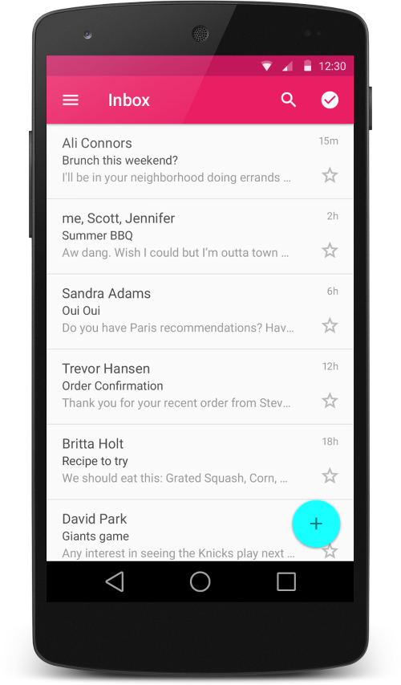

# RecyclerView


!!! abstract 
    **Objectives**

    - [x] You know how to use the RecyclerView class to display items in a scrollable list
    - [x] You know how to dynamically add items to the RecyclerView as they become visible through scrolling
    - [x] You know how to perform an action when the user taps a specific item

## Introduction

A common App feature is the display and manipulation of similar data items in form of lists or cards.
Android favours the separation of rendering data items from their actual model data and therefore deploys the concept of **adapters** to link the display of data items (the *View* in the MVC-Pattern) to their actual data (the *Model* in the MVC-Pattern). 

The [RecyclerView](https://developer.android.com/reference/android/support/v7/widget/RecyclerView.html) is a new [ViewGroup](https://developer.android.com/reference/android/view/ViewGroup.html) that is prepared to render any adapter-based view in a similar and more resource-efficient way. It is the successor of ListView and GridView, and it can be found in the latest support-v7 version. One of the reasons is that RecyclerView has a more extensible framework, especially since it provides the ability to implement both horizontal and vertical layouts. Use the RecyclerView widget when you have data collections whose elements change at runtime based on user action or network events.

_A list being displayed using the `RecyclerView` (Source: [Google](https://developer.android.com/design/material/images/list_mail.png))_

In order to use a RecyclerView, the following components are needed:

- `:::js RecyclerView.Adapter` - To handle the data collection and bind it to the view
- `:::js LayoutManager` - to position the items
- `:::js ItemAnimator` - to support animating the items for common operations such as Addition or Removal of item

- A **data model** containing the data to display: Use the mWordList.
- A **RecyclerView** for the scrolling list that contains the list items.
- A **layout** for one item of data. All list items look the same.
- A **layout manager**. `:::js RecyclerView.LayoutManager` handles the hierarchy and layout of View elements. `RecyclerView` requires an explicit layout manager to manage the arrangement of list items contained within it. This layout could be vertical, horizontal, or a grid. You will use a vertical [LinearLayoutManager](https://developer.android.com/reference/android/support/v7/widget/LinearLayoutManager.html).
- An **adapter**. `:::js RecyclerView.Adapter` connects your data to the `RecyclerView`. It prepares the data in a `:::js RecyclerView.ViewHolder`. You will create an adapter that inserts into and updates your _generated words in your views_.
- A **ViewHolder**. Inside your adapter, you will create a [ViewHolder](https://developer.android.com/reference/android/support/v7/widget/RecyclerView.ViewHolder.html) that contains the View information for displaying one item from the item's layout.


## Glossary of Terms

* **Adapter**: A subclass of `:::js RecyclerView.Adapter` responsible for providing views that represent items in a data set.
* **Position**: The position of a data item within an Adapter.
* **Index**: The index of an attached child view as used in a call to `:::js getChildAt(int)`. Contrast with Position.
* **Binding**: The process of preparing a child view to display data corresponding to a position within the adapter.
* **Recycle (view)**: A view previously used to display data for a specific adapter position may be placed in a cache for later reuse to display the same type of data again later. This can drastically improve performance by skipping initial layout inflation or construction.
* **Scrap (view)**: A child view that has entered into a temporarily detached state during layout. Scrap views may be reused without becoming fully detached from the parent RecyclerView, either unmodified if no rebinding is required or modified by the adapter if the view was considered dirty.
* **Dirty (view)**: A child view that must be rebound by the adapter before being displayed.

## Using the RecyclerView

Using a RecyclerView has the following key steps:

1. Add **RecyclerView support library** to the Gradle build file
2. Define a **model class** to use as the data source
3. Add a **RecyclerView** to your activity to display the items
4. Create a **custom row layout XML file** to visualize the items
5. Create a **RecyclerView.Adapter** and **ViewHolder** to render the items
6. **Bind the adapter** to the data source to populate the RecyclerView


### Adding the RecyclerView Support Library

Make sure the RecyclerView support library is listed as a dependency in the `app/build.gradle` file:
```js
dependencies {
    ...
    implementation 'com.android.support:recyclerview-v7:27.1.1'
}
```
Click on `Sync Project with Gradle files` to let the IDE download the appropriate resources.


### Defining a Model

Every RecyclerView is backed by a data source (the *Model* in the MVC-Paradigm). 
Therefore, a class which represents the data model being displayed by the RecyclerView needs to be defined.

```java
public class Rating implements Serializable {

    public static final String TAG = Rating.class.getSimpleName();

    private String date;
    private int score;

    public Rating() {
        this.date = generateDate();
        this.score = generateScore();
    }

    public Rating(int score) {
        this.date = generateDate();
        this.score = score;
    }

    public String generateDate() {
        this.date = new SimpleDateFormat("E, dd. MMM yyyy, HH:mm")
            .format(new Date(System.currentTimeMillis() - 
                Math.round((Math.random() * 31000000000.0))));
        return this.date;
    }

    public int generateScore() {
        return (int)(Math.round(Math.random() * 4.0 ) + 1);
    }

    public String getDate() {
        return this.date;
    }

    public void setDate(String date) {
        this.date = date;
    }

    public void setScore(int score) {
        this.score = score;
    }

    public int getScore() {
        return this.score;
    }
}
```


### Add the RecyclerView to the Activity's Layout

Inside the desired activity layout XML file in `res/layout/activity_users.xml`, let's add the RecyclerView from the support library:

```xml
<?xml version="1.0" encoding="utf-8"?>
<android.support.constraint.ConstraintLayout 
    xmlns:android="http://schemas.android.com/apk/res/android"
    xmlns:app="http://schemas.android.com/apk/res-auto"
    android:layout_width="match_parent"
    android:layout_height="match_parent">

    <android.support.v7.widget.RecyclerView
        android:id="@+id/__set_id__"
        android:layout_width="0dp"
        android:layout_height="0dp"
        app:layout_constraintBottom_toBottomOf="parent"
        app:layout_constraintEnd_toEndOf="parent"
        app:layout_constraintStart_toStartOf="parent"
        app:layout_constraintTop_toTopOf="parent" />

</android.support.constraint.ConstraintLayout>
```


### Create a Custom Item Layout

Before we create the adapter, we need to define the XML layout file that will be used for each row within the list. 
The item layout for contains the widgets used to represent the data of one item per row.

The layout file should be created in `res/layout/item_rating.xml`  and will be rendered for each item row. 
!!! note
    Please note that `wrap_content` should be used for the `layout_height` because of RecyclerView versions prior to 23.2.1 previously ignored layout parameters ([Source](http://android-developers.blogspot.com/2016/02/android-support-library-232.html)). 


### Creating the `:::js RecyclerView.Adapter`

Here we need to create the adapter which will actually populate the data into the `RecyclerView`. 
The adapter's role is to **convert an object at a position into a list row item** to be inserted.

The following things need to be implemented by the `:::js RecyclerView.Adapter`:

1. A ViewHolder that extends the `ViewHolder` class of the `RecyclerView`
2. Data structure that holds the items to be displayed (representing the data model)
3. A constructor to populate the data structure containing the items to be displayed
4. Individual implementation (=*overriding*) of the three `:::js RecycleView.Adapter` methods 
    1. `:::js public ViewHolder onCreateViewHolder(ViewGroup viewGroup, int viewType)`
    2. `:::js public void onBindViewHolder(ViewHolder viewHolder, int position)`
    3. `:::js public int getItemCount()`

#### Creating the ViewHolder

However, with a RecyclerView the adapter requires the existence of a `ViewHolder` object which describes and provides access to all the views within each item row. 

We can create the basic empty adapter and holder together in an `:::js RecycleView.Adapter` class as follows:

```java
// Create the basic adapter extending from RecyclerView.Adapter
// Note that we specify a custom ViewHolder that provides access to our views
public class MyIndividualAdapter extends
    RecyclerView.Adapter<MyIndividualAdapter.ViewHolder> {

    // Provide a direct reference to each of the views within a data item
    // Used to cache the views within the item layout for fast access
    public class ViewHolder extends RecyclerView.ViewHolder {
        // The holder should contain a member variable
        // for any view that will be set as you render a row
        public TextView nameTextView;
        public Button messageButton;

        // We also create a constructor that accepts the entire item row
        // and does the view lookups to find each subview
        public ViewHolder(View itemView) {
            // Stores the itemView in a public final member variable that can
            // be used to access the context from any ViewHolder instance.
            super(itemView);

            nameTextView = (TextView) itemView.findViewById(R.id.contact_name);
            messageButton = (Button) itemView.findViewById(R.id.message_button);
        }
    }
}
```

#### Implementing the `:::js RecycleView.Adapter` Methods

Every adapter has three primary methods: 

1. `:::js public ViewHolder onCreateViewHolder(ViewGroup viewGroup, int viewType)`  
    *to inflate the item layout and create the holder,*
2. `:::js public void onBindViewHolder(ViewHolder viewHolder, int position)`  
    *to set the view attributes based on the data, and* 
3. `:::js public int getItemCount()`  
    *to determine the number of items.* 

Those methods need to be implemented in order to have a fully working adapter.

The following code demonstrates the implementations for the RecyclerViewDemoApp:

```java
public class RatingsAdapter extends RecyclerView.Adapter<RatingsAdapter.ViewHolder> {

    // The adapter holds a reference to the data source
    private ArrayList<Rating> mRatings = new ArrayList<Rating>();

    // The ViewHolder implementation of the adapter
    public class ViewHolder extends RecyclerView.ViewHolder {
        public TextView txtNumber;
        public TextView txtDate;
        public TextView txtScore;
        public TextView lblScore;
        public ImageButton btnRemove;

        // ViewHolder holds event handlers for caching reasons
        public ViewHolder(final View itemView) {
            super(itemView);
            txtNumber = (TextView) itemView.findViewById(R.id.txtNumber);
            txtDate = (TextView) itemView.findViewById(R.id.txtDate);
            txtScore = (TextView) itemView.findViewById(R.id.txtScore);
            lblScore = (TextView) itemView.findViewById(R.id.lblScore);
            btnRemove = (ImageButton) itemView.findViewById(R.id.btnRemove);
        }
    }

    public RatingsAdapter(ArrayList<Rating> ratings) {
        this.mRatings = ratings;
    }

    @NonNull
    @Override
    public ViewHolder onCreateViewHolder(@NonNull ViewGroup viewGroup, int viewType) {
        Context context = viewGroup.getContext();
        LayoutInflater inflater = LayoutInflater.from(context);
        View ratingView = inflater.inflate(R.layout.rating_item, viewGroup, false);
        ViewHolder viewHolder = new ViewHolder(ratingView);
        return viewHolder;
    }

    @Override
    public void onBindViewHolder(@NonNull ViewHolder viewHolder, int position) {
        Rating rating = mRatings.get(position);

        TextView txtNumber = viewHolder.txtNumber;
        txtNumber.setText(String.valueOf(position + 1));
        TextView txtData = viewHolder.txtDate;
        txtData.setText(rating.getDate());
        TextView txtScore = viewHolder.txtScore;
        txtScore.setText(String.valueOf(rating.getScore()));
        TextView lblScore = viewHolder.lblScore;
    }

    @Override
    public int getItemCount() {
        return mRatings.size();
    }
}
```

### Binding the Adapter to the RecyclerView

```java
public class UserListActivity extends AppCompatActivity {

     ArrayList<Contact> contacts;

     @Override
     protected void onCreate(Bundle savedInstanceState) {
         // ...
         // Lookup the recyclerview in activity layout
         RecyclerView rvContacts = (RecyclerView) findViewById(R.id.rvContacts);

         // Initialize contacts
         contacts = Contact.createContactsList(20);
         // Create adapter passing in the sample user data
         ContactsAdapter adapter = new ContactsAdapter(contacts);
         // Attach the adapter to the recyclerview to populate items
         rvContacts.setAdapter(adapter);
         // Set layout manager to position the items
         rvContacts.setLayoutManager(new LinearLayoutManager(this));
         // That's all!
     }
}
```

## Adding Data via the Adapter

Unlike ListView, there is no way to add or remove items directly through the RecyclerView adapter. 
In order to add or remove data from the data source, you need to make changes to the data source directly and notify the adapter of any changes. 
Also, whenever adding or removing elements, always make changes to the existing data source.

The adapter provides a set of **notification methods** for changes related to the data source:

| **Method**                            | **Description**                                                                           |
|---------------------------------------|-------------------------------------------------------------------------------------------|
| `:::js notifyItemChanged(int pos)`    | Notify that item at the position has changed.                                             |
| `:::js notifyItemInserted(int pos)`   | Notify that item reflected at the position has been newly inserted.                       |
| `:::js notifyItemRemoved(int pos)`    | Notify that items previously located at the position have been removed from the data set. |
| `:::js notifyDataSetChanged()`        | Notify that the dataset has changed. Use only as last resort.                             |


<!-- | Method                      | Description                                                                               |
|-----------------------------|-------------------------------------------------------------------------------------------|
| notifyItemChanged(int pos)  | Notify that item at the position has changed.                                             |
| notifyItemInserted(int pos) | Notify that item reflected at the position has been newly inserted.                       |
| notifyItemRemoved(int pos)  | Notify that items previously located at the position have been removed from the data set. |
| notifyDataSetChanged()      | Notify that the dataset has changed. Use only as last resort.                             | -->

In case an item is added to the end of the list, use the following code:

```java
// Add a new contact
mRatings.add(new Rating());
// Notify the adapter that an item was inserted at last position
adapter.notifyItemInserted(mRatings.size()-1);
```

Every time we want to add or remove items from the RecyclerView, we will need to explicitly inform the adapter of the event. 
Unlike the ListView adapter, a RecyclerView adapter should *not* rely on `:::js notifyDataSetChanged()` since the more granular actions should be used.
The [API Documentation](https://developer.android.com/reference/android/support/v7/widget/RecyclerView.Adapter.html) provides more details.

The following code excerpt defines an `onClick()` handler for an Floating Action Button that adds a new rating to the data source every time it is activated:

```java
fabAdd = (FloatingActionButton) findViewById(R.id.fabAdd);
fabAdd.setOnClickListener(new View.OnClickListener() {
    @Override
    public void onClick(View v) {
        mRatings.add(new Rating());
        adapter.notifyItemInserted(mRatings.size()-1);
        Toast.makeText(v.getContext(), "Rating added", Toast.LENGTH_SHORT)
            .show();
        recRatings.smoothScrollToPosition(mRatings.size()-1);
    }
});
```

## Removing Data from the Data Source

In the RecyclerViewDemoApp, each item (row) has a remove button at the right end of its row; once the button is activated (=*clicked*) the current item will be removed.
In contrast to the FAB for adding an entry, the application code for removing an item will be placed in the adapter, since the handler for the remove button is defined within the `ViewHolder` class.

```java
public ViewHolder(final View itemView) {
    super(itemView);

    txtNumber = (TextView) itemView.findViewById(R.id.txtNumber);
    txtDate = (TextView) itemView.findViewById(R.id.txtDate);
    txtScore = (TextView) itemView.findViewById(R.id.txtScore);
    lblScore = (TextView) itemView.findViewById(R.id.lblScore);
    btnRemove = (ImageButton) itemView.findViewById(R.id.btnRemove);

    btnRemove.setOnClickListener(new View.OnClickListener() {
        @Override
        public void onClick(View v) {
        int pos = getAdapterPosition();
        if (pos != RecyclerView.NO_POSITION) {
            Toast.makeText(itemView.getContext(), "Deleting Item #" + (pos+1), Toast.LENGTH_SHORT).show();
            mRatings.remove(pos);
            notifyItemRemoved(pos);
        }
        }
    });
}
```

Since the adapter holds a reference to the data source, items can be removed (or added) directly via this reference. 
!!! note
    **Note**: Although the code is conducted in the adapter's ViewHolder implementation, please do not forget to fire the notification event for the adapter.


## Interacting with the RecyclerView


## What you have Learned

!!! abstract
    __After having finished this lession, you know...__

    - [ ] ...how to create Activities and Intents 
    - [ ] ...how the Application Model in Android works
    - [ ] ...how you can use Intents to call Activities and share data between them.