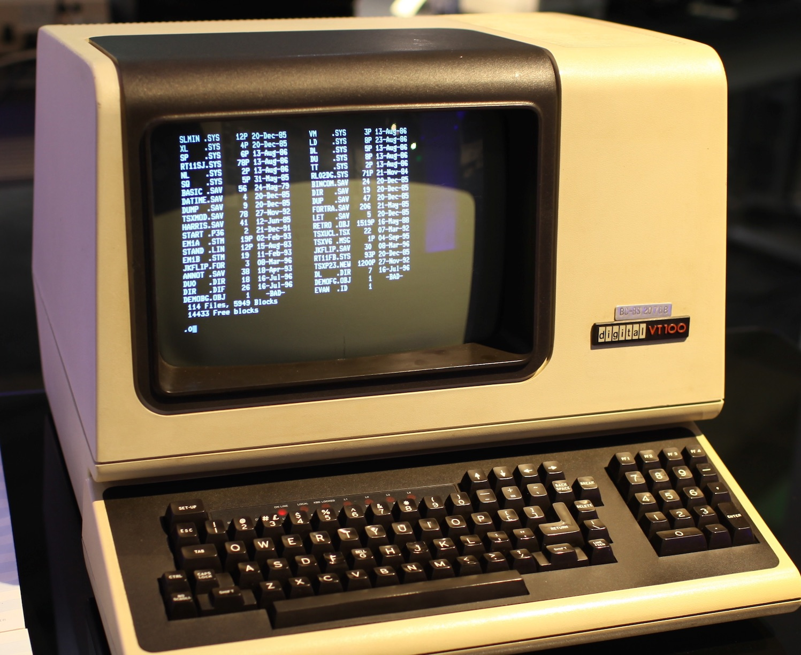
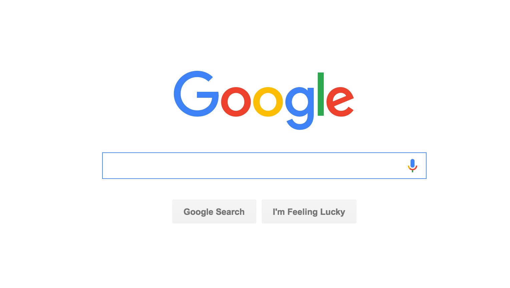
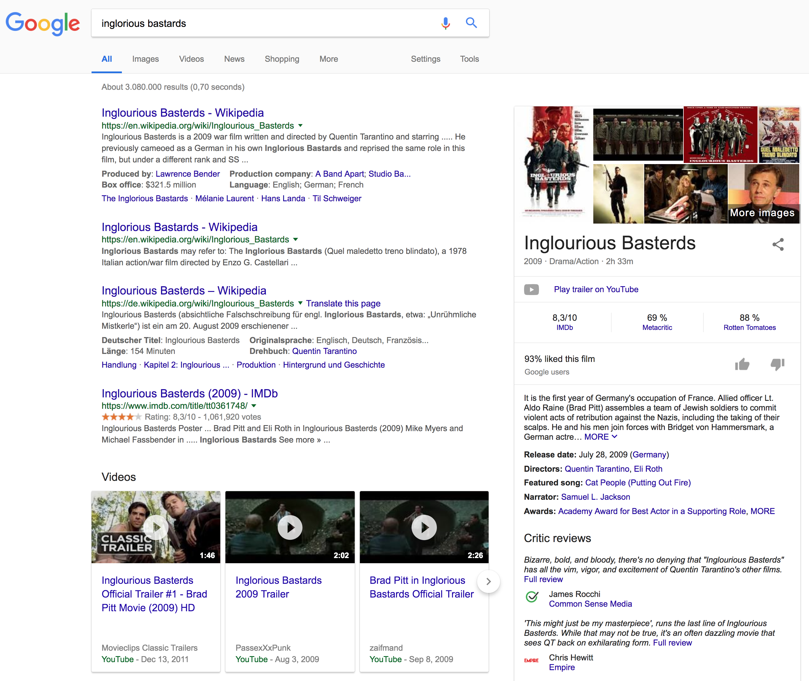
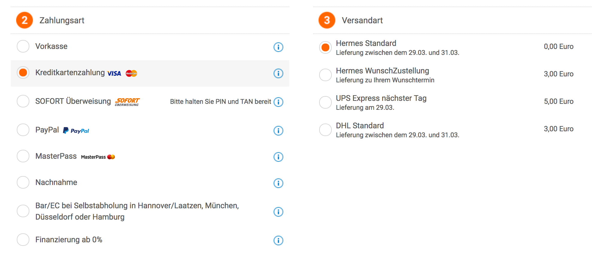

# Basic Principles of User Interface Design

*DEC VT100's Terminal Interface*

> The moment the user sees your UI, it communicates where they have arrived, what they can do, and how they should do it. The user receives this message from every aspect of your design: graphical and textual, silent and audible, static and moving, intentional and accidental. Figure out what you want that message to be, then do everything you can to ensure the message your UI sends is as close as possible to the one you intended.
> ––JAN MIKSOVSKY

This lecture teaches you basic principles for designing good and intuitive UIs. Those principles apply to many kinds of systems (Web-based system, mobile app, desktop app etc).

!!! abstract "Objectives"
    * [x] You know basic principles of intuitive and modern UIs
    * [x] You learn a methodology that helps you to built UIs with a good user experience
    * [x] You can ...

## Introduction

### User Interface versus User Experience

This section briefly discusses the __differences__ between __User Interface Design__ (UI) and __User Experience Design__ (UX).

Both elements are crucial to a product and work closely together. But despite their professional relationship, the roles themselves are quite different, referring to very different parts of the process and the design discipline. Where UX Design is a more analytical and technical field, UI Design is closer to what we refer to as graphic or visual design, though the responsibilities are somewhat more complex.

* **User Interface (UI)**: A user interface connects users to a product's underlying technology; it is what users see and feel directly when using a product or system.
* **User Experience (UX)**: User experience encompasses the entire experience users have with a product or software system. That experience includes the UI, but it also transcends the UI to include the internals that users do not interact with directly, as well as the externals, such as a purchasing process, technical support etc. E.g. for a car, the internals include engine, chassis, handling, and reliability; the externals are product showroom, the purchasing and delivery experience, manuals, warranty etc.

User interface design addresses actions users must do, whereas user experience design also addresses actions users do not have to do; it is the more encompassing action/goal.

!!! note "The Body Analogy (Source: <https://careerfoundry.com/en/blog/ux-design/the-difference-between-ux-and-ui-design-a-laymans-guide/>)"
    If you imagine a product as the human body, 

    * the __bones__ represent the code which give it structure.
    * The __organs__ represent the UX design: measuring and optimizing against input for supporting life functions.
    
    And UI design represents the cosmetics of the body–its presentation, its senses and reactions.

As a consequence, User experience design is a __human-first way__ of designing products.

Quotes from Don Norman and Jakob Nielsen perfectly outline the difference between UI and UX.

> "It’s important to distinguish the total user experience from the user interface (UI), even though the UI is obviously an extremely important part of the design.
>
> As an example, consider a website with movie reviews. Even if the UI for finding a film is perfect, the UX will be poor for a user who wants information about a small independent release if the underlying database only contains movies from the major studios."

Another good example is the Goolge search page – its interface is simple. There’s barely anything to the UI—just a logo, a search bar, a few buttons, and a search results page.

*Standard UI of the Google Search Web page*

But when you enter a search string into the search box, the search engine offers access to nearly the entirety of digitized human knowledge in less than one second.

*Results of a Web search for the movie "Inglourious Basterds" using the Google Search Engine*

Now imagine that every time you searched on Google it took 15 seconds to get a result – you’d no longer be able to instantly get an answer to your question. Even if the interface stayed the same, your experience with Google would be dramatically different.

## What is User Experience?

Source: <https://academic.oup.com/iwc/article/23/5/473/660020>

The term User Expereince was created by Don Norman in the early 1990s. 

> "The first requirement for an exemplary user experience is to meet the exact needs of the customer, without fuss or bother. Next comes simplicity and elegance that produce products that are a joy to own, a joy to use.
>
> True user experience goes far beyond giving customers what they say they want, or providing checklist features. In order to achieve high-quality user experience in a company’s offerings there must be a seamless merging of the services of multiple disciplines, including engineering, marketing, graphical and industrial design, and interface design."

User experience is a __multidimensional concept__ and a commonly accepted definition is still lacking. As Hassenzahl and Tractinsky (2006) argue, the concept of user experience attempts to go beyond the task-oriented approach of traditional HCI by bringing out aspects such as 

* beauty, 
* fun, 
* pleasure, and 
* personal growth 

that satisfy general human needs but have little instrumental value. 

Therefore, when compared to basic usability, __enjoyability plays an essential role in user experience__. The extent to which an interactive product is enjoyable to use is referred to as the __product’s hedonic quality__ (Hassenzahl et al., 2000; Hassenzahl, 2001). The shift of emphasis from usability to experiential factors has forced researchers to consider what user experience actually is and how to evaluate it (Vermeeren et al., 2010).

__Important question: How do we measure the queality of user experience?__

A number of __user experience models__ have been proposed during the past decade (Desmet and Hekkert, 2007; Forlizzi and Battarbee, 2004; Hartmann et al., 2008; Hassenzahl, 2004; Hassenzahl and Tractinsky, 2006; Jordan, 2000). Mahlke and Thüring’s (2007) holistic model is one of the most recent and it is building on the previous models and research findings. Mahlke and Thüring (2007) distinguish three __user experience components__ which together determine the __user’s overall appraisal__ of a system and influence their future decisions and behavior: 

1. perception of instrumental qualities, 
2. emotional reactions and 
3. perception of non-instrumental qualities. 

Instrumental qualities are related to the usability and usefulness of a system, while non-instrumental qualities are related to its appeal and attractiveness. Mahlke and Thüring (2007) also found empirical evidence that both of these two aspects of quality influence emotional reactions and the appraisal of interactive systems.

It is important to notice, that the definition does not contain any reference to techology nor mentions digital assets.

User Experience Design / Research is a rather young field; it shares many aspects with the more traditional approach termed market research. 

But User Experience Design is not a market research job. 

Though it does utilize many of the same techniques to achieve a complex end goal: The structure, analysis and optimization of a customer’s experience with a company and its products.

### Typical Tasks of a User Experience Designer

Strategy and Content:
* Competitor Analysis
* Customer Analysis
* Product Structure/Strategy
* Content Development

Wireframing and Prototyping:
* Wireframing
* Prototyping
* Testing/Iteration
* Development Planning

Execution and Analytics
* Coordination with UI Designer(s)
* Coordination with Developer(s)
* Tracking Goals and Integration
* Analysis and Iteration

So part marketer, part designer, part project manager; the UX role is complex, challenging and multi-faceted. You see that iteration of the product, as connected to analysis or testing is indeed mentioned twice, but in reality you would put it in between every other item on the list. Ultimately the aim is to connect business goals to user’s needs through a process of testing and refinement to that which satisfies both sides of the relationship.

### Conclusion

* User Experience Design is the process of development and improvement of quality interaction between a user and all facets of a company.
* User Experience Design is responsible for being hands on with the process of research, testing, development, content, and prototyping to test for quality results.
* User Experience Design is in theory a non-digital (cognitive science) practice, but used and defined predominantly by digital industries.

UX is not limited to the visual interface of your product. It’s a concept that has many dimensions and encompasses the entire journey a person takes, including:

* The process they go through to discover your company’s product
* The sequence of actions they take as they interact the interface
* The thoughts and feelings that arise as they try to accomplish their task
* The impressions they take away from the interaction as a whole

UX designers are responsible for ensuring that the company delivers a product or service that meets the needs of the customer and allows them to seamlessly achieve their desired outcome.

They may do that by conducting user research to get as much context as possible about the user of the product and then using those learnings to mockup wireframes and prototypes to help the user get from point A to point B.

## What is User Interface Design?

While User Experience is a conglomeration of tasks focused on optimization of a product for effective and enjoyable use; User Interface Design is its compliment, the look and feel, the presentation and interactivity of a product.

Like User Experience Design, User Interface Design is a multi-faceted and challenging role. It is responsible for the transference of a product’s development, research, content and layout into an attractive, guiding and responsive experience for users. 

Responsibilities of a UI Designer

Look and Feel:
* Customer Analysis
* Design Research
* Branding and Graphic Development
* User Guides/Storyline

Responsiveness and Interactivity:
* UI Prototyping
* Interactivity and Animation
* Adaptation to All Device Screen Sizes
* Implementation with Developer

So, in conclusion
* User Interface Design is responsible for the transference of a brand’s strengths and visual assets to a product’s interface as to best enhance the user’s experience.
* User Interface Design is a process of visually guiding the user through a product’s interface via interactive elements and across all sizes/platforms.
* User Interface Design is a digital field, which includes responsibility for cooperation and work with developers or code.

Or in analogical terms, UI design produces a product’s: Skin - a product’s visual/graphic presentation. Senses - a product’s reactivity and interactivity in response to a user’s input or different display environments. And makeup - a product’s guides, hints, and directives that visually leads users through their experience.

### Basic Concepts

A user interface is essentially a **conversation between the user and a software system** to perfom tasks to achieve users' goals.
A UI differs from conversation primarily in that it uses the **language of UI elements** instead of natural language.
A well designed UI communicates with its users in a way that is

* natural
* professional
* friendly
* easy to understand
* efficient.

By contrast, poorly designed UIs are unnatural, technological and mechanical, and require users to apply thought, experimentation, memorization, and training to translate it into something meaningful.

!!! note "User Interface Design is not a subjective visual art"
    From this point of view, user interface design is not a subjective visual art about pixels and aestethics but rather a **principled objective communication skill** to explain tasks to users.

    By focusing on communication, **design decisions** that appear subjective (such as control selection, icon design, layout, color scheme etc.) become much more **objective**.

Style, color schemes, fashion are largely subjective, but aspects that constitute a comprehensible and intuitive task explanation to the target users are not.
Therefore, every user interface element can be **evaluated by how effectively it communicates its role and contribution** towards the fulfillment of users' tasks.
If a UI containts elements, that communicate nothing, they should be removed.

!!! abstract "Principle x: UI is essentially Human-like Communication"
    The most important concept is to understand that UI is **not** a completely different form of communication. A good and ituitve UI is designed to **communicate to people**, not robots, so it employs many concepts of human communication.

!!! abstract "Principle x: Friendliness"
    If a UI communicates in a way that would be inappropriate or rude in person, it is equally inappropriate or rude in a system.

For example, consider the classic question
> "should I use radio buttons or a checkbox?"

There are potentially dozens of possible considerations, but answering the question with
> "What are you trying to communicate?"

helps in driving the decision.

If you are providing an option that can be turned on or off, a checkbox is the better choice; if you are providing two or more independent states, radio buttons are the better choice.

*Radio buttons are a good choice when one out of several independent options needs to be selected*

## UI Design Principles