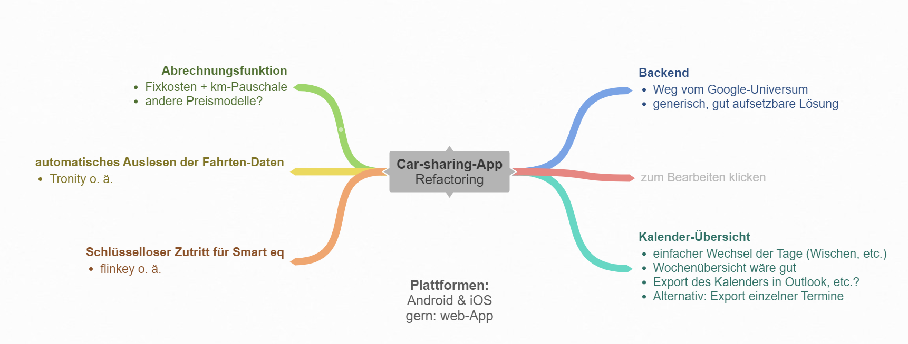

<!--   -->
<!--  -->
<!--  -->
 
<!-- marp --engine ./engine.js --watch --theme-set custom-theme-roboto.css -- --allow-local-files 2023_SS_PSE_Kick-Off.md -->
<!-- marp --pdf --allow-local-files --engine ./engine.js --theme-set custom-theme-roboto.css -- 2023_SS_PSE_Kick-Off.md -->

# Master-Projekt-Systementwicklung im SoSe 2023 

#### Prof. Dr. Stefan Linus Zander – Dipl. Volkswirt Roland Trefftz

Kick-Off-Meeting – 03.05.2023  {.lightgreen .Big .skip}

---
<!-- header: Überblick -->
<!-- footer: Projekt Systementwicklung / Projekt Multimedia – Kick-Off-Meeting, 03.05.2023 -->

# Agenda

1. Gemeinsame Kennenlernrunde zu Beginn (alle)
2. Allgemeine Informationen zum Modul (S. Zander)
3. Vorstellung der Projekte und Arbeitspakete (S. Zander)
4. Projektassignments (alle)
5. Gemeinsame Q&A-Session (alle)
6. Nächste Schritte (alle)

---
# Gemeinsames Kennenlernen

<!-- In einer kurzen gemeinsamen Kennenlernrunde soll sich bitte jeder kurz vorstellen -->

Damit wir uns einander besser kennen lernen, stellt sich bitte jeder kurz vor

Für *Studierende*, sagen Sie bitte kurz ...
- ...in welchem Studienabschnitt sie sich befinden
- ...wo Ihre persönlichen **Interessen** liegen
- ...wo Ihre **Stärken** liegen
- ...welche **Erfahrungen** Sie mitbringen
- ...mit welchen **Erwartungen** Sie in das Modul gehen

---
# Beteiligte Personen (1/2)

**Hochschule Darmstadt** {.BIGskip}
- **Prof. Dr. Stefan Linus Zander** (Modulverantwortung und Projektleitung) 
  - Email: stefan.zander@h-da.de 
  - Website: https://fbi.h-da.de/personen/stefan-zander

**Klinikon GmbH^1^** {.Bigskip}
- **Dipl. Volkswirt Roland Trefftz** (fachliche Projektleitung und Stakeholder) – trefftz@klinikon.com

**Fachliche Begleitung** {.Bigskip}
- **Marcus Raphael Schül** (Solutionarchitekt und Stakeholder) – mail@marcus-schuel.de

::: footnotes
^1^ https://www.klinikon.com/
:::

---
# Beteiligte Personen (2/2)

**Hochschule Darmstadt – Studierende**

- Boschert, Michele – Michele.Boschert@stud.h-da.de
- Kleinschmidt, Lars  – Lars.Kleinschmidt@stud.h-da.de

<!-- ---
# Aufteilung in Projektteams

::::: columns
:::: single bluebox
**Projektteam RPN-Calculator**
- Engler Cedric – Cedric.Engler@stud.h-da.de
- Gotha Etienne – Etienne.Gotha@stud.h-da.de
- Räpple Lukas – Lukas.Raepple@stud.h-da.de^1^
- Steinrücken Niklas – Niklas.Steinruecken@stud.h-da.de
 
::::
:::: single greenbox
**Projektteam Fachbereichsratsprotokolle**
- Elsässer Dimitrij – Dimitrij.Elsaesser@stud.h-da.de^1^
- Führes Jasmin – Jasmin.Fuehres@stud.h-da.de
- Thelen Tobias – Thelen.Tobias@stud.h-da.de
- Weishäupl Daniel – Daniel.Weishaeupl@stud.h-da.de
::::
:::::

::: footnotes
^1^ Product Owner der jeweiligen Projekte
::: -->

---
<!-- header: Allgemeine Informationen zum Modul -->
# Allgemeine Informationen zum Modul

---
# Lernziele

::::: columns
:::: triple 
- Die Studierenden können eine Fragestellung in einem Teilgebiet der Informatik in einem ==Projektteam== *selbständig*, *eigenverantwortlich* und *professionell* bearbeiten. 
- Sie erlernen eine ==strukturierte== und ==professionelle Herangehensweise== und können ihre Ergebnisse in geeigneter Form _dokumentieren_, _präsentieren_, und _reflektieren_.
- Sie wenden ihre bis dahin erworbenen Kenntnisse an und erweitern und vertiefen ...
  - ihre *fachlichen Kompetenzen* in mindestens einem Teilgebiet der Informatik,
  - ihre Kompetenzen im Bereich *Software-Engineering* und *Projektmanagement*,
  - Schlüsselkompetenzen wie *Kooperations-* und *Teamfähigkeit*, _Problemlösungskompetenz_, *Kommunikations-* und *Moderationskompetenz*,
  - ==Strategien des Wissenserwerbs==
::::
:::: double
::: center

:::
::::
:::::

::: footnotes
Quelle: Modulhandbuch des Fachbereichs Informatik mit individuellen Ergänzungen und Anpassungen
:::

---
# Durchführung

- Aufteilung der Studierenden in **2 Projektteams** analog den beiden Projekten
- Jedes Projektteam bildet eigenverantwortlich **Sub-Teams (Dev.-/Research-Teams mit 2-3 Beteiligten)**, die selbständig und eigenverantwortlich an den verschiedenen Arbeitspaketen arbeiten
  - so lassen sich Arbeitspakete (=Sprints) parallel bearbeiten^1^
- Jedes Projektteam bestimmt **1 Projektverantwortliche/n (=Product Owner)**^2^, die ...
  - ... den *Projektfortschritt* kontrolliert
  - ... *Arbeitsergebnisse* einfordert
  - ... als *Ansprechpartner* des Projektteams fungieren
  - ... *Arbeitspakete* und Sprints koordinieren
  - ... für die *Qualitätskontrolle* verantwortlich sind
  - ... mitarbeiten, aber vor allem Aufgaben *delegieren* können
- Projektdurchführung analog dem Scrum- und Design-Thinking Vorgehensmodell

::: footnotes
^1^ Durchführung analog dem Scrum-Modell (vgl. <https://scrumguides.org/docs/scrumguide/v1/Scrum-Guide-DE.pdf>)
:::

<!-- 
---
# Zeitliches Engagement 

Projekt Systementwicklung / Projekt Multimedia ist ein **7,5 CP Modul**.
- Das Bachelorstudium sieht **30 CP** an Modulen pro Semester vor
- **1 CP** entspricht **30 Arbeitsstunden** laut den gängigen Berechnungsmodellen^1,2^
- Der Arbeitunsumfang für das Modul entspricht deshalb **225 Arbeitsstunden**
- Damit ergibt sich eine wöchentliche Arbeitszeit (ohne Pause) von **ca. 17,3 h - 18,75 h**.

::: footnotes
^1^ https://www.studis-online.de/Studieren/ects.php

^2^ https://fbc.h-da.de/fileadmin/Dokumente/Pruefungsordnung/ABPO_AEnderung_2018-01-30.pdf
::: -->

---
# Zeitliches Engagement – eine realistische Betrachtung
Projekt Systementwicklung / Projekt Multimedia ist ein **7,5 CP Modul**.
- Das Bachelor-/Masterstudium sieht **30 CP** an Modulen pro Semester vor
- Bei einer wöchentlichen Arbeitszeit von **42 h** ergibt sich ein zeitlicher Aufwand von **10,5 h** (ohne Pausen) über **16 Wochen** hinweg^1^
- das ist das zeitliche Engagement, das wir von Ihnen einfordern
- den zeitlichen Aufwand dürfen Sie frei einteilen
<!-- - Zeitlicher Aufwand von **10,5h** wöchentliche Arbeitszeit (ohne Pausen) über **16 Wochen** hinweg^1^ -->

::: redbox center
In Summe veranschlagen wir für das Projekt ein **Gesamtzeitbudget** von **320h**
:::

::: footnotes
^1^ Vorlesungszeit (12 Wochen) + Lernwoche (1 Woche) + Prüfungszeit (3 Wochen)
:::

---
# Kommunikation
- via **Discord**: _Link folgt_
  - für die Kommunikation der Projektteams untereinander
  - für die Kommunikation mit den Stakeholdern zu technischen Fragen
- oder **Email** bei wichtigen und/oder offiziellen Dingen
  - achten sie auf einen aussagekräftigen Betreff
  - bitte alle Verantwortlichen in cc mit aufnehmen
- wöchentliche **Jour fixe** (ca. 30-45 Min pro Projektteam) mit den Stakeholdern
  - Durchführung mittels geeigneter Online-Tools (bspw. BBB etc.)
  - Pflichttermin für alle Beteiligte

---
# Entwicklungsplattform und Dokumentation

**GitLab**
- jede Gruppe benutzt ein eigenes **GitLab-Repository** 
- dort werden Programmcode und Dokumentation (Deliverables) gehostet
- bitte direkt selbst erstellen und die Teammitglieder hinzufühgen
<!-- - Unternehmensseitig werden notwendige APIs etc. zur Verfügung gestellt – mehr Informationen dazu in der Projektvorstellung -->

**Moodle** (nicht im SoSe 2023)
- Link zum Moodlekurs: <https://lernen.h-da.de/course/view.php?id=17896> 
- offizielle Dokumentationen werden über **Moodle** bereit gestellt
- ebenso wie ergänzende Materialien

---
# Bewertungskriterien

:::: columns
::: single
In die **Gesamtbewertung** fließt ein
- ... das von Ihnen gezeigte *Engagement*
- ... die von Ihnen erbrachten *Ergebnissartefakte*
- ... *Qualität* und *Umfang* der erbrachten Ergebnisartefakte
- ... Ausfüllen besonderer *Rollen* im Projekt
- ... Ihre *Sichtbarkeit*
- ... die Rückmeldungen der *Stakeholder*
- ... die individuelle Gewichtung der *Beteiligungsmatrix*
:::
::: single
Die **Beteiligungsmatrix**
- ... ist von jedem Projektteam verplichtend zu führen
- ... beziffert den *%-tualen Beitrag* eines Teammitglieds
  - d.h., sie beziffert den Beitragsumfang, den ein Teammitglied zu einem Ergebnisartefarkt geleistet hat
- ... ist in Form einer *Matrix* zu dokumentieren
  - bspw. in den jeweiligen Deliverables
- ... wird von den Projektgruppen *eigenverantwortlich* erstellt
:::
::::

---
## Fragen / TBD / TODOs

- Wo Docker-Container hosten (IT-Services/hda/etc)? Budget existiert
- Lade- und Lastmanagement sollte mit in die App integriert werden (Marcus)
  - Laden aus technisch- und kaufmännischer Sicht 
  - State-of-Charge (aka Ladezustand) des Fahrzeugs sollte immer sichtbar/abrufbar sein um informierte Entscheidungen treffen zu können (bspw. Einkaufsfahrt jetzt mit halb-vollem Auto vs. Fahrt in 3h mit vollem Auto aber geschlossenem Supermarkt)
- TODO (SZA): Gemeinsamer Termin mit J. Wischnat und den neuen Entwicklern finden
- TODO (RT): Bug an J. Wischnat kommunizieren
- 

---
<!-- header: Projektplanung -->
# Projekt #1: Erweiterung & Refactoring der we3ve-App

### Betreuer: Roland Trefftz, Stefan Zander, Marcus Schül

---
## Projekt #1: Ursprüngliche allgemeine Anforderungen der App

::: blue 
**Ziel**: Entwicklung einer einfach nutzbaren Car-Sharing-App auf Basis moderner Web-Technologien.
:::

{.HugeSkip}

**Allgemeine Anforderungen** 
- Lauffähig im Web und auf mobilen Endgeräten
- Verwaltung von NutzerInnen und Fahrzeugen
- Individualisierbares Dashboard mit div. Übersichten (Buchungen / Nutzung / gefahren Kilometer / Auslastung / etc.)
- Einfache und vielfältige Reservierungsmöglichkeiten (bspw. über einen gem. Kalender / via Email etc.)
- Erforschung von Schnittstellen zur Integration von Telemetriedaten und anderen technischen Merkmalen (Ladezustand, Kilometer etc)
- Einfachste Nutzung und Administration
- Hohe Code- und Dokumentationsqualität

::: warning
Die konkreten Anforderungen müssen in Stakeholder-Interviews mittels User-Research und Requirements Engineering Methoden erforscht und erarbeitet werden.
:::

---
## Workpackage 1: Erweiterung der App um neue Funktionalität

<!-- 
---
## Workpackage 1: Erweiterung der App um neue Funktionalität (2/2)

- **Ziel**: _Implementierung der Anwendung (Frontend & Backend), Testing,  Durchführung von Usability-Evaluierungsmethoden und Fertigstellung der Dokumentation._
- **Task-Liste**:
  - Task 1: Abrechnungsfunktion
  - Task 2: State-of-Charge // automatisiertes Auslesen von Fahrtzeug-/Fahrdaten 
  - Task 3: Code- und Doc-Reviews
  - Task 4: Deployment
  - Task 5: Abschluss (Vervollständigung) von Implementierung und Dokumentation
- **Milestones**
  - ==Deliverable 5: Usability-Tests==
    - Dokumentation der Usability-Test inkl. Testfällen
    - Dokumentation der Erkenntnisse aus der Usability-Evaluation (=Auswertung)
    - Dokumentation der Verbesserungen
  - Abgeschlossene Implementierung sowie Deployment des Systems
  - Übergabe des Systems sowie der Dokumentation 
  - 
-->

---
# Ursprüngliche Projektplanung und Ergebnisartefakte der ersten Projektphase

---
## Workpackage 1: User Research

- **Ziel**: _Benutzungsgruppenspezifische Nutzungsszenarien und -Anforderungen erforschen_
- **Task-Liste**:
  - Task 1: Stakeholderanalyse
  - Task 2: Erarbeitung von Interviewleitfäden für die teilstandardisierten Interviews mit den Stakeholdern (=Stereotypen)
  - Task 3: Durchführung und Auswertung der teilstandardisierten Interviews 
  - Task 4: Erarbeitung von Anwendungsszenarien und Anwendungsfällen
  - Task 5: Erarbeitung eines Anforderungkatalogs
  - Task 6: Aufteilung der Anforderungen analog dem KANO-Modell und Finden von Begeisterungsfaktoren
- **Milestones**:
  - ==Deliverable 1: User Research== mit
    - Dokumentation aller relevanter Artefakte des User Research 
      - Dokumentation der Stereotypenanalyse, 
      - Stakeholder-Interviews
      - Anwendungsszenarien und Use-Cases, 
      - Anforderungsspezifikation mit Begeisterungsfaktoren 
  - Anforderungkatalog inkl. Begeisterungsfaktoren
  
::: footnotes
Hinweis: Die notwendigen Informationen zur Durchführung des User-Research finden sich in den Unterlagen des [Moduls "NZSE"](https://projects.fbi.h-da.de/~s.zander/#nutzer-zentrierte-softwareentwicklung-nzse) von Prof. Dr. Stefan Zander (siehe [Moodle](https://lernen.h-da.de/course/view.php?id=6802))
:::

---
## Workpackage 2: UI-Entwurf & Prototyping

- **Ziel**: _Aus den Erkenntnissen des User Research erste UI-Prototypen erarbeiten und mit den Stakeholdern testen um zu einem finalen, akzeptierten Design zu kommen._
- **Task-Liste**:
  - Task 1: Erarbeitung der GUIs 
  - Task 2: Konzeption von User-Tests anhand der aus dem User-Research gewonnenen Erkenntnissen
  - Task 3: Durchführung der User-Tests mit den Steretypen
  - Task 4: Ableitung von Verbesserungen und Überarbeitung des Designs
- **Milestones**:
  - finaler Entwurf der Benutzungsschnittstellen (GUIs)
  - ==Deliverable 2: UI-Entwurf (=Designkonzept)==
    - Dokumentation des Designkonzepts für die User-Tests
    - Dokumentation der durchgeführten User-Tests
    - Dokumentation der gewonnenen Erkenntnisse
    - Dokumentation des finalen UI-Entwurfs

---
## Workpackage 3: Technologie-Research

- **Ziel**: _Evaluierung der technologischen und architektonischen Umsetzungsmöglichkeiten; System-Grob- und -feinentwurf._
- **Task-Liste**:
  - Task 1: Sichtung aktueller Technologien bzw. Analyse technologischer- und architektonischer Umsetzungsmöglichkeiten auf Basis der Anforderungsspezifikation
  - Task 2: Systemarchitekturentwurf
  - Task 3: Vorbereitung der Implementierungsphase
- **Milestones**:
  - ==Deliverable 3: Technologie-Research==
    - Evaluation der technologischen und architektonischen Umsetzungsmöglichkeiten
    - Dokumentation des System-Grob- und -feinentwurfs
  - Auswahl des Technologie-Stacks
  - Festlegung des Systemdesigns 

---
## Workpackage 4: Implementierung, Usability-Evaluation, Deployment

- **Ziel**: _Implementierung der Anwendung (Frontend & Backend), Testing,  Durchführung von Usability-Evaluierungsmethoden und Fertigstellung der Dokumentation._
- **Task-Liste**:
  - Task 1: Implementierung
  - Task 2: Usability Testing mittels heuristischer und empirischer Evaluationsmethoden 
  - Task 3: Code- und Doc-Reviews
  - Task 4: Deployment
  - Task 5: Abschluss (Vervollständigung) von Implementierung und Dokumentation
- **Milestones**
  - ==Deliverable 4: Usability-Tests==
    - Dokumentation der Usability-Test inkl. Testfällen
    - Dokumentation der Erkenntnisse aus der Usability-Evaluation (=Auswertung)
    - Dokumentation der Verbesserungen
  - Abgeschlossene Implementierung sowie Deployment des Systems
  - Übergabe des Systems sowie der Dokumentation

<!--
## Projekt: Überführung der Fachbereichsratsprotokolle in eine semantische Wissensbasis mittels moderner NLP-/KI-Technologien

### Betreuer: Stefan Zander

---
## Zielsetzung

:::: green
Die vielen wertvollen Informationen, die in Fachbereichsratsprotokollen enthalten sind, automatisiert extrahieren und nutzbar machen.
::::

{.HugeSkip}

- Erforschung und Begutachtung von aktuellen Ansätzen, um in Textdokumenten enthaltene Informationen (sog. Faktenwissen) automatisiert zu extrahieren und nutzbar zu machen
  - Abbildung auf Wissensgraphen
  - Named Entity Recognition (NER)
  - mit Hilfe moderner NLP-Techniken
- Fachbereichsratsprotokolle in einer NLP-Pipeline verarbeiten 
- Überführung der Fachbereichsratsprotokolle in (semantische) Wissensgraphen unter Zuhilfenahme von State-of-the-Art NLP-Technologien und Verarbeitungsansätzen
- Aufarbeitung von SOTA-Ansätzen im Bereich NER oder IE
- Untersuchung und Vergleich von Extraction Pipelines 

::: blue
Wichtig: Der nachfolgende _Projektplan_ ist eine grobe Orientierung und soll die Detailplanung unterstützen und erleichtern, diese jedoch nicht ersetzen. 
:::

---
## Workpackage 1: Auseinandersetzung mit dem Thema

- **Ziel**: _Erlangung eines umfassenden Verständnisses zu Aufgabenstellung, Zielen, Rahmenbedingungen, Erwartungen, benötigten Technologien etc._
- **Task-Liste**
  - Task 1: Sichtung und Analyse der Fachbereichratsprotokolle
  - Task 2: Durchführung von Stakeholderinterviews
  - Task 3: Identifikation und Zusammentragung der Informationsbedürfnisse
  - Task 4: Sammlung von Anforderungen
- **Meilensteine**
  - ==Deliverable 1: Anforderungsspezifikation (aka Lastenheft)==
    - Dokumentation der wesentlichen Anforderungen, Rahmenbedingungen, Zielen etc.
    - Darlegung des geplanten Vorgehens (_Research Design_) mit Definition von Projektmeilensteinen etc. 
    - Klassifikation der verschiedenen _Bestandteile_ eines Fachbereichratsprotokolls
    - Auflistung der zu erfüllenden Queries

---
## Workpackage 2: Literaturstudium und Technolgie-Research

- **Ziel:** _Wissensaufbau zu den erforderlichen Technologien und methodischen Ansätzen_
- **Task-Liste**
  - Task 1: Auseinandersetzung mit relevanten Technologien und Konzepten (NLP, Transformer, Wissensgraphen, Semantik, etc.)
  - Task 2: Sammlung und Auswertung von relevanten Projekten mit vergleichbaren Problemstellungen 
  - Task 3: Erarbeitung von Umsetzungsmöglichkeiten
  - Task 4: Research zum State-of-the-Art (SOTA)
  - Task 5: Analyse des SOTA und Abgleich der Umsetzungsmöglichkeiten mit der Anforderungsspezifikation
- **Meilensteine**
  - ==Deliverable 2: Technologie-Research und Vorgehensbeschreibung==
    - Auf Basis des SOTA Darlegung der verschiedenen Umsetzungsmöglichkeiten inkl. deren Stärken und Schwächen
    - Abgleich mit der Anforderungsspezifikation und Darlegung des gewählten methodischen Vorgehens einschl. involvierter Technologien
    - Darlegung des konzeptionellen Vorgehens und Aufbaus

---
## Workpackage 3: Technologische Realisierung

- **Ziel:** _Entwicklung von Demonstratoren für das Backend zur Demonstration der Nutzbarmachung bzw. des Zugriffs auf das enthaltene Faktenwissen_ 
- **Task-Liste**
  - Task 1: Umsetzung der Informationsbedürfnisse in entspr. Abfragen
  - Task 2: Entwurf von Taxonomien / Ontologien zur Entitäts-Klassifikation
  - Task 3: Auswahl und Aufbau der Verarbeitungspipeline (inkl. Storage-Infrastruktur) bzw. einer Wissensbasis
  - Task 4: Refinement und Validierung
- **Meilensteine**
  - Lauffähige Demonstratoren mit denen FB-Protokolle in semantische Wissensgraphen umgewandelt und die enthaltenen Informationen abgefragt werden können
  - ==Deliverable 3: Projektdokumentation + Demonstratoren==
    - Dokumentation aller wesentlicher Projektschritte
    - Dokumentation der Demonstratoren

---
## Workpackage 0: Detailprojektplanung

- **Ziel:** _Entwurf eines Detailprojektplans auf Basis des Projektgrobplans_ 
- **Detailaufgaben**
  - Legen Sie Zeitpunkte für die *Fertigstellung* der Meilensteine bzw. Arbeitspakete fest
  - Prüfen Sie alle Tasks auf *Verständlichkeit* und *Vollständigkeit*; Fragen Sie nach, falls ein Task unverständlich und/oder mehrdeutig ist
  - Prüfen Sie die Tasks auf *Erfüllbarkeit*, d.h., machen Sie sich Gedanken über Kriterien und deren Herkunft, anhand derer sich der Erfüllungsgrad eines Tasks festmachen lässt.
  - Beginnen Sie mit der Strategischen Projektplanung, d.h., planen Sie Ihr Projekt vom Ende zum Anfang.
    - Legen Sie Ziele (=Arbeitspakete) und den Erfüllungszeitpunkt fest
    - Definieren Sie Ziele für die jeweiligen Arbeitspakete
    - Teilen Sie das Gesamtprojektbudget aller Teammitglieder auf die Arbeitspakete auf^1^
  - Legen Sie die **Dokumentationsinfrastruktur** an
    - GitLab-Repo
    - Kanban- / Scrum-Boardsoftware
    - etc.

::: bluebox centerbox center
Stellen Sie den Detailprojektplan im 1. Jour fixe vor und klären Sie dort offene Punkte
:::
  

::: footnotes
^1^ Während des Projekts überprüfen Sie in regelmäßigen Abständen, in wie weit Ihre IST-Zahlen von der SOLL-Planung abweicht. Thematisieren Sie dies in den Jours fixes.
:::

---
## Ressourcen

:::: twocolumns smaller
- Knowledge Graph Generation From Text Using Neural Machine Translation Techniques <https://ieeexplore.ieee.org/document/9510164>
- Neural Machine Translation for Semantic-Driven Q&A Systems in the Factory Planning <https://www.sciencedirect.com/science/article/pii/S2212827121000676>
- https://towardsdatascience.com/transformers-89034557de14
- Language Models are Open Knowledge Graphs https://youtu.be/NAJOZTNkhlI
- Building a Knowledge Base from Texts: a Full Practical Example https://medium.com/nlplanet/building-a-knowledge-base-from-texts-a-full-practical-example-8dbbffb912fa
- Text to Knowledge Graph https://medium.com/swlh/text-to-knowledge-graph-683002cde6e0
- From Text to a Knowledge Graph: The Information Extraction Pipeline https://neo4j.com/blog/text-to-knowledge-graph-information-extraction-pipeline/
- Knowledge Graph – A Powerful Data Science Technique to Mine Information from Text https://www.analyticsvidhya.com/blog/2019/10/how-to-build-knowledge-graph-text-using-spacy/
- Knowledge Graphs 
  - https://web.stanford.edu/~vinayc/kg/notes/How_To_Create_A_Knowledge_Graph_From_Text.html
  - https://web.stanford.edu/~vinayc/kg/notes/KG_Notes_v1.pdf
  - https://web.stanford.edu/~vinayc/kg/notes/
  - https://web.stanford.edu/~vinayc/kg/notes/Table_Of_Contents.html
- Attentention is all you need  https://arxiv.org/abs/1706.03762
- Word2Vec-Paper Explained https://towardsdatascience.com/word2vec-research-paper-explained-205cb7eecc30
::::

::: footnotes
Die hier aufgeführten Arbeiten sind als Empfehlung bzw. Einstieg in das Themengebiet zu verstehen. Die Liste ist weder vollständig noch erschöpfend. Eigene Recherchen sind zwingend notwendig.
:::

-->

---
# Fragen ?

---
<!-- header: Projektmanagement -->
# Projektmanagement

---
# Projektmanagement – Teil 1

::: bluebox centerbox small
Da wir analog dem **Agilen Manifesto** vorgehen wollen, anbei ein paar Gedanken zum strategischen und operativen Projektmanagement und der Projektdurchführung. Die folgenden Informationen dienen gleichzeitig als Vorbereitung für die wöchentlichen **Jour fixes**.
:::

{.Skip}
- Grundsätzlich: die Projektaufgaben (=Tasks der jeweiligen WPs) werden in wöchentlichen **Sprints** abgearbeitet^1^
- Die **Detailarbeiten** pro Sprint (Research / Development / etc) legt jedes Team individuell fest
- Jedes Projekt führt ein **Sprint**- und ein **Produkt-Backlog**. 
  - Das Sprint-Backlog dokumentiert die einzelnen Aufgaben und Ziele eines Sprints für jedes Team. 
  - Im Produkt-Backlog werden die Anforderungen der APs und der zugehörigen Tasks definiert und dokumentiert.
- Die Sprint- und Produkt-Backlogs werden in den **Git-Repositories** der jeweiligen Projekte geführt.
- Vor jedem Sprint steht die **Planung**; hier werden die Tasks der Arbeitspakete (=APs) aus der Projektbeschreibung in Teilaufgaben zerlegt und in das Sprint-Backlog übertragen (siehe vorheriger Punkt). 
- Jeder Sprint wird im **Sprint-Backlog** dokumentiert (Planung & Review).

::: footnotes
^1^ Nach dem SCRUM Guide sollen Sprints eine zeitliche Dauer von 2-3 Wochen haben; da wir jedoch einen vergleichsweise kurzen und fest-definierten Zeitrahmen haben werden wir wöchentliche Sprints abhalten.
:::

---
# Projektmanagement – Teil 2

- Das **Produkt-Backlog** dient als Basis für das Sprint-Review und ist “Richtschnur” für die Planung des nä. Sprints 
- Die MO-JFs sind also **Planungs**- und **Review-Meetings** zugleich. 
- Zusätzlich kann dort in von den Teams und Stakeholdern definierten Zeitpunkten eine **Retrospektive** durchgeführt werden. 
  - Spätestens nach der Erfüllung eines WPs soll eine Retrospektive stattfinden. 
- Zusätzlich bzw. ergänzend zu den JFs finden Zwischenpräsentationen statt – idR. bei der Erreichung eines Meilensteins. Die Präsentationstermine werden durch die Stakeholder festgelegt.

::: centerbox warning
Wichtig: Agiles Vorgehen bedeutet, dass sich die Projektdurchführung den aktuellen Anforderungen und vorherrschenden Gegebenheiten anpasst. Sollte sich im Verlauf des Projektes herausstellen, dass eine Nachjustierung sinnvoll ist, dann werden wir diese gemeinsam besprechen und durchführen.
:::

---
<!-- header: Jour fixes -->
# Jour fixes

<!-- 
---
# Jour fixe – MO, 31.10.2022

- Beantwortung offener Fragen zu den Projekten
- Erläuterung Vorgehensmodell
- Festlegung Product Owner
- Festlegung Dokumentation von Product Backlog und Sprint Backlog
- Festlegung Dokumentation der Deliverables
- sonstiges

::: blue centerbox center Bigskip
Im **Zielbild** wollen wir erreichen, dass Sie alle Informationen zur Verfügung haben, um den **1. Sprint** zu planen und durchzuführen.
::: 
-->

---
<!-- header: Retrospektive -->
# Retrospektive – Infos und Durchführung

---
# Infos zur Durchführung

**Ziel**: _Subjektive Reflektion von Arbeitprozessen und Methodiken um zukünftige Sprints zu verbessern._

**Methode**: ==__4 L__^1^==

::::: bluebox 
:::: columns
::: single 
:fa-heart: What I **LOVED**
- Was lief richtig gut? 
- Was lief besser als erwartet?

:fa-graduation-cap: What I **LEARNED**
- Was habe ich gelernt? 
- Was war eine neue Erfahrung?
:::
::: single 
:fa-bolt: What I **LACKED**
- Was habe ich vermisst?
- Was hätte besser laufen können?

:fa-question: What I **LONGED** for
- Wonach habe ich mich gesehnt?
- Was hat mir gefehlt?
- Was hätte mir geholfen?
:::
::::
:::::

::: footnotes
^1^ https://nativdigital.com/retro-methoden-4l/
:::

---
# Aufgabe

::::: centerbox center greenbox
**Aufgabe**: Jede/r bereitet bitte 1 Slide mit den ausgefüllten Aspekten analog nachstehender Vorlage vor und präsentiert diese im nächsten Meeting.
:::::

{.Skip} 

Vorlage: 

::::: columns 
:::: single bluebox
::: center
What I **LOVED**
:::
- ...
- ...
- ...
- ...
 
::::
:::: single bluebox
::: center
What I **LEARNED**
:::
- ...
- ...
- ...
- ...
 
::::
:::: single bluebox
::: center
What I **LACKED**
:::
- ...
- ...
- ...
- ...
 
::::
:::: single bluebox
::: center
What I **LONGED**
:::
- ...
- ...
- ...
- ...
 
::::
:::::

{.Skip}

Anschließend werten wir die gesammelten Punkte gemeinsam aus (bspw. mit der Methode "_5X Warum_"^1^) und entwickeln Maßnahmen für die kommenden Sprints (bspw. mit der Methode "_Starfish_"^2^).

::: footnotes
^1^ https://nativdigital.com/retro-methoden-5x-warum/

^2^ https://nativdigital.com/retro-methoden-starfish/
:::