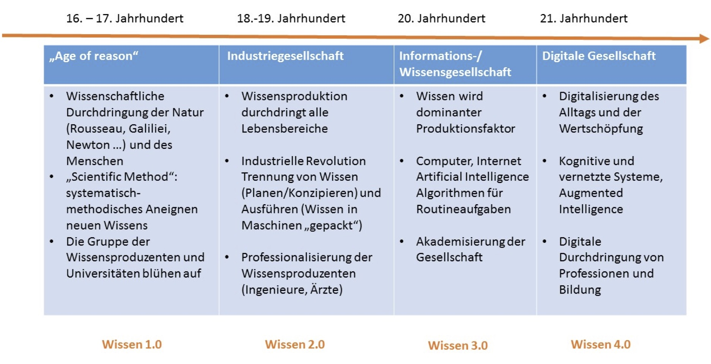

# Was ist Wissensmanagement ?

TODO:
- Sehr gute Studienergebnisse im Studie North 2004
- Include Grafiken aus Karlsruhe Studie
- 

### Von der Industrie- zur Wissensgesellschaft

Quelle: 01_WM_Theorie.pdf

Mitte der 1960er Jahre waren noch über 50% aller Beschäftigten in der Industrie tätig.

Seit dieser Zeit hat sich die Produktivität durch Automatisierung ==versechsfacht==(!) und durch die Globalisierung hat sich die Massenproduktion der meisten Güter weltweit verteilt.

Inzwischen ist die Mehrheit der Bevölkerung im Dienstleistungsbereich beschäftigt.

Durch die zunehmende Digitalisierung werden wissensbasierten Dienstleistungen zum dominanten Wirtschaftssegment.

Während vor wenigen Jahren noch von der Informationsgesellschaft gesprochen wurde, welche die Industriegesellschaft beerben sollte, ist es heute Konsens, dass die Ablösung der Industriegesellschaft treffender durch den Begriff der __Wissensgesellschaft__ umschrieben werden sollte.

!!! example
    **Beispiel**  
    Der Übergang von der Industrie- zur Wissensgesellschaft aus betrieblicher Sicht:

    | Industriegesellschaft |  | Wissensgesellschaft |
    | --- | :---: | --- |
    | Sachkapital | --> | Wissenskapital  |
    | Hierarchie/Kontrolle | --> |  Vernetzung/Fokussierung |
    | Produkte | --> | Problemlösungen | 

### Die Hauptaufgaben des Wissensmanagements

--> Sehr gute Vorlage: http://strategie-spektren.de/innovation/aufgaben-des-wissensmanagements/

* **Implizites Wissen in explizites Wissen umwandeln**: Implizites Wissen entsteht in erster Linie durch Erfahrung, und liegt somit eher unbewusst in einer nur schwer auszudrückenden Form vor. Ziel des Wissensmanagements ist es dieses schwer zu greifende implizite Wissen in greifbares explizites Wissen zu transformieren.
* **Individuelles Wissen in kollektives Wissen überführen**: Insbesondere in kleinen und mittelständischen Unternehmen (KMUs), ist Wissen häufig an eine oder wenige Personen gebunden. Ziel ist es daher, das vorhandene (explizite) Wissen bestmöglich zu dokumentieren und allen Mitarbeitern zugänglich zu machen.
* **Externes Wissen in das Unternehmen integrieren**: Nicht alles Wissen, das ein Unternehmen für seinen Geschäftserfolg braucht, ist immer im Unternehmen vorhanden. Hier gilt es, effiziente Wege zu finden, um Wissen zu erwerben und das erworbene Wissen schließlich in das kollektive Wissen der Organisation zu übertragen.

### Ziele des Wissensmanagements

* Der Austausch von Wissen soll die Resonanzfähigkeit des Unternehmens erhöhen, und somit bestehende Denkmuster durchbrechen. Letztlich soll dadurch die Reaktionsfähigkeit erhöht werden, was ein zentrales Merkmale der _agilen Organisation_ ist. Das Wissensmanagement kann somit als eine wesentliche Voraussetzung für eine __digitale Transformation__ gesehen werden.
* Eine Besondere Bedeutung hat das Wissensmanagement im Zusammenhang mit der __Open Innovation__. Hier wird der Informations- und Wissensaustausch nicht nur als ein interner Prozess betrachtet, sondern als ein ==Austausch zwischen der internen Organisation und ihrer externen Umgebung== (bspw. Kunden, Lieferanten, strategische Partner). Wissensmanagement ist also ein wichtiger Bestandteil des Innovationsprozesses.

### Grundlegende Konzepte
* **Das Wissen ist in den Menschen**  
  Wissen befindet sich vor allem in den Köpfen der Menschen - also in denen Ihrer Mitarbeiter und Mitarbeiterinnen. Deshalb ist Wissen schwerer zu erfassen als Daten und Informationen.

* **Informationssammlung ist nur ein Teil des Ganzen**  
  Informationen müssen verglichen und Zusammenhänge erkannt werden um mögliche Konsequenzen abzuleiten oder neue Erkenntnisse zu schaffen.

* **Erfolgreich ist ein menschliches Wissensmanagement**  
  Erfolgreich sind vor allem solche Maßnahmen, durch die Ihre Mitarbeiter und Mitarbeiterinnen sich selbst als ein Teil des Ganzen empfinden und sich aktiv einbringen können.

### Warum brauchen Organisationen Wissensmanagement?

Gemäss heutigen Erfahrungen spart man durch Wissensmanagement **20-25% der bisherigen Aufwendungen** ein und erreicht eine **Qualitätssteigerung** von ca. 20% (_Quelle: Wyrsch & Partner, © 2012; <www.wyrsch-partner.ch>_).

Beispiele: 

* Der Erdöl-Konzern "Chevron" konnte durch Wissensmanagementmaßnahmen die Förderung von Erdgas optimieren, was einen jährlichen Nutzen von 20 Mio. Dollar erbrachte. 
* Siemens gab in seiner Telekommunikationssparte ICN 15 Mio. DM für Wissensmanagement aus, wodurch im Gegenzug 280 Mio. DM an nicht notwendigen Ausgaben eingespart werden konnten. 
* Texas Instruments vernetzte mittels Wissensmanagement seine weltweit 13 Chip-Fabriken so effizient, dass der Bau einer weiteren, eigentlich geplanten Fabrik entfallen konnte. Spar-Effekt: 1,5 Mrd. Dollar. 
* "digital spirit" (e-learning) mit heute 100 Mitarbeitern: Leitende Mitarbeiter konnten auf diese Weise um bis zu 30 % entlastet werden, die Einarbeitung neuer Mitarbeiter konnte wesentlich schneller geleistet werden. "Insgesamt ist die operative Hektik deutlich geringer geworden

Die Integration von Wissensmanagement in die Projektarbeit (Quelle: https://de.slideshare.net/mcwyrsch/wissensmanagement-in-unternehmen)

* Projekte sind Orte des Lernens
    * Ca. 20% - 40% des Wissens und der Dokumente aus Projekten können in anderen Projekten wieder verwendet werden[^2]
* Wissensmanagement (bspw. Lessons Learned) muss im Projektvorgehen voll integriert sein und systematisch von Projekt zu Projekt weitergegeben werden
* Die Lern-Loops sollen in die Organisation hineinreichen und nicht im Projektteam verbleiben
* Wissensmanagement bietet die Möglichkeit 
    - die Methoden in der Projektarbeit zu verbessern 
    - Innovationen anzustoßen 
    - Projekterfolge zu garantieren
[^2]: Quelle: http://www.forschungsnetzwerk.at/downloadpub/wirkt%20wissensmanagement.pdf

Wissensmanagement ist Katalysator bei der Überführung in eine << Lernende Organisation >>

!!! note
    Ziel der lernenden Organisation ist, das **Lern-** und **Wissenspotential der Mitarbeiter** (und damit der gesamten Organisation) zu vergrößern, um die **Leistungsfähigkeit** des  Unternehmens zu steigern. 

Lernende Organisation...
* ist eine Organisation, die kontinuierlich die Fähigkeit ausweitet, ihre eigene Zukunft schöpferisch zu gestalten
* ist ein Ort, an dem Menschen entdecken, dass sie ihre Realität selbst erschaffen und selbst verändern können 
* Dafür müssen die Rahmenbedingungen geschaffen werden: Wissensmanagement

### Typische Wissensmanagementprobleme

* Ausarbeitung von Ideen, Standards, Evaluationen, Projekten, Vorschlägen, welche bereits bestehen
* Ausbildung von **Fähigkeiten**, die bereits in der Unternehmung vorhanden sind
* Einkauf von Lizenzen und Leistungen, obwohl eigene Entwicklungen (Produkte,
Services) bestehen
* **Informationsüberlastung** auf allen Ebenen
* Projekterfahrungen werden nicht dokumentiert
* **mangelnde Transparenz** über externes Wissen (Internet, Dokumente, Experten, Trends, Standards)
* Interne Experten sind nicht bekannt
* Zentrales Wissen geht verloren (~> **Expertenverlust**)

### Typische Fragestellungen im Wissensmanagement

* Wie lässt sich **individuelles** und **organisationales Wissen** systematisch nutzen und weiterentwickeln ?
* Wie kann individuelles, implizites Wissen unternehmensweit **transparent** + **explizit** gemacht werden ?
* Wie kann relevantes Wissen dort **bereitgestellt** werden, wo es benötigt wird ?
* Wie ist individuelles **Expertenwissen** zu identifizieren, speichern und unternehmensweit zu transferieren ?
* Was sind organisationale Maßnahmen, um die **Informationsqualität** zu sichern und einen **Information Overload** zu vermeiden[^1] ?

[^1]: Hieran sieht man, dass die Dimension "Organisation" (=Unternehmenskultur, verborgene Gesetzmäßigkeiten (hidden rules), Organisationsstruktur, Hierarchie etc.) eine wichtige Rolle im Wissensmanagement spielt 

### Typische Aufgaben des Wissensmanagements
* Mitarbeiterwissen verfügbar machen
* Benennung und Strukturierung von Wissen
* Wissensweitergabe ermöglichen und fördern
* Integration von relevantem Wissen in den Arbeitsfluss * Gezielter Wissensaufbau
* Aus Fehlern lernen
* Dokumentation von Erfahrungswissen
* Transfer von Wissen (vor Ausscheiden)
* Wiederkehrende Fragen (FAQ)
* Befähigung zur Bewältigung von Aufgaben

### Phasen des Wissensmanagements

 *Phasen der Wissensproduktion und -nutzung (Quelle: Klaus North, Ronald Maier, Wissen 4.0 – Wissensmanagement im digitalen Wandel)*

**Phase 1** – << Beginn der Aufklärung >>
: Beginn der systematischen wissenschaftlichen Erforschung der Natur und Entwicklung einer allgemein anerkannten wissenschaftlichen Methodik

**Phase 2** – **Die Industriegesellschaft**
: Wissen wurde in dieser Phase zunehmend in Maschinen und Produktionssysteme mit "mechanischen Algorithmen" eingebettet. Die Wissensproduktion durchdrang alle Lebensbereiche.

__Phase 3__ – __Die Informationsgesellschaft__
: Information und Wissen wurden zu dominierenden Produktionsfaktoren. Aus organisationaler Perspektive wurden Wettbewerbsvorteile mit der Einzigartigkeit von Ressourcen erklärt. Etablierung von wissensbasierten Theorien und Wissensmanagementsystemen in Unternehmen.

__Phase 4__ – __Die Digitalgesellschaft__
: Übergang zum ==Datenkapitalismus== bei dem die Wertschöpfung vorrangig von der unternehmerischen Kompetenz zur Aneignung und Auswertung von Daten abhängt. Intelligente und vernetzte Produkte und Dienstleistungen werden allgegenwärtig (ubiquitär) und durchdringen alle Lebensbereiche.

!!! example
    **Aufgabe**  
    Beantworten Sie folgende Fragen:

    * Warum ist Wissensmanagement mehr als eine technische Plattform?
    * Überlegen Sie sich eine Reihe von organisationalen Maßnahmen zur Erhöhung der Informationsqualität
    * Wie lässt sich Information Overload reduzieren ?
