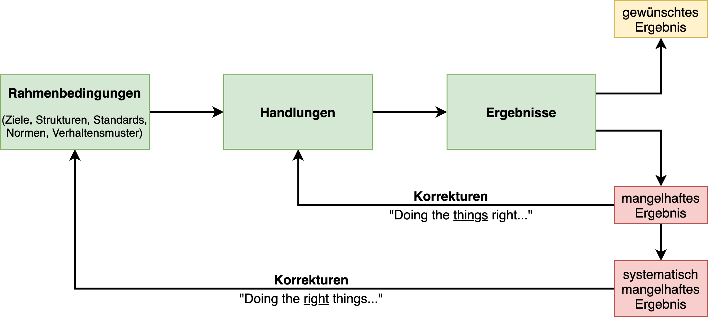

# Die Integration von Wissensmanagement in die Projektarbeit  
(Quelle: https://de.slideshare.net/mcwyrsch/wissensmanagement-in-unternehmen)

* Projekte sind Orte des Lernens
    * Ca. 20% - 40% des Wissens und der Dokumente aus Projekten können in anderen Projekten wieder verwendet werden[^2]
* Wissensmanagement (bspw. Lessons Learned) muss im Projektvorgehen voll integriert sein und systematisch von Projekt zu Projekt weitergegeben werden
* Die Lern-Loops sollen in die Organisation hineinreichen und nicht im Projektteam verbleiben
* Wissensmanagement bietet die Möglichkeit 
    - die Methoden in der Projektarbeit zu verbessern 
    - Innovationen anzustoßen 
    - Projekterfolge zu garantieren
[^2]: Quelle: http://www.forschungsnetzwerk.at/downloadpub/wirkt%20wissensmanagement.pdf

Wissensmanagement ist Katalysator bei der Überführung in eine << Lernende Organisation >>

!!! note
    Ziel der lernenden Organisation ist, das **Lern-** und **Wissenspotential der Mitarbeiter** (und damit der gesamten Organisation) zu vergrößern, um die **Leistungsfähigkeit** des  Unternehmens zu steigern. 

Lernende Organisation...

* ist eine Organisation, die kontinuierlich die Fähigkeit ausweitet, ihre eigene Zukunft schöpferisch zu gestalten
* ist ein Ort, an dem Menschen entdecken, dass sie ihre Realität selbst erschaffen und selbst verändern können 
* Dafür müssen die Rahmenbedingungen geschaffen werden: Wissensmanagement

