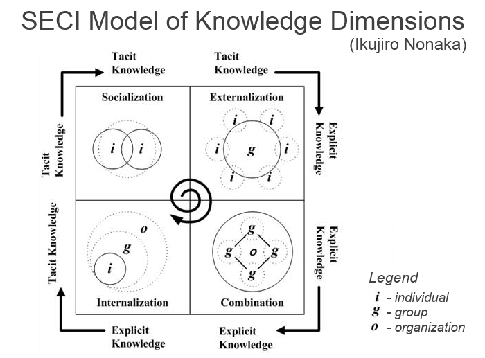

# Was ist Wissen?

Bevor wir einen Versuch starten Wissen zu definieren ist es sinnvoll, den Wissensbegriff richtig ein- und abzugrenzen. 
Hierzu gibt es verschiedene **Modelle**; eines der bekanntesten und etabliertesten Modelle ist die **Wissenstreppe** von Klaus North.

### Die Wissenstreppe nach Klaus North

 *Die Wissenstreppe aufgestellt von Klaus North (Quelle: ...)*

Erläuterungen zur Wissenstreppe

* **Zeichen** bestehen aus Buchstaben, Zahlen etc. aber auch Beobachtungen
* **Daten** entstehen, indem man Zeichen in eine Reihenfolge bringt
* **Information** entsteht, indem man Daten eine Bedeutung zuordnet
* **Wissen** entsteht durch die Vernetzung von Informationen. Wissen ist allerdings subjektiv und kann deshalb nicht direkt übertragen werden (es ist _personifiziert_). Wissen hängt sehr stark vom Erfahrungsschatz des Individuums ab.
* **Können** entsteht aus der Umsetzung von Wissen in entsprechende Handlungen, da es natürlich nicht ausreicht, nur Wissen zu erwerben, sondern dieses erworbene Wissen auch in Fertigkeiten umgesetzt werden muss.
* Erst das in **Handeln** umgesetzte Können stellt dieses auch unter Beweis. Hinzu kommt hier natürlich noch das Wollen, dem eine Mitarbeitermotivation vorausgehen muss. Handeln ist messbar und zeigt wie Personen, Gruppen oder Organisationen aus Informationen Wissen generieren und zur Lösung von Problemen einsetzen.
* Die Fähigkeit, Wissen zur Problemlösung, also zweckorientiert in konkrete Handlungen einzusetzen, wird als **Kompetenz** einer Person, Gruppe oder Organisation bezeichnet.
* **Kernkompetenzen** beruhen auf explizit gemachtem Wissen und setzen sich aus Fähigkeiten und Technologien zusammen. Sie generieren Werte bei Kunden und sind einzigartig gegenüber Wettbewerbern, schaffen somit Zugang zu neuen Märkten. Deshalb drücken Kernkompetenzen auch die **Wettbewerbsfähigkeit** eines Unternehmens aus.

!!! note
    **Lehrvideo zur Wissenstreppe**  
    Die einzelnen Stufen der Wissenstreppe werden auch sehr schön in diesem [Kurzvideo](https://www.youtube.com/watch?v=VW7ArONW4dA) dargestellt.

### Was ist Wissen ? – Eine pragmatische Arbeitsdefinition

Wissen ist
: ... häufig das Ergebnis **bewusster** Informationsverarbeitung,
: ... zusammengesetzt aus **Modellen** über konkrete und abstrakte Objekte, Ereignisse und Fakten, d.h. **symbolische Strukturen**, die im ==menschlichen Gedächtnis== abgespeichert sind,
: ... kontext-situiert und vernetzt,
: ... handlungs- und ziel-orientiert.

!!! warning 
    **Definition**: << **Wissen** >>  
    Wissen bezeichnet die Gesamtheit der Kenntnisse und Fähigkeiten, die Menschen zur Lösung von Problemen einsetzen.
    
    (_Quelle: Probst GJB., Raub S., Romhardt K., (2006): Wissen managen – Wie Unternehmen ihre wertvollste Ressource optimal nutzen. 5. Aufl. Gabler, Frankfurt/Main; S.22_)

### Wissensarten

nach _Michael Polanyi (1966), "The Tacit Dimension", University of Chicago Press: Chicago_

Bekannt ist die Aussage
> "We know more than we can tell."

| **Explicit Knowledge**                                                                 | **Tacit / Implicit Knowledge**  |
|----------------------------------------------------------------------------------------|---------------------------------|
| ... kann kommuniziert werden                                                           | ... im Gehirn gespeichert       |
| ... kann auf verschiedenen Ebenen formalisiert werden                                  | ... schwer zu kommunizieren     |
| ... kann in verschiedenen Formaten abgespeichert werden   &nbsp;&nbsp;&nbsp;&nbsp;(Dokumente, Datenbanken, etc.) | ... nicht/kaum zu formalisieren |
| --> **Disembodied Knowledge**                                                          | --> **Embodied Knowledge**      |

Explizites Wissen 
: ...ist Faktenwissen, eindeutig kodifizierbar und mittels Sprache eindeutig kommunizierbar.

Implizites bzw. *verborgenes* Wissen 
: ...ist Erfahrungs- und Handlungswissen, das an Personen gebunden ist; ist nur schwer und nicht vollständig explizierbar (d.h., in Worte zu fassen)

Nur ca. **20%** des in einer Organisation vorhandenen Wissens ist **dokumentiert** (--> explicit knowledge).  
**80%** des relevanten Wissens ist verborgenes, **implizites Wissen** (--> tacit and implicit knowledge).  
*Quelle: https://de.slideshare.net/mcwyrsch/wissensmanagement-in-unternehmen*

### Das SECI-Modell

Das SECI-Modell stellt das implizite, d.h., **Personen-gebundene** und **schwer verbalisierbare Erfahrungswissen** von Mitarbeitern in den Mittelpunkt. Es erläutert, wie dieses Wissen für eine Organisation aktiviert werden kann.

Es unterscheidet sich von anderen Wissensmanagement dadurch, dass es den Fokus auf eine einzige Fragestellung lenkt, nämlich – *wie neues Wissen in Organisationen entsteht*.

Neues Wissen entsteht in einem **kontinuierlichen Transformationsprozess** zwischen dem impliziten und dem expliziten Wissen, d.h., die Wissengenerierung beruht auf einem Prozess der dynamischen Transformation von implizitem zu explizitem Wissen und vice versa.

 _Das SECI-Modell nach Nonaka und Takeuchi (Quelle: eigene Internetrecherche)_

Es unterscheidet die folgenden **4 Phasen**, welche im einem iterativen und inkrementellen Transformationsprozess durchlaufen werden:

**Sozialisierung** 
: Implizites Wissen wird geteilt durch Beobachtung, gemeinsames Tun und durch nicht verbalisierte Handlungen. Die Weitergabe von implizitem Wissen in einer Gruppe erfordert einen **Wissensraum**, dieser muss, damit die Sozialisierung funktioniert, 3 Eigenschaften aufweisen: (--> geteiltes Verständnis und einer gemeinsamen Sprache mit gegenseitigem Vertrauten (=_Grundlage des gesamten Prozesses der Wissengenerierung und des Wissensaustausches_)). 

**Externalisierung**
: Mitglieder einer Gruppe fassen das Wissen in Sprache und teilen es mit anderen. Aus implizitem Wissen entsteht explizites. 

**Kombination**
: Explizites kann nun mit existierendem Wissen neu kombiniert werden. Hier ruht Potential für Innovation. Neues Wissen entsteht nicht aus dem "Nichts" sondern dadurch, dass neue Akteure neues Wissen in die Organisation einbringen (Frage: Aus welchen Quellen kann dieses Wissen stammen?)

**Internalisierung**
: Entsteht in der Phase der Kombination neues Wissen, so wird dieses nun wieder von den Individuen internalisiert, d.h., mit dem eigenen Wissen kombiniert und dadurch wieder in implizites Wissen überführt. (~> Prozess der Bewußtseinsbildung).

Wichtig, das Kollektiv baut immer auf dem neu entstandenen Wissen auf (--> _iterativ-inkrementeller Transformationsprozess_). 

Entscheidend bei dem Modell von Nonaka & Takeuchi ist die Transformation von individuellem in kollektives Wissen, d.h., von einem personenbezogenen in ein allgemein zugängliches Wissen (=_die Wissensbasis der Organisation_).

Voraussetzungen seitens der Organisation
: **Intention** --> klare Wissensziele (der Organisation)
: **Autonomie** --> Eigenverantwortung, Selbstorganisation und Freiräume
: **Instabilität** --> Bereitschaft Bestehendes zu hinterfragen und zu verändern
: **Redundanz** --> sollte nicht vermieden werden; "Zuviel" an Informationen eröffnet neue Perspektiven
: **Interne Vielfalt** --> Diversität der Mitglieder und Prozesse

**Fazit**
: Das SECI-Modell verbindet als eines der wenigen Modelle Wissensmanagement mit Innovation und versteht Innovation als kollektiven Prozess[^1]. Besondere Bedeutung kommt hierbei der Kommunikation und Kollaboration zu gute. Ziel ist nicht den Prozess bis auf's "Kleinste" zu managen, sondern Rahmenbedingungen zu schaffen, in denen ein derartiger kollektiver Transformationsprozess entstehen kann (=Systemische Sicht). 

[^1]: Innovation ist nicht das Resultat eines "Heureka"-Prozesses eines Individuums

_Quelle: Nonaka, Takeuchi; "Die Organisation des Wissens – Wie japanische Unternehmen eine brachliegende Ressource nutzbar machen"; 2. Auflage, 2012,
Campus Verlag, ISBN 978-3-593-39631-6_

<!-- Nonaka und Takeuchi gelten als die Erfinder des SECI-Modells*) aus dem Jahr 1995, bei dem die soziale Interaktion eine zentrale Rolle spielt. In der Phase der Sozialisation wird implizites Wissen ausgetauscht. Zumindest zwei Personen tauschen also ihre Erfahrungen z. B. in einem persönlichen Gespräch oder durch Beobachtung und Nachahmung aus. Das implizite Wissen des Senders wird zum impliziten Wissen des Empfängers. In der Phase der Externalisierung entsteht durch Kodifizierung bzw. 
Dokumentation Wissen. Dabei wird das implizite Wissen dokumentiert bzw. erfasst und somit zu explizitem Wissen, das schließlich in einem unternehmensweiten, zentralen System zur Verfügung gestellt wird. Das implizite Wissen des Senders wird zu explizitem Wissen. In der Phase der Kombination wird durch das Zusammenfügen von bestehendem Wissen systemisches Wissen. Die Kombination findet vor allem dann statt, wenn sich mehrere Personen zu einem Thema austauschen und dabei neues Wissen generieren. Das bestehende explizite Wissen wird zu neuem expliziten Wissen kombiniert. In der Phase der Internalisierung wird Wissen wiederum individuell gelernt bzw. operationalisiert. Das explizite Wissen wird also wieder zu implizitem Wissen. -->