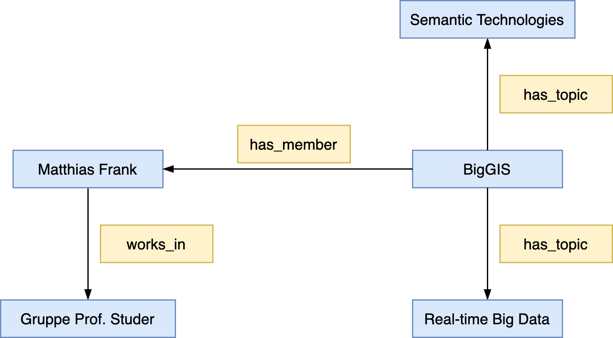
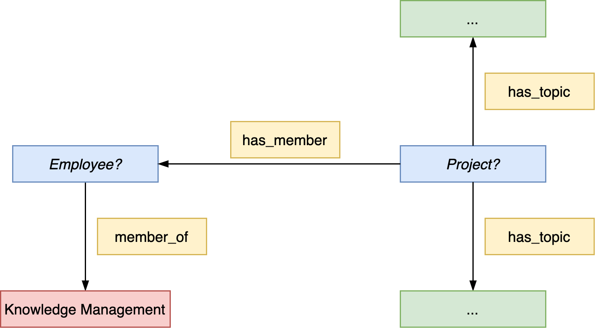

# Semantische Suche

SMW verfügt über eine eigene **Anfragesprache**

* Anlehnung an Wiki-Syntax
* interne Umsetzung der Anfragen in Abfragen für den internen Speicher (z.B. SQL bei Verwendung von MySQL als internen Speicher)

**Formale Semantik** der Anfrage

* durch Abbildung in **OWL-DL-Klassenkonstrukte** gegeben  
  ~> d.h. eine Anfrage ermittelt Instanzen einer entsprechenden OWL-Klasse
* Nutzung der Anfragesprache auf **Spezialseite** oder in **inline queries**

Einbindung in **Wiki-Seiten**

* Anzeige der Abfrageergebnisse auf der Wiki-Seite
*  stets aktuell

**Polynomielle Komplexität** der Anfragebeantwortung

* Anfragesprache unterstützt daher (wie auch OWL DL) *keine* benannten Variablen  
    (Beispiel: Personen, die in Stadt_x geboren wurden und in Stadt_x gestorben sind) (mindestens NP-hart)

### How to Formulate Query Conditions

!!! example 
    **Example**  
    The following domains are modelled in a Semantic MediaWiki

    _"A research group has a number of employees being members of it. These employees work in different project where each project has different topics it is concerned with."_

    Question:  
    _How can we satisfy the information need of displaying all the research topics a research group's members are associated with through their project work on the research group's wiki page?_

    ...or in other words

    _Which topics are a research group working on?[^1]_

How can we model and satisfy this information need in Semantic MediaWiki?

First consider the structural composition of the data model used to represent an universe of discourse (or an excerpt of it).

For example:

 _An excerpt of the previous example modelled as conceptual SMW graph_

This graphical representation serves as basis for the formulation of query conditions.  
~> Therefore, think of query conditions as graphs with conditional node values.

 _An illustration of the query graph for the previous example_

Consider the following conceptual model semantics:

* *yellow boxes* represent properties;  
    properties need to be pre-determined in an #ask query, i.e., you can, e.g., not ask which properties exist between to pages in the main namespace.
* the *red box* represents a pre-determined wiki page in the main namespace
* the _blue boxes_ represent query variables that are to be filled with the values in the course of evaluating the query conditions
* the _green boxes_ are the results returned by processing the query and that are being displayed.

In order to determine the **inner** and **outer query** interpret the query graphs as projects with specific employees as members. 
: ~> Then it becomes clear which query must be embedded into the outer query, ie., which query conditions must constitute the inner query and which conditions the outer query. 

!!! note
    **Summary**  
    As a consequence, when formulating a query in Semantic MediaWiki, always consider the **structural semantics** (ie., how pages are linked togehter via properties) of involved vertices and edges.

[^1]: Assuming that the topics information is modelled on the project pages
