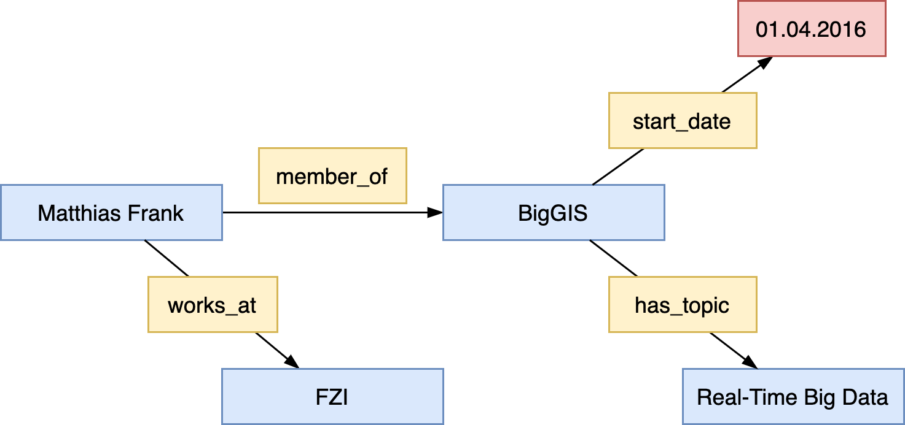
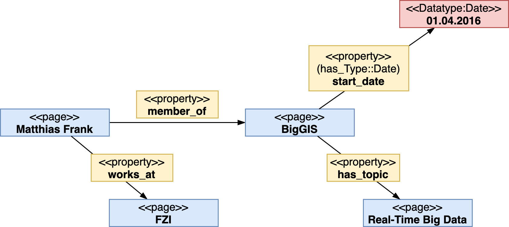

# Encoding Information

SWM represents information conceptually in form of an **labeled directed acyclic graph** where ...
: ...*nodes* represent pages or subobjects
: ...*edges* represent relationshiphs between pages, literals and subobjects 

Consider the following example:

> Matthias Frank is an employee of the FZI Research Center for Information Technology working in the BigGIS project. BigGIS is a research project started at April 2016 and dealing with real-time big data and semantic technologies.

How could we represent this excerpt of a universe of discourse in form of an conceptual graph?

 _A representation of the above example as conceptual graph_

In this conceptual graph, we distinguish between ...

* individuals --- represented as blue boxes
* relationships --- represented as yellow boxes
* literals --- represented as red box

We also defined the *direction* of a relation to indicate the real-world semantics between their vertices.

How can we represent such information in SMW, ie., how can we transform the previous conceptual representation into an SWM's datamodel compliant graph?

 _A Semantic MediaWiki-based representation of the previous example_

The central elements in SMW's data model are [pages](./page.md) adhering to distinct, pre-defined [namespaces](./namespaces.md) in order to obtain their formal, model-theoretic semantics needed for representing the real-world semantics of the universe of discourse accordingly.

Factual knowledge is editied on the wiki pages of each element, e.g. `Matthias Frank` or `BigGIS`.

Considering the above graph, 

* `Matthias Frank`, `BigGIS`, `FZI`, and `Real-Time Big Data` are pages in the `main` namespace
* `member_of`, `start_date`, `works_at` and `has_topic` are wiki pages in the `Property` namespace
* `start_date` contains a datatype annotation on its wikipage declaring the objects of statements in which `start_date` participates as *literal* of datatype `Date`; hence SMW treats it as a *specific value* (with certain *lexical structure* and *restrictions*) rather than a wiki page.
* `April 2016` this is a literal without a separate wiki page

Thus, **datatypes** in property declarations control **input** and **output** (and some more things)

* Output  
    * `[[member_of::BigGIS]]` appears as link  
    * `[[start_date::April 2016]]` appears as date
* Input  
    * `[[my property::1000]]` vs. `[[my property::1,000]]`  
        * Different value if `my property` has type `Wikipage`  
        * Same value if `my property` has type `Number`
    * In particular useful when used in conjunction with [PageForms](https://www.mediawiki.org/wiki/Extension:Page_Forms) to limit permitted values of an input element according to an property's datatype.

!!! tip
    **Task**:  
    a) Take the previous graph and determine what information (annotations) are encoded on which pages.  
    b) Also list _all_ the pages that are needed for representing the above graph in SMW.

