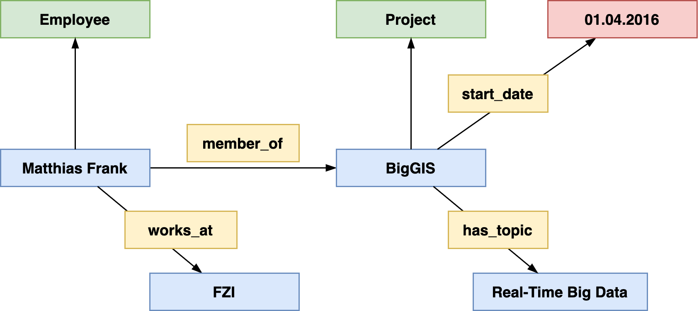

# Encoding Information

SWM represents information conceptually in form of an labeled directed acyclic graph where ...
: nodes represent pages or subobjects
: edges represent relationshiphs between pages, literals and subobjects 

Consider the following example:

> Matthias Frank is an employee of the FZI Research Center for Information Technology working in the BigGIS project. BigGIS is a research project started at April 2016 and dealing with real-time big data and semantic technologies.

 _A representation of the above example as conceptual graph_

How can we represent such information in SMW?

 _A Semantic MediaWiki-based representation of the previous example_

Factual knowledge is editied on the wiki pages of each element, e.g. `Matthias Frank` or `BigGIS`.

Considering the above graph, 

* `Matthias Frank` and `BigGIS` for instance are pages in the `main` namespace
* `member_of` and `start_date` are wiki pages in the `Property` namespace
* `start_date` as a datatype annotation on its wikipage declaring the objects of statements in which `start_date` participates as literal of datatype `Date`
* `April 2016` this is a literal without a separate wiki page

Thus, datatypes in property declarations control input and output (and some more things)

* Output  
    * `[[member_of::BigGIS]]` appears as link  
    * `[[start_date::April 2016]]` appears as date
* Input  
    * `[[my property::1000]]` vs. `[[my property::1,000]]`  
        * Different value if `my property` has type `Wikipage`  
        * Same value if `my property` has type `Number`
    * In particular useful when used in conjunction with [PageForms](https://www.mediawiki.org/wiki/Extension:Page_Forms) to limit permitted values of an input element according to an property's datatype.

