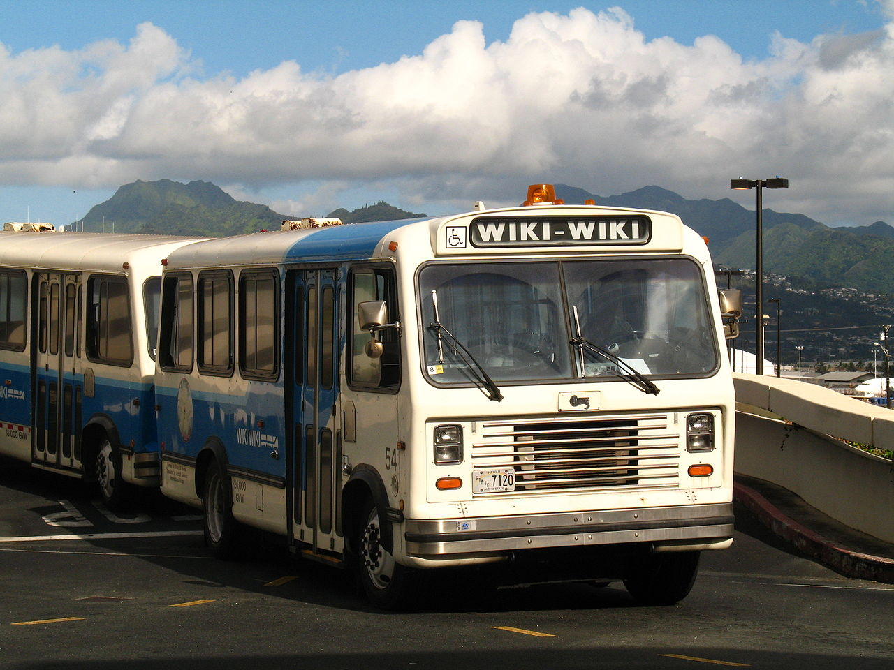

# Was ist ein Wiki ?

 _The Wiki-Wiki bus shuttle at the Honolulu International Airport (Quelle: https://commons.wikimedia.org/wiki/File:HNL_Wiki_Wiki_Bus.jpg)_

!!! warning
    **Definition**: << **Wiki** >>  
     Ein Wiki ist ein **webbasiertes Hypertext-System**, das es Benutzenden ermöglicht, Webseiten direkt (d.h. ohne Programmierung) und online in einem Web-Browser zu erzeugen, zu lesen und zu ändern.

### Eigenschaften
* Hypertext-System mit eigener, einfach erlernbaren **Markup-Sprache**
* Inhalte sind frei erweiter-, les- und veränderbar
* Die Wiki-Engine ist ein vereinfachtes Content-Management-System
* Ein Benutzer kann **jede Seite** eines Wikis verändern, eine neue Seite erstellen
* _"Wiki promotes meaningful topic associations between different pages by making page link creation almost intuitively easy"_[^1]
    * Verweise zwischen einzelnen Seiten möglich
    * Kennzeichnung ob Verweis existiert oder nicht (_~> großer Vorteil gegenüber dem bestehenden Web_)
* ein Wiki ist **niemals vollständig** oder perfekt und unterliegt einem **ständigen Prozess** von
    * Erschaffung 
    * Kollaboration
* Inkludierte Versionsverwaltung der Inhalte (_~> ebenfalls ein großer Vorteil gegenüber dem Web_)
* Wiki ist **frei**
    * Quelltext: Gnu General Public License
    * Jede/r kann im Rahmen der Möglichkeiten tun und lassen was sie will
* Wiki ist **kollaborativ**
    * Zusammenarbeit mit anderen
    * schnelle Informationsbereitstellung, -korrektur
* Wiki ist von Natur aus **demokratisch**
    * Jeder hat die gleichen Rechte
    * damit erlaubt es eine Zusammenarbeit im Netz ohne Accounts und Passwörter
* Wiki ist **erweiterbar**
    * modularer Aufbau
    * Programmierschnittstellen

_Quelle: Rick Hegewald, "Ontologien und (semantische) Wikis", Problemseminar Ontologie-Management Institut für Informatik - Universität Leipzig_

### Komponenten eines Wiki-Systems

Es gibt unterschiedliche Implementierungen von Wiki-Systemen; Die am häufigsten verwendeten Komponenten sind

* Datenbank
* Versionsverwaltung
* Suchfunktion

### MediaWiki

* Open-source Wiki-Software
* Technische Basisplattform der Wikipedia

### Sprachelemente

Wikis stellen eine Reihe von Sprachelementen zur Erstellung und Verwaltung von Inhalten bereit:

* Seiten, 
* Namensräume, 
* Kategorien, 
* Vorlagen
* Magic Words
    * Parser Funktionen
    * Variablen
    * Behavior switches 
* etc.

!!! warning
    **Groß- und Kleinschreibung beachten!**  
    Bitte beachten Sie, dass MediaWiki und damit auch Semantic MediaWiki zwischen Groß- und Kleinschreibung bei Seitennamen etc., d.h., in der URL unterscheidet!

#### Seiten

* grundlegende Inhalts-Einheit: **Wiki-Seite** mit **Titel**
* **Hyperlinks** zur Herstellung von direkten Verbindungen zwischen Seiten
* Auszeichnungssprache **Wikitext**
* wird durch MediaWiki in HTML5 übersetzt

#### Namensräume

* Namensräume dienen der Gruppierung von Seiten
* Funktionen können auf bestimmte Namensräume eingeschränkt werden
* Mediawiki hat standardmäßig **18 Namensräume**
* Textseiten stehen standardmäßig im Namenraum `Main`

#### Vorlagen

* Vorlagen sind Wikiseiten, deren Inhalt in andere Seiten **transkludiert** (d.h. per Referenz eingebunden) wird
* Verwendungsmöglichkeiten
    * Standardisierung von Inhaltsteilen
    * Reduzierter Wartungsaufwand für mehrfach verwendete Inhalte
    * Corporate Design
    * Identische Header/Footer Informationen

#### Kategorien

* MediaWiki ermöglicht das Klassifizieren von Seiten mit Kategorien
* Die Zuordnung einer Seite zu einer Kategorie erfolgt durch Einfügen von `[[Kategorie:Kategorienname]]` im Quelltext
* Eine Seite kann mehreren Kategorien zugeordnet werden
* Kategorien werden am Ende der Seite angezeigt
* Eine Hierarchiebildung der Kategorien ist durch Zuordnung von Kategorien zu Kategorien möglich

[^1]: Bo Leuf, Ward Cunningham, "The Wiki Way: Quick Collaboration on the Web",	Addison-Wesley, 2001.
