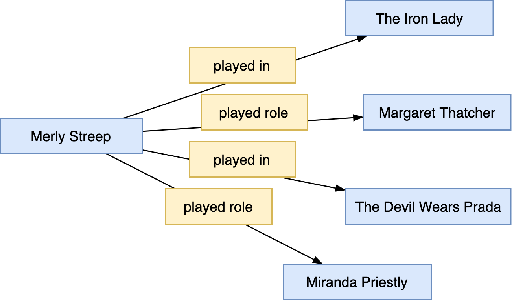

# Fortschrittliche Modellierung mit SMW

### N-äre Beziehungen


Nicht alle Aspekte eines Gegenstandsbereichs lassen sich durch Property-Value-Paare abbilden.

!!! example
    **Beispiel**[^1]:  

    _"Meryl Streep played Margaret Thatcher in The Iron Lady"_

    Properties `:::diff played role` und `:::diff played in` mit folgenden Statements
    : Meryl Streep played in _The Iron Lady_
    : Meryl Streep played role _Margaret Thatcher_

    Allerdings existieren noch weitere Rollenbesetzungen von Merly Streep
    : Meryl Streep played in _The Devil Wears Prada_
    : Meryl Streep played role _Miranda Priestly_

    Daraus resultiert der folgende konzeptuelle Graph:

    

    Frage: _Welche Rolle spielte nun Merly Streep im Film The Iron Lady ?_

[^1]: Das Beispiel stammt aus den SWM Tutorial-Unterlagen von Prof. Dr. Markus Krötzsch von der SMWCon Fall 2012.

#### Ein erster Lösungsansatz

* Erstellung einer neuen Seite mit dem Namen `:::diff Streep's role in The Iron Lady` mit folgenden Eigenschaften:  
    ``` diff
    [[role::Margaret Thatcher]]  
    [[film::The Iron Lady]] 
    ```

* Hinzunahme der Annotation auf der Meryl Streep Seite:  
    ``` diff
    [[played::Streep's role in The Iron Lady]]
    ```

    !!! tip
        **Aufgabe**:  

        1. Stellen Sie obigen Modellierungsansatz in einem konzeptuellen Graphen dar
        2. Beurteilen Sie obigen Modellierungsansatz im Hinblick auf *Flexibilität*, *Wartbarkeit*, *Datensparsamkeit*. 
            Beachten Sie insbesondere, dass Meryl Streep in Ihrer beruflichen Laufbahn in mehr als 89 Filmen (_Quelle: IMDB.com_) mitgewirkt hat. 

#### Ein Lösungsansatz mit Subobjects

* Erstellung eines neuen Subobjects auf der Meryl Streep Seite mit den properties `movie` und `role`
    ``` diff
    {{#subobject:The Iron Lady 
     |role=Margaret Thatcher 
     |movie=The Iron Lady
    }}
    ```

    !!! tip
        **Aufgabe**:
        
        1. Stellen Sie den neuen Modellierungsansatz in einem konzeptuellen Graphen dar
        2. Beurteilen Sie den gerade entworfenen Modellierungsansatz erneut nach Flexibilität, Wartbarkeit, Datensparsamkeit.  

* Tipp:
    * Um die Abfragekomplexität zu verringern kann es gelegentlich sinnvoll sein, innerhalb eines Subobjects Informationen zu hinterlegen, auf welcher Seite es eingebettet ist (_in RDF: zu welchem Subject es gehört_). Dies kann mit einem zusätzlichen frei zu definierenden Property realisiert werden, dessen Value dem Seitennamen entspricht, auf dem das Subobject eingebettet ist.
    
        !!! example
            **Beispiel**:

            Stating that the subobject `The Iron Lady` was embedded on the Meryl Streep page

            ``` diff
            {{#subobject:The Iron Lady 
             ...
             |played by=Meryl Streep 
            }}
            ```

        Falls das Subobject mittels einem **Template** transkludiert wird, so kann für die Angabe des Seitennamens das __Magic Word__ `:::diff {{PAGENAME}}` verwendet werden[^2].

    * Explizit benannte Subobjects können von überall aus in einem Semantic MediaWiki adressiert und in Annotationen genutzt werden:
        ``` diff
        [[played::Meryl Streep#The Iron Lady]]
        ```

        Bei anonymen oder unbenannten Subobjects ist dies nicht möglich, da ein interner Bezeichner als Identifier vergeben wird, der im Sourcecode der wiki Seite nicht zu sehen ist.


[^2]: Unter <https://www.mediawiki.org/wiki/Help:Magic_words> findet sich eine Liste aller in MediaWiki unterstützter Magic Words.
