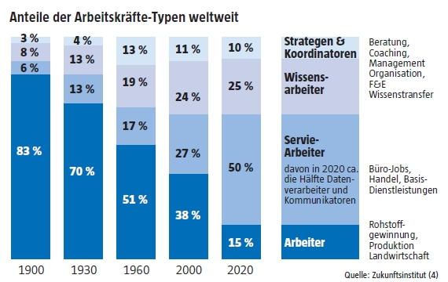
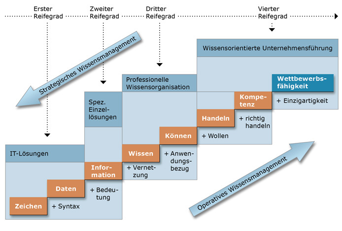
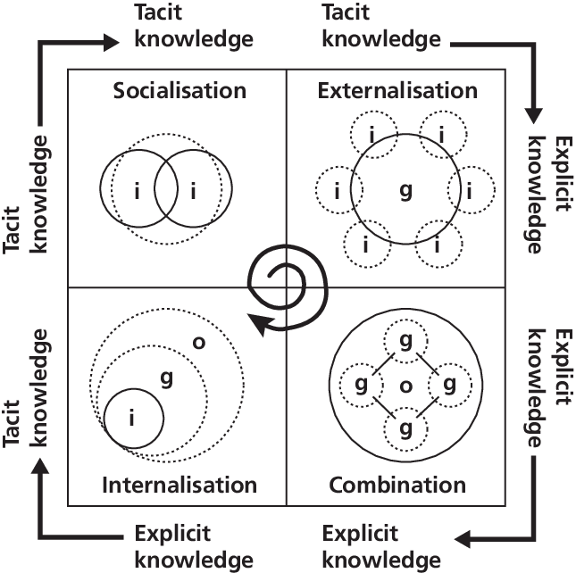
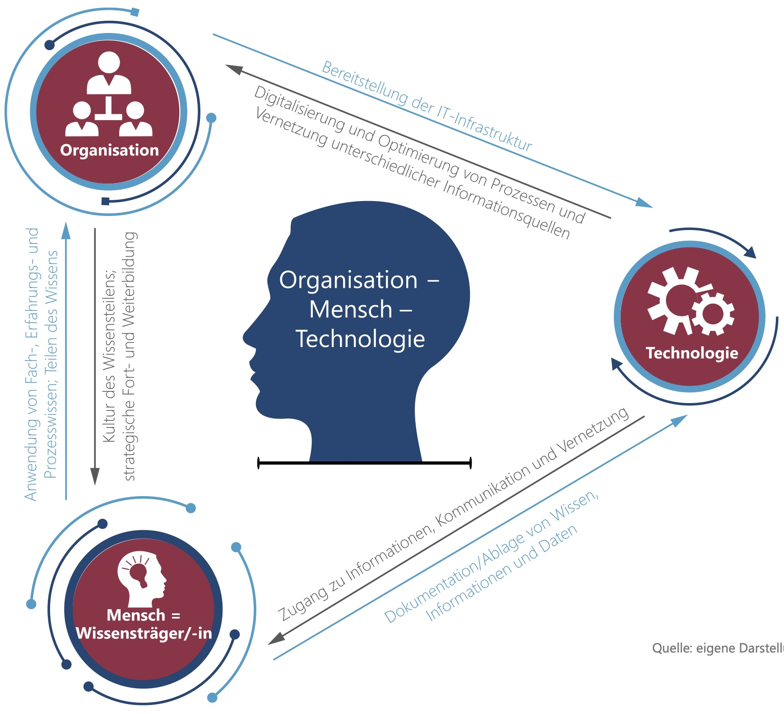

# Semantisches Wissensmanagement im Unternehmen:  Konzepte, Technologien, Anwendungen

#### Prof. Dr. Stefan Linus Zander

Kapitel 1: Einführung in das Wissensmanagement {.lightgreen .big}

---
<!-- header: Kapitel 1: Einführung -->
<!-- footer: Prof. Dr. Stefan Zander -->
# Leitfragen

- Warum benötigen Unternehmen ein funktionierendes Wissensmanagement ?
- Was ist Wissen ?
- Welche Rolle spielt der Mensch im Wissensmanagement ?
- Welche Wissensmanagementansätze gibt es und wodurch unterscheiden sie sich ?
- Welche Rolle spielt IKT im Wissensmanagement?
- Warum wird WM mit fortschreitender Digitalisierung immer wichtiger ?

---

# Gliederung

1. Über die Notwendigkeit eines Wissensmanagements
2. Was ist Wissen ?
   1. Definitionsversuche
   2. Wissensarten
3. Wissensmodelle
   1. Wissenstreppe nach Klaus North
   2. Das SECI-Modell
4. Wissensmanagement
   1. Hauptaufgaben
   3. Ziele
   4. Grundlegende Konzepte
   5. Typische Wissensmanagementprobleme
5. Die Rolle des Menschen im Wissensmanagement
6. Lernzielkontrolle

---

# Gliederung

1. Über die Notwendigkeit eines Wissensmanagements (--> _Warum brauchen Organisationen Wissensmanagement_)
2. _Was ist Wissen ?_ (Definitionsversuche, Wissensarten, Wissensmodelle)
3. _Wissensmodelle_ (1. Wissenstreppe nach Klaus North, 2) Das SECI-Modell)
4. _Wissensmanagement_ (Hauptaufgaben, Ziele, Grundlegende Konzepte, Typische Probleme & Fragestellungen, Phasen)
5. Die Rolle des Menschen im Wissensmanagement

---
<!-- header: Kapitel 1: Warum brauchen Organisationen Wissensmanagement -->
# Warum benötigen Organisationen ein funktionierendes Wissensmanagement ?

---
# Von der Industrie- zur Wissensgesellschaft
<!-- beschäftigungsanteil_inland -->

::: twocolumns
Mitte der 1960er Jahre waren über __50% aller Beschäftigten__ in der Industrie tätig.

Seit dieser Zeit hat sich die __Produktivität__ durch Automatisierung __versechsfacht__(!) und durch die Globalisierung hat sich die Massenproduktion der meisten Güter weltweit verteilt.

Inzwischen ist die Mehrheit der Bevölkerung im **Dienstleistungsbereich** beschäftigt.

Durch die zunehmende Digitalisierung werden __wissensbasierte Dienstleistungen__ zum dominanten Wirtschaftssegment.

Während vor wenigen Jahren noch von der Informationsgesellschaft gesprochen wurde, welche die Industriegesellschaft beerben sollte, ist es heute Konsens, dass die Ablösung der Industriegesellschaft treffender durch den Begriff der __Wissensgesellschaft__ umschrieben werden sollte.

:::

::: footnotes skip
Quelle: Bundeszentrale für politische Bildung: Wissensgesellschaft – Eine Idee im Realitätscheck; online abrufbar unter: https://www.bpb.de/gesellschaft/bildung/zukunft-bildung/146199/wissensgesellschaft
:::

---
# Beispiele

:::: twocolumns small
__Sektoraler Wandel in Deutschland, Großbritannien und der EU__

Der Anteil der verarbeitenden Industrie (in Deutschland mit den wichtigen Sektoren Automobil, Chemie, Pharmazeutika und dem Bereich der Investitionsgüter wie Maschinenbau, elektrische Ausrüstungen etc.) an der gesamtgesellschaftlichen Wertschöpfung schrumpft, meist verbunden mit einem Abbau von Arbeitsplätzen in diesem Sektor. Das ist ein langfristiger Trend, der freilich in den letzten zehn Jahren in Deutschland aufgehalten wurde, während er sich in der EU ungebremst fortsetzte. In Deutschland hat sich der Anteil des verarbeitenden Gewerbes an der Bruttowertschöpfung von 37 Prozent in 1971 auf 22,6 Prozent in 2011 verringert. Zum Vergleich: 1979 betrug im Großbritannien der industrielle Anteil 33 Prozent, 2011 lag er bei 10,8 Prozent. In diesem Zeitraum entstand in der Londoner City die moderne Finanzwirtschaft. In der EU fiel der entsprechende Anteil im Zeitraum von 2001 bis 2011 von 18 auf 15,5 Prozent.

**Von Produktion zu Dienstleistung -- das Beispiel Automobilindustrie**

Die Automobilindustrie produziert zwar noch immer Automobile. Die Aufgabe besteht heute aber zunehmend darin, nicht das physische Produkt Auto zu verkaufen, sondern Mobilitätsbedürfnisse der Kunden zu befriedigen. Die Menschen wollen das Auto nicht mehr unbedingt besitzen, sondern es dort nutzen, wo ihnen Fahrrad, Bahn oder Bus nicht ausreichen. Die Lösung dieser Fragen – zum Beispiel durch Car-Sharing eingebunden in weitere Nutzungsmöglichkeiten – erfordert kommunikative und logistische Leistungen, die weit über die Herstellung der physischen Produkte hinausgehen. Es geht um Kommunikation mit den Kunden und um Kooperation mit ihnen, die in gewisser Weise zu Koproduzenten des Mobilitätsangebots werden.
::::

::: footnotes
Quelle: Bundeszentrale für politische Bildung: Wissensgesellschaft – Eine Idee im Realitätscheck; online abrufbar unter: https://www.bpb.de/gesellschaft/bildung/zukunft-bildung/146199/wissensgesellschaft
:::

---
# Die Wissensgesellschaft

:::: equalcolumns
::: 1st-column
**Früher**:
- Informationen werden von wenigen »Experten« bereitgestellt
- passive Rolle des Nutzers: überwiegend rezeptiver Prozess der Informationsrecherche
- __Leitgedanke__: 
    ==Wissen ist statisch und wird wie ein Gut von einer Person zur anderen übertragen==
:::
::: 2nd-column
**Heute**:
- Informationen werden von allen Nutzern bereitgestellt
- Aktive Rolle des Nutzers: selbstgesteuerter, konstruktivere Prozess, fügt Informationen hinzu, verknüpft Informationen
- __Leitgedanke__: 
    ==Wissen ist dynamisch und wird vom Nutzer auf Grund von Erfahrungen konstruiert und laufend verändert auf Basis praktischer Bedürfnisse==
::::

<!-- | Industriegesellschaft |  | Wissensgesellschaft |
| --- | :---: | --- |
| Sachkapital | -- | Wissenskapital  |
| Hierarchie/Kontrolle | -- |  Vernetzung/Fokussierung |
| Produkte | -- | Problemlösungen |  -->

::: blue
Gefragt ist nicht formelles, abrufbares Wissen, sondern Formen "lebendigen Wissens", wie Erfahrungswissen, Urteilsvermögen, Selbstorganisation, etc. Nicht alles Wissen, aber wissen, wo es zu finden ist. Wichtig werden Fähigkeiten wie die Generierung und Konstruktion und Auswahl von Wissen.
:::

::: footnotes
Quelle: Wilmar Raddatz, "Wissensgesellschaft – Was ist Wissen?"; abrufbar unter https://slideplayer.org/slide/640439/
:::

---
# Warum wird Wissen zunehmend wichtiger für Unternehmen ?

:::: columns {.small}
::: 1st-col {.left}
- **Wissensintensive** Geschäftsprozesse, Dienstleistungen und Produkte werden bedeutender
    - Anteil der Wissensarbeiter in Organisationen nimmt zu 
        (Ingenieure, Manager, Berater, Entwickler, Forscher, ...)
    - Hoher Zeitanteil für Informationssuche und -bewertung
- **Produktlebenszyklen** werden kürzer
    - Höhere Innovationsrate wird erforderlich
    - Concurrent Engineering komplexer Produkte erfordert die Integration von Wissen aller Unternehmensbereiche
- **Lean Management** erfordert Entscheidungen auf allen Management-Ebenen
    - Das erforderliche Wissen muss überall vorhanden sein
:::
::: 2nd-col {.right}
- Firmen arbeiten zunehmend **verteilt** und **global** 
    - Virtuelle Unternehmen
    - Komplexe Wertschöpfungsnetzwerke
- **Wissen** selber wird zum Produkt
    - Neue Arten spezialisierter Dienstleistungsangebote entstehen (z.B. Information Broker)
- **Firmenwert** beruht bei Weitem nicht nur auf materiellen Werten (Fabrikationsanlagen, Immobilien, ...)
    - sondern auf "intangible assets" / "intellectual capital"
- **Demographischer Wandel** in Europa
    - Zunahme des Fachkräftemangels in vielen Branchen absehbar
:::
::::

::: blue small skip 
**Wichtig**: Einige der vorstehenden Argumente gelten nicht nur für gewinn-orientierte Unternehmen, sondern auch in der öffentlichen Verwaltung, Forschung & Lehre und in Non-Governmental Organizations (NGOs).
:::

---
<!-- header: Kapitel 2: Was ist Wissen -->
# Was ist Wissen ?

---
# Welche Rolle spielt "Wissen" im Unternehmen ?

Bekannt sind die folgenden Aussagen^1^
> "We know more than we can tell."
> "If HP knew what HP knows, we would be three times as profitable"

Nur ca. **20%** des in einer Organisation vorhandenen Wissens ist dokumentiert. 
**80%** des relevanten Wissens ist verborgenes, implizites Wissen.^2^

Eine der größten Herausforderungen in und für Unternehmen besteht darin, das für ihre Geschäftsbereiche _relevante Wissen_ zu identifizieren und zu nutzen. Hierauf zielt das Wissensmanagement ab.

::: footnotes
^1^ vgl. Hinds, P. J.; Pfeffer, J. (2003): Why Organizations Don’t “Know What They Know”: Cognitive and Motivational Factors Affecting the Transfer of Expertise. In: Ackerman, M. S.; Pipek, V.; Wulf, V. (2003) (Eds.): Sharing Expertise. Beyond Knowledge Management, pp. 3-26

^2^ Quelle: https://de.slideshare.net/mcwyrsch/Wissensmanagement-in-unternehmen
:::

---
# Was ist Wissen ? -- Eine pragmatische Arbeitsdefinition

::: blue
Bevor wir einen Versuch starten Wissen zu definieren ist es sinnvoll, den Wissensbegriff richtig ein- und abzugrenzen.
:::

Wissen ist {.longskip}

- ... häufig das Ergebnis __bewusster Informationsverarbeitung__,
- ... zusammengesetzt aus __Modellen__ über konkrete und abstrakte Objekte Ereignisse und Fakten, d.h. symbolische Strukturen, die im menschlichen Gedächtnis abgespeichert sind,
- ... __kontext-situiert__ und __vernetzt__,
- ... __handlungs-__ und __ziel-orientiert__.

::: definition
Wissen bezeichnet die Gesamtheit der Kenntnisse und Fähigkeiten, die Menschen zur Lösung von Problemen einsetzen. Wissen stützt sich auf Daten und Informationen, ist im Gegensatz zu diesen jedoch immer an Personen gebunden. Daher müssen Daten-, Informations- und Wissensmanagement stets zusammenspielen.

Quelle: Probst GJB., Raub S., Romhardt K., (2011): "Wissen managen – Wie Unternehmen ihre wertvollste Ressource optimal nutzen". 7. Auflage, Gabler, Frankfurt/Main; S.24
:::

---
# Wissensarten
<!-- ::: source
nach Michael Polanyi (1966), “The Tacit Dimension”, University of Chicago Press: Chicago
::: -->

Grundsätzlich lassen sich ==2 Wissensarten== unterscheiden^1^:

:::: twocolumns
::: blue
**Explicit Knowledge** (=_Disembodied Knowledge_)
- ... kann kommuniziert werden
- ... kann auf verschiedenen Ebenen formalisiert werden 
- ... kann in verschiedenen Formaten abgespeichert werden
:::

::: green
**Tacit / Implicit Knowledge** (=_Embodied Knowledge_)
- ... im Gehirn gespeichert 
- ... schwer zu kommunizieren
- ... nicht/kaum zu formalisieren
:::
::::

_Explizites Wissen_
...ist Faktenwissen, eindeutig kodifizierbar und mittels Sprache eindeutig kommunizierbar.{.skip}

_Implizites bzw. verborgenes Wissen_
...ist Erfahrungs- und Handlungswissen, das an Personen gebunden ist; ist nur schwer und nicht vollständig explizierbar (d.h., in Worte zu fassen)

::: footnotes
^1^ nach Michael Polanyi (1966), “The Tacit Dimension”, University of Chicago Press: Chicago
:::

---
<!-- header: Kapitel xx: Wissensmodelle -->
# Die Wissenstreppe nach Klaus North

::: center

:::
::: footnotes
Quelle: http://qib.f-bb.de/wissensmanagement/thema/wissen/wissenstreppe.rsys
:::

---
# Erläuterungen zur Wissenstreppe 

::: threecolumns small
- **Zeichen** bestehen aus Buchstaben, Zahlen etc. aber auch Beobachtungen
- **Daten** entstehen, indem man Zeichen in eine Reihenfolge bringt
- **Information** entsteht, indem man Daten eine Bedeutung zuordnet
- **Wissen** entsteht durch die Vernetzung von Informationen. Wissen ist allerdings subjektiv und kann deshalb nicht direkt übertragen werden (es ist personifiziert). Wissen hängt sehr stark vom Erfahrungsschatz des Individuums ab.
- **Können** entsteht aus der Umsetzung von Wissen in entsprechende Handlungen, da es natürlich nicht ausreicht, nur Wissen zu erwerben, sondern dieses erworbene Wissen auch in Fertigkeiten umgesetzt werden muss.
- Erst das in **Handeln** umgesetzte Können stellt dieses auch unter Beweis. Hinzu kommt hier natürlich noch das Wollen, dem eine Mitarbeitermotivation vorausgehen muss. Handeln ist messbar und zeigt wie Personen, Gruppen oder Organisationen aus Informationen Wissen generieren und zur Lösung von Problemen einsetzen.
- Die Fähigkeit, Wissen zur Problemlösung, also zweckorientiert in konkrete Handlungen einzusetzen, wird als **Kompetenz** einer Person, Gruppe oder Organisation bezeichnet.
- **Kernkompetenzen** beruhen auf explizit gemachtem Wissen und setzen sich aus Fähigkeiten und Technologien zusammen. Sie generieren Werte bei Kunden und sind einzigartig gegenüber Wettbewerbern, schaffen somit Zugang zu neuen Märkten. Deshalb drücken Kernkompetenzen auch die **Wettbewerbsfähigkeit** eines Unternehmens aus.
:::

::: blue
__Lehrvideo zur Wissenstreppe__ Die einzelnen Stufen der Wissenstreppe werden auch sehr schön in diesem [Kurzvideo](https://www.youtube.com/watch?v=VW7ArONW4dA) dargestellt.
:::

---
# Das SECI-Modell

:::: columns
::: 1st-col {.left}
Das SECI-Modell stellt das implizite, d.h., **Personen-gebundene** und **schwer verbalisierbare Erfahrungswissen** von Mitarbeitern in den Mittelpunkt. Es erläutert, _wie dieses Wissen für eine Organisation aktiviert_ werden kann.

Es unterscheidet sich von anderen Wissensmanagement dadurch, dass es den Fokus auf eine einzige Fragestellung lenkt, nämlich -- _wie neues Wissen in Organisationen entsteht_.

Neues Wissen entsteht in einem **kontinuierlichen Transformationsprozess** zwischen dem _impliziten_ und dem _expliziten Wissen_, d.h., die Wissengenerierung beruht auf einem Prozess der dynamischen Transformation von implizitem zu explizitem Wissen und vice versa.

Entscheidend bei dem Modell von Nonaka & Takeuchi ist die __Transformation von individuellem in kollektives Wissen__, d.h., von einem personenbezogenen in ein allgemein zugängliches Wissen (=die Wissensbasis der Organisation).
::: 
::: 2nd-col {.left}

:::
::::

---
# Das SECI-Modell: Die Transformationsphasen

Es unterscheidet die folgenden **4 Phasen**, welche im einem _iterativen und inkrementellen Transformationsprozess_ durchlaufen werden:

::: twocolumns
Sozialisierung
: Implizites Wissen wird geteilt durch Beobachtung, gemeinsames Tun und durch nicht-verbalisierte Handlungen. Die Weitergabe von implizitem Wissen in einer Gruppe erfordert einen Wissensraum, dieser muss, damit die Sozialisierung funktioniert, _3 Eigenschaften_ aufweisen: (a) geteiltes Verständnis und einer (b) gemeinsamen Sprache mit (c) gegenseitigem Vertrauen^1^.

Externalisierung
: Mitglieder einer Gruppe fassen das Wissen in Sprache und teilen es mit anderen. Aus implizitem Wissen entsteht explizites.

Kombination
: Explizites kann nun mit existierendem Wissen neu kombiniert werden. Hier ruht Potential für Innovation. Neues Wissen entsteht nicht aus dem “Nichts” sondern dadurch, dass neue Akteure neues Wissen in die Organisation einbringen^2^.

Internalisierung
: Entsteht in der Phase der Kombination neues Wissen, so wird dieses nun wieder von den Individuen internalisiert, d.h., mit dem eigenen Wissen kombiniert und dadurch wieder in implizites Wissen überführt. (~> _Prozess der Bewußtseinsbildung_).
:::

==Wichtig, das Kollektiv baut immer auf dem neu entstandenen Wissen auf (→ iterativ-inkrementeller Transformationsprozess).==

::: footnotes
^1^ Vertrauen ist die Grundlage des gesamten Prozesses der Wissensgenerierung und des Wissensaustausches.

^2^ Frage zum Selbststudium: Aus welchen Quellen kann dieses Wissen stammen?
:::

---
# Das SECI-Modell: Voraussetzungen und Fazit

Voraussetzungen seitens der Organisation^2^

- **Intention** --> klare Wissensziele innerhalb der Organisation
- **Autonomie** --> Eigenverantwortung, Selbstorganisation und Freiräume
- **Instabilität** --> Bereitschaft Bestehendes zu hinterfragen und zu verändern
- **Redundanz** --> Sollte nicht vermieden werden; ein "Zuviel" an Informationen eröffnet neue Perspektiven
- **Interne Vielfalt** --> Diversität der Mitglieder und Prozesse

**Fazit**
: Das SECI-Modell verbindet als eines der ersten  Modelle _Wissensmanagement mit Innovation_ und versteht _Innovation als kollektiven Prozess_^1^. Besondere Bedeutung kommt hierbei der Kommunikation und Kollaboration zuteil. Ziel ist nicht den Prozess bis aufs "Kleinste" zu managen, sondern ==Rahmenbedingungen zu schaffen, in denen ein derartiger kollektiver Transformationsprozess entstehen kann== (=Systemische Sicht). 

::: footnotes
^1^ Innovation ist nicht das Resultat eines "Heureka"-Prozesses eines Individuums sondern ein kollektiver Kommunikations- und Bewußtseinsbildungsprozess.

^2^ Quelle: Nonaka, Takeuchi; "Die Organisation des Wissens – Wie japanische Unternehmen eine brachliegende Ressource nutzbar machen"; 2. Auflage, 2012, Campus Verlag, ISBN 978-3-593-39631-6.
:::

---

# Was ist Wissensmanagement und warum wird dies für Unternehmen im Zuge der Digitalisierung immer wichtiger ?

---
<!-- header: Kapitel xx: Was ist Wissensmanagement -->
# Was ist Wissensmanagement

::: definition
==Wissensmanagement== beschäftigt sich mit dem Erwerb, der Entwicklung, dem Transfer, der Speicherung sowie der Nutzung von Wissen. Wissensmanagement ist weit mehr als Informationsmanagement, da es sich über den Fluss von Information und deren Verknüpfung hinaus mit dem "Know-why" befasst, also dem ==zielgerichteten Einsatz zur Problemlösung und Kompetenzbildung==.

Quelle: angelehnt an Gabler Wirtschaftslexikon, Definition: Was ist "Wissensmanagement"? (online abrufbar unter <https://wirtschaftslexikon.gabler.de/definition/wissensmanagement-47468>)
:::

Wissensmanagement^1^ dient dazu{.skip}
- ...vorhandenes betriebliches Wissen zu identifizieren und zu vernetzen
- ...neues Wissen zu generieren und in neue Produkte, Prozesse und Geschäftsfelder umzusetzen
- ...Wissen von außen -- über Kunden, Lieferanten, Partner und externe Know-how-Träger -- in das Unternehmen zu transferieren
- ...Wissen produktiv zu nutzen
- ...Wissen zu messen und zu bewerten

::: footnotes
^1^ siehe http://qib.f-bb.de/wissensmanagement/thema/
:::

---
# Typische Fragestellungen und Wissensmanagementprobleme

::::: equalcolumns
:::: 1st-column
::: blue
**Fragestellungen**

- Wie lässt sich individuelles und organisationales Wissen systematisch nutzen und weiterentwickeln ?
- Wie kann individuelles, implizites Wissen unternehmensweit transparent und explizit gemacht werden ?
- Wie kann relevantes Wissen dort bereitgestellt werden, wo es benötigt wird ?
- Wie ist individuelles Expertenwissen zu identifizieren, speichern und unternehmensweit zu transferieren ?
- Was sind organisationale Maßnahmen, um die Informationsqualität zu sichern und einen Information Overload zu vermeiden^1^ ?

::: footnotes
^1^ Hieran sieht man, dass die Dimension “Organisation” (=Unternehmenskultur, verborgene Gesetzmäßigkeiten (engl. "hidden rules"), Organisationsstruktur, Hierarchie etc.) eine wichtige Rolle im Wissensmanagement spielt.   
:::

:::
::::
:::: 2nd-column
::: green
**Wissensmanagementprobleme**

- Ausarbeitung von Ideen, Standards, Evaluationen, Projekten, Vorschlägen, welche bereits bestehen
- Ausbildung von Fähigkeiten, die bereits in der Unternehmung vorhanden sind
- Einkauf von Lizenzen und Leistungen, obwohl eigene Entwicklungen (Produkte, Services) bestehen
- Informationsüberlastung auf allen Ebenen
- Projekterfahrungen werden nicht dokumentiert
- mangelnde Transparenz über externes Wissen (Internet, Dokumente, Experten, Trends, Standards)
- Interne Experten sind nicht bekannt
- Zentrales Wissen geht verloren (~> Expertenverlust)
:::
::::
:::::

---
# Typische Wissensmanagementprobleme

::: twocolumns
- Verfügbares Wissen wächst exponentiell.
- "Halbwertszeit" bestehenden Wissens sinkt rapide.
- Produkte und Dienstleistungen werden immer wissensintensiver in ihrer Herstellung.
- Komplexe Mitarbeiter- und Hierarchiestrukturen und Hemmnisse bei der Verteilung von Wissen verhindern effizienten Wissensfluss im Unternehmen.
- Wissensmanagement wird als zeit- und kostenintensiv erlebt.
- Rein technische Lösungen verfehlen oft ihren Nutzen.
- Ausarbeitung von Ideen, Standards, Evaluationen, Projekten, Vorschlägen, welche bereits bestehen
- Ausbildung von Fähigkeiten, die bereits in der Unternehmung vorhanden sind
- Einkauf von Lizenzen und Leistungen, obwohl eigene Entwicklungen (Produkte, Services) bestehen
- Informationsüberlastung auf allen Ebenen
- Projekterfahrungen werden nicht dokumentiert
- mangelnde Transparenz über externes Wissen (Internet, Dokumente, Experten, Trends, Standards)
- Interne Experten sind nicht bekannt
- Zentrales Wissen geht verloren (~> Expertenverlust)
:::

---
# Die Hauptaufgaben des Wissensmanagements

- **Implizites Wissen in explizites Wissen umwandeln**: 
    Implizites Wissen entsteht in erster Linie durch _Erfahrung_ und liegt somit eher unbewusst in einer nur schwer auszudrückenden Form vor. Ziel des Wissensmanagements ist es, dieses schwer zu greifende implizite Wissen in greifbares _explizites Wissen zu transformieren_.

- **Individuelles Wissen in kollektives Wissen überführen**: 
    Insbesondere in kleinen und mittelständischen Unternehmen (KMUs) ist Wissen häufig an eine oder wenige Personen gebunden. Ziel ist es daher, das vorhandene (explizite) Wissen bestmöglich zu dokumentieren und _allen Mitarbeitern zugänglich_ zu machen.

- **Externes Wissen in das Unternehmen integrieren**: 
    Nicht alles Wissen, das ein Unternehmen für seinen Geschäftserfolg braucht, ist immer im Unternehmen vorhanden. Hier gilt es, effiziente Wege zu finden, um Wissen zu erwerben und das erworbene Wissen schließlich in das _kollektive Wissen der Organisation zu übertragen_.

::: footnotes
in Anlehnung an: http://strategie-spektren.de/innovation/aufgaben-des-wissensmanagements/
:::

---
# Weitere typische Aufgaben des Wissensmanagements

- Mitarbeiterwissen verfügbar machen
- Benennung und Strukturierung von Wissen
- Wissensweitergabe ermöglichen und fördern
- Integration von relevantem Wissen in den Arbeitsfluss
- Gezielter Wissensaufbau
- Aus Fehlern lernen
- Dokumentation von Erfahrungswissen
- Transfer von Wissen (vor Ausscheiden)
- Wiederkehrende Fragen (FAQ)
- Befähigung zur Bewältigung von Aufgaben

---
# Ziele des Wissensmanagements

- Der Austausch von Wissen soll die Resonanzfähigkeit des Unternehmens erhöhen, und somit bestehende Denkmuster durchbrechen. Letztlich soll dadurch die Reaktionsfähigkeit erhöht werden, was ein zentrales Merkmale der ==agilen Organisation== ist. Das Wissensmanagement kann somit als eine wesentliche Voraussetzung für eine _digitale Transformation_ gesehen werden.

- Eine Besondere Bedeutung hat das Wissensmanagement im Zusammenhang mit der ==Open Innovation==. Hier wird der Informations- und Wissensaustausch nicht nur als ein interner Prozess betrachtet, sondern als ein Austausch zwischen der internen Organisation und ihrer externen Umgebung (bspw. Kunden, Lieferanten, strategische Partner). Wissensmanagement ist also ein wichtiger Bestandteil des _Innovationsprozesses_.

---
# Effekte durch Wissensmanagement

::: blue
Gemäss heutigen Erfahrungen spart man durch Wissensmanagement **20-25%** der **bisherigen Aufwendungen** ein und erreicht eine **Qualitätssteigerung** von **ca. 20%**.^1^
:::

**Beispiele**:{.skip .nobottommargin}
- Der Erdöl-Konzern “Chevron” konnte durch Wissensmanagementmaßnahmen die Förderung von Erdgas optimieren, was einen jährlichen Nutzen von 20 Mio. Dollar erbrachte.

- Siemens gab in seiner Telekommunikationssparte ICN 15 Mio. DM für Wissensmanagement aus, wodurch im Gegenzug 280 Mio. DM an nicht notwendigen Ausgaben eingespart werden konnten.

- Texas Instruments vernetzte mittels Wissensmanagement seine weltweit 13 Chip-Fabriken so effizient, dass der Bau einer weiteren, eigentlich geplanten Fabrik entfallen konnte. Spar-Effekt: 1,5 Mrd. Dollar.

- "digital spirit" (e-learning) mit heute 100 Mitarbeitern: Leitende Mitarbeiter konnten auf diese Weise um bis zu 30% entlastet werden; die Einarbeitung neuer Mitarbeiter konnte wesentlich schneller geleistet werden. Insgesamt ist die “operative Hektik” deutlich geringer geworden.

::: footnotes
^1^ Quelle: Wyrsch & Partner, © 2012, http://www.wyrsch-partner.ch
:::

---
# Die Rolle des Menschen im Wissensmanagement

---
<!-- header: Kapitel xx: -->
:::: columns
# Das Zusammenwirken von Mensch, Organisation und Technik
::: center

:::
::::

::: source
Quelle: TRENDREPORT “Auf Wissen bauen – mit systematischem Wissensmanagement zur digitalen Verwaltung”; Behörden Spiegel, Februar 2020
:::

---
# Die Rolle der Mitarbeiter

:::: equalcolumns
:::
__"Neue" Eigenschaften__

- Der Mitarbeiter ist _Know-How Träger_
- Untereinander sind die Mitarbeiter _Coach_ oder _Mentor_
- Die Erfahrung zählt, _Führung erfolgt durch Kompetenz_
- _Communities_ (Fachgruppen) werden gebildet
- Sie sind _aktiv_ in den Wissensprozessen eingebunden
- Ein offener Austausch wird gefördert
:::
:::
__...und ihre Auswirkungen__

- Hohe Wertschätzung der einzelnen Mitarbeiter
- Veränderte Arbeitsweise
- Erhöhtes Zusammengehörigkeitsgefühl
- Höhere Identifikation mit der Firma, weniger Fluktuation
- Freierer Umgang mit Ideen
::::

::: source
Quelle: https://de.slideshare.net/mcwyrsch/wissensmanagement-in-unternehmen
:::

---
# Lernzielkontrolle

::: green
**Aufgaben**

Beantworten Sie folgende Fragen:
- Lässt sich Wissen überhaupt managen? Falls ja, wie bzw. durch welche Maßnahmen?
- Warum ist Wissensmanagement mehr als eine technische Plattform?
- Überlegen Sie sich eine Reihe von organisationalen Maßnahmen zur Erhöhung der Informationsqualität
- Wie lässt sich Information Overload reduzieren?
- Wie lässt sich Wissen messen oder bewerten?
:::

