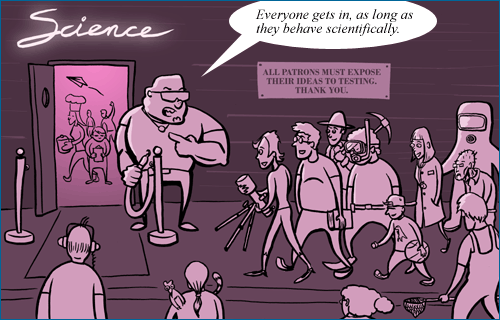

# Scientific Writing in Computer Science aka Wissenschaftliches Arbeiten in der Informatik II

 Welcome to the course pages of the modules 

 * [Wissenschaftliches Arbeiten in der Informatik 2](https://obs.fbi.h-da.de/mhb/modul.php?nr=30.7512)
 * [Scientifc Writing for Computer Science](https://obs.fbi.h-da.de/mhb/modul.php?nr=30.7324)

<!-- Stand: 2019-03-18 -->

_The Science Club – Picture taken from the "Understanding Science 101" course material by the University of California, Berkeley (Source: <https://undsci.berkeley.edu/article/_0_0/whatisscience_09>)_ 

The following pages contain information about the modules' main elements and milestones. 
They serve as a guideline in preparing the materials needed for successfully passing the modules.

The information on this site is separated into 

- **course details**, i.e., objectives, schedule, milestones, assessment etc., and
- **content details**, i.e., background information about how to write a proper scientific paper.

## General Information

* [Overview, Objectives, and Literature Recommendations](objectives.md)
* [Organisation](organisation.md)
* [Schedule with Milestones](schedule.md)

## Milestones

* [Milestone #0: Introductory Material and Science Spirit](milestone0.md) 
* [Milestone #1: Group and Topic Finding](milestone1.md) 
* [Milestone #2: Factsheet and Abstract](milestone2.md) 
* [Milestone #3: Submission of Paper Draft](milestone3.md) 
* [Milestone #4: Review](milestone4.md) 
* [Milestone #5: Scientific Presentation](milestone5.md) 
* [Milestone #6: Submission of Final Paper](milestone6.md) 

## Methods and Materials

* [Introduction to Scientific Writing](scientific_writing.md)
* [Structure of a Scientific Paper](structure.md)

## Tipps

* [What makes a good Scientifc Paper](good_paper.md) 
* [Common Mistakes made in Scientific Writing and Presentations](common_mistakes.md)

----
Diese Unterlagen wurden mit [MkDocs](http://mkdocs.org), [Markdown](https://en.wikipedia.org/wiki/Markdown) und [Visual Studio Code](https://code.visualstudio.com/) erstellt und mit dem individuell angepassten [Material Theme for MkDocs](https://squidfunk.github.io/mkdocs-material/) gerendert.
